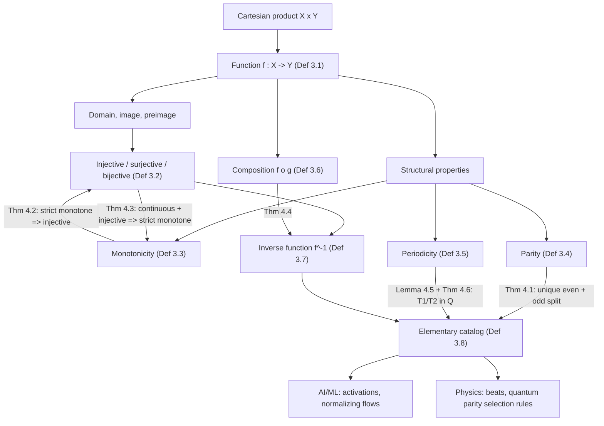

# Module 01 — Functions and Properties

Calculus is the study of what a *function* does when its input is perturbed. Every later statement
in this area — a limit, a derivative, an integral, a Taylor remainder — carries hypotheses on the
function it is about: that it is defined there, that it is invertible there, that it repeats, that
it is symmetric. None of those hypotheses can be stated before the properties themselves exist. So
this module supplies the vocabulary the rest of calculus consumes, and supplies it with proof.

Four structural properties carry almost all of the later weight. **Invertibility** decides which
change of variable is legal. **Monotonicity** decides which inverse exists and how well behaved it
is. **Parity** kills half the terms in a symmetric integral before any integration happens.
**Periodicity** decides whether a superposition of oscillations ever exactly repeats.

The properties are not independent, and the dependencies are the content. Strict monotonicity
forces injectivity, hence invertibility on the image; on an interval the implication reverses, so
for a continuous function "invertible" and "never turns back" are the same statement. That
two-directional characterisation is the result the module is named for, and it is proved here in
both directions.

The payoff is immediate. A normalizing-flow layer is trainable exactly when it is a bijection; a
scalar layer on an interval is one exactly when it is strictly monotonic. A parity argument makes a
quantum selection rule a one-line observation. And whether two tones ever produce a repeating signal
is settled by a single rationality test on their period ratio.

> [!NOTE]
> For a **continuous** function on an **interval**, injectivity and strict monotonicity are the same
> property, and either one delivers an inverse that is itself strictly monotonic with the same
> orientation. Both hypotheses are load-bearing: $1/x$ is continuous and injective on
> $\mathbb{R} \setminus \{0\}$ — not an interval — and is not monotonic there.

## Prerequisites

| Direction | Module | What it supplies or unlocks |
|---|---|---|
| Requires | [mathematical_reasoning/02 — Sets, Relations and Functions](../../mathematical_reasoning/02_sets_relations_and_functions/) | Set builder notation, Cartesian products, and the injective / surjective / bijective classification of a map. |
| Downstream | [calculus/02 — Limits and Continuity](../../calculus/02_limits_and_continuity/) | Supplies the functions whose limits are taken, and the monotonicity and invertibility hypotheses that the intermediate value theorem is applied to. |

## Learning outcomes

After this module you can:

- State the set-theoretic definition of a function and compute a natural domain, image and preimage.
- Decide injectivity, surjectivity and bijectivity, and explain why surjectivity depends on the
  declared codomain while injectivity does not.
- Prove strict monotonicity **without derivatives**, and use it to certify that an inverse exists.
- Prove the converse on an interval: continuous plus injective implies strictly monotonic, via the
  intermediate value theorem.
- Split any function on a symmetric domain into its unique even and odd parts, and use parity to
  make an integral or a matrix element vanish.
- Compute the fundamental period of a superposition, and decide periodicity of a sum by the
  rationality of the period ratio.
- Compose functions, compute $\operatorname{Dom}(f \circ g)$, and invert a composition in the correct
  (reversed) order.
- Derive the closed forms of $\operatorname{arcsinh}$, $\operatorname{arccosh}$ and
  $\operatorname{arctanh}$, and say which branch restriction each needs and why.
- Classify the standard activation functions by range, monotonicity and invertibility, and say which
  can serve as normalizing-flow layers.

## Concept map

## Notation

| Symbol | Meaning | Convention fixed here |
|---|---|---|
| $f : X \to Y$ | function, domain first | domain always written before codomain |
| $\operatorname{Dom}(f)$, $\operatorname{Cod}(f)$, $\operatorname{Im}(f)$ | domain, codomain, image | $\operatorname{Im}(f) \subseteq \operatorname{Cod}(f)$, with equality iff $f$ is surjective |
| $f^{-1}(B)$ | preimage of a set $B$ | defined for **every** $f$; a set, not a function value |
| $f^{-1}$ | inverse function | only when $f$ is a bijection; never $1/f$ |
| $f \circ g$ | composition, $(f \circ g)(x) = f(g(x))$ | $g$ acts first |
| $f_E$, $f_O$ | even and odd parts | $f = f_E + f_O$, unique |
| $T$, $T_0$ | a period, the fundamental period | $T_0$ is the least strictly positive period |
| $\operatorname{Per}(f)$ | the set of periods of $f$, together with $0$ | an additive subgroup of $\mathbb{R}$ |
| $\mathbb{N}, \mathbb{Z}, \mathbb{Q}, \mathbb{R}$ | number systems | $\mathbb{N}$ includes $0$ |
| $\lvert \cdot \rvert$ | absolute value | written `\lvert ... \rvert` |
| $\lfloor x \rfloor$, $\lceil x \rceil$, $\operatorname{sgn}(x)$ | floor, ceiling, signum | $\operatorname{sgn}(0) = 0$ |

## Core results

| # | Result | Statement | Hypotheses that matter |
|---|---|---|---|
| Theorem 4.1 | Unique even–odd decomposition | $f = \frac{f(x)+f(-x)}{2} + \frac{f(x)-f(-x)}{2}$, and this is the only such split | domain symmetric about $0$; no continuity needed |
| Theorem 4.2 | Monotone $\Rightarrow$ invertible | strictly monotonic $f$ is injective, and $f^{-1}$ on $f(I)$ is strictly monotonic with the same orientation | strictness (flat pieces destroy injectivity) |
| Theorem 4.3 | Converse on an interval | $f$ continuous and injective on an interval $\Rightarrow$ $f$ strictly monotonic | continuity (IVT is the engine); $I$ an interval |
| Theorem 4.4 | Inverse of a composition | $(f \circ g)^{-1} = g^{-1} \circ f^{-1}$ | both factors bijective; codomain of $g$ = domain of $f$ |
| Lemma 4.5 | Period group | continuous non-constant periodic $f$ has $\operatorname{Per}(f) = T_0 \mathbb{Z}$ | continuity — the Dirichlet function has no fundamental period |
| Theorem 4.6 | Superposition criterion | $g+h$ periodic $\iff T_1/T_2 \in \mathbb{Q}$, and then $qT_1 = pT_2$ is a period | $g, h$ continuous and non-constant |
| Derivation 5.7 | Inverse hyperbolic closed forms | $\operatorname{arcsinh} x = \ln(x+\sqrt{x^2+1})$; $\operatorname{arccosh} x = \ln(x+\sqrt{x^2-1})$; $\operatorname{arctanh} x = \frac{1}{2}\ln\frac{1+x}{1-x}$ | branch restriction $x \ge 1$ and $\lvert x \rvert \lt 1$ for the last two |

## Common misconceptions

| Misconception | What is true | Concrete case |
|---|---|---|
| Every function has an inverse. | Only bijections do; every injective $f$ becomes one after shrinking the codomain to $\operatorname{Im}(f)$. | $f(x)=x^2$ on $\mathbb{R}$ has no inverse since $f(-2)=f(2)=4$; on $[0,\infty)$ it does, with $f^{-1}(y)=\sqrt{y}$. |
| $\operatorname{Dom}(f \circ g)$ is just $\operatorname{Dom}(g)$. | $\operatorname{Dom}(f\circ g) = \{x \in \operatorname{Dom}(g) : g(x) \in \operatorname{Dom}(f)\}$. | $f(u)=\sqrt{u}$, $g(x)=x-5$: $\operatorname{Dom}(g)=\mathbb{R}$ but $\operatorname{Dom}(f\circ g)=[5,\infty)$. |
| A sum of periodic functions is periodic. | Only when the fundamental periods are commensurable (Theorem 4.6). | $\sin x + \sin(\sqrt{2}x)$ has ratio $\sqrt{2} \notin \mathbb{Q}$ and never repeats; the best residual over 2000 candidate periods is $0.136$. |
| $f^{-1}(x)$ means $1/f(x)$. | $f^{-1}$ is the composition inverse, $f(f^{-1}(y))=y$; the reciprocal is $(f(x))^{-1}$. | For $f(x)=e^{x}$: $f^{-1}(x)=\ln x$, while $(f(x))^{-1}=e^{-x}$. |
| A strictly increasing function must be continuous. | Monotonicity and continuity are independent; Theorem 4.3 runs only one way. | $f(x) = x + \lfloor x \rfloor$ is strictly increasing on $\mathbb{R}$ and jumps at every integer. |
| An even function can be injective. | If $f$ is even and $x \neq 0$ lies in a symmetric domain, $f(x)=f(-x)$ kills injectivity. | No non-trivial even $f$ on $[-a,a]$, $a \gt 0$, is injective — which is why $\cosh$ needs the branch $x \ge 0$. |
| $f$ injective on its domain implies $f$ monotonic. | The domain must be an **interval**, or the intermediate value theorem is unavailable. | $f(x)=1/x$ is continuous and injective on $\mathbb{R}\setminus\{0\}$ yet $f(-1) \lt f(1)$ while decreasing on each half. |

## Exercise index

[`exercises.ipynb`](exercises.ipynb) contains **40** fully solved problems.

| Tier | Title | Count | Focus |
|---|---|---|---|
| L0 | Concept Checks | 8 | one-line reads: parity, domain, injectivity, period, inverse-versus-reciprocal |
| L1 | Foundations | 11 | natural domains, explicit inverses, monotonicity proofs without derivatives, composition domains |
| L2 | Applications (AI/ML and Physics) | 11 | activations and flow layers; relativistic kinematics, wave beats, oscillator periods |
| L3 | Challenge Proofs | 10 | Cauchy functional equations, involutions $f(f(x))=x$, Dirichlet-type pathologies, Putnam problems |

## References

- Spivak, M. *Calculus*, 4th ed. — Ch. 3 (Functions); Ch. 12 (Inverse Functions), Thm 12-1 for
  "continuous and injective on an interval implies monotone" and Thm 12-2 for continuity of the
  inverse.
- Apostol, T. M. *Calculus, Volume I*, 2nd ed. — §1.6–1.11 (mappings, step functions), §3.10
  (Thm 3.7, the intermediate value theorem used in Proof 5.3).
- Stewart, J. *Calculus: Early Transcendentals*, 8th ed. — §1.1–1.3 (catalog of elementary
  functions), §3.11 (hyperbolic and inverse hyperbolic functions).
- Rudin, W. *Principles of Mathematical Analysis*, 3rd ed. — Ch. 2 (subgroups and density,
  Exercise 2.20 ff.), Ch. 4 (continuity and limits along dense sets), background for Lemma 4.5.
- Demidovich, B. P. *Problems in Mathematical Analysis* — Ch. 1, Nos. 1–150 (domain, range, parity
  and periodicity drills).
- Pólya, G. & Szegő, G. *Problems and Theorems in Analysis I* — Part 1, Ch. 1 (functional equations
  and iterated maps).
- Goodfellow, I., Bengio, Y. & Courville, A. *Deep Learning* — §6.3 (activation functions), §4.1
  (overflow, underflow and the log-sum-exp trick).
- Papamakarios, G. et al. *Normalizing Flows for Probabilistic Modeling and Inference*, JMLR 22(57),
  2021 — §2.1 (change of variables), §3.1 (monotone scalar transforms as flow layers).
