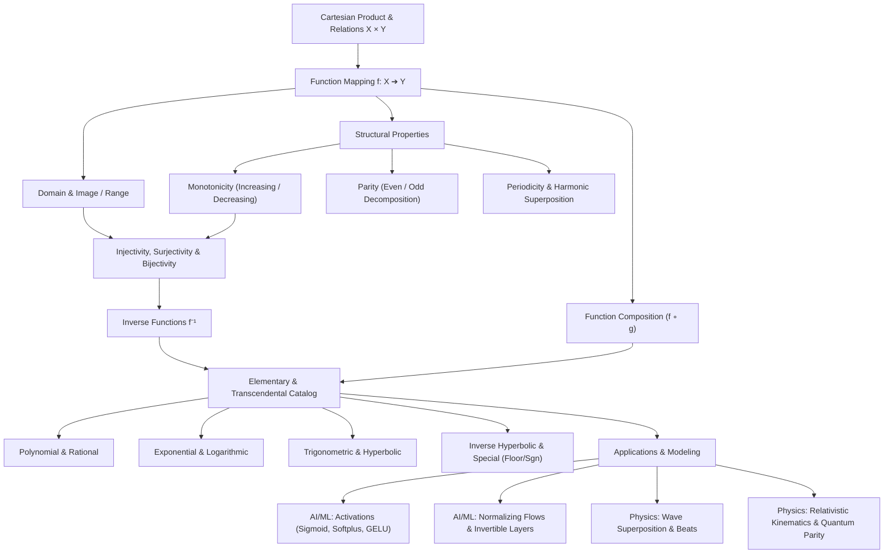

# Topic 01: Functions & Properties — Calculus Mastery Module

**Status:** Active  
**Level:** Core Foundation (Part I of Calculus Series)  
**Target Audience:** Mathematical Modelers, AI Researchers, Applied Mathematicians  

---

## 📌 Module Overview

Functions are the primary mathematical engines that map inputs to outputs, represent dynamical state transitions, govern physical conservation laws, and define transformation pipelines in artificial intelligence. Before entering differential calculus (rates of change) or integral calculus (accumulated measure), one must establish absolute theoretical and computational fluency in the fundamental properties of functions: **domains, ranges, monotonicity, parity, periodicity, compositions, inverse functions, and elementary/transcendental function catalogs**.

This module delivers a first-principles mathematical foundation paired with a **4-Level Mastery Exercise Package** (40 fully solved problems) spanning classical analysis rigor, real-world physical systems, and modern deep learning activations.

---

## 🎯 Learning Objectives

By completing this module, you will be able to:

1. **Formulate Set-Theoretic Mappings**: Define functions rigorously as subsets of Cartesian products ($f \subseteq X \times Y$) and analyze natural domains, codomains, images, and preimages.
2. **Analyze Monotonicity & Invertibility**: Prove strict monotonicity without derivatives, establish bijectivity conditions, construct explicit inverse functions $f^{-1}$, and map their geometric reflections across $y = x$.
3. **Decompose Algebraic Parity**: Decompose any real-valued function uniquely into its even ($f_E$) and odd ($f_O$) components, and apply parity invariants in quantum mechanics and symmetric loss landscapes.
4. **Evaluate Periodicity & Wave Superposition**: Calculate fundamental periods $T_0$, determine periodicity conditions for function sums ($\omega_1/\omega_2 \in \mathbb{Q}$), and analyze phase shifts and beat frequencies.
5. **Construct Function Compositions**: Evaluate composition domains $\text{Dom}(f \circ g)$, compute iterated compositions, and handle non-commutative functional transformations.
6. **Bridge Pure Math to AI & Physics**: Analyze neural network activation functions (Sigmoid, ReLU, Softplus, GELU, Swish/SiLU), invertible normalizing flow layers, relativistic mass functions, and quantum parity wavefunctions.
7. **Solve Advanced Olympiad & Tripos Problems**: Solve Cauchy functional equations, involution equations ($f(f(x))=x$), Putnam competition problems, and non-smooth/dense discontinuous functions (Dirichlet function, dense rational jump functions).

---

## 🗺️ First-Principles Concept Map



---

## ⚠️ Common Misconceptions Table

| Misconception | Mathematical Truth | Correct Principle & Example |
|---|---|---|
| **"Every function has an inverse."** | Only **bijective** (one-to-one and onto) functions possess a true inverse function. | $f(x) = x^2$ on $\mathbb{R}$ has no inverse because $f(-2) = f(2) = 4$. Restricting the domain to $[0, \infty)$ yields the bijective inverse $f^{-1}(y) = \sqrt{y}$. |
| **"The domain of $(f \circ g)(x)$ is simply the domain of $g(x)$."** | $\text{Dom}(f \circ g) = \{x \in \text{Dom}(g) \mid g(x) \in \text{Dom}(f)\}$. | If $f(u) = \sqrt{u}$ and $g(x) = x - 5$, $\text{Dom}(g) = \mathbb{R}$, but $\text{Dom}(f \circ g) = [5, \infty)$ because $g(x)$ must be $\ge 0$. |
| **"The sum of two periodic functions is always periodic."** | The sum $f(x) + g(x)$ is periodic **if and only if** the ratio of their fundamental periods $T_1/T_2$ is rational ($\mathbb{Q}$). | $\sin(x) + \sin(\sqrt{2}x)$ is non-periodic because $2\pi / (2\pi/\sqrt{2}) = \sqrt{2} \notin \mathbb{Q}$. |
| **"The inverse function $f^{-1}(x)$ is the multiplicative inverse $1/f(x)$."** | $f^{-1}(x)$ is the **functional composition inverse** satisfying $f(f^{-1}(x)) = x$, whereas $(f(x))^{-1} = \frac{1}{f(x)}$. | For $f(x) = e^x$, $f^{-1}(x) = \ln x$, while $(f(x))^{-1} = e^{-x}$. |
| **"A strictly increasing function must be continuous."** | Monotonicity and continuity are independent structural properties. | The floor step function $f(x) = x + \lfloor x \rfloor$ is strictly increasing on $\mathbb{R}$ but has jump discontinuities at every integer. |
| **"An even function can be injective on a symmetric domain."** | If $f$ is even and $x \neq 0$ is in its domain, $f(x) = f(-x)$, violating injectivity. | No non-trivial even function defined on $[-a, a]$ ($a \gt 0$) can be injective. |

---

## 📂 Directory Inventory

```text
foundations/calculus/01_functions_and_properties/
├── README.md               <-- Executive Summary, Concept Map, Misconceptions & References (This File)
├── first_principles.ipynb        <-- First-Principles Theory, Definitions, Theorems, Proofs & Applications
└── exercises.ipynb         <-- 4-Level Exercise Package (40 Fully Solved Problems + Solutions Manual)
```

---

## 📖 Recommended References

- **Spivak, M.** *Calculus* (4th Edition) — Chapters 3 & 4 (Functions, Graphs, and Functional Inverses; unmatched theoretical clarity and proof exercises).
- **Apostol, T. M.** *Calculus, Volume I* (2nd Edition) — Chapters 1 & 2 (Set theory foundation, mappings, step functions, and monotonic properties).
- **Stewart, J.** *Calculus: Early Transcendentals* (8th Edition) — Chapter 1 (Functions and Models, catalog of elementary functions).
- **Demidovich, B. P.** *Problems in Mathematical Analysis* — Chapter 1 (Functions, domain/range calculation, parity, periodicity, and elementary function transformations).
- **Pólya, G., & Szegő, G.** *Problems and Theorems in Analysis I* — Part 1 (Functions of a real variable, functional equations, and sequences).
- **Putnam Competition Archives** — William Lowell Putnam Mathematical Competition past problems on functional equations and iterations.
- **Cambridge Mathematical Tripos** — Part IA Analysis I (Functional behavior, bounds, and inverse mappings).
- **Goodfellow, I., Bengio, Y., & Courville, A.** *Deep Learning* — Chapter 3 & 4 (Activation functions, loss landscapes, and numerical stability).
