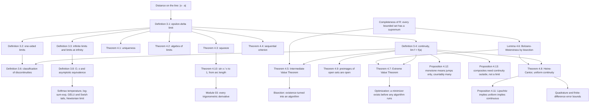

# Module 02 — Limits and Continuity

Calculus needs to talk about what a function does *near* a point without ever evaluating it *at*
that point. Every difference quotient is a $0/0$ at the only place it matters, so "substitute and
see" is not available. The limit is the device that makes the question well posed, and its content
is entirely in the order of two quantifiers.

Continuity is then the statement that the limit and the value agree. That single equation buys
three global theorems that no amount of local algebra can produce: a continuous function on an
interval cannot skip a value, a continuous function on a closed bounded interval attains its
extremes, and on that same domain one $\delta$ works everywhere at once. Each of the three is a
consequence of the completeness of $\mathbb{R}$, and each fails loudly when a hypothesis is
dropped.

These are not decorative results. Bisection is the Intermediate Value Theorem executed as an
algorithm; "a minimizer exists" in an optimization argument is the Extreme Value Theorem being
quoted; every finite-difference and quadrature error bound of the form "refine the mesh past
$\delta$" is Heine-Cantor being used silently.

The module proves all of them in full — including Bolzano-Weierstrass inline rather than by a
forward citation to [calculus/08](../08_sequences_series_convergence/), and including
$\lim_{x \to 0} \sin x / x = 1$ from the circle-area sandwich with the angle *defined* by arc
length, so the argument is not the usual circular one. It then measures, in executable code, the
gap between a limit as a statement about $\mathbb{R}$ and the same limit evaluated in `float64`.

> [!NOTE]
> **Compactness is what turns a local definition into global guarantees.** If $f$ is continuous on
> a closed bounded interval $[a,b]$, then all three hold at once: $f$ attains every value strictly
> between $f(a)$ and $f(b)$ (Theorem 4.5), $f$ is bounded and attains both bounds (Theorem 4.7),
> and $f$ is *uniformly* continuous, so a single $\delta(\varepsilon)$ serves every base point
> (Theorem 4.8). Remove closedness, boundedness, or continuity at even one point and the
> corresponding conclusion fails — Example 6.6 and Section 7.4 run each failure.

## Prerequisites and downstream modules

**Prerequisites.**

- [mathematical_reasoning/01 — Propositional and Predicate Logic](../../mathematical_reasoning/01_propositional_and_predicate_logic/) — read and negate a quantified statement, so the $\varepsilon$-$\delta$ definition parses and Problem L0.1 can negate it.
- [Module 01 — Functions and Properties](../01_functions_and_properties/) — natural domains, one-sided behaviour, monotonicity and boundedness, all of which the hypotheses below are stated in terms of.

**Downstream modules unlocked by this one.**

- [Module 03 — Single Variable Derivatives](../03_single_variable_derivatives/) — the derivative *is* the limit of Definition 3.1 applied to a difference quotient, and Theorem 4.10 supplies $\sin'(0)$.
- [Module 07 — Improper Integrals and Special Functions](../07_improper_integrals_special_functions/) — convergence of an improper integral is a limit at infinity or at a singular endpoint (Definition 3.3).
- [Module 08 — Sequences, Series, Convergence](../08_sequences_series_convergence/) — the sequential criterion (Theorem 4.4) is the bridge, and Lemma 4.6 is developed there in general.
- [Module 10 — Multivariable Functions and Partials](../10_multivariable_functions_partials/) — limits along paths, where "every sequence" becomes "every direction" and the theorem changes character.

The full dependency graph is in [docs/prerequisites.md](../../docs/prerequisites.md), and the
symbol conventions used below are fixed in [docs/notation.md](../../docs/notation.md).

## Learning outcomes

After working through this module you will be able to:

- write the $\varepsilon$-$\delta$ definition with the quantifiers in the right order, negate it correctly, and say why swapping $\forall\varepsilon$ and $\exists\delta$ makes it false for every non-constant function;
- produce an explicit $\delta(\varepsilon)$ for linear, quadratic and reciprocal targets, including the two-stage "restrict first, then bound" technique of Example 6.1;
- refute a limit in two lines with the sequential criterion, rather than by arguing about pictures;
- use the squeeze theorem as the one tool that *creates* existence, and recognize when its two envelopes fail to agree;
- state the Intermediate Value Theorem, the Extreme Value Theorem and Heine-Cantor with every hypothesis, and give the counterexample that each hypothesis blocks;
- prove all three from completeness, and prove Bolzano-Weierstrass by bisection rather than citing it forward;
- classify a discontinuity as removable, jump, essential or oscillatory, and explain why a monotone function can only ever have jumps, at most countably many;
- distinguish Lipschitz, uniformly continuous and continuous by *what $\delta$ is allowed to depend on*, and show both implications are strict;
- derive $\lim_{x\to0}\sin x/x = 1$ non-circularly from arc length, and $\lim_{x\to0}(1-\cos x)/x^2 = 1/2$ from it;
- read Big-O, little-o and $\sim$ as statements about a limit, and say what they do *not* claim away from it;
- explain why $T \to 0^{+}$ and $T \to \infty$ are limits rather than values of softmax, and why log-sum-exp is an exact identity whose naive evaluation is not;
- predict the optimal step $h_{\star} = \sqrt{2u}$ of a forward difference and explain why the limit $h \to 0$ is a statement about $\mathbb{R}$ and not about `float64`.

## Concept map

## Notation

Drawn from [docs/notation.md](../../docs/notation.md).

| Symbol | Meaning | Convention |
|---|---|---|
| $\varepsilon$, $\delta$ | the limit quantifiers | `\varepsilon`, never `\epsilon`, in limit arguments |
| $\lvert x - a \rvert$ | distance on the line | `\lvert ... \rvert`, never a bare pipe |
| $\lim_{x \to a} f(x) = L$ | limit at a point | Definition 3.1; $x = a$ is punched out |
| $\lim_{x \to a^{-}}$, $\lim_{x \to a^{+}}$ | one-sided limits | Definition 3.2; both exist and agree iff the two-sided limit does |
| $\limsup$, $\liminf$ | upper and lower limits at a point | Definition 3.5; finite even when the limit does not exist |
| $D \subseteq \mathbb{R}$, $f : D \to \mathbb{R}$ | domain and function | $a$ approachable: some punctured interval around $a$ lies in $D$ |
| $[a,b]$ | closed bounded interval | the compact domain of Theorems 4.7 and 4.8 |
| $O$, $o$, $\Theta$, $\sim$ | asymptotic notation | bare capitals, never `\mathcal{O}`; Definition 3.8 |
| $\varepsilon_{\mathrm{mach}} = 2^{-52}$ | gap between $1$ and the next float | unit roundoff $u = \tfrac12\varepsilon_{\mathrm{mach}} = 2^{-53}$ |
| $h_{\star} = \sqrt{2u}$ | optimal forward-difference step | $\approx 1.49 \times 10^{-8}$ for $f = \sin$ near $x = 1$ |

## Core results

| Result | Statement | Hypotheses | Where |
|---|---|---|---|
| Uniqueness | a limit, if it exists, is unique | $a$ approachable; otherwise every $L$ works vacuously | Theorem 4.1, Proof 5.1 |
| Algebra of limits | sums, products and quotients pass to the limit | both limits exist **separately**; $M \neq 0$ for the quotient | Theorem 4.2, Proof 5.2 |
| Squeeze | $g \le f \le h$ near $a$ with $g, h \to L$ forces $f \to L$ | the two envelopes must have the **same** limit | Theorem 4.3, Proof 5.3 |
| Sequential criterion | $f \to L$ iff $f(x_n) \to L$ for **every** $x_n \to a$, $x_n \neq a$ | none beyond Definition 3.1; "every" is load-bearing | Theorem 4.4, Proof 5.4 |
| Intermediate Value Theorem | $f$ attains every $d$ strictly between $f(a)$ and $f(b)$ | continuity at **every** point of $[a,b]$; domain connected; endpoints included | Theorem 4.5, Proof 5.5 |
| Bolzano-Weierstrass | every sequence in $[a,b]$ has a subsequence converging in $[a,b]$ | closed **and** bounded; proved here by bisection, not cited forward | Lemma 4.6, Proof 5.6 |
| Extreme Value Theorem | $f$ is bounded and attains both bounds | continuity; $[a,b]$ closed and bounded; the three failures are separate | Theorem 4.7, Proof 5.7 |
| Heine-Cantor | continuity on $[a,b]$ upgrades to uniform continuity | compactness of the domain is the entire content | Theorem 4.8, Proof 5.8 |
| Topological characterization | continuous everywhere iff $f^{-1}(V)$ open for every open $V$ | a statement about the whole domain; no pointwise version | Theorem 4.9, Proof 5.9 |
| Trigonometric limits | $\lim_{x\to0}\frac{\sin x}{x} = 1$ and $\lim_{x\to0}\frac{1-\cos x}{x^{2}} = \frac12$ | radians defined by arc length, else the proof is circular | Theorem 4.10, Proof 5.10 |
| Lipschitz, uniform, pointwise | Lipschitz $\Rightarrow$ uniform $\Rightarrow$ continuous, both strict | witnesses: $\sqrt{x}$ on $[0,1]$, and $x^{2}$ on $[0,\infty)$ | Proposition 4.11, Proof 5.11 |
| Monotone discontinuities | every discontinuity is a jump, at most countably many | monotonicity alone; no continuity assumed | Proposition 4.12, Proof 5.12 |
| Composite limits | $g \to L$ and $f$ **continuous at** $L$ give $f \circ g \to f(L)$ | $\lim_{y \to L} f(y) = M$ is not enough; Section 7.4 runs the gap | Proposition 4.13, Proof 5.13 |

## Common misconceptions

1. **"The limit is just $f(a)$."** Definition 3.1 punches out $x = a$ with the clause
   $0 \lt \lvert x - a \rvert$, so $f(a)$ may be undefined, or defined and different. The two
   agree exactly when $f$ is continuous at $a$ — which is the *definition* of continuity
   (Definition 3.4), not a theorem about limits. Problems L0.3 and L0.4 separate the cases.

2. **"$0/0$ means the limit does not exist."** An indeterminate form says the current algebraic
   form is uninformative, not that the limit is absent. $\sin x / x \to 1$, $x/x^{2} \to \infty$
   and $x^{2}/x \to 0$ are all $0/0$ at the origin. Problems L1.4 and L1.8 rewrite the expression
   until the algebra of limits (Theorem 4.2) applies.

3. **"$\delta$ may depend on $x$."** It may depend on $\varepsilon$ and on the base point, never on
   the running variable. Dropping the dependence on the base point as well is *uniform* continuity,
   and the two are genuinely different: Section 7.5 plots the largest admissible $\delta$ for
   $x^{2}$ at $\varepsilon = 1$ and measures it decaying like $1/(2x)$, so its infimum over
   $[0,\infty)$ is $0$ and no uniform choice exists.

4. **"IVT gives a unique root."** It gives *at least one* $c \in (a,b)$. Uniqueness is a separate
   hypothesis — strict monotonicity — and bisection converges to *some* root, not a distinguished
   one. Section 7.2 brackets a root of $x^{5} - 3x - 1$ on $[1,2]$ in exactly
   $\lceil \log_{2} 10^{7} \rceil = 24$ steps with every observed bracket ratio equal to $0.5$ to
   the last bit.

5. **"EVT just says $f$ is bounded."** Boundedness and attainment are two conclusions that fail
   separately. On $[0,1)$ the map $f(x) = x$ is bounded with supremum $1$ and no maximum; on
   $[0,\infty)$ it is not bounded at all; and $f(x) = x$ for $x \lt 1$ with $f(1) = 0$ is bounded
   on the compact $[0,1]$ yet attains nothing near its supremum. Example 6.6 runs all three.

6. **"Continuous implies differentiable."** $\lvert x \rvert$ is continuous everywhere and has no
   derivative at $0$; Thomae's function (Problem L3.1) is continuous at every irrational and at no
   rational. Continuity is necessary for differentiability, never sufficient.

7. **"You can substitute inside a limit."** Only when the outer function is *continuous* at the
   inner limit (Proposition 4.13). With $g \equiv 0$ and $f(y) = 1$ for $y \neq 0$, $f(0) = 0$, one
   has $\lim_{y \to 0} f(y) = 1$ but $f(g(x)) \equiv 0$: the composite limit is off by the entire
   gap. Section 7.4 runs it.

8. **"$f = O(g)$ means $f$ and $g$ grow at the same rate."** $O$ is an upper bound up to a
   constant; the two-sided statement is $\Theta$, and $o$ is strictly smaller order. All three are
   claims about a limit and say nothing away from it: Section 8.3 shows relativistic kinetic energy
   is asymptotically $\tfrac12 m v^{2}$ yet exceeds it by a factor $3.20$ at $v = 0.9c$.

9. **"Smaller $h$ always gives a better derivative."** The limit $h \to 0$ lives in $\mathbb{R}$.
   In `float64` the forward difference has error $\approx u\lvert f\rvert/h + \tfrac{h}{2}\lvert f''\rvert$,
   minimized at $h_{\star} = \sqrt{2u} \approx 1.49 \times 10^{-8}$; Section 7.6 fits the two
   regimes at slopes $+1.00$ and $-0.98$ against the predicted $+1$ and $-1$.

## Exercise index

[`exercises.ipynb`](exercises.ipynb) contains 45 fully solved problems in four tiers. Every problem
carries a statement, a short intuition, a stepwise solution, a boxed answer, a key takeaway, and —
where the answer is numeric or algorithmic — a code cell that recomputes it.

| Tier | Count | Coverage |
|---|---:|---|
| L0 — Concept Checks | 10 | negating the limit definition, the sign function, irrelevance of $f(a)$, two discontinuities at one point, a squeeze that pins the value, connectedness in IVT, compactness in EVT, a growth hierarchy at infinity, the fractional part, $\limsup$ and $\liminf$ of $\sin(1/x)$ |
| L1 — Foundations | 13 | explicit $\varepsilon$-$\delta$ for linear, quadratic and reciprocal targets, a conjugate against $0/0$, a compound trigonometric limit, an $1^{\infty}$ form, a squeeze on an oscillating product, $\infty - \infty$, a root by IVT, matching a piecewise constant for continuity, a logarithmic expansion, the sequential criterion as a refutation, Lipschitz implies uniform |
| L2 — Applications (AI/ML and Physics) | 10 | softmax temperature endpoints, the log-sum-exp window, the Newtonian limit of relativistic kinetic energy, the two tails of GELU, Swish between a half-line and ReLU, bisection step count for a target accuracy, the optimal forward-difference step, a thick tunnelling barrier, vanishing sigmoid gradients, terminal velocity against free fall |
| L3 — Challenge Proofs | 12 | Thomae's function, Cesaro means, Cauchy's functional equation from one point of continuity, an oscillatory sequence limit, the decay rate of $a_{n+1} = \sin a_{n}$, a fixed point of every continuous self-map of $[0,1]$, $\sqrt{x}$ uniformly continuous and $x^{2}$ not, a nested radical, Dirichlet's function, the $n$-th root of a factorial, a finite limit at infinity forcing uniform continuity, the continuous image of a compact interval |

Tier L2 contains three genuine physics problems: the Newtonian limit of relativistic kinetic
energy as $v/c \to 0$ (Problem L2.3), the vanishing of quantum tunnelling transmission as the
barrier thickens (Problem L2.8), and terminal velocity against free fall as the two limits
$t \to \infty$ and $t \to 0$ of the same drag solution (Problem L2.10).

## References

**Textbooks.**

- Spivak, M. *Calculus*, 4th ed. — chapter 5 (the $\varepsilon$-$\delta$ definition and the algebra of limits), chapter 6 (continuous functions; Thomae's and Dirichlet's examples), chapter 7 (the three hard theorems: boundedness, EVT, IVT), chapter 8 (least upper bounds and uniform continuity).
- Rudin, W. *Principles of Mathematical Analysis*, 3rd ed., chapter 4 — the sequential criterion (Thm 4.2), the topological characterization (Thm 4.8), continuity and compactness (Thm 4.19 is Heine-Cantor), the intermediate value property (Thm 4.23), discontinuities of monotone functions (Thms 4.29 and 4.30).
- Abbott, S. *Understanding Analysis*, 2nd ed. — section 4.2 (functional limits), section 4.3 (continuity), section 4.4 (Thms 4.4.1 to 4.4.8: compactness, uniform continuity, IVT), section 4.6 (a nowhere-differentiable continuous function).
- Apostol, T. M. *Calculus*, Volume I, 2nd ed. — chapter 3 (limits and continuity, sections 3.1 to 3.12), section 4.2 (the trigonometric limits).
- Bartle, R. G. and Sherbert, D. R. *Introduction to Real Analysis*, 4th ed. — chapter 4 (limits), chapter 5 (continuity, sections 5.3 and 5.4 for the global theorems and uniform continuity).
- Bender, C. M. and Orszag, S. A. *Advanced Mathematical Methods for Scientists and Engineers*, chapter 3 — asymptotic expansions and the algebra of $O$ and $o$.
- Goodfellow, I., Bengio, Y. and Courville, A. *Deep Learning*, section 4.1 — overflow, underflow and the log-sum-exp stabilization used in Section 8.2.
- Higham, N. J. *Accuracy and Stability of Numerical Algorithms*, 2nd ed., section 1.14 — cancellation and the optimal finite-difference step measured in Section 7.6.

**Papers.**

- Hendrycks, D. and Gimpel, K. "Gaussian Error Linear Units (GELUs)", arXiv:1606.08415 (2016) — the two tails computed in Problem L2.4.
- Ramachandran, P., Zoph, B. and Le, Q. V. "Searching for Activation Functions", arXiv:1710.05941 (2017) — Swish and its ReLU limit, Problem L2.5.

**In this directory.**

- [`first_principles.ipynb`](first_principles.ipynb) — theory, thirteen numbered results with full proofs, seven worked examples, twelve executable code cells and three figures.
- [`exercises.ipynb`](exercises.ipynb) — the 45 solved problems indexed above.
