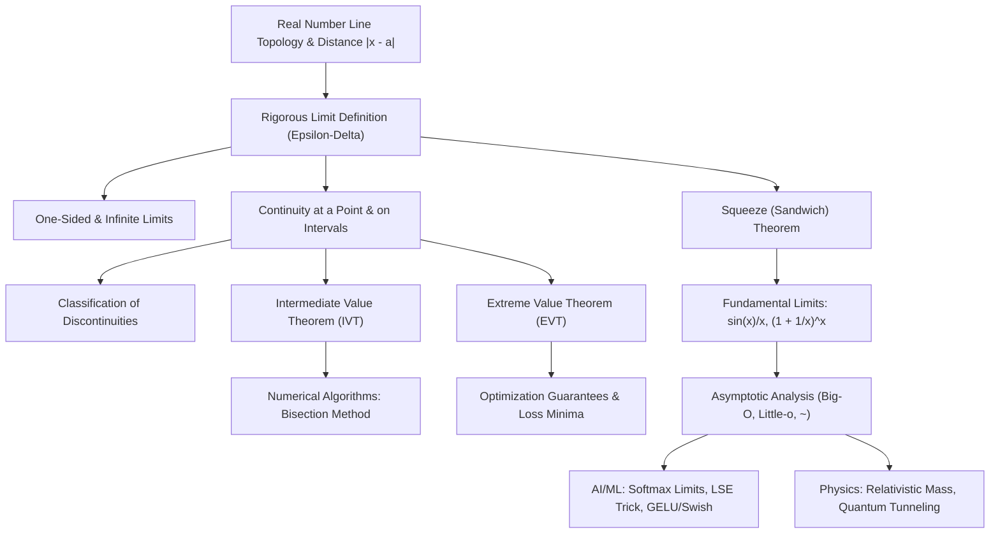

# Topic 02: Limits and Continuity — Calculus Mastery Module

**Status:** Active  
**Level:** Core Foundation (Part II of Calculus Series)  
**Target Audience:** Mathematical Modelers, AI Researchers, Applied Mathematicians, Physics & CS Students  

---

## 📌 Executive Summary & Learning Objectives

Limits and continuity constitute the foundational bedrock of mathematical analysis, differential calculus, physical conservation laws, and optimization algorithms in AI/ML. The notion of a limit formalizes how functions behave near points of interest without demanding evaluation at those points, resolving long-standing paradoxes of infinitesimal change ($0/0$ indeterminate forms). Continuity provides the topological guarantee that small inputs yield small outputs—a property indispensable for stable numerical computation, optimization landscapes, and physical continuous fields.

By completing this module, you will achieve the following mastery objectives:

1. **First-Principles $\varepsilon$-$\delta$ Rigor**: Construct formal, quantifier-precise $\varepsilon$-$\delta$ proofs for limit claims, understanding the explicit functional dependence $\delta(\varepsilon)$ for linear, polynomial, rational, and trigonometric functions.
2. **One-Sided & Infinite Limit Dynamics**: Analyze directional limits ($\lim_{x \to a^\pm} f(x)$) and asymptotic behaviors ($\lim_{x \to \pm\infty} f(x) = L$ and $\lim_{x \to a} f(x) = \pm\infty$), identifying vertical, horizontal, and oblique asymptotes.
3. **Fundamental Theorems of Continuity**: Prove and apply the Squeeze (Sandwich) Theorem, the Intermediate Value Theorem (IVT), and the Extreme Value Theorem (EVT), connecting them to root-finding algorithms (Bisection Method) and optimization existence guarantees.
4. **Classification of Discontinuities**: Categorize function irregularities into removable, jump, infinite/essential, and oscillatory discontinuities, analyzing their structural implications in physical state transitions and loss surfaces.
5. **Asymptotic Analysis & Growth Hierarchies**: Master Big-O ($O$), Little-o ($o$), and asymptotic equivalence ($\sim$) notations to simplify complicated limits and analyze algorithm time complexity and numerical error bounds.
6. **Real-World Physics & AI/ML Bridges**: Map limit processes to critical physical and computational phenomena: temperature-controlled Softmax selection ($T \to 0^+$ vs. $T \to \infty$), Log-Sum-Exp (LSE) overflow stabilization tricks, relativistic mass scaling ($v \to c^-$), and activation function limits (Sigmoid, GELU, Swish/SiLU).

---

## 🗺️ First-Principles Concept Map



```text
First-Principles Structure:
Phenomenon (Continuous Motion & Indeterminate Forms)
  ├── Basic Tool: Proximity Metric |x - a| < δ  ==>  |f(x) - L| < ε
  ├── Limit Mechanics: Algebra of Limits, One-Sided Limits, Infinite Limits
  ├── Squeeze Principle: Bounding Complex Functions between Simple Envelopes
  ├── Topological Bridge: Continuity (Lim f(x) = f(a))
  │     ├── Global Property 1: IVT (Connectedness -> Root Existence)
  │     └── Global Property 2: EVT (Compactness -> Min/Max Existence)
  ├── Local Approximation: Big-O Asymptotics & Taylor-adjacent scale comparison
  └── Modern Applications: AI Loss Smoothness, Softmax Temperature, Relativistic Limits
```

---

## ⚠️ Common Misconceptions Table

| Misconception                                          | Erroneous View                                                                 | First-Principles Truth                                                                                                                                                                                                               |
| ------------------------------------------------------ | ------------------------------------------------------------------------------ | ------------------------------------------------------------------------------------------------------------------------------------------------------------------------------------ |
| **1. Limit Equals Function Value**                     | $\lim_{x \to a} f(x)$ is simply evaluated by computing $f(a)$.                 | The limit describes the behavior of $f(x)$ as $x$ gets arbitrarily close to $a$, **excluding** $x = a$. $f(a)$ may be undefined or unequal to the limit unless $f$ is continuous at $a$. |
| **2. Indeterminate Form Implies Non-existence**        | $0/0$ or $\infty/\infty$ means the limit does not exist.                       | Indeterminate forms mean the current algebraic expression is insufficient to determine the limit. The limit may exist and equal any real number (e.g., $\lim_{x \to 0} \frac{\sin x}{x} = 1$). |
| **3. $\delta$ Depends Only on $x$**                    | In an $\varepsilon$-$\delta$ proof, $\delta$ can depend on $x$.                | $\delta$ must depend **only** on $\varepsilon$ and the point $a$ (and globally across the domain for uniform continuity). It must hold for *all* $x$ in $0 \lt \vert x - a \vert \lt \delta$.  |
| **4. IVT Guarantees Uniqueness**                       | If $f(a) \lt d \lt f(b)$, IVT guarantees *exactly one* $c$ with $f(c) = d$.        | IVT guarantees **at least one** root $c \in (a, b)$. Uniqueness requires strict monotonicity ($f' \gt 0$ or $f' \lt 0$).                                                                     |
| **5. Big-O Means Exact Order**                         | $f(x) = O(g(x))$ means $f$ grows at the exact same rate as $g$.                | $O(g(x))$ denotes an **upper bound** up to a constant ($\vert f(x) \vert \le C \vert g(x) \vert$). Exact order is $\Theta(g(x))$, while $o(g(x))$ means strictly smaller order.          |
| **6. Continuous Functions Are Always Differentiable**  | If $f$ is continuous, it must have a derivative almost everywhere.             | Continuity does not imply differentiability. Functions like $f(x) = \vert x \vert$ have corners, and Thomae's or Weierstrass's functions exhibit continuous yet nowhere-differentiable behavior. |
| **7. Large Outputs Cause Overflows in Limits**         | Softmax as $T \to 0^+$ always overflows numerically in Python.                 | Softmax without shifting overflows; however, applying the Log-Sum-Exp identity $\text{LSE}(x) = m + \ln \sum e^{x_i - m}$ stabilizes computation identically for arbitrary scale bounds.   |

---

## 📁 Directory Inventory

```text
calculus/02_limits_and_continuity/
├── README.md               <-- Module Overview, Concept Map, Misconceptions & References (This File)
├── first_principles.ipynb  <-- Rigorous First-Principles Theory, Definitions, Proofs & Applications
└── exercises.ipynb         <-- 4-Tier Exercise Package (57 Fully Solved Problems, L0-L3)
```

---

## 📖 Recommended References

- **Spivak, M.** *Calculus* (4th Edition) — Chapters 5, 6, 7, 8 (The definitive gold standard for $\varepsilon$-$\delta$ rigor, continuity, IVT, EVT, and uniform continuity proofs).
- **Apostol, T. M.** *Calculus, Volume I* (2nd Edition) — Chapters 3 & 4 (Axiomatic foundation of limits, step functions, and continuous mappings).
- **Stewart, J.** *Calculus: Early Transcendentals* (8th Edition) — Chapter 2 (Intuitive limits, limit laws, computing limits, and physical velocities).
- **Demidovich, B. P.** *Problems in Mathematical Analysis* — Chapter 1, Section 6 (Limits and continuous functions: hundreds of concrete computational problems).
- **Pólya, G., & Szegő, G.** *Problems and Theorems in Analysis I* — Part I (Sequences, functions, and asymptotic analysis).
- **Putnam Competition Archives** — Past Problem Papers (Sequence limit challenges, functional equations under continuity).
- **Cambridge Mathematical Tripos** — Part IA Analysis I (Tripos questions on limit proofs, Thomae's popcorn function, and uniform continuity).
- **Goodfellow, I., Bengio, Y., & Courville, A.** *Deep Learning* — Chapter 4 (Numerical computation, Softmax temperature limit, Log-Sum-Exp, overflow/underflow).
- **Bender, C. M., & Orszag, S. A.** *Advanced Mathematical Methods for Scientists and Engineers* — Chapter 1 (Asymptotic expansions and Big-O / Little-o algebra).
