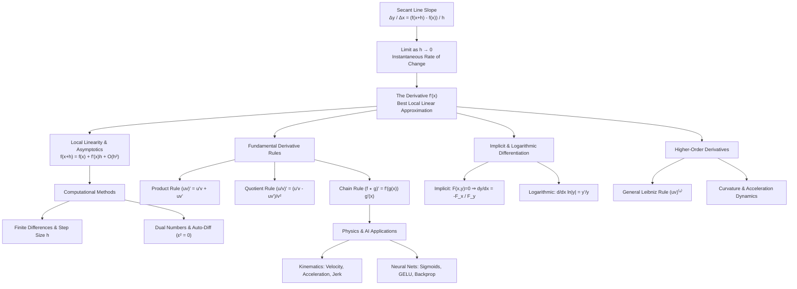

# Topic 03: Single Variable Derivatives — Calculus Mastery Module

**Status:** Complete Learning Unit  
**Module Type:** Foundation Topic Module  
**Parent Framework:** Foundations / Calculus  

---

## 1. Executive Summary & Learning Objectives

Single-variable differentiation is the fundamental mathematical tool for quantifying local, instantaneous change. Rather than treating differentiation as a mechanical list of symbol-manipulation rules, this module establishes derivatives from first principles as **the unique local linear approximation** of a function near a point.

From the secant-line limit definition to high-order derivatives, this module covers the foundational mechanics, analytical proofs, computational algorithms, and real-world applications of single-variable calculus in physics and machine learning.

### Learning Objectives

By completing this module, you will be able to:
1. **Define** the derivative as the limit of secant slopes $\lim_{h \to 0} \frac{f(x+h) - f(x)}{h}$ and formulate differentiability via local linearity with Landau asymptotic error terms $f(x+h) = f(x) + f'(x)h + O(h^2)$.
2. **Derive** fundamental differentiation rules (Product, Quotient, Chain, Inverse Function, and Logarithmic Differentiation) from first principles with full analytical rigor (e.g., using Carathéodory's formulation for the Chain Rule).
3. **Apply** implicit differentiation to geometric level curves $F(x, y) = c$ and physical constraint manifolds.
4. **Compute** high-order derivatives $f^{(n)}(x)$ using the General Leibniz Rule and understand structural expansions like Faà di Bruno's formula.
5. **Implement** forward-mode automatic differentiation using dual numbers ($a + b\epsilon$ where $\epsilon^2 = 0$) and numerical finite difference stencils, analyzing truncation versus round-off error.
6. **Analyze** physical kinematics (velocity, acceleration, jerk) and machine learning activation function derivatives (Sigmoids, GELU, Swish, Softplus) used in deep neural network backpropagation.

---

## 2. First-Principles Concept Map

---

## 3. Common Misconceptions Table

| Misconception | Mathematical Reality | Correct Mental Model |
|---|---|---|
| *"The derivative $f'(x)$ is obtained by plugging $h = 0$ directly into $\frac{f(x+h) - f(x)}{h}$."* | Direct substitution yields $\frac{0}{0}$, which is undefined. The derivative is the **limit** as $h \to 0$, evaluating behavior in an open punctured neighborhood of $x$. | Secant slopes approach a limiting slope as the secant line rotates into the tangent line. |
| *"Continuity guarantees differentiability."* | Continuity ensures no jumps or gaps, but does not prevent sharp corners (e.g., $f(x) = \lvert x \rvert$) or infinite vertical oscillations (e.g., $x \sin(1/x)$). | Continuity is a necessary condition for differentiability, but not a sufficient one. |
| *"The Chain Rule proof can always be written as $\frac{dy}{dx} = \frac{dy}{du} \cdot \frac{du}{dx}$ by canceling $du$."* | Division by $du$ fails if $g(x) - g(x_0) = 0$ infinitely often in every neighborhood of $x_0$ (e.g., $x^2 \sin(1/x)$). | Use Carathéodory's continuous auxiliary function $\phi(u)$ where $f(u) - f(u_0) = \phi(u)(u - u_0)$. |
| *"Logarithmic differentiation $\frac{d}{dx} \ln(f(x))$ only applies when $f(x) \gt 0$."* | Using absolute values $\ln \lvert f(x) \rvert$, the formula $\frac{f'(x)}{f(x)}$ holds for all points where $f(x) \neq 0$. | $\frac{d}{dx} \ln \lvert f(x) \rvert = \frac{f'(x)}{f(x)}$ domain is $\{x \in \mathbb{R} : f(x) \neq 0\}$. |
| *"Numerical differentiation with smaller step size $h \to 0$ always gives higher accuracy."* | In finite-precision floating-point arithmetic, as $h \to 0$, round-off error $O(\epsilon_{\text{mach}}/h)$ dominates truncation error $O(h^2)$. Optimal $h \approx \sqrt{\epsilon_{\text{mach}}}$. | Total error forms a U-curve: truncation error dominates for large $h$, round-off error dominates for small $h$. |

---

## 4. Directory Inventory

This module contains the following core files:

1. **[`README.md`](README.md)**: Module executive summary, learning objectives, concept map, misconceptions table, directory inventory, and canonical reference list.
2. **[`first_principles.ipynb`](first_principles.ipynb)**: Comprehensive first-principles theory, rigorous limit definitions, full proofs (including Carathéodory's chain rule and General Leibniz rule), local linearity asymptotics $O(h^2)$, forward-mode dual number auto-differentiation, and physics/AI applications.
3. **[`exercises.ipynb`](exercises.ipynb)**: A complete 40-problem 4-level exercise package and step-by-step solutions manual spanning:
   - **L0 (Concept Checks)**: 8 fundamental conceptual and geometric questions.
   - **L1 (Foundations)**: 10 core standard textbook and computational problems.
   - **L2 (Applications, AI/ML and Physics)**: 12 applied problems (kinematics, activation functions, backprop, autograd, implicit layers).
   - **L3 (Challenge Proofs)**: 10 advanced competition and analysis problems (Tripos, Demidovich, Kaczor & Nowak, Landau inequalities).

---

## 5. Recommended References & Canonical Literature

1. **Spivak, M.** (2008). *Calculus* (4th ed.). Publish or Perish.
   - *Chapters 9, 10, 11 & 12*: Foundations of derivatives, differentiation rules, local approximation, and inverse functions.
2. **Apostol, T. M.** (1967). *Calculus, Volume 1: One-Variable Calculus, with an Introduction to Linear Algebra* (2nd ed.). John Wiley & Sons.
   - *Chapter 3*: The derivative, mean value theorems, and derivative rules.
3. **Stewart, J.** (2015). *Calculus: Early Transcendentals* (8th ed.). Cengage Learning.
   - *Chapter 3*: Differentiation rules, implicit differentiation, and rate of change models.
4. **Demidovich, B. P.** (1973). *Problems in Mathematical Analysis*. Mir Publishers.
   - *Chapter II*: Differentiation of functions (Problems 651–1000).
5. **Landau, E.** (1913). *Einige Ungleichungen für die zweiten Ableitungen einer Funktion*. Mathematische Zeitschrift.
   - Foundation for differential inequality bounds ($M_1^2 \le 4 M_0 M_2$).
6. **Bernoulli, J.** (1696). *Problema novum ad cujus solutionem Mathematici invitantur*. Acta Eruditorum.
   - Classical foundation for Fermat's principle of least time, refraction, and the Brachistochrone curve.
7. **Pólya, G., & Szegő, G.** (1998). *Problems and Theorems in Analysis I*. Springer-Verlag.
   - *Part One*: Operations with functions and asymptotic expansions.
8. **MIT OpenCourseWare.** (18.01 / 18.01SC). *Single Variable Calculus*. Massachusetts Institute of Technology.
9. **Cambridge Mathematical Tripos.** *Part IA — Differential Equations and Analysis*. University of Cambridge.
10. **Putnam Mathematical Competition.** *William Lowell Putnam Mathematical Competition Archive*. Mathematical Association of America.
