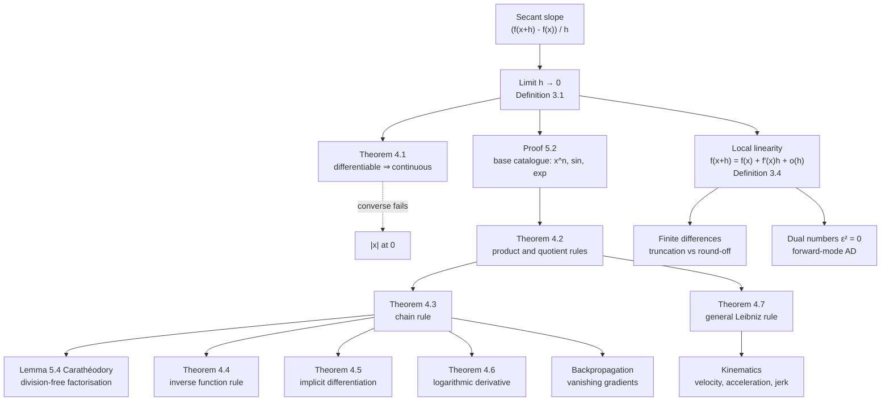

# Module 03 — Single Variable Derivatives

Every quantitative model has to answer one question before it can be optimised, calibrated or
trusted: if the input moves a little, how does the output move? The derivative is that answer in
its sharpest form — it replaces a nonlinear function, near a point, by the single linear map that
reproduces its first-order response.

That replacement is the engine underneath gradient descent, Newton's method, sensitivity analysis,
kinematics and backpropagation. None of them ever inspects a function globally; all of them run on
local linear models and on the rules that keep those models consistent under sums, products and
composition.

This module builds the derivative from the secant-slope limit of
[`calculus/02_limits_and_continuity`](../02_limits_and_continuity/), then *proves* the
differentiation rules rather than reciting them. The chain rule gets particular care: the popular
"cancel the $du$" argument divides by a quantity that can vanish arbitrarily close to the point of
interest, so the proof here goes through Carathéodory's factorisation instead, which never divides
at all.

It closes with the two ways a machine actually produces derivatives — finite differences, which
trade truncation error against round-off and hit an accuracy floor far above machine precision, and
forward-mode automatic differentiation on dual numbers, which has no step size and therefore no
truncation error.

> [!NOTE]
> **The chain rule is the module's load-bearing result.** If $g$ is differentiable at $x_0$ and $f$
> is differentiable at $g(x_0)$, then $(f \circ g)'(x_0) = f'(g(x_0))\, g'(x_0)$. Backpropagation is
> this identity applied to a composition of hundreds of layers, which is why a depth-$N$ gradient is
> a *product* of $N$ local derivatives — and why stacking sigmoids, whose derivative never exceeds
> $1/4$, cannot pass more than $4^{-N}$ of a gradient.

## Prerequisites

| Direction | Modules |
|---|---|
| Requires | [`calculus/02_limits_and_continuity`](../02_limits_and_continuity/) |
| Downstream (unlocks) | [`calculus/04_derivative_applications_optimization`](../04_derivative_applications_optimization/), [`calculus/05_indefinite_and_definite_integrals`](../05_indefinite_and_definite_integrals/), [`calculus/09_taylor_and_power_series`](../09_taylor_and_power_series/), [`calculus/10_multivariable_functions_partials`](../10_multivariable_functions_partials/), [`numerical_computing/03_conditioning_and_condition_numbers`](../../numerical_computing/03_conditioning_and_condition_numbers/) |

From the prerequisite you need the epsilon-delta definition of a limit, the limit laws, continuity
at a point, and the two trigonometric limits $\lim_{h\to 0}\frac{\sin h}{h}=1$ and
$\lim_{h\to 0}\frac{\cos h-1}{h}=0$.

## Learning outcomes

After this module you will be able to:

- State the derivative both as a limit of secant slopes and as local linearity,
  $f(x_0+h)=f(x_0)+f'(x_0)h+o(h)$, and explain why the second form is the one that generalises to $\mathbb{R}^n$.
- Prove that differentiability implies continuity, and produce the standard counterexample showing
  the converse fails.
- Derive the power, sine and exponential derivatives directly from the limit definition, and see
  why a base catalogue is needed before any rule can be applied.
- Prove the product, quotient, chain, inverse-function and general Leibniz rules, and say for each
  one exactly which hypothesis each step consumes.
- Explain why the naive chain-rule proof is invalid, and reproduce Carathéodory's division-free
  argument that repairs it.
- Differentiate implicitly on a level curve $F(x,y)=0$ and identify the points where the method
  fails because $F_y = 0$.
- Predict the optimal finite-difference step size in double precision and the accuracy floor it
  implies, and measure both.
- Implement forward-mode automatic differentiation on dual numbers and check it against a SciPy
  routine and an exact symbolic derivative.
- Derive the sigmoid, softplus, GELU and Swish derivatives and read the vanishing-gradient problem
  off the chain rule.

## Concept map

## Notation

| Symbol | Meaning | Convention fixed here |
|---|---|---|
| $f'(x_0)$, $\frac{df}{dx}$ | derivative at a point | Lagrange and Leibniz forms used interchangeably |
| $f'_+(x_0)$, $f'_-(x_0)$ | right- and left-hand derivatives | Definition 3.2 |
| $f^{(n)}$ | $n$-th derivative, with $f^{(0)} = f$ | never $f^n$, which is a power |
| $C^k(I)$ | $f^{(k)}$ exists and is continuous on $I$ | |
| $O$, $o$ | asymptotic notation as $h \to 0$ | bare capitals, never `\mathcal{O}` |
| $\lvert x \rvert$ | absolute value | `\lvert ... \rvert`, never a bare pipe |
| $\varepsilon$ | the dual unit, $\varepsilon^2 = 0$, $\varepsilon \neq 0$ | distinct from $\epsilon_{\text{mach}}$ |
| $\epsilon_{\text{mach}}$ | unit roundoff, $\approx 2.22 \times 10^{-16}$ | IEEE-754 binary64 |
| $F_x$, $F_y$ | partial derivatives of $F(x,y)$ | used only inside Theorem 4.5 |
| $\sigma(z)$ | logistic sigmoid $(1+e^{-z})^{-1}$ | |
| $\Phi$, $\phi$ | standard normal CDF and density | $\phi = \Phi'$ |

## Core results

| # | Result | Statement | Hypotheses that cannot be dropped |
|---|---|---|---|
| Thm 4.1 | Differentiability ⇒ continuity | $f'(x_0)$ exists $\Rightarrow$ $f$ continuous at $x_0$ | finiteness of $f'(x_0)$; the converse is false |
| Thm 4.2 | Product and quotient | $(uv)' = u'v + uv'$; $(u/v)' = (u'v - uv')/v^2$ | both differentiable at the same $x_0$; $v(x_0) \neq 0$ |
| Thm 4.3 | Chain rule | $(f \circ g)'(x_0) = f'(g(x_0))\,g'(x_0)$ | $f$ differentiable **at $g(x_0)$**, not at $x_0$ |
| Thm 4.4 | Inverse function rule | $(f^{-1})'(y_0) = 1/f'(x_0)$, $y_0 = f(x_0)$ | $f$ continuous and strictly monotonic; $f'(x_0) \neq 0$ |
| Thm 4.5 | Implicit differentiation | $dy/dx = -F_x/F_y$ on $F(x,y)=0$ | $F \in C^1$; $F_y(x_0,y_0) \neq 0$ |
| Thm 4.6 | Logarithmic derivative | $\frac{d}{dx}\ln\lvert f \rvert = f'/f$ | $f(x_0) \neq 0$ |
| Thm 4.7 | General Leibniz rule | $(uv)^{(n)} = \sum_k \binom{n}{k} u^{(n-k)} v^{(k)}$ | both factors $n$ times differentiable |
| §7.1 | Finite-difference step balance | $h_{\text{opt}} = \left(3\epsilon_{\text{mach}}\lvert f \rvert / M_3\right)^{1/3}$ for the central stencil | $M_3 = \sup\lvert f''' \rvert$ finite; bound is worst-case |

## Common misconceptions

| Misconception | Mathematical reality | Correct mental model |
|---|---|---|
| *"Set $h = 0$ in $\frac{f(x+h)-f(x)}{h}$."* | That is $0/0$, undefined. The derivative is a **limit** over a punctured neighbourhood of $0$. | Secant slopes rotate onto the tangent; the value at $h=0$ is never used. |
| *"Continuity is enough for differentiability."* | Continuity forbids jumps, not corners. $\lvert x \rvert$ is continuous at $0$ with $f'_+(0)=1 \neq -1 = f'_-(0)$. | Theorem 4.1 runs one way only. |
| *"The chain rule follows by cancelling $du$."* | The cancellation divides by $g(x)-g(x_0)$, which vanishes infinitely often near $0$ for $g(x)=x^2\sin(1/x)$, $g(0)=0$. | Lemma 5.4 factors $f(u)-f(u_0)=\phi(u)(u-u_0)$ with no division anywhere. |
| *"The inverse function rule only needs $f$ to be invertible."* | It also needs $f'(x_0)\neq 0$. For $f(x)=x^3$ the inverse $y^{1/3}$ has difference quotients diverging like $\delta^{-2/3}$ at $0$. | A horizontal tangent reflects to a vertical one, and vertical tangents have no slope. |
| *"$\frac{d}{dx}\ln\lvert f\rvert = f'/f$ only where $f \gt 0$."* | The absolute value extends it to every point with $f(x)\neq 0$; on $f \lt 0$ the two sign flips cancel. | The domain of the identity is $\{x : f(x)\neq 0\}$. |
| *"Smaller $h$ always gives a better numerical derivative."* | Round-off grows like $\epsilon_{\text{mach}}\lvert f\rvert / h$ while truncation falls like $h^2$; total error is U-shaped with a minimum near $h \approx 10^{-5}$. | Best attainable accuracy is about $\epsilon_{\text{mach}}^{2/3} \approx 10^{-11}$, not $\epsilon_{\text{mach}}$. |
| *"Automatic differentiation is finite differences done carefully."* | AD introduces no step size at all: dual arithmetic is exact algebra in $\mathbb{R}[\varepsilon]/(\varepsilon^2)$. | Its only error is the rounding already present in evaluating $f$. |

## Exercise index

[`exercises.ipynb`](exercises.ipynb) contains 40 problems, every one worked in full.

| Tier | Heading | Count | Content |
|---|---|---|---|
| L0 | Concept Checks | 8 | secant-to-tangent limit, corners vs continuity, local linearity order, geometry of the product rule, one-sided derivatives of $\lvert x \rvert$, $x^k\sin(1/x)$, implicit tangent geometry, failure of the naive chain-rule proof |
| L1 | Foundations | 10 | limit-definition derivatives, product and quotient, nested chain rule, $a^{g(x)}$ and $\log_a g(x)$, folium of Descartes, logarithmic differentiation, $x^{x^x}$, Leibniz $n$-th derivatives, inverse trigonometric derivations, partial fractions |
| L2 | Applications (AI/ML and Physics) | 12 | jerk-limited motion planning, Snell's law from Fermat's principle, sigmoid saturation, GELU, dual-number AD, optimal step size, implicit deep-equilibrium layers, two-class softmax, escape velocity, curvature and learning rate, relativistic acceleration, Swish convexity |
| L3 | Challenge Proofs | 10 | Rodrigues' formula, Cauchy MVT, Landau's inequality $M_1^2 \le 4M_0M_2$, Tripos $x^{n-1}\ln x$, $f + f' \to 0$, third-order Faà di Bruno, brachistochrone ODE, a nowhere-differentiable function, osculating circle, Darboux's theorem |

## References

1. Spivak, *Calculus*, 4th ed., Ch. 9 (definition of the derivative), Ch. 10 (Thm. 3 product rule, Thm. 5 quotient rule, Thm. 9 chain rule).
2. Apostol, *Calculus, Vol. I*, 2nd ed., §4.2 (derivative and continuity), §6.17 Ex. 5 (Leibniz rule), §7.6 (Landau notation).
3. Rudin, *Principles of Mathematical Analysis*, 3rd ed., Thm. 5.2 (differentiability implies continuity), Thm. 5.3 (algebra of derivatives), Thm. 5.5 (chain rule).
4. Carathéodory, *Theory of Functions of a Complex Variable*, Vol. I, §115 — the factorisation lemma used in Proof 5.4.
5. Kuhn, "The derivative à la Carathéodory", *American Mathematical Monthly* **98** (1991), 40–44.
6. Hubbard & Hubbard, *Vector Calculus, Linear Algebra, and Differential Forms*, 5th ed., §2.10 (Thm. 2.10.6, implicit function theorem).
7. Higham, *Accuracy and Stability of Numerical Algorithms*, 2nd ed., §1.14 — the truncation/round-off balance for finite differences.
8. Trefethen & Bau, *Numerical Linear Algebra*, Lecture 14 — stability and the $\epsilon_{\text{mach}}^{2/3}$ barrier.
9. Griewank & Walther, *Evaluating Derivatives*, 2nd ed., Ch. 3 — forward-mode AD and dual numbers.
10. Baydin, Pearlmutter, Radul & Siskind, "Automatic differentiation in machine learning: a survey", *JMLR* **18** (2018), 1–43, §3.1.
11. Goodfellow, Bengio & Courville, *Deep Learning*, §6.3 (activation functions), §6.5 (backpropagation as the chain rule).
12. Demidovich, *Problems in Mathematical Analysis*, Ch. II, Problems 651–1000 — the source of several L1 and L3 exercises.
13. Graham, Knuth & Patashnik, *Concrete Mathematics*, 2nd ed., §5.1 (Pascal's identity), §9.2 (O and o notation).
