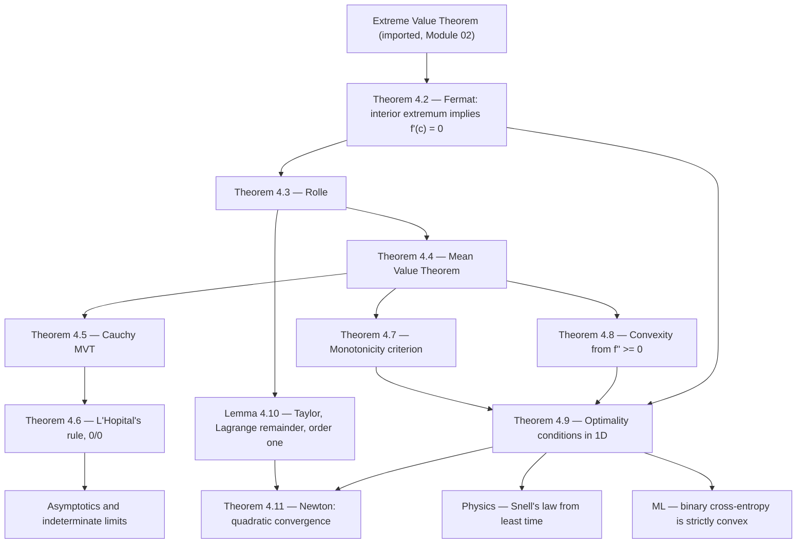

# Module 04 — Derivative Applications and Optimization

The derivative of [Module 03](../03_single_variable_derivatives/) is a purely local object: it
describes $f$ in an arbitrarily small neighbourhood of one point. On its own it says nothing about
the interval as a whole. This module supplies the single bridge that turns local information into
global conclusions — the Mean Value Theorem — and then spends the rest of its length crossing it.

The chain is short and every link is proved here. The Extreme Value Theorem, imported from
[Module 02](../02_limits_and_continuity/), guarantees that a continuous function on a closed bounded
interval attains a maximum. Fermat's theorem says the derivative vanishes wherever that maximum is
interior. Rolle's theorem combines the two, the Mean Value Theorem tilts Rolle's theorem, and
Cauchy's Mean Value Theorem runs two functions at once. From that last form L'Hopital's rule falls
out in a page; from the plain form fall monotonicity, convexity, the second-derivative test, and the
first- and second-order optimality conditions of one-dimensional optimization.

The module ends with Newton's method, where the same machinery is used quantitatively rather than
qualitatively. A one-term Taylor expansion with Lagrange remainder — proved here at order one, so
nothing is borrowed from [Module 09](../09_taylor_and_power_series/) — converts the Newton update
into an error recursion $e_{k+1} \le C e_k^2$. That inequality is why root-finders and second-order
optimizers double their correct digits per step, and why they must be started close to the answer.

Everything here is one-dimensional on purpose. The stationarity condition, the curvature test, the
convexity-implies-global argument and the quadratic convergence estimate all survive verbatim into
$\mathbb{R}^n$ with $f'$ replaced by $\nabla f$ and $f''$ by $\nabla^2 f$, so the one-dimensional
proofs are the ones worth understanding in full.

> [!NOTE]
> **Mean Value Theorem.** If $f$ is continuous on $[a,b]$ and differentiable on $(a,b)$, there
> exists $c \in (a,b)$ with $f'(c) = \dfrac{f(b) - f(a)}{b - a}$.
> Every other result in this module — monotonicity, convexity, L'Hopital's rule, the optimality
> conditions, the Newton error bound — is a corollary of this one identity or of its two-function
> version, Cauchy's Mean Value Theorem.

## Prerequisites

**Required before this module**

- [calculus/03 — Single-Variable Derivatives](../03_single_variable_derivatives/) — the derivative
  as a limit of difference quotients, the differentiation rules, and the local linear model.
- [calculus/02 — Limits and Continuity](../02_limits_and_continuity/) — supplies the Extreme Value
  Theorem, the one result this module cites rather than proves.

**Downstream — modules that build on this one**

- [numerical_methods/02 — Root-Finding Methods](../../numerical_methods/02_root_finding_methods/) —
  takes the Newton convergence theorem and compares it against bisection and the secant method.
- [information_theory/01 — Self-Information and Entropy](../../information_theory/01_self_information_and_entropy/) —
  uses strict concavity and the interior-stationary-point argument to prove the uniform
  distribution maximizes entropy.
- [calculus/09 — Taylor and Power Series](../09_taylor_and_power_series/) — generalizes the
  order-one Lagrange remainder proved here to arbitrary order.

## Learning outcomes

After this module you will be able to:

- State the Extreme Value, Fermat, Rolle, Mean Value and Cauchy Mean Value theorems with every
  hypothesis, and give the counterexample that breaks each one when a hypothesis is dropped.
- Prove the Mean Value Theorem from Rolle's theorem, and Rolle's theorem from Fermat's theorem plus
  the Extreme Value Theorem, without circularity.
- Derive L'Hopital's rule for $0/0$ from Cauchy's Mean Value Theorem, and recognize the two ways it
  is commonly misapplied: a non-indeterminate form, and a non-existent limit of $f'/g'$.
- Reduce $0 \cdot \infty$, $\infty - \infty$, $0^0$, $1^\infty$ and $\infty^0$ to $0/0$ or
  $\infty/\infty$ and evaluate them.
- Determine intervals of strict monotonicity and convexity from derivative signs, and separate a
  genuine inflection point from a mere vanishing of $f''$.
- Certify a one-dimensional optimum: apply the first-order necessary condition, the second-order
  sufficient condition, and the convexity argument that upgrades a local minimum to a global one.
- Derive Newton's method, prove its local quadratic convergence with an explicit constant, and
  exhibit its failure modes — a vanishing $f'$, a two-cycle, and the degradation to linear rate
  $1/2$ at a double root.
- Apply the machinery to Snell's law from Fermat's principle and to the strict convexity of the
  binary cross-entropy loss.

## Concept map

## Notation

| Symbol | Meaning | Convention used here |
|---|---|---|
| $f'(x)$, $f''(x)$ | first and second derivative | Lagrange notation throughout; $\tfrac{df}{dx}$ only inside a substitution |
| $c$, $\xi$ | the interior point produced by a mean value theorem | $c$ for Rolle, MVT and CMVT; $\xi$ for a Taylor remainder |
| $x^{\star}$ | a minimizer or maximizer | superscript star, never $x^*$ in prose |
| $\operatorname{int}(I)$ | interior of the interval $I$ | |
| $\operatorname{argmin}$, $\operatorname{argmax}$ | argument of the extremum | `\operatorname{...}`; `\argmin` is forbidden by KaTeX |
| $e_k = \lvert x_k - r \rvert$ | error of the $k$-th iterate against the root $r$ | absolute error, never signed |
| $p$ | order of convergence | $e_{k+1} \approx C e_k^{\,p}$; $p = 2$ for Newton at a simple root |
| $O$, $o$ | asymptotic notation | bare capitals, not `\mathcal{O}` |
| $P_n$, $R_n$ | degree-$n$ Taylor polynomial and its remainder | not $T_n$ |

## Core results

| Result | Statement | Hypotheses that cannot be dropped |
|---|---|---|
| Theorem 4.1 — Extreme Value Theorem | continuous $f$ on $[a,b]$ attains a maximum and a minimum | continuity; the interval closed **and** bounded |
| Theorem 4.2 — Fermat | interior local extremum with $f'(c)$ existing forces $f'(c) = 0$ | $c$ interior; $f'(c)$ exists |
| Theorem 4.3 — Rolle | $f(a) = f(b)$ forces $f'(c) = 0$ for some $c \in (a,b)$ | continuity on $[a,b]$; differentiability on $(a,b)$; equal endpoints |
| Theorem 4.4 — Mean Value Theorem | $f'(c) = \dfrac{f(b)-f(a)}{b-a}$ for some $c \in (a,b)$ | continuity on $[a,b]$; differentiability on $(a,b)$ |
| Theorem 4.5 — Cauchy MVT | $\dfrac{f'(c)}{g'(c)} = \dfrac{f(b)-f(a)}{g(b)-g(a)}$ at one shared $c$ | both continuous and differentiable; $g' \ne 0$ on $(a,b)$ |
| Theorem 4.6 — L'Hopital, $0/0$ | $\lim f/g = \lim f'/g'$ when the latter exists | indeterminate form; $g' \ne 0$ near $a$; the limit of $f'/g'$ must exist |
| Theorem 4.7 — Monotonicity | $f' \gt 0$ gives strict increase; $f' \ge 0$ is equivalent to non-decreasing | continuity on the closed interval to reach the endpoints |
| Theorem 4.8 — Convexity | for twice differentiable $f$, convex $\iff f'' \ge 0$; $f'' \gt 0$ gives strict convexity | twice differentiability; part 3 is one-directional |
| Theorem 4.9 — Optimality in 1D | $f'(x^{\star}) = 0$ necessary; with $f''(x^{\star}) \gt 0$ sufficient for a strict local min; convexity makes it global | $x^{\star}$ interior; $f''$ continuous at $x^{\star}$ |
| Lemma 4.10 — Taylor, order one | $f(y) = f(x) + f'(x)(y-x) + \tfrac{1}{2}f''(\xi)(y-x)^2$ | $f''$ exists on the open interval joining $x$ and $y$ |
| Theorem 4.11 — Newton | $e_{k+1} \le C\,e_k^{2}$ on a neighbourhood with $C\rho \lt 1$ | $f(r) = 0$; $f'(r) \ne 0$; $f''$ bounded near $r$ |

## Common misconceptions

| Misconception | Reality | Counterexample |
|---|---|---|
| "$f'(c) = 0$ makes $c$ an extremum." | Stationarity is necessary at an interior extremum, never sufficient. | $f(x) = x^3$ has $f'(0) = 0$ and no extremum at $0$. |
| "$f''(c) = 0$ makes $c$ an inflection point." | An inflection point needs $f''$ to *change sign* at $c$. | $f(x) = x^4$ has $f''(0) = 0$ and $f'' \ge 0$ everywhere; $0$ is a strict minimum. |
| "L'Hopital applies to any quotient." | It applies only to $0/0$ and $\pm\infty/\pm\infty$. | $\lim_{x\to0}\frac{x+1}{x+2} = \tfrac12$, but differentiating gives $1$. |
| "If $\lim f'/g'$ fails to exist, $\lim f/g$ fails too." | The implication runs one way only. | $\lim_{x\to\infty}\frac{x+\sin x}{x} = 1$ while $1 + \cos x$ oscillates. |
| "Newton's method finds the nearest root." | Convergence is local; the theorem promises nothing from an arbitrary $x_0$. | $f(x) = x^3 - 5x$, $x_0 = 1$ cycles between $1$ and $-1$ forever. |
| "Strictly increasing forces $f' \gt 0$." | Isolated zeros of $f'$ are permitted; only $f' \ge 0$ is equivalent. | $f(x) = x^3$ is strictly increasing with $f'(0) = 0$. |
| "Quadratic convergence means Newton is always fast." | The rate degrades to linear with ratio $1/2$ at a multiple root. | $f(x) = (x-1)^2$ halves the error per step, never squares it. |

## Exercise index

[`exercises.ipynb`](exercises.ipynb) — 40 fully solved problems.

| Tier | Count | Content |
|---|---|---|
| L0 — Concept Checks | 6 | hypothesis checks for Rolle and Fermat, L'Hopital misuse, $f''(c) = 0$ versus inflection, strict monotonicity with a zero derivative |
| L1 — Foundations | 14 | MVT and CMVT computations, all seven indeterminate forms, monotonicity and concavity analyses, global extrema on a closed interval, Newton iterations and its instability near $f' = 0$ |
| L2 — Applications (AI/ML and Physics) | 12 | Snell's law, maximum power transfer, projectile range on an incline, cylindrical container, terminal velocity; cross-entropy convexity, ridge regression, Huber loss, exact line search, logistic and softplus curvature, Newton on the logistic loss |
| L3 — Challenge Proofs | 8 | Putnam 1990 A1 and 1998 B1, a three-function determinant CMVT, the secant method's order $\varphi$, a Tripos derivative bound, Jensen's inequality from convexity, a pathological L'Hopital case, Armijo finite termination |

## References

- Spivak, *Calculus*, 4th ed., Ch. 11 (Significance of the Derivative) and Ch. 14 (Thm 14.4, the
  Mean Value Theorem, and its corollaries).
- Apostol, *Calculus, Volume I*, 2nd ed., §4.13–4.18 (Rolle, Mean Value, monotonicity) and §7.8
  (Taylor with Lagrange remainder).
- Rudin, *Principles of Mathematical Analysis*, 3rd ed., Thm 4.16 (Extreme Value Theorem, p. 89),
  Thm 5.9 (generalized Mean Value Theorem, p. 107), Thm 5.13 (L'Hopital, p. 109), Thm 5.15
  (Taylor, p. 110).
- Nocedal & Wright, *Numerical Optimization*, 2nd ed., Thm 2.4 (second-order sufficient conditions,
  p. 16), Thm 3.5 (quadratic convergence of Newton's method, p. 44), §3.1 (Armijo backtracking,
  p. 33).
- Boyd & Vandenberghe, *Convex Optimization*, §3.1.4 (second-order convexity conditions, p. 71) and
  §4.2.3 (optimality for unconstrained convex problems, p. 141).
- Hubbard & Hubbard, *Vector Calculus, Linear Algebra, and Differential Forms*, 5th ed., §1.9
  (Newton's method and its Kantorovich-type hypotheses).
