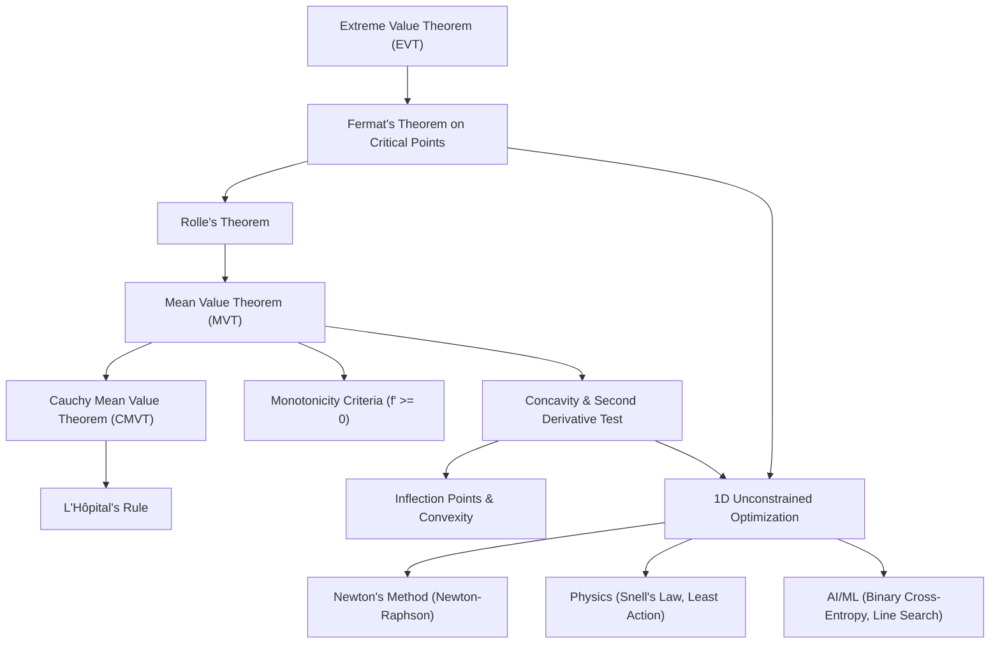

# Topic 04: Derivative Applications & Optimization — Calculus Mastery Module

**Status:** Active  
**Level:** Core Foundation (Part IV of Calculus Series)  
**Target Audience:** Mathematical Modelers, AI Researchers, Applied Mathematicians, Computational Physicists  

---

## 📌 Executive Summary

Derivative applications form the core bridge between local differential behavior and global quantitative analysis. While differential calculus defines instantaneous rates of change, its true power lies in analyzing function behavior across entire domains.

This module establishes the analytical machinery governing local and global extrema, shape characteristics (monotonicity and concavity), asymptotic limits via local linear/polynomial approximations, and algorithmic optimization. We build systematically from fundamental existence theorems (Fermat, Rolle, Mean Value Theorem, Cauchy Mean Value Theorem) to computational applications (L'Hôpital's Rule, 1D Optimization, Newton-Raphson Method) and their foundational roles in physics and machine learning loss minimization.

---

## 🎯 Learning Objectives

By completing this module, you will be able to:

1. **Rigorously Apply Mean Value Theorems**: State, prove, and apply Fermat's Theorem, Rolle's Theorem, the Mean Value Theorem (MVT), and Cauchy's Mean Value Theorem (CMVT) from first principles using real analysis topology (Extreme Value Theorem and Darboux's Theorem).
2. **Evaluate Indeterminate Limits**: Evaluate $0/0, \infty/\infty, 0 \cdot \infty, \infty - \infty, 0^0, 1^\infty, \infty^0$ indeterminate forms using Cauchy MVT derivations of L'Hôpital's Rule and asymptotic expansion analysis.
3. **Characterize Qualitative Function Behavior**: Determine intervals of strict monotonicity via derivative signs, analyze local convexity/concavity via second derivatives, and isolate inflection points and saddle points.
4. **Formulate & Solve 1D Optimization Problems**: Construct analytical models for unconstrained and constrained 1D optimization, proving necessary ($f'(x^{\ast})=0$) and sufficient ($f''(x^{\ast}) \gt 0$) conditions for local and global optimality.
5. **Analyze Numerical Root-Finding Algorithms**: Derive Newton's Method (Newton-Raphson), establish its quadratic convergence rate $e_{k+1} = O(e_k^2)$ via Taylor expansions, identify failure modes (cycles, zero derivative, non-convergence), and implement line search globalizations.
6. **Bridge Calculus to Physics & AI/ML**: Connect Fermat's Principle of Least Time (Snell's Law), physical energy minimization, loss function curvature, cross-entropy optimization, and gradient descent line search step-size selection to classical calculus theorems.

---

## 🗺️ First-Principles Concept Map



---

## ⚠️ Common Misconceptions Table

| Misconception | Mathematical Reality | Counterexample / Correct Principle |
|---|---|---|
| **"If $f'(c) = 0$, then $c$ must be a local maximum or minimum."** | $f'(c) = 0$ is a *necessary* condition for a local extremum in an open interior, but not a *sufficient* one. The derivative can vanish at inflection points. | $f(x) = x^3$ at $x=0$ has $f'(0)=0$, but $x=0$ is a strict inflection point, neither a local min nor max. |
| **"If $f''(c) = 0$, then $(c, f(c))$ is an inflection point."** | $f''(c) = 0$ is a candidate condition. An inflection point requires that $f''(x)$ *changes sign* across $x=c$. | $f(x) = x^4$ at $x=0$ has $f''(0)=0$, but $f''(x) = 12x^2 \ge 0$ for all $x$, so $x=0$ is a strict local minimum, not an inflection point. |
| **"L'Hôpital's Rule applies whenever a limit looks like a fraction."** | L'Hôpital's Rule requires indeterminate form $0/0$ or $\pm\infty/\pm\infty$, differentiability on an interval, and existence of $\lim f'/g'$. | $\lim_{x\to 0} \frac{x+1}{x+2} = \frac{1}{2}$. Applying L'Hôpital yields $\frac{1}{1}=1$, which is wrong because it was not indeterminate. |
| **"If $\lim_{x\to a} \frac{f'(x)}{g'(x)}$ does not exist, then $\lim_{x\to a} \frac{f(x)}{g(x)}$ does not exist."** | L'Hôpital's Rule is a one-way implication: if $\frac{f'}{g'}$ has a limit, $\frac{f}{g}$ has the same limit. Non-existence of $\frac{f'}{g'}$ does *not* imply non-existence of $\frac{f}{g}$. | $\lim_{x\to\infty} \frac{x + \sin x}{x} = 1$, but $\frac{f'(x)}{g'(x)} = 1 + \cos x$ oscillates endlessly as $x\to\infty$. |
| **"Newton's method always converges to the nearest root."** | Newton's method is local; convergence depends heavily on the initial point $x_0$. It can diverge, oscillate infinitely, or jump to distant roots. | For $f(x) = x^3 - 5x$, starting at $x_0 = 1$ leads to an oscillating cycle between $1$ and $-1$. |
| **"A differentiable strictly increasing function must have $f'(x) \gt 0$ everywhere."** | Strict monotonicity allows $f'(x) = 0$ at isolated points. | $f(x) = x^3$ is strictly increasing on $\mathbb{R}$, yet $f'(0) = 0$. |

---

## 📂 Directory Inventory

```text
foundations/calculus/04_derivative_applications_optimization/
├── README.md         <-- Executive summary, concept map, misconception table, reference bibliography (This File)
├── first_principles.md     <-- Complete first-principles theory, rigorous proofs, derivations & applications
└── exercises.md      <-- 40-problem 4-level exercise package (L0-L3) with full KaTeX step-by-step solutions
```

---

## 📖 Recommended References

1. **Spivak, Michael.** *Calculus* (4th Edition), Publish or Perish, 2008.
   - *Chapters 11 (Significance of the Derivative), 12 (Inverse Functions), 14 (The Mean Value Theorem).*
2. **Apostol, Tom M.** *Calculus, Volume I* (2nd Edition), John Wiley & Sons, 1967.
   - *Chapter 4 (Applications of Differential Calculus: Monotonicity, Extrema, Mean Value Theorem).*
3. **Demidovich, B. P.** *Problems in Mathematical Analysis*, Mir Publishers, 1973.
   - *Section II: Differential Calculus (Extrema, MVT, L'Hôpital, Curve Sketching).*
4. **Nocedal, Jorge, & Wright, Stephen J.** *Numerical Optimization* (2nd Edition), Springer, 2006.
   - *Chapter 2 (Fundamentals of Unconstrained Optimization), Chapter 3 (Line Search Methods).*
5. **Polya, George, & Szegö, Gabor.** *Problems and Theorems in Analysis I*, Springer, 1972.
   - *Part I: Analysis of Functions, Extremal Properties.*
6. **Stewart, James.** *Calculus: Early Transcendentals* (8th Edition), Cengage Learning, 2015.
   - *Chapter 4 (Applications of Differentiation).*
7. **William Lowell Putnam Mathematical Competition.** Archives (1938–2023), Mathematical Association of America.
8. **Cambridge Mathematical Tripos.** Part IA Paper 1 (Differential Equations and Analysis).
