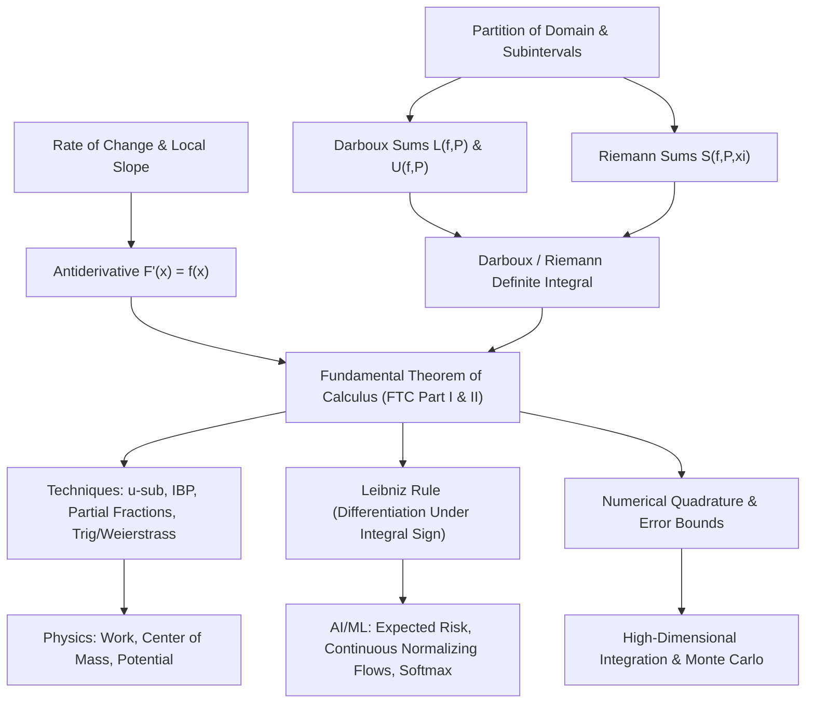

# Topic 05: Indefinite and Definite Integrals — Calculus Mastery Module

**Status:** Active  
**Level:** Core Foundation (Part III of Calculus Series)  
**Target Audience:** Mathematical Modelers, Physicists, AI/ML Researchers, Applied Mathematicians  

---

## 📌 Module Overview

Integration is the fundamental operation of continuous accumulation. While differentiation breaks complex continuous processes down into instantaneous rates of change, integration synthesizes local information—density, flux, probability, work, gradient vectors—back into global quantities.

This module delivers a complete first-principles construction of integration:
1. **The Antiderivative (Indefinite Integral)**: The inverse operation of differentiation, representing the family of functions whose rate of change recovers the integrand.
2. **Darboux & Riemann Definite Integrals**: The rigorous limit of finite sum approximations over partitions, establishing the exact geometric concept of signed area and measure accumulation.
3. **The Fundamental Theorem of Calculus (FTC Parts I & II)**: The profound bridge linking differential calculus (local rates) to integral calculus (global accumulation).
4. **Differentiation Under the Integral Sign (Leibniz Rule)**: Parametric integration and the "Feynman Trick" for evaluating difficult definite integrals and continuous loss functions.
5. **Systematic Integration Techniques**: Master-level mastery of $u$-substitution, integration by parts (IBP), partial fraction decomposition (PFD), trigonometric substitutions, and the Weierstrass universal substitution ($t = \tan(x/2)$).
6. **Numerical & Applied Quadrature**: Numerical integration algorithms (Trapezoidal, Simpson's, Gaussian Quadrature), error bounds, and applications in continuous probability (PDF/CDF), continuous neural ODEs, and ML expected risk minimization.

Accompanied by a **4-Level Mastery Exercise Package** (40 fully solved problems), this module connects rigorous analysis (Spivak, Apostol, Demidovich) to physical conservation laws and state-of-the-art AI architectures.

---

## 🎯 Learning Objectives

By completing this module, you will be able to:

1. **Construct Definite Integrals from First Principles**: Define partitions, mesh size, upper/lower Darboux sums, and tagged Riemann sums, proving integrability for bounded continuous and piecewise monotonic functions.
2. **Prove and Apply the Fundamental Theorem of Calculus**: Execute rigorous proofs of FTC I and FTC II using the Mean Value Theorem (MVT) and Darboux bounds, avoiding common pitfalls with discontinuous integrands.
3. **Master Parametric Differentiation (Leibniz Integral Rule)**: Apply Leibniz's rule with variable boundaries and parametric integrands, solving non-standard integrals via the Feynman integration technique.
4. **Deploy Advanced Integration Techniques**: Execute non-trivial antiderivatives using algebraic substitutions, recursive integration by parts, partial fractions with irreducible quadratics, and Weierstrass tangent half-angle substitutions.
5. **Analyze Numerical Quadrature & Error Bounds**: Derive and evaluate error bounds for Midpoint, Trapezoidal, and Simpson's $1/3$ rules ($O(h^2)$ and $O(h^4)$ convergence).
6. **Bridge Calculus to Physics & AI/ML**: Formulate physical work, center of mass, and continuous probability expectations ($E[X], \text{Var}(X)$), and model continuous-time dynamics in AI (Neural ODEs, Softmax partition functions, continuous loss landscapes).
7. **Solve Competition-Level Integrals**: Conquer Putnam, MIT Integration Bee, Demidovich, and Cambridge Tripos integral challenges.

---

## 📂 Module Structure

```text
foundations/calculus/05_indefinite_and_definite_integrals/
├── README.md       <-- Module Overview & Index (This File)
├── first_principles.md   <-- First-Principles Theory, Proofs, Derivations, Quadrature & AI Applications
└── exercises.md    <-- 4-Level Exercise Package (40 Problems with Full Solutions & Takeaways)
```

---

## 🗺️ First-Principles Concept Map



---

## ⚠️ Common Misconceptions Table

| Misconception | Fallacy / Error | Rigorous Correction |
|---|---|---|
| **Indefinite Integral Constant** | Writing $\int \frac{1}{x} dx = \ln x + C$ for all $x \in \mathbb{R} \setminus \{0\}$. | The domain is partitioned into $(-\infty, 0)$ and $(0, \infty)$. The correct antiderivative is $\ln \lvert x \rvert + C$. On disconnected domains, constants can differ on each connected component. |
| **Naïve FTC Application** | Applying $\int_a^b f(x) dx = F(b) - F(a)$ when $f(x)$ has an essential discontinuity or asymptote in $[a, b]$ (e.g., $\int_{-1}^1 \frac{1}{x^2} dx = -2$). | FTC II requires $f$ to be continuous (or bounded and integrable with a continuous antiderivative $F$) on $[a, b]$. $\int_{-1}^1 x^{-2} dx$ is an improper integral that diverges to $+\infty$. |
| **Variable Bound Differentiation** | Claiming $\frac{d}{dx} \int_a^x f(t) dt = f(x)$ even when integrand depends on $x$, e.g., $\frac{d}{dx}\int_0^x (x-t)dt$. | If $x$ appears inside the integrand *and* in the limit of integration, one must use the full **Leibniz Integral Rule**: $\frac{d}{dx}\int_{a(x)}^{b(x)} f(x,t)dt = f(x,b(x))b'(x) - f(x,a(x))a'(x) + \int_{a(x)}^{b(x)} \frac{\partial f}{\partial x}(x,t)dt$. |
| **Substitution Boundaries** | Changing variables $u = g(x)$ without changing limits of integration or checking monotonicity/differentiability of $g(x)$. | Definite integration substitution requires $\int_a^b f(g(x))g'(x)dx = \int_{g(a)}^{g(b)} f(u)du$, where $g$ must be continuously differentiable on $[a,b]$. |
| **Riemann Sum Limit Existence** | Assuming any infinite sum over a partition equals a Riemann integral without checking partition mesh $\lim_{n \to \infty} \Vert P_n \Vert = 0$. | The limit of Riemann sums converges to the definite integral if and only if the mesh size (maximum subinterval width) approaches zero and $f$ is Riemann integrable. |

---

## 📊 Exercise Progression Summary

| Level | Category / Target Audience | Problem Count | Core Competencies Developed |
|---|---|---|---|
| **Level 0 — Concept Check** | Intuition & Conceptual Reasoning | 8 Problems | Geometric area logic, Darboux bounds, FTC hypotheses, improper integral convergence testing. |
| **Level 1 — Foundation** | Standard Techniques & Computations | 11 Problems | $u$-substitution, IBP, partial fractions, trig substitution, Weierstrass substitution, Riemann sum limits. |
| **Level 2 — Applications in Physics & AI/ML** | Physics Modeling & Machine Learning | 11 Problems | Work, electric potential, continuous expectations $E[X]$, Gaussian integrals, Neural ODEs, loss risk minimization. |
| **Level 3 — Challenge & Olympiad** | Putnam, Cambridge Tripos, Demidovich | 10 Problems | Feynman trick, Frullani integrals, symmetry tricks, Polya integral bounds, analysis proofs. |

**Total Problems:** **40 fully solved problems** with step-by-step KaTeX math, boxed answers, and explicit takeaways.

---

## 📖 Recommended References

- **Spivak, M.** *Calculus* (4th Ed.) — Chapters 13, 14, 15, 18 & 19. (Incomparable treatment of Darboux sums, FTC proofs, and transcendental functions).
- **Apostol, T. M.** *Calculus, Volume I* (2nd Ed.) — Chapters 1, 2 & 5. (Axiomatic measure-first approach to integration, step functions, and FTC).
- **Stewart, J.** *Calculus: Early Transcendentals* (8th Ed.) — Chapters 5 & 7. (Comprehensive computational foundation and physical applications).
- **Demidovich, B. P.** *Problems in Mathematical Analysis* — Chapters IV & V. (Classic collection of classic, computational, and challenging integrals).
- **Pólya, G., & Szegő, G.** *Problems and Theorems in Analysis I* — Part I (Integration techniques, limits of sequences of integrals, asymptotic evaluations).
- **Putnam Competition Archive** — Mathematical Association of America (Definite integral tricks, functional equations under integrals).
- **Cambridge Mathematical Tripos** — Part IA Examination Papers (Integration by parts reductions, contour integration previews, special functions).
- **MIT Integration Bee Archives** — Annual Competition Problems (High-speed integration techniques and algebraic transformations).
