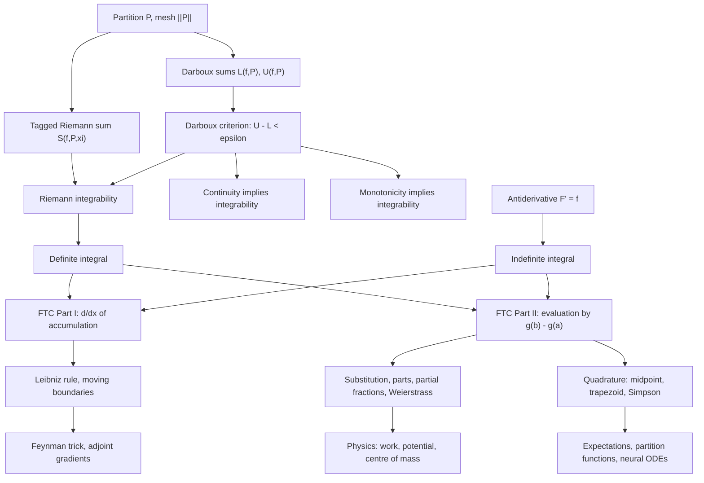

# Module 05 — Indefinite and Definite Integrals

Two constructions share the name "integral", and they start from opposite ends. The
**indefinite integral** $\int f(x)\,dx$ is defined by inverting differentiation: it is the
family of functions whose derivative is $f$. The **definite integral** $\int_a^b f(x)\,dx$ is
defined by cutting $[a,b]$ into pieces, bounding $f$ above and below on each piece, and
squeezing the two totals together. Nothing in the second definition mentions a derivative.

The module builds both from the ground up — partitions, mesh, Darboux sums, upper and lower
integrals, tagged Riemann sums — and then proves the two theorems that join them. Along the
way it settles which functions are integrable at all: continuity suffices, monotonicity
suffices, and the Dirichlet function shows that boundedness alone does not.

The joining theorem is the Fundamental Theorem of Calculus. Part I says the accumulation
function $F(x) = \int_a^x f$ is differentiable with $F' = f$, which is an *existence* result:
every continuous function on a closed interval has an antiderivative, whether or not a formula
for it exists. Part II says any antiderivative evaluates the definite integral by two
subtractions. Both are proved in full in Section 5, from the Mean Value Theorem and the
Darboux criterion, with neither proof leaning on the other's conclusion.

The rest is machinery and consequence: substitution and parts as the chain and product rules
read backwards, partial fractions and the Weierstrass half-angle substitution, the Leibniz
rule for differentiating under the integral sign, and the quadrature rules with their $O(h)$,
$O(h^2)$ and $O(h^4)$ error orders — the tools that turn "the integral exists" into a number.

> [!NOTE]
> **Fundamental Theorem of Calculus.** If $f$ is continuous on $[a, b]$, then
> $F(x) = \int_a^x f(t)\,dt$ satisfies $F'(x) = f(x)$ (Part I); and if $f$ is Riemann integrable
> on $[a, b]$ and $g$ is continuous on $[a, b]$, differentiable on $(a, b)$, with $g' = f$, then
> $\int_a^b f(x)\,dx = g(b) - g(a)$ (Part II). Drop continuity of $g$ at an interior point and the
> formula produces nonsense: it reports $\int_{-1}^{1} x^{-2}\,dx = -2$ for a strictly positive
> integrand.

## Prerequisites

- [calculus/03 — Single-Variable Derivatives](../03_single_variable_derivatives/) — the Mean
  Value Theorem, the chain rule and the product rule are the engine of every proof here.

Useful but not required: [calculus/02 — Limits and Continuity](../02_limits_and_continuity/)
for uniform continuity, the Extreme Value Theorem and the Squeeze Theorem.

**Downstream — this module unlocks:**

- [calculus/06 — Integral Applications: Geometry and Physics](../06_integral_applications_geometry_physics/)
- [calculus/07 — Improper Integrals and Special Functions](../07_improper_integrals_special_functions/)
- [calculus/15 — Ordinary Differential Equations](../15_ordinary_differential_equations/)
- [probability_statistics/03 — Random Variables and Distribution Functions](../../probability_statistics/03_random_variables_and_distribution_functions/)
- [numerical_methods/06 — Numerical Integration and Quadrature](../../numerical_methods/06_numerical_integration_quadrature/)

## Learning outcomes

After this module you will be able to:

- Build a partition, compute its Darboux sums, and decide integrability from the criterion
  $U(f,P) - L(f,P) \lt \varepsilon$ rather than from a picture.
- Prove that continuity on a closed bounded interval implies integrability, and that
  monotonicity does too, with the explicit gap $(b-a)\lvert f(b)-f(a)\rvert / n$.
- Prove both parts of the Fundamental Theorem of Calculus and say precisely which hypothesis
  each step consumes.
- Evaluate an integral by substitution, by parts, by partial fractions, or by the Weierstrass
  substitution $t = \tan(x/2)$, keeping the limits of integration correct.
- Differentiate a parametric integral with moving boundaries using the Leibniz rule, and use it
  as Feynman's technique.
- Decide whether an improper integral converges, and quote the $p$-test.
- Choose a quadrature rule, state its error order, and verify that order numerically.

## Concept map

## Notation

| Symbol | Meaning | Convention |
|---|---|---|
| $\int f(x)\,dx$ | indefinite integral: the family of antiderivatives of $f$ | `\,` before the differential |
| $\int_a^b f(x)\,dx$ | Riemann (equivalently Darboux) integral of $f$ over $[a,b]$ | `\,` before the differential |
| $P = \lbrace x_0, \dots, x_n \rbrace$ | partition of $[a,b]$ with $a = x_0 \lt \dots \lt x_n = b$ | |
| $\Delta x_i$ | width $x_i - x_{i-1}$ of the $i$-th subinterval | |
| $\lVert P \rVert$ | mesh of $P$, i.e. $\max_i \Delta x_i$ | `\lVert ... \rVert`, never `\Vert` |
| $m_i$, $M_i$ | $\inf$ and $\sup$ of $f$ on $[x_{i-1}, x_i]$ | |
| $L(f,P)$, $U(f,P)$ | lower and upper Darboux sums | |
| $S(f,P,\xi)$ | Riemann sum with tags $\xi_i \in [x_{i-1}, x_i]$ | |
| $\operatorname{osc}(f, S)$ | oscillation $\sup_S f - \inf_S f$ | `\operatorname`, never `\DeclareMathOperator` |
| $\varepsilon$, $\delta$ | the limit quantifiers | $\varepsilon$, never $\epsilon$ |
| $\lvert \cdot \rvert$ | absolute value | `\lvert ... \rvert` |

## Core results

| Result | Statement | Hypotheses that cannot be dropped |
|---|---|---|
| Theorem 4.1 | Two antiderivatives of $f$ on an interval differ by a constant | $I$ connected; on $\mathbb{R} \setminus \lbrace 0 \rbrace$ the constants are independent |
| Theorem 4.2 | Darboux criterion: integrable iff $U(f,P) - L(f,P) \lt \varepsilon$ for some $P$ | $f$ bounded, so $L$ and $U$ are finite |
| Theorem 4.3 | Continuity on $[a,b]$ implies integrability | closed **and** bounded interval, for uniform continuity |
| Theorem 4.4 | Monotonicity on $[a,b]$ implies integrability, gap $=(b-a)\lvert f(b)-f(a)\rvert/n$ | monotone, so $m_i, M_i$ are endpoint values and telescope |
| Theorem 4.5 | Lebesgue's criterion: integrable iff discontinuities have measure zero | cited, not proved here — Apostol, *Mathematical Analysis*, Thm 7.48 |
| Theorem 4.7 | FTC I: $f$ continuous $\Rightarrow \frac{d}{dx}\int_a^x f = f(x)$ | continuity at $x$; a jump leaves $F$ with unequal one-sided derivatives |
| Theorem 4.8 | FTC II: $\int_a^b f = g(b) - g(a)$ when $g' = f$ | $f$ integrable; $g$ continuous on the **closed** interval |
| Theorem 4.9 | Leibniz rule: two boundary terms plus $\int \partial f/\partial x$ | $f, \partial f/\partial x$ continuous on the rectangle; $u, v \in C^1$ |
| Theorem 4.10 | Substitution: $\int_a^b f(g)g' = \int_{g(a)}^{g(b)} f$ | $g \in C^1$, $f$ continuous; monotonicity of $g$ is **not** needed |
| Theorem 4.11 | Parts: $\int_a^b uv' = [uv]_a^b - \int_a^b vu'$ | $u, v \in C^1$ |

## Common misconceptions

| Misconception | The error | Correction |
|---|---|---|
| $\int \frac{dx}{x} = \ln x + C$ on all of $\mathbb{R} \setminus \lbrace 0 \rbrace$ | treating a disconnected domain as one interval | $\ln \lvert x \rvert + C$, and by Theorem 4.1 the constant may differ on $(-\infty,0)$ and $(0,\infty)$ |
| $\int_{-1}^{1} x^{-2}\,dx = \left[-\tfrac{1}{x}\right]_{-1}^{1} = -2$ | applying Theorem 4.8 through an interior singularity | $-1/x$ is not continuous on $[-1,1]$; the integral is improper and diverges to $+\infty$ |
| $\frac{d}{dx}\int_a^x f(x,t)\,dt = f(x,x)$ when $x$ also sits inside the integrand | using Theorem 4.7 where Theorem 4.9 is required | the answer carries an extra $\int_a^x \frac{\partial f}{\partial x}(x,t)\,dt$ term |
| Substituting $u = g(x)$ without moving the limits | mixing $x$-limits with a $u$-integrand | Theorem 4.10 replaces $[a,b]$ by $[g(a), g(b)]$; the orientation of those endpoints carries the sign |
| Any $\sum f(\xi_i)\Delta x_i$ with $n \to \infty$ converges to the integral | ignoring the mesh and integrability | the mesh $\lVert P \rVert$ must go to $0$ **and** $f$ must be integrable; the Dirichlet function gives $1$ or $0$ from the same partition |
| "It has no elementary antiderivative" means the integral does not exist | conflating the indefinite and definite integrals | $\int_0^1 e^{-x^2}\,dx$ exists by Theorem 4.3 and equals $\tfrac{\sqrt{\pi}}{2}\operatorname{erf}(1)$ |

## Exercise index

[`exercises.ipynb`](exercises.ipynb) — 40 problems, every one fully solved, with a code cell
that recomputes each numeric or algorithmic answer.

| Tier | Focus | Count |
|---|---|---|
| L0 — Concept Checks | one-line hypothesis checks: the $-2$ fallacy, net signed area, FTC I with a composite limit, per-component constants, odd symmetry | 5 |
| L1 — Foundations | Riemann-sum limits, substitution, parts, partial fractions, trigonometric and Weierstrass substitutions, the Leibniz rule, Darboux sums of a constant, the Dirichlet function, the $p$-test | 14 |
| L2 — Applications (AI/ML and Physics) | work by a Duffing spring, potential of a charged rod, centre of mass of a semicircular plate, exponential mean, uniform entropy, Gaussian integral and partition function, Laplace $L_1$ risk, Simpson error bound, neural-ODE flow, ROC AUC | 11 |
| L3 — Challenge Proofs | King's property, Feynman differentiation, Frullani, Pólya's concentrating kernel, Wallis reduction, the Dirichlet integral, a floor-function series, Bonnet's second mean value theorem, a Putnam logarithmic integral | 10 |

L2 contains four genuine physics problems (Duffing work, rod potential, semicircular centroid,
and the Gaussian integral via polar coordinates).

## References

- Spivak, M. *Calculus*, 4th ed. — Ch. 13 (Darboux definition, integrability criterion), Ch. 14
  (FTC, Theorems 1 and 2), Ch. 18–19 (log and exp).
- Apostol, T. M. *Mathematical Analysis*, 2nd ed. — Thm 7.19 (Riemann–Darboux equivalence),
  §7.26 Thm 7.48 (Lebesgue's criterion for Riemann integrability).
- Apostol, T. M. *Calculus, Volume I*, 2nd ed. — Ch. 1–2 (step-function construction), Ch. 5
  (FTC and integration techniques).
- Rudin, W. *Principles of Mathematical Analysis*, 3rd ed. — §6.1–6.7 (Thm 6.6), Thm 6.20
  (FTC I), Thm 6.21 (FTC II).
- Stewart, J. *Calculus: Early Transcendentals*, 8th ed. — Ch. 5 (definite integral), Ch. 7
  (substitution, parts, partial fractions, trigonometric and Weierstrass substitutions).
- Heath, M. T. *Scientific Computing: An Introductory Survey*, 2nd ed. — Ch. 8 (quadrature
  rules and the error constants quoted in Section 7).
- Demidovich, B. P. *Problems in Mathematical Analysis* — Ch. IV–V.
- Pólya, G., and Szegő, G. *Problems and Theorems in Analysis I* — Part I, Problems 1–100
  (limits of integral sequences).
