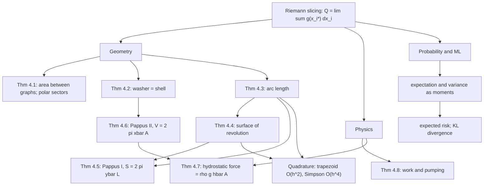

# Module 06 — Integral Applications in Geometry and Physics

[Module 05](../05_indefinite_and_definite_integrals/) built the definite integral and the machinery for evaluating one. It never said *what* to integrate. That gap is this module: given a length, an area, a volume, a surface, a force, an amount of work or an expected value, which function do you integrate, and over what interval?

The answer is one template used nine times. Cut the object into slices indexed by a single real parameter; approximate one slice by an object whose measure is exactly known — a rectangle, a disk, an annulus, a cylindrical shell, a line segment, a conical frustum; then prove that the per-slice error is small enough that the sum converges to a definite integral. The third step is the one most treatments skip. It is where the hypotheses live, and it is where this module spends its effort.

Skipping it is not harmless. The same infinitesimal picture that gives the correct arc-length formula gives a *false* surface-area formula the moment the slant length $ds$ is replaced by the horizontal width $dx$, and the naive three-dimensional version of the argument (Schwarz's lantern) makes the area of a plain cylinder come out infinite. Everything here is proved with single-variable tools only: no multiple integral, no Jacobian, no Fubini theorem, since those belong to [Module 13](../13_multiple_integrals_coordinate_transforms/) and using them would make the arguments circular.

The reach goes past geometry. An expectation $\mathbb{E}[X] = \int x f_X(x)\,dx$ is a first moment of mass, the expected risk minimised by every supervised learner is an integral against a density, and the KL divergence in a variational autoencoder is a definite integral of a log-ratio. The slicing template is what makes those objects computable.

> [!NOTE]
> For $f \in C^1[a,b]$ the graph of $f$ is rectifiable and its length — defined as the supremum of inscribed polygon lengths, not as an integral — equals $\int_a^b \sqrt{1 + [f'(x)]^2}\,dx$. Continuity of $f$ alone is not enough: $f(x) = x\sin(\pi/x)$ with $f(0) = 0$ is continuous on $[0,1]$ and its graph has infinite length.

## Prerequisites

| Direction | Module | What it supplies or unlocks |
|---|---|---|
| Requires | [calculus/05 — Indefinite and Definite Integrals](../05_indefinite_and_definite_integrals/) | Riemann and Darboux sums, substitution, integration by parts, both parts of the Fundamental Theorem of Calculus |
| Requires | [calculus/03 — Single-Variable Derivatives](../03_single_variable_derivatives/) | the Mean Value Theorem, used in every arc-length and surface-area proof here |
| Downstream | [calculus/13 — Multiple Integrals and Coordinate Transforms](../13_multiple_integrals_coordinate_transforms/) | re-derives these volumes and moments as iterated integrals with a Jacobian |
| Downstream | [calculus/07 — Improper Integrals and Special Functions](../07_improper_integrals_special_functions/) | the convergence questions raised by Gabriel's horn and by density moments |

## Learning outcomes

- Build the differential element $d\mathcal{Q} = g(x)\,dx$ for a length, area, volume, surface, work, hydrostatic-force or centre-of-mass problem, and say which hypothesis makes the limit exist.
- Prove that the washer and shell methods give the same volume using only substitution and one integration by parts, with no multivariable machinery.
- State the definition of curve length as a supremum over inscribed polygons and prove the integral formula from it for $f \in C^1$.
- Derive the surface-of-revolution formula from inscribed conical frustums, and explain why the analogous inscribed-triangle argument fails in three dimensions.
- Apply Pappus's two centroid theorems, and identify the hypothesis (axis disjoint from the region) that makes them true.
- Compute expectations, variances and KL divergences as definite integrals, and connect them to expected risk minimisation.
- Choose a quadrature rule for these integrands and predict its convergence order, then measure the order and confirm the prediction.

## Concept map

## Notation

| Symbol | Meaning | Convention |
|---|---|---|
| $\mathcal{P}$, $\lVert \mathcal{P} \rVert$ | partition of $[a,b]$ and its mesh | $\lVert \mathcal{P} \rVert = \max_i (x_i - x_{i-1})$ |
| $\mathcal{R}[h,f;a,b]$ | region between the graphs of $h \le f$ over $[a,b]$ | Definition 3.1 |
| $L(\gamma)$, $L(\gamma,\mathcal{P})$ | curve length; inscribed polygon length | $L(\gamma) = \sup_{\mathcal{P}} L(\gamma,\mathcal{P})$ |
| $ds$ | arc-length element | $ds = \sqrt{1 + [f'(x)]^2}\,dx$, never $dx$ |
| $\Sigma(\mathcal{P})$, $S$ | inscribed frustum area; surface area | Definition 3.4 |
| $\bar{x}$, $\bar{y}$, $\bar{y}_C$ | region centroid; curve centroid height | Definition 3.5 |
| $A$, $V$, $W$, $F$ | area, volume, work, force | SI units throughout |
| $\rho$, $g$ | fluid mass density; gravitational acceleration | $\rho g$ is weight density |
| $f_X$, $\mathbb{E}[X]$, $\operatorname{Var}(X)$ | density, expectation, variance | $\mathbb{E}$ never bare $E$; $f_X$ is a density, not a probability |
| $D_{\mathrm{KL}}(p \parallel q)$ | Kullback-Leibler divergence | $\int p \ln (p/q)$ |
| $\lVert v \rVert_2$ | Euclidean norm | `\lVert ... \rVert`, never `\Vert` |

## Core results

| # | Result | Statement | Hypotheses that matter |
|---|---|---|---|
| Thm 4.1 | Area between graphs | $A = \int_a^b (f - h)$; polar $A = \tfrac12\int_\alpha^\beta r^2\,d\theta$ | $f,h$ continuous, $h \le f$; $\beta - \alpha \le 2\pi$ |
| Thm 4.2 | Washer $=$ shell | $2\pi\int_a^b x f = \pi(b^2-a^2)c + \pi\int_c^d (b^2 - g^2)$ | $f \in C^1$, $f \gt 0$, $f' \gt 0$, $0 \le a \lt b$ |
| Thm 4.3 | Arc length | $L(\gamma) = \int_a^b \sqrt{1 + (f')^2}$ | $f \in C^1$; continuity of $f$ alone fails |
| Thm 4.4 | Surface of revolution | $S = 2\pi \int_a^b f\sqrt{1 + (f')^2}$ | $f \in C^1$, $f \ge 0$ |
| Thm 4.5 | Pappus I | $S = 2\pi \bar{y}_C L$ | axis disjoint from the curve; $L \gt 0$ |
| Thm 4.6 | Pappus II | $V = 2\pi \bar{x} A$ | axis off the interior of the region; $A \gt 0$ |
| Thm 4.7 | Hydrostatic force | $F = \rho g \int_c^d h w = \rho g \bar{h} A$ | flat plate, fully submerged, fluid on one side |
| Thm 4.8 | Work and pumping | $W = \int_a^b F$; $W = \rho g \int A(y)(H - y)\,dy$ | $H \ge y_1$; constant $\rho$; kinetic energy neglected |

## Common misconceptions

| Misconception | Why it fails | The correct statement |
|---|---|---|
| The arc-length integral *is* the definition of length | It is a theorem about the real definition — the supremum of inscribed polygon lengths (Definition 3.2) — and that theorem has hypotheses | Length is $\sup_{\mathcal{P}} L(\gamma,\mathcal{P})$; for $f \in C^1$, Theorem 4.3 evaluates it |
| Continuity of $f$ is enough for a finite length | $f(x) = x\sin(\pi/x)$, $f(0)=0$, is continuous with unbounded $f'$; inscribed polygon lengths grow like $\ln N$ | $f \in C^1$ on a compact interval; Section 7c of the theory notebook exhibits the divergence |
| Surface element is $2\pi f(x)\,dx$ | It replaces the frustum's slant height by its horizontal shadow, underestimating by $\sqrt{1+m^2}$ at slope $m$ | $d\Sigma = 2\pi f(x)\,ds = 2\pi f(x)\sqrt{1 + [f'(x)]^2}\,dx$ |
| Disks and shells are alternative answers | They slice the *same* solid, one perpendicular to the axis and one parallel; Theorem 4.2 proves the two integrals are equal | Perpendicular slice $\Rightarrow$ washer $\pi(R^2 - r^2)\,dy$; parallel slice $\Rightarrow$ shell $2\pi r h\,dx$ |
| Pappus's theorems always apply | If the axis crosses the region, points on the two sides sweep the same solid and the product over-counts | The axis must miss the interior of the region (Theorem 4.6) |
| Centroid is the midpoint of the interval | That assumes uniform area distribution; under $y = x^2$ on $[0,1]$ the centroid sits at $\bar{x} = 3/4$ | $\bar{x} = \frac{1}{A}\int x (f - h)\,dx$ |
| Hydrostatic force is bottom pressure times area | Pressure grows linearly with depth, so the bottom value overestimates by a factor of $2$ on a surface-piercing rectangle | $F = \rho g \int h(y) w(y)\,dy = \rho g \bar{h} A$ |
| A density value $f_X(x) \gt 1$ breaks the axioms | Only the integral must be $1$; $f_X$ is probability per unit length | $\int f_X = 1$ and $P(X = c) = 0$ for every $c$ |

## Exercise index

`exercises.ipynb` holds **40 fully solved problems**, each with statement, intuition, a step-by-step solution, a boxed answer, a one-line takeaway, and — wherever the answer is numeric or algorithmic — a code cell that recomputes it.

| Tier | Count | Coverage |
|---|---|---|
| `L0 — Concept Checks` | 8 | slicing orientation, disk versus shell, why $ds$ and not $dx$, centroid versus midpoint, depth-dependent pressure, density versus probability, when Pappus applies |
| `L1 — Foundations` | 12 | area between a parabola and a line, cardioid area, sphere volume and surface, shell volumes, catenary arc length, semicircular centroid, non-linear spring work, conical-tank pumping, parabolic gate force, exponential moments, Simpson error bound |
| `L2 — Applications (AI/ML and Physics)` | 12 | heavy-rope work, circular dam gate, hemispherical tank pumping, exponential-decay centroid, uniform moments, KL divergence between exponentials, squared-loss risk minimisation, catenary cable sag, paraboloid dish area, off-axis revolution, solid torus by Pappus, half-normal moments for ReLU networks |
| `L3 — Challenge Proofs` | 8 | Gabriel's horn, Steinmetz solid, elliptic integrals for the ellipse perimeter, variational derivation of the catenary, oblate ellipsoid surface, Maxwell-Boltzmann moments, Pappus for an inclined axis, asymptotic expansion of the Gaussian $Q$-function |

## References

1. Apostol, T. M., *Calculus, Volume I*, 2nd ed., Wiley 1967 — §1.6–§1.17 (area as an integral), §2.11 (volume by cross-sections), §14.7 (surfaces of revolution and Pappus's theorems).
2. Spivak, M., *Calculus*, 4th ed., Publish or Perish 2008 — Ch. 13 (the integral); Ch. 19, Problems 1–5 (length as the supremum of inscribed polygons, and non-rectifiable continuous graphs).
3. Courant, R., *Differential and Integral Calculus, Volume I*, 2nd ed., Interscience 1937 — §V.2 (area, length, volume, moments), §V.3 (work and hydrostatic pressure).
4. Rudin, W., *Principles of Mathematical Analysis*, 3rd ed., McGraw-Hill 1976 — Thm 6.27 and the surrounding discussion of rectifiable curves.
5. Stewart, J., *Calculus: Early Transcendentals*, 8th ed., Cengage 2015 — Ch. 6 (areas, volumes, shells, work), §8.1–§8.3 (arc length, surface area, centroids, Pappus), §8.5 (probability densities).
6. Trefethen, L. N., *Approximation Theory and Approximation Practice*, SIAM 2013 — Ch. 19 (quadrature convergence orders).
7. Wasserman, L., *All of Statistics*, Springer 2004 — §2.3 (continuous random variables), §3.1 (expectation as an integral).
8. Demidovich, B. P., *Problems in Mathematical Analysis*, Mir 1970 — §5 (definite integrals and their geometric and physical applications), Nos. 1600–1750.
