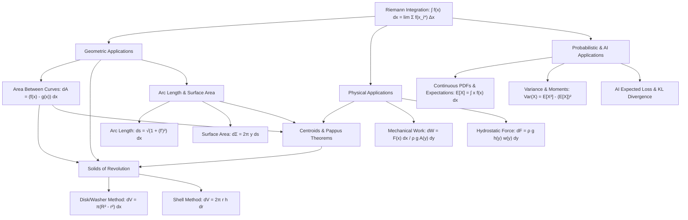

# Topic 06: Integral Applications in Geometry & Physics — Calculus Mastery Module

**Status:** Active  
**Level:** Core Foundation (Part III of Single-Variable Calculus Series)  
**Target Audience:** Mathematical Modelers, Applied Physicists, AI/ML Researchers  

---

## 📌 Executive Summary & Module Overview

Definite integration is far more than a tool for evaluating the "area under a curve." At its core, the definite integral $\int_a^b f(x)\,dx$ is a continuum limit of discrete Riemann sums—a mathematical mechanism for aggregating infinitely many infinitesimal contributions over a continuous domain. 

In this module, we develop a unified, first-principles framework that applies definite integration across geometry, classical physics, and probability theory. By conceptualizing physical and geometric quantities as accumulations of infinitesimal elements $d\mathcal{Q}$ (such as differential area elements $dA$, slice volume elements $dV$, arc length elements $ds$, surface area ribbons $d\Sigma$, work elements $dW$, hydrostatic force elements $dF$, or mass elements $dm$), we derive exact continuum formulas without hand-waving or reliance on formula memorization.

Furthermore, this module establishes a direct bridge to modern AI/ML and continuous statistics. Expectations of probability density functions, continuous loss landscapes, expected risk minimization, Kullback-Leibler (KL) divergence, and variational principles in physics and neural network optimization all trace their origins to these exact integral formulation principles.

---

## 🎯 Learning Objectives

By completing this module, you will master the following capabilities:

1. **First-Principles Riemann Sum Decomposition**: Formulate differential elements $d\mathcal{Q}$ for arbitrary continuous physical or geometric quantities, rigorously proving formulas via limits of Riemann sums $\lim_{\|\mathcal{P}\| \to 0} \sum_{i=1}^n f(x_i^{\ast})\,\Delta x_i$.
2. **Geometric Mensuration**:
   - Compute areas between intersecting Cartesian, parametric, and polar curves.
   - Master both the **Disk/Washer Method** (perpendicular slicing) and the **Cylindrical Shell Method** (parallel slicing) for solids of revolution, proving their theoretical equivalence via Fubini's theorem / change of variables.
   - Calculate exact arc length $s = \int \sqrt{1 + (f'(x))^2}\,dx$ for smooth curves and understand conditions for rectifiability.
   - Compute surface areas of revolution via conical frustum approximation elements $d\Sigma = 2\pi r \, ds$.
3. **Physical & Mechanical Modeling**:
   - Derive center of mass and centroid coordinates $(\bar{x}, \bar{y})$ using moments of mass and Pappus's Centroid Theorems (Theorems 1 and 2).
   - Evaluate mechanical work $W = \int F(x)\,dx$ for non-linear Hooke's law springs, variable gravity, and pumping fluids out of arbitrary 3D vessels.
   - Compute hydrostatic forces $F = \int \rho g h(y) w(y)\,dy$ on submerged vertical surfaces using depth integration.
4. **Probability Density & Expectation Integration**:
   - Evaluate expectations $\mathbb{E}[X] = \int x f(x)\,dx$, variances $\text{Var}(X) = \mathbb{E}[(X - \mu)^2]$, and cumulative distribution functions (CDFs) for continuous random variables (Uniform, Exponential, Gaussian/Normal, Maxwell-Boltzmann).
   - Connect continuous expectations to AI/ML loss functions and expected risk minimization.
5. **Algorithmic & Computational Quadrature**:
   - Understand non-analytic integration limitations and implement computational quadrature (Trapezoidal Rule, Simpson's $1/3$ Rule, Adaptive Quadrature, and Monte Carlo integration).
6. **Problem-Solving Rigor**:
   - Solve 40 canonical, physics, and competition-level problems drawn from Stewart, Apostol, Demidovich, Cambridge Tripos, and the Putnam Competition.

---

## 🗺️ First-Principles Concept Map



### Conceptual Slicing Hierarchy (ASCII View)

```text
========================================================================================
                          THE INTEGRAL ACCUMULATION PARADIGM
========================================================================================
   Continuous Quantity Q  --->  Partition Domain [a,b]  --->  Construct Slice dQ
----------------------------------------------------------------------------------------
   Application Domain    | Differential Element (dQ)       | Integral Formulation
----------------------------------------------------------------------------------------
   Area Between Curves   | dA = [f(x) - g(x)] dx            | A = ∫_a^b [f(x) - g(x)] dx
   Volume (Disk/Washer)  | dV = π [R(x)² - r(x)²] dx       | V = π ∫_a^b [R(x)² - r(x)²] dx
   Volume (Cyl. Shell)   | dV = 2π x [f(x) - g(x)] dx       | V = 2π ∫_a^b x [f(x) - g(x)] dx
   Arc Length            | ds = √(1 + [f'(x)]²) dx         | L = ∫_a^b √(1 + [f'(x)]²) dx
   Surface Area          | dΣ = 2π f(x) ds                 | S = 2π ∫_a^b f(x) √(1 + [f'(x)]²) dx
   Centroid (x_bar)      | dM_y = x dA                     | x_bar = (1/A) ∫_a^b x [f(x) - g(x)] dx
   Mechanical Work       | dW = F(x) dx  or  ρ g A(y) h dy | W = ∫_a^b F(x) dx
   Hydrostatic Force     | dF = ρ g depth(y) width(y) dy   | F = ρ g ∫_a^b h(y) w(y) dy
   PDF Expectation       | dE = x f(x) dx                  | E[X] = ∫_{-∞}^{∞} x f(x) dx
========================================================================================
```

---

## 💡 Common Misconceptions & Pitfalls

| Misconception / Pitfall | Why It Fails Mathematically | Correct First-Principles Perspective |
|:--- |:--- |:--- |
| **Disk vs. Shell confusion** | Rotating a region about an axis without checking if slices are parallel or perpendicular to the axis of rotation leads to wrong dimensions. | Disks/Washers use slices **perpendicular** to the rotation axis ($dV = \pi R^2 \, dx$). Shells use slices **parallel** to the rotation axis ($dV = 2\pi r h \, dr$). |
| **Naive Arc Length sum $\int dy$** | Adding $\Delta y$ or $\Delta x$ directly ignores the Euclidean hypotenuse structure. | Arc length measures hypotenuse increments: $\Delta s = \sqrt{(\Delta x)^2 + (\Delta y)^2} = \sqrt{1 + (f'(x))^2}\,\Delta x$. |
| **Surface Area via cylinders $2\pi f(x)\,dx$** | Replacing the slant length element $ds$ with flat height $dx$ underestimates surface area for non-flat slopes. | A revolution element is a conical frustum of slant height $ds = \sqrt{1 + (f'(x))^2}\,dx$, giving $d\Sigma = 2\pi f(x) ds$. |
| **Centroid as arithmetic mean of endpoints** | Assuming $\bar{x} = \frac{a+b}{2}$ or $\bar{y} = \frac{y_{\text{max}}}{2}$ ignores non-uniform spatial mass distribution. | Centroids require normalized mass moments: $\bar{x} = \frac{\int x \, dA}{\int dA}$ and $\bar{y} = \frac{\int \frac{1}{2}(f(x)^2 - g(x)^2)\,dx}{\int [f(x)-g(x)]\,dx}$. |
| **Hydrostatic Force = Pressure $\times$ Total Area** | Pressure $P(y) = \rho g y$ varies continuously with depth $y$; multiplying bottom pressure by area overestimates force on vertical walls. | Integrate differential force slices: $dF = P(y)\,dA = \rho g y w(y)\,dy$ over the depth profile. |
| **Confusing PDF value $f(x)$ with probability** | For a continuous random variable, $f(x)$ can exceed $1$; it is a probability *density*, not a probability. | Probability is the area under density: $P(a \le X \le b) = \int_a^b f(x)\,dx$. Single points have measure zero: $P(X = c) = 0$. |

---

## 📂 Directory Inventory

```text
calculus/06_integral_applications_geometry_physics/
├── README.md               <-- Module overview, concept map, misconceptions, inventory (This File)
├── first_principles.ipynb  <-- Complete theoretical derivations, theorems, physics models, AI connections
└── exercises.ipynb         <-- 40-problem 4-level exercise package with full step-by-step solutions
```

---

## 📖 Recommended References & Citations

1. **Spivak, M.** *Calculus* (4th Edition), Publish or Perish, 2008.
   - *Chapters 13, 14, & 18*: Rigorous Riemann integration foundations, arc length bounds, and rectifiable curves.
2. **Apostol, T. M.** *Calculus, Volume I* (2nd Edition), John Wiley & Sons, 1967.
   - *Chapters 2 & 14*: Axiomatic area integration, volume by cross-sections, and Pappus's theorems.
3. **Stewart, J.** *Calculus: Early Transcendentals* (8th Edition), Cengage Learning, 2015.
   - *Chapters 6 & 8*: Applications of integration to geometry, physics, centroids, and probability.
4. **Demidovich, B. P.** *Problems in Mathematical Analysis*, Mir Publishers, 1973.
   - *Section V (Definite Integrals & Applications)*: Classic computational, geometric, and physical integration problems.
5. **Pólya, G., & Szegő, G.** *Problems and Theorems in Analysis I*, Springer-Verlag, 1972.
   - *Part One*: Geometric integration limits, variational area properties, and classical integral inequalities.
6. **MIT OpenCourseWare (OCW)**: *18.01 Single Variable Calculus* (Prof. David Jerison).
   - *Unit 3 & Unit 4*: Slicing methods, physical work, hydrostatic pressure, and parametric arc length.
7. **Cambridge Mathematical Tripos**: *Part IA — Differential Equations & Dynamics / Vector Calculus*.
   - Historical problem archives on center of mass, fluid pressure integration, and catenary variational problems.
8. **William Lowell Putnam Mathematical Competition**:
   - Past competition problem archives (Solids of revolution, Gabriel's horn variations, spatial integrals).
