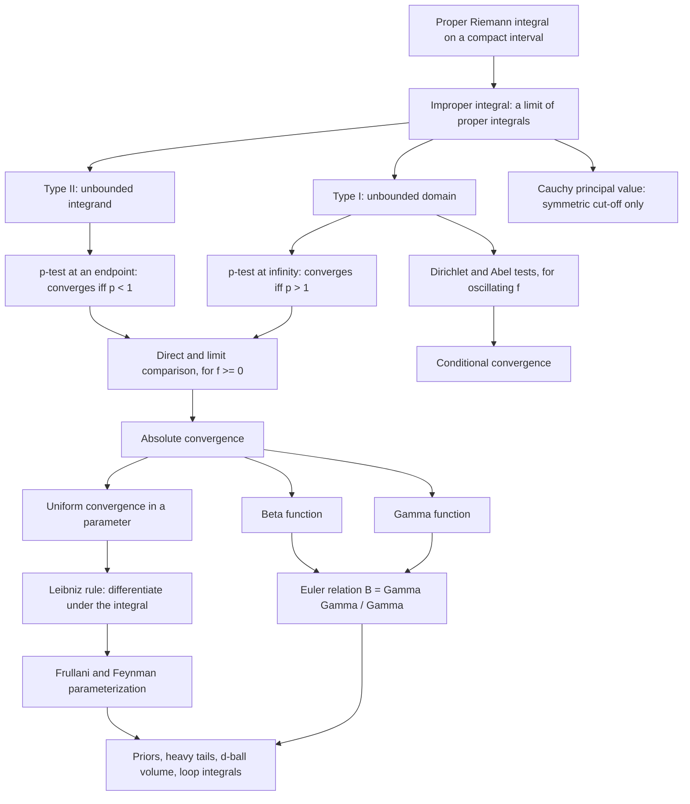

# Module 07 — Improper Integrals and Special Functions

The Riemann integral is built for a bounded function on a compact interval. The two integrals
that matter most in applied mathematics satisfy neither condition: a probability density is
integrated over all of $\mathbb{R}$, and a Beta density with shape parameter below $1$ blows up
at the endpoint. This module extends the integral to both situations by the only device
available — take a proper integral over a shrinking or expanding piece of the domain, then pass
to the limit.

Everything downstream hangs on whether that limit exists. A density whose integral diverges has
no normalizing constant; a moment whose integral diverges is not a number. So the module builds
the convergence theory first: the two $p$-tests that calibrate every comparison, the direct and
limit comparison tests for non-negative integrands, and Dirichlet's and Abel's tests for the
oscillating integrands where convergence comes from cancellation rather than accumulated area.

On top of that theory sit the two Eulerian integrals. The Gamma function interpolates the
factorial, and the Beta function is its two-argument companion; Euler's relation
$B(x,y) = \Gamma(x)\Gamma(y)/\Gamma(x+y)$ ties them together and thereby supplies the normalizing
constant of the Beta, Gamma, chi-squared, Student-$t$ and Dirichlet laws, the volume of the
$d$-dimensional ball, and the Feynman parameterization that collapses a product of propagator
denominators into one.

The last theme is parameter differentiation. Introducing an artificial parameter, differentiating
under the integral sign, solving the resulting differential equation and sending the parameter to
its limit evaluates integrals with no elementary antiderivative — the Dirichlet integral
$\int_0^\infty \sin(x)/x \, dx = \pi/2$ being the standard example. The step that makes this a
proof rather than a manipulation is uniform convergence in the parameter, and the module states
and proves exactly that hypothesis.

> [!NOTE]
> **Euler's Beta–Gamma relation.** For $x, y \gt 0$,
> $B(x,y) = \dfrac{\Gamma(x)\Gamma(y)}{\Gamma(x+y)}$.
> The two Eulerian integrals are one object: an integral over the simplex $[0,1]$ equals an
> integral over the quadrant $[0,\infty)^2$ with the total-mass coordinate factored out. Every
> Beta, Dirichlet, Student-$t$ and $d$-ball normalizing constant is a special case, which is why
> a ratio of Gammas is the closed form that keeps appearing in Bayesian statistics.

## Prerequisites

| Direction | Modules |
| :--- | :--- |
| Requires | [calculus/02 — Limits and Continuity](../02_limits_and_continuity/), [calculus/05 — Indefinite and Definite Integrals](../05_indefinite_and_definite_integrals/) |
| Downstream (unlocks) | [probability_statistics/05 — Continuous Distributions](../../probability_statistics/05_continuous_distributions/), [differential_equations/06 — Laplace Transform Methods](../../differential_equations/06_laplace_transform_methods/) |

You need the $\varepsilon$–$\delta$ definition of a limit and one-sided limits from calculus/02,
and substitution, integration by parts and both parts of the Fundamental Theorem from calculus/05.

## Learning outcomes

After working through [`first_principles.ipynb`](first_principles.ipynb) and
[`exercises.ipynb`](exercises.ipynb) you will be able to:

- Classify an integral as Type I, Type II or hybrid, and write it as the correct limit of proper
  integrals with independent cut-offs.
- Decide convergence with the $p$-test, direct comparison or limit comparison, and state which
  hypothesis each test needs.
- Distinguish absolute from conditional convergence, and use Dirichlet's or Abel's test on an
  oscillating integrand.
- Separate a Cauchy principal value from genuine convergence and produce an integral where the
  two differ.
- Evaluate integrals in closed form with $\Gamma$, $B$ and Euler's relation, including
  half-integer arguments through $\Gamma(1/2) = \sqrt{\pi}$.
- Apply Frullani's theorem and recognise when its hypotheses hold.
- Evaluate a non-elementary integral by differentiating under the integral sign, and justify the
  step with uniform convergence rather than assuming it.
- Recognise these integrals in Gaussian normalizers, conjugate priors, heavy-tailed moments,
  $d$-ball volumes and Feynman parameterization.

## Concept map

## Notation

| Symbol | Meaning | Convention |
| :--- | :--- | :--- |
| $\int_a^\infty f$ | Type I improper integral | $\lim_{R \to \infty} \int_a^R f$, Definition 3.1 |
| $\int_a^b f$ with $f$ unbounded at $b$ | Type II improper integral | $\lim_{\epsilon \to 0^+} \int_a^{b-\epsilon} f$, Definition 3.4 |
| $\operatorname{P.V.}\int$ | Cauchy principal value | symmetric cut-off only, Definition 3.7 |
| $\lvert f \rvert$ | absolute value of the integrand | `\lvert ... \rvert`, never a bare pipe |
| $p$ | exponent in the test integrand $x^{-p}$ | reserved for the $p$-test in this module |
| $\Gamma(z)$ | Gamma function, $z \gt 0$ | $\int_0^\infty t^{z-1}e^{-t}\,dt$, Definition 3.9 |
| $B(x,y)$ | Beta function, $x, y \gt 0$ | $\int_0^1 t^{x-1}(1-t)^{y-1}\,dt$, Definition 3.10 |
| $f(\infty)$ | $\lim_{x \to \infty} f(x)$ when it exists | used only inside Theorem 4.12 |
| $\alpha$ | the artificial parameter in $I(\alpha)$ | Definition 3.11, Theorem 4.13 |
| $s$ | the Feynman parameter | $s \in [0,1]$, Theorem 4.14 |
| $\varepsilon_{\mathrm{mach}}$ | unit of floating-point rounding | $\approx 2.2 \times 10^{-16}$ in binary64 |

## Core results

| # | Result | Statement | Hypotheses |
| :--- | :--- | :--- | :--- |
| Thm 4.1 | $p$-test at infinity | $\int_1^\infty x^{-p}dx = \frac{1}{p-1}$ | converges iff $p \gt 1$ |
| Thm 4.2 | $p$-test at an endpoint | $\int_0^1 x^{-p}dx = \frac{1}{1-p}$ | converges iff $p \lt 1$ |
| Thm 4.3 | Direct comparison | $\int g$ converges $\Rightarrow \int f$ converges | $0 \le f \le g$ eventually |
| Thm 4.4 | Limit comparison | same fate for both integrals | $f, g \gt 0$ and $f/g \to L \in (0,\infty)$ |
| Thm 4.5 | Dirichlet's test | $\int_a^\infty fg$ converges | $\int_a^R f$ bounded; $g \in C^1$ monotone, $g \to 0$ |
| Thm 4.6 | Abel's test | $\int_a^\infty fg$ converges | $\int_a^\infty f$ converges; $g \in C^1$ monotone and bounded |
| Thm 4.7 | Functional equation | $\Gamma(z+1) = z\Gamma(z)$, $\Gamma(n+1) = n!$ | $z \gt 0$ |
| Thm 4.8 | Gaussian value | $\Gamma(1/2) = \sqrt{\pi}$ | none beyond $z = 1/2$ |
| Thm 4.9 | Beta representations | trigonometric and half-line forms | $x, y \gt 0$ |
| Thm 4.10 | Euler's relation | $B(x,y) = \Gamma(x)\Gamma(y)/\Gamma(x+y)$ | $x, y \gt 0$ |
| Thm 4.11 | Reflection formula | $\Gamma(x)\Gamma(1-x) = \pi/\sin(\pi x)$ | $0 \lt x \lt 1$; cited, with $x = 1/2$ proved in full |
| Thm 4.12 | Frullani | $\int_0^\infty \frac{f(ax)-f(bx)}{x}dx = (f(0)-f(\infty))\ln\frac{b}{a}$ | $f$ continuous on $[0,\infty)$ with a finite limit; $a, b \gt 0$ |
| Thm 4.13 | Leibniz rule | $\frac{d}{d\alpha}\int f = \int \partial_\alpha f$ | $f, \partial_\alpha f$ continuous; differentiated integral uniformly convergent |
| Thm 4.14 | Feynman parameterization | $\frac{1}{A^aB^b} = \frac{\Gamma(a+b)}{\Gamma(a)\Gamma(b)}\int_0^1 \frac{s^{a-1}(1-s)^{b-1}}{[sA+(1-s)B]^{a+b}}ds$ | $A, B \gt 0$ and $a, b \gt 0$ |

## Common misconceptions

| Misconception | Reality | Counterexample or correction |
| :--- | :--- | :--- |
| "If $f(x) \to 0$ then $\int_a^\infty f$ converges." | The decay must beat $1/x$, not merely reach $0$. | $\int_1^\infty \frac{dx}{x} = \lim_{R\to\infty}\ln R = \infty$ although $1/x \to 0$. |
| "If $\int_a^\infty f$ converges then $f(x) \to 0$." | False for integrands with spikes that thin out fast enough. | $\int_0^\infty \sin(x^2)\,dx = \tfrac{1}{2}\sqrt{\pi/2}$ converges while $\sin(x^2)$ keeps oscillating between $\pm 1$. |
| "$\int_{-\infty}^\infty f = \lim_{R\to\infty}\int_{-R}^{R} f$." | That is the principal value; the definition needs two independent limits. | $\int_{-\infty}^\infty x\,dx$ diverges, yet $\operatorname{P.V.}\int_{-\infty}^\infty x\,dx = 0$. |
| "A convergent improper integral can be split and rearranged freely." | Only absolute convergence licenses that. | $\int_0^\infty \frac{\sin x}{x}dx$ converges but $\int_0^\infty \frac{\lvert \sin x\rvert}{x}dx$ diverges, so the positive and negative parts cannot be separated. |
| "Differentiating under the integral sign always works." | Theorem 4.13 needs the differentiated integral to converge *uniformly* in the parameter. | Without uniformity the truncated derivatives can converge to something that is not $I'$; Example 6.5 verifies the hypothesis before using it. |
| "$\Gamma$ and $B$ are decorative notation for factorials." | They are the normalizing constants that make standard densities integrate to $1$. | A Beta$(a,b)$ prior with $a \lt 1$ is unbounded at $0$; it is Theorem 4.2 that makes it normalizable at all. |
| "Convergence at one end implies convergence overall." | Each end must be tested separately. | $\int_0^\infty x^{-p}dx$ diverges for every $p$: no exponent satisfies $p \lt 1$ at the origin and $p \gt 1$ at infinity. |

## Exercise index

[`exercises.ipynb`](exercises.ipynb) holds 40 fully solved problems.

| Tier | Title | Count | Focus |
| :--- | :--- | ---: | :--- |
| L0 | Concept Checks | 6 | classification, both $p$-tests, principal value versus convergence, $\Gamma$ at small integers, one direct comparison |
| L1 | Foundations | 13 | logarithmic $p$-test, endpoint singularities, limit comparison, conditional convergence, Beta symmetry and Wallis integrals, Frullani, a first parameter differentiation |
| L2 | Applications (AI/ML and Physics) | 11 | Gaussian normalizer and the ELBO's KL term, Beta-binomial and Gamma priors, $d$-ball volume, Student-$t$ constant; Maxwell-Boltzmann, the Planck integral, propagator combination, the Laplace characteristic function |
| L3 | Challenge Proofs | 10 | Fresnel, the squared Dirichlet integral, Putnam 2005 A5, Stirling by Laplace's method, Euler's log-Gamma integral, the log-sine integral, $N$-denominator Feynman parameters |

## References

- Apostol, *Mathematical Analysis*, 2nd ed., Ch. 10 §10.14–10.20 — improper integrals, comparison
  tests, and the $p$-test benchmarks.
- Apostol, *Mathematical Analysis*, 2nd ed., Ch. 10 §10.19 (Thm 10.17) and §10.21–10.23 —
  Dirichlet's test, uniform convergence of parameter integrals, and the Leibniz rule.
- Rudin, *Principles of Mathematical Analysis*, 3rd ed., Ch. 8, "The Gamma Function"
  (Thms 8.18–8.20) — Bohr–Mollerup and the Beta–Gamma relation.
- Ahlfors, *Complex Analysis*, 3rd ed., Ch. 5 §2.4 — Euler's reflection formula, cited in
  Theorem 4.11.
- Whittaker & Watson, *A Course of Modern Analysis*, 4th ed., Ch. XII — Eulerian integrals and
  product representations of $\Gamma$.
- Spivak, *Calculus*, 4th ed., Ch. 19 — conditional convergence and $\int_0^\infty \sin(x)/x\,dx$.
- Hubbard & Hubbard, *Vector Calculus, Linear Algebra, and Differential Forms*, 5th ed., Ch. 4
  §4.10 — the change-of-variables theorem used in the polar-coordinate proofs.
- Bishop, *Pattern Recognition and Machine Learning*, §2.1.1 and §2.3.6 — Beta and Gamma
  distributions as conjugate priors.
- Peskin & Schroeder, *An Introduction to Quantum Field Theory*, §6.3 and Appendix A.4 — Feynman
  parameterization and loop integrals.
