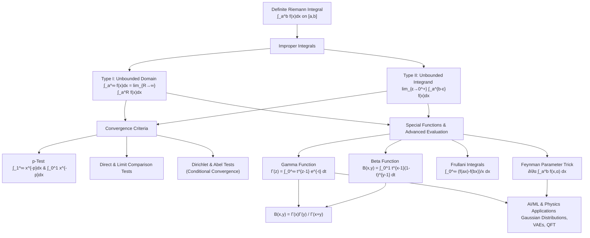

# Topic 07: Improper Integrals & Special Functions — Calculus Mastery Module

## Executive Summary & Learning Objectives

Improper integrals extend the fundamental concept of the Definite Integral (Riemann Integration) from compact intervals $[a, b]$ with bounded integrands to unbounded domains (such as $[a, \infty)$ or $(-\infty, \infty)$) and integrands with singular points (unbounded values). Understanding the convergence, divergence, and exact evaluations of improper integrals is a cornerstone of modern analysis, probability theory, statistical physics, quantum mechanics, and machine learning.

This module provides a rigorous, first-principles foundation for evaluating and analyzing improper integrals, mastering classical convergence tests, and deploying powerful integral transforms and special functions ($\Gamma(x)$, $B(x,y)$, Frullani integrals, and Feynman parameterization).

### Core Learning Objectives
1. **Classification & Definition**: Formally define Type I (unbounded domain) and Type II (unbounded integrand) improper integrals as limits of proper Riemann integrals, including Cauchy Principal Value (P.V.).
2. **Convergence Analysis**: Master the $p$-test for Type I and Type II integrals, the Direct Comparison Test (DCT), Limit Comparison Test (LCT), and Dirichlet/Abel Tests for conditional convergence.
3. **Special Functions**: Derive the fundamental identities, symmetry properties, functional equations, and integral representations of the Gamma function $\Gamma(z)$ and Beta function $B(x, y)$.
4. **Advanced Analytical Tools**: Master Frullani integrals, Feynman's Parameterization Trick (differentiation under the integral sign / Leibniz Rule), and double-integral transformations for evaluating non-elementary integrals.
5. **Real-World & AI/ML Applications**: Connect improper integrals and special functions to Gaussian distributions in Variational Autoencoders (VAEs), Beta/Gamma conjugate priors in Bayesian statistics, and loop integrals in physics/QFT.

---

## First-Principles Concept Map



---

## Common Misconceptions Table

| Misconception | Reality & Correct Principle | Correct Mathematical Counterexample |
| :--- | :--- | :--- |
| **"If $\lim_{x \to \infty} f(x) = 0$, then $\int_a^\infty f(x) \, dx$ must converge."** | Decay rate matters. $f(x)$ must decay strictly faster than $1/x$. | $\int_1^\infty \frac{1}{x} \, dx = \lim_{R \to \infty} \ln R = \infty$, despite $\lim_{x \to \infty} \frac{1}{x} = 0$. |
| **"$\int_{-\infty}^\infty f(x) \, dx = \lim_{R \to \infty} \int_{-R}^R f(x) \, dx$."** | This is the *Cauchy Principal Value* (P.V.), not the standard improper integral. The standard integral requires independent limits $\lim_{R_1 \to \infty} \int_{-R_1}^c f(x) dx + \lim_{R_2 \to \infty} \int_c^{R_2} f(x) dx$. | $\int_{-\infty}^\infty x \, dx$ diverges in the standard sense, but $\text{P.V.} \int_{-\infty}^\infty x \, dx = \lim_{R \to \infty} \int_{-R}^R x \, dx = 0$. |
| **"If $\int_a^\infty f(x) \, dx$ converges, then $\lim_{x \to \infty} f(x) = 0$."** | Convergence does not require $f(x) \to 0$ if spikes become infinitely narrow (continuous function with narrow spikes). | Fresnel integral $\int_0^\infty \sin(x^2) \, dx$ converges to $\sqrt{\pi/8}$, but $\sin(x^2)$ oscillates infinitely without converging to $0$. |
| **"Gamma and Beta functions are just arbitrary abstract math definitions."** | $\Gamma(z)$ is the unique smooth extension of the factorial $n!$ satisfying the Bohr-Mollerup theorem, and $B(x,y)$ represents normalizing constants for Beta distributions in probability. | $\Gamma(n+1) = n!$ and $B(x,y) = \frac{\Gamma(x)\Gamma(y)}{\Gamma(x+y)}$. |
| **"Differentiation under the integral sign is always valid."** | Dominated Convergence Theorem / Leibniz Rule requires the partial derivative $\frac{\partial f}{\partial \alpha}(x,\alpha)$ to be bounded by an integrable function $g(x)$ uniform in $\alpha$. | Differentiating an improper integral where the boundary terms or integrand derivatives grow uncontrollably leads to false convergence results. |

---

## Directory Inventory

```text
07_improper_integrals_special_functions/
├── README.md        # Mastery module overview, concept map, misconceptions, references
├── first_principles.md    # First-principles theory, rigorous proofs, theorems, physics & AI applications
└── exercises.md     # 40 fully solved 4-level problems (L0: Concept Check, L1: Foundation, L2: Physics & AI/ML, L3: Tripos/Putnam/Challenge)
```

---

## Recommended References

1. **Michael Spivak** — *Calculus* (4th ed.), Publish or Perish.
   - *Chapters 14, 19, & 27*: Rigorous limits, improper integrals, and special functions.

2. **Tom M. Apostol** — *Calculus, Volume 1 & 2* (2nd ed.), Wiley.
   - *Volume 1, Chapter 10*: Detailed exposition of Type I and Type II improper integrals and comparison tests.
   - *Volume 2, Chapter 11*: Parametric integrals and differentiation under the integral sign.

3. **James Stewart** — *Calculus: Early Transcendentals* (9th ed.), Cengage.
   - *Chapter 7.8*: Introductory improper integrals, geometric interpretation, and basic $p$-tests.

4. **B. P. Demidovich** — *Problems in Mathematical Analysis*, Mir Publishers.
   - *Chapter IV & V*: Canonical practice problems for convergence tests, Frullani integrals, and Eulerian integrals ($\Gamma$ and $B$).

5. **G. Polya & G. Szego** — *Problems and Theorems in Analysis I*, Springer.
   - *Part One*: Advanced analytical techniques, asymptotic expansions of improper integrals, and special functions.

6. **Cambridge Mathematical Tripos** — *Part IA / IB Analysis & Methods*.
   - Classic integral evaluations, contour-adjacent improper integrals, Dirichlet integrals, and asymptotic expansions.

7. **William Lowell Putnam Mathematical Competition** — *Problem Books*.
   - Olympiad-level improper integration tricks, differentiation under the integral sign, and Gamma/Beta functional equations.

8. **MIT OpenCourseWare (18.01 / 18.02 / 18.04)** — *Single & Multivariable Calculus / Complex Analysis*.
   - Operational methods for parameter integration and real-world applications.
