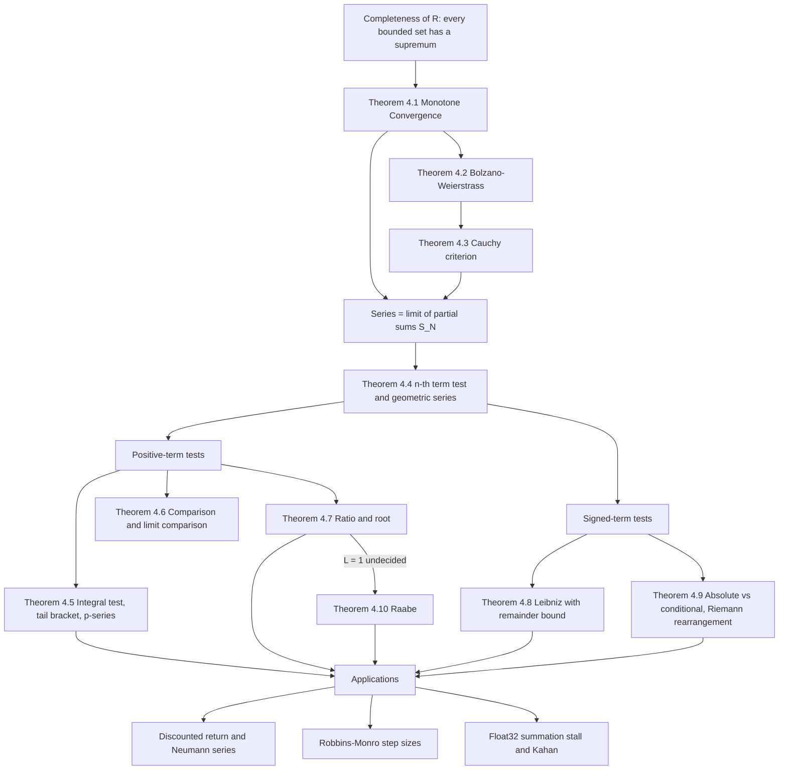

# Module 08 — Sequences, Series and Convergence

Addition is a binary operation, and induction extends it only to finite lists. Nothing in
arithmetic says what $a_1 + a_2 + a_3 + \cdots$ means when the list never ends, and the naive
answers contradict each other: grouping $1 - 1 + 1 - 1 + \cdots$ one way gives $0$, another way
gives $1$. This module takes the only workable definition — an infinite sum is the *limit of its
partial sums* — and follows it to its consequences.

That single move converts every question about infinite summation into a question about the
convergence of a sequence, and convergence of sequences in $\mathbb{R}$ is decided by one
structural fact: completeness. From the completeness axiom the module derives the Monotone
Convergence Theorem, Bolzano-Weierstrass, and the Cauchy criterion, and from those the classical
convergence tests — comparison, integral (with two-sided remainder bounds), ratio, root, Leibniz,
and Raabe's test for the boundary case the ratio test cannot decide.

The last third of the module is about what convergence does *not* give you. Absolute convergence
makes a sum rearrangement-invariant; conditional convergence does not, and Riemann's theorem says a
conditionally convergent series can be rearranged to reach any real number at all. In finite
precision the failure runs the other way: a provably divergent series can *stop* diverging, because
a float32 running sum swallows its own increments at a predictable index.

Every downstream use — discounted returns in reinforcement learning, Neumann expansions of
$(I - A)^{-1}$, Robbins-Monro step-size schedules, truncated power series — is an application of
exactly these theorems, with the hypotheses that make them true.

> [!NOTE]
> **A series is its partial-sum sequence.** $\sum_{n\ge1} a_n$ converges iff $(S_N)$ with
> $S_N = \sum_{n=1}^N a_n$ converges. Hence $a_n \to 0$ is *necessary but not sufficient*, and for a
> positive non-increasing $f$ the integral test both decides the fate of $\sum f(n)$ and brackets its
> tail: $\int_{N+1}^{\infty} f \le R_N \le \int_{N}^{\infty} f$, giving $\sum n^{-p} \lt \infty$ exactly
> when $p \gt 1$.

## Prerequisites

| Direction | Module | Why |
| --- | --- | --- |
| Requires | [mathematical_reasoning/04 — Induction and Recursion](../../mathematical_reasoning/04_induction_and_recursion/) | Every monotonicity and boundedness claim below is an induction. |
| Requires | [calculus/02 — Limits and Continuity](../../calculus/02_limits_and_continuity/) | The $\varepsilon$-$N$ machinery, and continuity of $f$ in the integral test. |
| Downstream | [calculus/09 — Taylor and Power Series](../../calculus/09_taylor_and_power_series/) | A radius of convergence is the root test applied to $\lvert c_n x^n \rvert$. |
| Downstream | [probability_statistics/04 — Discrete Distributions](../../probability_statistics/04_discrete_distributions/) | Normalisation and moments of a discrete law are convergent series. |
| Downstream | [differential_equations/02 — Existence, Uniqueness, Picard-Lindelof](../../differential_equations/02_existence_uniqueness_picard_lindelof/) | Picard iteration converges by a Cauchy/geometric-majorant argument. |

## Learning outcomes

- Write an $\varepsilon$-$N$ proof of a sequence limit, and derive an explicit $N(\varepsilon)$.
- Prove convergence of a recursively defined sequence from monotonicity plus boundedness, and locate its limit as a fixed point.
- Use the Cauchy criterion to decide convergence without knowing the limit.
- Select the correct convergence test for a given term, state its hypotheses, and say which hypothesis each example is stressing.
- Bracket the tail $R_N$ of a positive series with the integral test and convert the bracket into a term count for a target accuracy.
- Apply Raabe's test when the ratio test returns $L = 1$, and recognise where Raabe's test in turn fails.
- Separate absolute from conditional convergence, and explain what Riemann rearrangement does and does not permit.
- Translate a convergence statement into an engineering bound: value-iteration sweeps, admissible SGD exponents, or the index where a float32 sum freezes.

## Concept map

## Notation

| Symbol | Meaning | Convention used here |
| --- | --- | --- |
| $(a_n)$ | a real sequence | indices start at $n = 1$ unless stated |
| $\varepsilon$, $N$ | limit quantifiers | $\varepsilon$, never $\epsilon$ |
| $S_N = \sum_{n=1}^{N} a_n$ | $N$-th partial sum | the series *is* this sequence |
| $R_N = S - S_N$ | tail, or remainder, after $N$ terms | defined only when $\sum a_n$ converges |
| $\sup E$, $\inf E$ | least upper, greatest lower bound | exist by the completeness axiom |
| $\limsup$, $\liminf$ | upper and lower limits | defined in Definition 3.4 before the root test uses them |
| $\lVert A \rVert_{\infty}$ | max absolute row sum of $A$ | equals $1$ for a row-stochastic matrix |
| $\rho(A)$ | spectral radius of $A$ | governs convergence of $\sum_k A^k$ |
| $\varepsilon_{\mathrm{mach}}$ | gap between $1$ and the next float | $2^{-23}$ for binary32, $2^{-52}$ for binary64 |
| $H_N$, $\gamma$ | $N$-th harmonic number, Euler-Mascheroni constant | $H_N = \ln N + \gamma + O(N^{-1})$ |

## Core results

| Result | Statement | Key hypotheses |
| --- | --- | --- |
| Theorem 4.1 — Monotone Convergence | A monotone bounded sequence converges, to $\sup$ or $\inf$ of its range | monotone **and** bounded; drop either and it fails |
| Theorem 4.2 — Bolzano-Weierstrass | Every bounded real sequence has a convergent subsequence | boundedness only |
| Theorem 4.3 — Cauchy criterion | $(a_n)$ converges $\iff$ $(a_n)$ is Cauchy | completeness of $\mathbb{R}$; false over $\mathbb{Q}$ |
| Theorem 4.4 — Term test and geometric series | $\sum a_n$ convergent $\Rightarrow a_n \to 0$; $\sum_{k\ge0} ar^k = \dfrac{a}{1-r}$ | the sum formula needs $\lvert r \rvert \lt 1$ |
| Theorem 4.5 — Integral test | $\sum f(n)$ and $\int_1^{\infty} f$ share a fate, and $\int_{N+1}^{\infty} f \le R_N \le \int_N^{\infty} f$ | $f$ continuous, positive, non-increasing |
| Theorem 4.6 — Comparison / limit comparison | Domination transfers convergence down and divergence up | positive terms |
| Theorem 4.7 — Ratio and root | $L \lt 1$ absolute convergence, $L \gt 1$ divergence, $L = 1$ silent | root uses $\limsup$ and is strictly stronger |
| Theorem 4.8 — Leibniz | $\sum (-1)^{n-1} b_n$ converges and $\lvert R_N \rvert \le b_{N+1}$ | $b_n \downarrow 0$ **monotonically** |
| Theorem 4.9 — Absolute vs conditional | Absolute convergence is rearrangement-invariant; a conditionally convergent series reaches any $M \in \mathbb{R}$ under some rearrangement | conditionality means both the positive and negative parts have infinite mass |
| Theorem 4.10 — Raabe | $R = \lim n\left(1 - \frac{a_{n+1}}{a_n}\right)$; $R \gt 1$ converges, $R \lt 1$ diverges | $a_n \gt 0$; $R = 1$ is undecided |

## Common misconceptions

| Misconception | Reality | Counterexample or correction |
| --- | --- | --- |
| "$a_n \to 0$ implies $\sum a_n$ converges." | Necessary, never sufficient. | $\sum 1/n$: the blocks $\tfrac13+\tfrac14$, $\tfrac15+\cdots+\tfrac18$ each weigh $\ge \tfrac12$, so $S_{2^k} \ge 1 + k/2$. |
| "Ratio test with $L = 1$ means divergence." | $L = 1$ means the test says nothing at all. | $\sum n^{-p}$ gives $L = 1$ for every $p$, yet converges for $p = 2$ and diverges for $p = 1$. Raabe's $R = p$ decides it. |
| "Raabe's test always finishes the job." | Raabe is undecided at $R = 1$, exactly as the ratio test is at $L = 1$. | $\sum \frac{1}{n \ln n}$ diverges and $\sum \frac{1}{n \ln^2 n}$ converges; both have $R = 1$. Gauss or Kummer is needed. |
| "A convergent series has a well-defined sum regardless of order." | Only if it converges absolutely. | Riemann rearrangement: reordering $\sum (-1)^{n-1}/n$ two positives per negative gives $\tfrac32 \ln 2$, not $\ln 2$. |
| "Root and ratio tests are equally strong." | The root test is strictly stronger. | If the ratio limit exists the root limit equals it; but $a_n = 2^{-n}$ (even $n$), $2^{-n+2}$ (odd $n$) has no ratio limit and root limit $\tfrac12$. |
| "The integral test needs only $f \ge 0$." | It needs $f$ continuous, positive, and non-increasing. | Without monotonicity the rectangles no longer straddle the curve, and the bracket $\int_{N+1}^{\infty} f \le R_N \le \int_N^{\infty} f$ is false. |
| "Alternating plus $b_n \to 0$ is enough for Leibniz." | Monotonicity is load-bearing. | $b_n = 1/n$ (odd $n$), $1/n^2$ (even $n$): terms alternate, $b_n \to 0$, and the partial sums grow like $\tfrac12 \ln N$. |
| "Floating point cannot change whether a series diverges." | Finite precision changes it outright. | In binary32 the harmonic partial sum freezes at $n = 2^{21}$ with $S \approx 15.4037$ and never moves again. |

## Exercise index

`exercises.ipynb` holds **40 problems** across four tiers, every one fully solved.

| Tier | Count | Focus |
| --- | --- | --- |
| `L0 — Concept Checks` | 8 | Sequence versus series, MCT hypotheses, telescoping, geometric domain, absolute versus conditional, Leibniz bracketing, $L = 1$, integral sandwich |
| `L1 — Foundations` | 11 | Explicit $\varepsilon$-$N$, recursive fixed points, partial fractions, repeating decimals, $p$-series, ratio, root, Leibniz term counts, Raabe, limit comparison |
| `L2 — Applications (AI/ML and Physics)` | 11 | Neumann series for $(I-\gamma P)^{-1}$, Robbins-Monro exponents, RNN gain bounds, overhanging dominoes, bouncing ball, geometric entropy, quadratic gradient descent, Koch snowflake, float32 summation stall, linear attention, quantum oscillator mean energy |
| `L3 — Challenge Proofs` | 10 | Asymptotics of $a_{n+1} = a_n + e^{-a_n}$, dyadic telescoping, Stolz-Cesaro, Gauss's test via Kummer, Dirichlet's test, Euler-Maclaurin for $H_n$, an explicit Riemann rearrangement, $\sum \sin(n!\,\pi e)$, block comparison, a divergent Cauchy product |

Every numeric or algorithmic answer is recomputed in a code cell immediately after the boxed
result, so no boxed number rests on memory alone.

## References

| Source | Location | What it covers |
| --- | --- | --- |
| Apostol, *Calculus, Volume I*, 2nd ed. | Ch. 10, §10.5–10.15 (Thm 10.14 integral test, Thm 10.18 ratio/root) | Sequences, series, integral test with explicit bounds |
| Spivak, *Calculus*, 4th ed. | Ch. 22 (Thm 22.3 comparison, Thm 22.5 Leibniz), Ch. 23 | Counterexamples, conditional convergence, rearrangement |
| Rudin, *Principles of Mathematical Analysis*, 3rd ed. | §3.2–3.7 (Thm 3.6 Bolzano-Weierstrass, Thm 3.11 Cauchy), Thm 3.54 | The completeness chain and Riemann's rearrangement theorem |
| Knopp, *Theory and Application of Infinite Series*, 2nd Eng. ed. | §38 (Kummer, Raabe, Gauss tests) | Higher-order criteria beyond ratio and root |
| Kaczor & Nowak, *Problems in Mathematical Analysis I* | §3.1–3.4 | Worked problems on Raabe, Kummer and Gauss |
| Knuth, *The Art of Computer Programming*, Vol. 1, 3rd ed. | §1.2.7 (harmonic numbers), §1.2.11.2 (Euler-Maclaurin) | Asymptotics of $H_n$ and the $\gamma$ constant |
| Higham, *Accuracy and Stability of Numerical Algorithms*, 2nd ed. | §4.1–4.3 (compensated summation) | Error analysis of naive and Kahan summation |
| Sutton & Barto, *Reinforcement Learning*, 2nd ed. | §3.3 (discounted return), §4.4 (value iteration) | Geometric discounting and the planning horizon $1/(1-\gamma)$ |
| Bottou, Curtis & Nocedal, *Optimization Methods for Large-Scale Machine Learning*, SIAM Rev. 60(2), 2018 | §4.2 (Thm 4.7) | Robbins-Monro step-size conditions for SGD |
