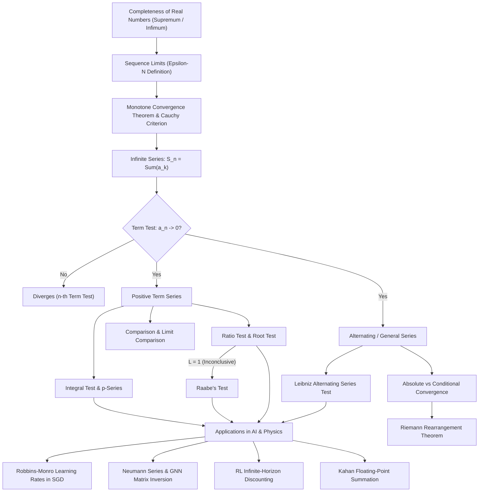

# Topic 08: Sequences, Series & Convergence — Calculus Mastery Module

**Status:** Active  
**Level:** Core Foundation (Part VIII of Calculus Series)  
**Target Audience:** Mathematical Modelers, AI Researchers, Applied Mathematicians, Computational Scientists  

---

## 📌 Module Overview

Infinite sequences and series constitute the gateway from finite arithmetic to continuous analysis and asymptotic modeling. In modern applied mathematics and artificial intelligence, continuous phenomena are frequently approximated, computed, or optimized through iterative discrete processes. Understanding whether and how an infinite summation converges is essential for ensuring algorithmic stability, modeling infinite-horizon decision processes, proving convergence of gradient methods, and evaluating numerical approximations.

This module provides a rigorous, first-principles foundation for sequence limits, infinite series, and advanced convergence criteria. We establish the topological completeness of the real numbers, investigate monotone and Cauchy sequences, systematically prove the classical convergence tests (Integral, Comparison, Ratio, Root, Leibniz Alternating Series Test, and Raabe's Test), and analyze the subtle dynamics of absolute versus conditional convergence. The theoretical framework is directly linked to modern computational algorithms, stochastic gradient descent step-size schedules, Neumann series in linear algebra, and reinforcement learning discount factors.

The module culminates in a **4-Level Exercise Package (40 fully solved problems)** featuring classical problems and analytical challenges from Apostol, Spivak, Demidovich, Kaczor & Nowak, Polya & Szégo, Cambridge Tripos, and the William Lowell Putnam Competition.

---

## 🎯 Learning Objectives

By completing this module, you will be able to:

1. **Master $\varepsilon$-$N$ Rigor & Sequence Limits**: Formally define sequence convergence using $\varepsilon$-$N$ quantifier logic, analyze boundedness and monotonicity, and apply the Monotone Convergence Theorem (MCT) and Cauchy Criterion.
2. **Understand Series as Limits of Partial Sums**: Formulate infinite series as limits of partial sum sequences $S_n = \sum_{k=1}^n a_k$, prove the $n$-th term divergence test, and derive closed-form expressions for geometric and telescoping series.
3. **Derive & Apply Standard Convergence Tests**: Construct step-by-step mathematical proofs for the Direct Comparison Test, Limit Comparison Test, Integral Test (with error bounds), Ratio Test, and Cauchy Root Test.
4. **Analyze Alternating & Subtle Series**: Apply the Leibniz Criterion to alternating series, derive error bounds for partial sums, and apply **Raabe's Test** when the ratio test yields the indeterminate boundary case $L = 1$.
5. **Distinguish Absolute vs. Conditional Convergence**: Differentiate absolute convergence from conditional convergence, prove that absolute convergence implies convergence, and understand the implications of the Riemann Rearrangement Theorem.
6. **Bridge Pure Analysis to Physics & AI/ML**: Connect series convergence to Neumann series $(I-A)^{-1} = \sum A^k$ in Graph Neural Networks, Robbins-Monro learning rate criteria $\sum \alpha_t = \infty, \sum \alpha_t^2 \lt \infty$ in SGD, discounted returns $\sum \gamma^t R_t$ in Reinforcement Learning, and floating-point summation stability (Kahan Summation).

---

## 🗺️ First-Principles Concept Map



---

## ⚠️ Common Misconceptions Table

| Misconception | Mathematical Reality | Correct Viewpoint & Counterexample |
| --- | --- | --- |
| **"If $\lim_{n\to\infty} a_n = 0$, then $\sum a_n$ converges."** | $\lim a_n = 0$ is a *necessary* condition, not a *sufficient* one. | The Harmonic series $\sum \frac{1}{n}$ has $\lim \frac{1}{n} = 0$, yet its partial sums grow logarithmically without bound ($\sum_{n=1}^N \frac{1}{n} \sim \ln N \to \infty$). |
| **"When Ratio Test yields $L=1$, the series diverges."** | $L=1$ means the Ratio Test is completely **inconclusive**. | For $p$-series $\sum \frac{1}{n^p}$, $L = \lim \frac{n^p}{(n+1)^p} = 1$ for all $p$. It converges for $p=2$ and diverges for $p=1$. Higher-order tests like **Raabe's Test** are required. |
| **"Conditionally convergent series sum to a fixed, immutable value."** | Changing the order of summation alters the limit. | By Riemann's Rearrangement Theorem, a conditionally convergent series can be rearranged to converge to *any* desired real number $M \in \mathbb{R}$, or to diverge to $\pm\infty$. |
| **"Root Test and Ratio Test are identical in strength."** | Root test is strictly **stronger** than Ratio Test. | If $\lim \lvert a_{n+1}/a_n \rvert = L$, then $\lim \sqrt[n]{\lvert a_n \rvert} = L$. However, $\limsup \sqrt[n]{\lvert a_n \rvert}$ may exist even when the ratio limit fails to exist (e.g. oscillating terms). |
| **"Integral test applies to any non-negative function."** | $f(x)$ must be **continuous, positive, and monotonically decreasing**. | If $f(x)$ oscillates wildly between 0 and 1, the integral $\int_1^\infty f(x) dx$ may not bound the discrete sum $\sum f(n)$. |
| **"Floating-point summation order does not matter because addition is associative."** | Finite precision floating-point addition is **non-associative**. | Adding large numbers first causes catastrophic loss of precision (swallowing small values). Summing small to large or using **Kahan Summation** preserves precision. |

---

## 📂 Directory Inventory

```text
foundations/calculus/08_sequences_series_convergence/
├── README.md               <-- Module Overview, Concept Map, Misconceptions & References (This File)
├── first_principles.md           <-- First-Principles Theory, Proofs, Raabe's Test, AI/Physics Applications
└── exercises.md            <-- 4-Level Exercise Package (40 Problems + Solutions + Key Takeaways)
```

---

## 📖 Recommended References

- **Apostol, T. M.** *Calculus, Volume I* (2nd Edition) — Chapter 8: *Infinite Series*. (Definitive reference for rigorous sequence limits, integral tests, and Cauchy criterion).
- **Spivak, M.** *Calculus* (4th Edition) — Chapter 22: *Infinite Series*. (Masterpiece of theoretical clarity, counterexamples, and precise $\varepsilon$-$N$ analysis).
- **Demidovich, B. P.** *Problems in Mathematical Analysis* — Chapter IV: *Infinite Series*. (Classic problem collection featuring demanding computational problems and test applications).
- **Kaczor, W. J., & Nowak, M. T.** *Problems in Mathematical Analysis I: Real Numbers, Sequences and Series* — American Mathematical Society. (Exceptional source for advanced convergence tests including Kummer, Raabe, Bertrand, and Gauss tests).
- **Polya, G., & Szégo, G.** *Problems and Theorems in Analysis I* — Springer. (Fundamental source for asymptotic summation, Stolz-Cesàro theorem, and analytic sequence properties).
- **William Lowell Putnam Mathematical Competition** — Archives (1985–2023). (High-level challenge problems on sequence growth, functional iteration, and infinite series).
- **Stewart, J.** *Calculus: Early Transcendentals* (8th Edition) — Chapter 11: *Infinite Sequences and Series*. (Pedagogical foundation and clear geometric illustrations).
- **MIT OpenCourseWare:** *18.100A / 18.100B Real Analysis* — Lectures on Metric Spaces, Completeness, and Uniform Convergence.
