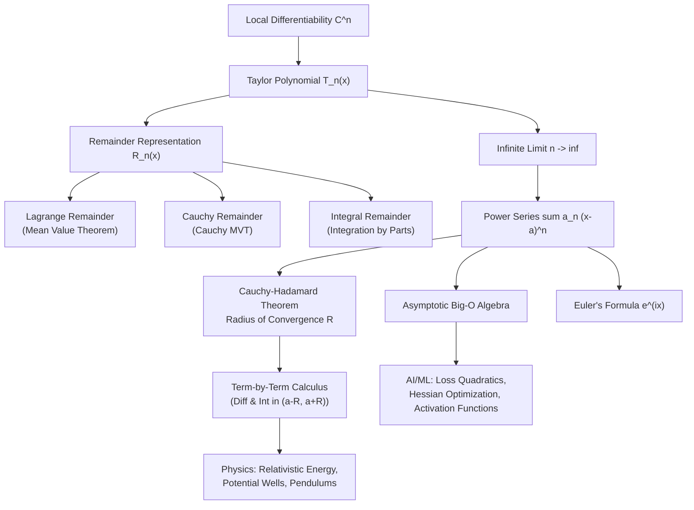

# Topic 09: Taylor & Power Series — Calculus Mastery Module

**Status:** Active  
**Level:** Core Foundation (Part IV of Calculus Series)  
**Target Audience:** Mathematical Modelers, AI Researchers, Applied Mathematicians, Physicists  

---

## 📌 Module Overview

Polynomials are the simplest mathematical functions: they require only addition and multiplication, making them trivially easy to differentiate, integrate, evaluate, and compute on modern digital hardware. **Taylor & Power Series** provide the universal bridge connecting complex, non-linear transcendental functions ($\exp, \ln, \sin, \cos$, activation functions, potential wells) to infinite polynomial representations.

This module delivers a rigorous, first-principles foundation for local polynomial approximations, remainder bounds, infinite power series convergence, term-by-term operations, asymptotic expansions, and complex power series.

Key pillars covered in this module:
1. **Taylor Polynomials & Contact Order**: How matching $n$ derivatives at a point $x=a$ constructs the unique optimal local polynomial approximation $T_n(x)$.
2. **The Three Remainder Theorems**: Rigorous proofs and practical error bounding using **Lagrange**, **Cauchy**, and **Integral** remainder forms.
3. **Power Series Convergence**: Complete theory of convergence intervals and the **Cauchy-Hadamard Theorem** via limit superiors.
4. **Analyticity & Operations**: Term-by-term differentiation and integration, Cauchy products, and Abel's Theorem for boundary behavior.
5. **Asymptotic Notation ($O, o, \sim$)**: Local error scaling, dominant term matching, and numerical order of convergence.
6. **Euler's Formula & Complex Exponentials**: Unification of circular functions and complex analysis through $e^{ix} = \cos x + i \sin x$.

---

## 🎯 Learning Objectives

By completing this module, you will be able to:

1. **Construct & Analyze Local Approximations**: Derive Taylor and Maclaurin polynomials for arbitrary smooth functions and evaluate contact order.
2. **Bound Truncation Errors Rigorously**: Select and apply the appropriate remainder form (Lagrange, Cauchy, or Integral) to establish guaranteed error bounds for numerical approximations.
3. **Determine Convergence Domains**: Calculate the exact radius of convergence $R$ and test endpoints for any power series using the Cauchy-Hadamard formula and ratio/root tests.
4. **Manipulate Power Series Safely**: Perform term-by-term differentiation, integration, substitution, and Cauchy multiplication within the interior of convergence $(a-R, a+R)$.
5. **Apply Asymptotic Big-O Arithmetic**: Simplify complex limit expressions, analyze floating-point numerical stability, and determine finite-difference truncation errors.
6. **Bridge Pure Theory to Physics & AI**: Model relativistic kinetic energy, pendulum non-linearities, loss surface quadratics (Hessian matrices), Newton-Raphson optimization steps, and neural network activation asymptotics (GELU, Softplus, SiLU).
7. **Solve Competition & Tripos Problems**: Prove non-trivial series summations, perturbation expansions, and non-analytic smooth counterexamples from Putnam, Cambridge Tripos, Demidovich, and Bender & Orszag.

---

## 📂 Module Structure

```text
foundations/calculus/09_taylor_and_power_series/
├── README.md               <-- Module Overview & Index (This File)
├── first_principles.md           <-- First-Principles Theory, Proofs, Remainder Theorems & Applications
└── exercises.md            <-- 4-Level Exercise Package (40 Fully Solved Problems + Solutions Manual)
```

---

## 🗺️ Concept Map



---

## ⚠️ Common Misconceptions Table

| Misconception | Mathematical Reality | Correct Viewpoint / Counterexample |
|---|---|---|
| **1. $C^\infty$ implies Analytic** | A function can have derivatives of all orders everywhere, yet its Taylor series fails to represent the function. | $f(x) = e^{-1/x^2}$ for $x \neq 0$ and $f(0)=0$ has $f^{(n)}(0)=0$ for all $n$. Its Maclaurin series is identically $0$, which equals $f(x)$ *only* at $x=0$. |
| **2. Taylor series always converges everywhere** | Power series have a specific radius of convergence $R \in [0, \infty]$, determined by complex singularities. | $f(x) = \frac{1}{1+x^2}$ is smooth on $\mathbb{R}$, but its Maclaurin series $\sum (-1)^n x^{2n}$ converges only for $\lvert x \rvert \lt 1$ due to poles at $x = \pm i$ in $\mathbb{C}$. |
| **3. Endpoints always behave like the interior** | Term-by-term differentiation and integration are guaranteed on $(a-R, a+R)$, but endpoint convergence requires Abel's Theorem. | $\sum \frac{x^n}{n}$ converges at $x = -1$ (conditional), diverges at $x=1$. Differentiating yields $\sum x^{n-1}$, which diverges at $x = -1$. |
| **4. Big-O term $O(x^n)$ means exact equality to $C x^n$** | $O(x^n)$ denotes a set / bounding condition, not a fixed constant multiple. | $f(x) = O(x^2)$ as $x\to 0$ means $\lvert f(x) \rvert \le M \lvert x \rvert^2$ for small $\lvert x \rvert$. Adding $O(x^2) + O(x^3) = O(x^2)$. |
| **5. Lagrange remainder works for complex-valued functions** | The Mean Value Theorem fails for vector-valued and complex-valued functions. | For $f: \mathbb{R} \to \mathbb{C}$, there is generally no single intermediate point $c \in (a, x)$ where $f(x) - f(a) = f'(c)(x-a)$. Use Integral Remainder instead. |

---

## 📊 Exercise Progression Summary

| Level | Focus / Target Audience | Problem Count | Primary Skill Developed |
|---|---|---|---|
| **L0 — Concept Check** | Intuition & Geometric Understanding | 8 Problems | Contact order, remainder logic, singularity interpretation, Big-O rules |
| **L1 — Foundation** | Core Skills & Textbook Mastery | 10 Problems | Remainder bounds, Cauchy-Hadamard radius calculation, series summations |
| **L2 — Applications** | Physics & AI/ML Modeling | 12 Problems | Loss quadratics, Hessian steps, GELU/Softplus expansions, relativistic bounds |
| **L3 — Challenge** | Olympiad, Tripos & Advanced Proofs | 10 Problems | Cambridge Tripos limits, Putnam identities, perturbation methods, non-analytic proofs |
| **Total** | Complete Mastery Package | **40 Problems** | Full theoretical and computational calculus proficiency |

---

## 📖 Recommended References

- **Spivak, M.** *Calculus* (4th Edition) — Chapters 19 ("Complex Numbers"), 20 ("Complex Functions"), and 23 ("Taylor Polynomials"). Exceptional depth on remainders and non-analytic counterexamples.
- **Apostol, T. M.** *Calculus, Volume I* (2nd Edition) — Chapters 7 & 9. Rigorous treatment of Taylor's formula, integral remainder, and power series convergence.
- **Stewart, J.** *Calculus: Early Transcendentals* (8th Edition) — Chapter 11. Practical computations, standard Maclaurin series tables, and applications.
- **Demidovich, B. P.** *Problems in Mathematical Analysis* — Chapters IV & V. Essential repository of Russian computational calculus problems.
- **Bender, C. M., & Orszag, S. A.** *Advanced Mathematical Methods for Scientists and Engineers* — Chapter 1. Master guide to local asymptotics, Big-O algebra, and perturbation theory.
- **Polya, G., & Szego, G.** *Problems and Theorems in Analysis I* — Analysis of power series, coefficients, and boundary behavior.
- **Putnam Mathematical Competition Archives** — Classical competition problems on power series identities and limit expansions.
- **Cambridge Mathematical Tripos (Part IA/IB)** — Differential equations, complex series, and asymptotic expansions.
