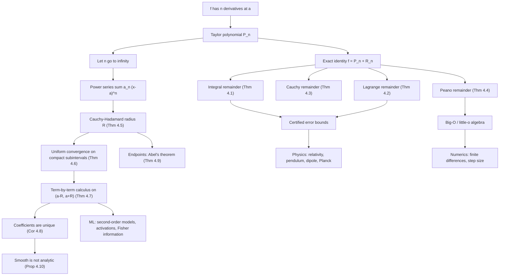

# Module 09 — Taylor and Power Series

Polynomials are the only functions a computer really evaluates: addition and multiplication,
nothing else. Everything transcendental that a numerical library reports — $\exp$, $\ln$,
$\sin$, the error function, a GELU activation — is a polynomial in disguise, together with a
promise about how far the disguise can be trusted. This module supplies both halves: the
polynomial, and the promise.

The first half is local. Matching the first $n$ derivatives of $f$ at a point $a$ produces the
degree-$n$ Taylor polynomial $P_n$, and the identity $f = P_n + R_n$ is exact by definition —
all the content sits in the four available descriptions of $R_n$. The integral form is an exact
formula, Lagrange and Cauchy trade exactness for weaker hypotheses and an uncomputable
intermediate point, and Peano gives only an order of vanishing. Choosing among them is the
practical skill: a certified error bar comes from Theorem 4.1 or 4.2, an order-of-convergence
claim comes from Theorem 4.4.

The second half is global. Letting $n \to \infty$ turns the polynomial into a power series, and
a new question appears: where does it converge, and does it converge to the function it came
from. Cauchy-Hadamard answers the first with a $\limsup$; $e^{-1/x^2}$ answers the second with a
flat no. In between sits the result the module is named after — inside its radius a power series
is a $C^{\infty}$ function that may be differentiated and integrated one term at a time.

The payoff is everywhere downstream. Second-order local models for optimization, the harmonic
approximation to any stable equilibrium, the delta method behind the central limit theorem's
error terms, and every finite-difference stencil in numerical analysis are all one truncated
Taylor expansion plus an honest remainder.

> [!NOTE]
> **The theorem this module is named after (Theorem 4.7).** If $\sum_n a_n (x-a)^n$ has radius
> of convergence $R \gt 0$ and sum $f$, then $f$ is differentiable on $(a-R, a+R)$ with
> $f'(x) = \sum_{n \ge 1} n\, a_n (x-a)^{n-1}$, and the differentiated series has radius exactly
> $R$. Iterating gives $f \in C^{\infty}(a-R, a+R)$ and, by Corollary 4.8,
> $a_n = f^{(n)}(a)/n!$ — a convergent power series is always the Taylor series of its own sum.
> The word *interior* is not decoration: $\sum_n x^n/n$ converges at $x = -1$ while its
> derivative series diverges there.

## Prerequisites

| Module | What is used from it |
|---|---|
| [Module 03 — Single-Variable Derivatives](../03_single_variable_derivatives/) | higher derivatives, the mean value theorem, the chain and product rules |
| [Module 08 — Sequences, Series and Convergence](../08_sequences_series_convergence/) | absolute convergence, the ratio and root tests, $\limsup$ |

Also assumed: the fundamental theorem of calculus and integration by parts from
[Module 05 — Indefinite and Definite Integrals](../05_indefinite_and_definite_integrals/),
used in Proof 5.1.

### Downstream — modules this one unlocks

| Module | What it takes from here |
|---|---|
| [Module 12 — Hessian, Jacobian and Curvature](../12_hessian_jacobian_curvature/) | the second-order expansion that classifies critical points |
| [Module 15 — Ordinary Differential Equations](../15_ordinary_differential_equations/) | power-series solutions and the matrix exponential |
| [probability_statistics/06 — Expectation, Variance and Moments](../../probability_statistics/06_expectation_variance_and_moments/) | moment generating functions as power series |
| [probability_statistics/08 — Law of Large Numbers and CLT](../../probability_statistics/08_law_of_large_numbers_and_clt/) | the characteristic-function expansion behind the CLT |
| [calculus_optimization/02 — Taylor Approximation and Local Models](../../calculus_optimization/02_taylor_approximation_and_local_models/) | the descent lemma and its remainder bound |
| [optimization/02 — Unconstrained Optimality Conditions](../../optimization/02_unconstrained_optimality_conditions/) | first- and second-order optimality conditions |
| [numerical_methods/01 — Error Analysis and Floating Point](../../numerical_methods/01_error_analysis_and_floating_point/) | truncation error and optimal step size |

The full graph is in [`docs/prerequisites.md`](../../docs/prerequisites.md).

## Learning outcomes

After this module you will be able to:

- Build $P_n$ for a given $f$ and centre $a$, and state precisely in what sense it is the best
  degree-$n$ polynomial approximation near $a$.
- Choose the correct remainder form for a task — integral for an exact identity, Lagrange for a
  certified numerical bound, Cauchy where Lagrange is too weak, Peano for an order claim — and
  say which hypothesis each one needs.
- Produce a guaranteed digit count for a truncated series, and verify it against the computed
  error.
- Compute a radius of convergence with Cauchy-Hadamard, including series where the ratio test
  has no limit, and test endpoint behaviour separately.
- Differentiate, integrate, substitute into and multiply power series, and justify each step by
  the theorem that permits it.
- Explain, with $e^{-1/x^2}$ in hand, why smoothness does not imply analyticity and why a
  convergent Taylor series may converge to the wrong function.
- Use $O$, $o$ and $\sim$ correctly in error estimates, including the step-size trade-off between
  truncation and rounding error.
- Apply expansions to relativistic energy, anharmonic oscillators, activation functions,
  Newton's method and finite-difference stencils.

## Concept map

## Notation

Drawn from [`docs/notation.md`](../../docs/notation.md); the calculus register is authoritative.

| Symbol | Meaning | Convention fixed here |
|---|---|---|
| $P_n(x)$ | degree-$n$ Taylor polynomial of $f$ about $a$ | **not** $T_n$ — $T_k$ is reserved for Chebyshev |
| $R_n(x)$ | remainder $f(x) - P_n(x)$ | four representations, Theorems 4.1 to 4.4 |
| $f^{(n)}$ | $n$-th derivative; $f^{(0)} = f$ | |
| $a$, $c$ | expansion centre, and the intermediate point of a mean-value form | $c$ lies strictly between $a$ and $x$ |
| $R$ | radius of convergence | $R = 1/\limsup_n \lvert a_n \rvert^{1/n}$, with $1/0 = \infty$ |
| $\limsup$ | upper limit of a real sequence | defined in Module 08; Definition 3.3 recalls it |
| $O(g)$, $o(g)$ | bounded by a constant times $g$; negligible against $g$ | bare $O$ and $o$, never $\mathcal{O}$ |
| $f \sim g$ | $f/g \to 1$ in the stated limit | asymptotic equivalence, not equality |
| $\lvert x \rvert$ | absolute value, or complex modulus | `\lvert ... \rvert` |
| $C^n$, $C^{\infty}$ | $n$ times continuously differentiable; smooth | smooth does **not** mean analytic |

## Core results

| Result | Statement | Hypotheses that cannot be dropped |
|---|---|---|
| Theorem 4.1 — integral remainder | $R_n(x) = \frac{1}{n!}\int_a^x f^{(n+1)}(t)(x-t)^n\,dt$ | $f^{(n+1)}$ continuous on the closed interval |
| Theorem 4.2 — Lagrange remainder | $R_n(x) = \frac{f^{(n+1)}(c)}{(n+1)!}(x-a)^{n+1}$ for some $c$ between $a$ and $x$ | $f$ real-valued; $f^{(n+1)}$ exists on the open interval |
| Theorem 4.3 — Cauchy remainder | $R_n(x) = \frac{f^{(n+1)}(c)}{n!}(x-c)^n(x-a)$ | same as Theorem 4.2; $c$ is a different point |
| Theorem 4.4 — Peano remainder | $R_n(x) = o((x-a)^n)$ as $x \to a$ | only $f^{(n)}(a)$; gives no bound at fixed $x$ |
| Theorem 4.5 — Cauchy-Hadamard | $R = 1/\limsup_n \lvert a_n \rvert^{1/n}$ | none; the ratio test needs the ratio limit to exist |
| Theorem 4.6 — Weierstrass M-test | $\sup_S \lvert u_n \rvert \le M_n$ and $\sum_n M_n \lt \infty$ give uniform convergence | $M_n$ independent of $x$; uniformity only on compacts |
| Theorem 4.7 — term-by-term calculus | $f'(x) = \sum_{n \ge 1} n a_n (x-a)^{n-1}$, same radius $R$ | $R \gt 0$ and $x$ strictly inside $(a-R, a+R)$ |
| Corollary 4.8 — uniqueness | $a_n = f^{(n)}(a)/n!$ | $R \gt 0$ |
| Theorem 4.9 — Abel's limit theorem | $\sum_n a_n$ convergent $\Rightarrow \lim_{x \to 1^-} \sum_n a_n x^n = \sum_n a_n$ | convergence of $\sum_n a_n$; the converse is false |
| Proposition 4.10 — smooth is not analytic | $e^{-1/x^2}$ is $C^{\infty}$ with all derivatives $0$ at the origin | none; its Taylor series equals $f$ only at $x = 0$ |
| Theorem 4.11 — Borel (cited, not proved) | every real sequence is the derivative sequence of some $f \in C^{\infty}$ | proof needs a smooth partition of unity |

## Common misconceptions

| Misconception | Reality | Where it is settled |
|---|---|---|
| A $C^{\infty}$ function equals its Taylor series | The series may converge everywhere and agree with $f$ at one point only | Proposition 4.10, Example 6.6 |
| A convergent Taylor series proves the approximation is good | Convergence of the series says nothing until $R_n \to 0$ is shown | Proposition 4.10, Section 7.3 |
| The radius is found by the ratio test | The ratio test is a special case that needs $\lvert a_{n+1}/a_n \rvert$ to converge; the radius is always a $\limsup$ | Theorem 4.5, Example 6.3 |
| A real function's series can only be limited by real behaviour | The radius is the distance to the nearest **complex** singularity: $1/(1+x^2)$ is smooth on $\mathbb{R}$ yet has $R = 1$ | Section 7.5 |
| The interval of convergence behaves the same at its endpoints | Term-by-term calculus is guaranteed on the open interval only; endpoints need Abel's theorem | Theorem 4.7, Theorem 4.9 |
| Lagrange's remainder works for any function | Its proof is a mean value theorem and fails for complex- and vector-valued $f$ | Theorem 4.2, Section 7.3 |
| $O(x^n)$ names a specific constant multiple of $x^n$ | It is a bound with an unspecified constant, so $O(x^2) + O(x^3) = O(x^2)$ near $0$ | Definition 3.6 |
| Peano and Lagrange say the same thing | Peano is a statement about the limit $x \to a$ and gives no number at a fixed $x$ | Theorem 4.4, Exercise L0.1 |

## Exercise index

All problems are fully solved in [`exercises.ipynb`](exercises.ipynb), each with a statement, an
intuition line, numbered solution steps, a boxed answer, a key takeaway, and a code cell that
recomputes the answer.

| Tier | Focus | Count |
|---|---|---|
| L0 — Concept Checks | one-line discriminations: Peano versus Lagrange, complex singularities, $O$-arithmetic, Cauchy products, Euler's formula, the non-analytic example | 6 |
| L1 — Foundations | contact order, certified error bounds, integral and Cauchy remainders, radius by ratio and by root, Gregory's series, Abel at an endpoint | 12 |
| L2 — Applications (AI/ML and Physics) | relativistic kinetic energy, anharmonic pendulum, van der Waals, dipole potential, Rayleigh-Jeans; GELU, SiLU, softplus, log-sum-exp, Newton's step, KL and Fisher information, optimal central-difference step | 12 |
| L3 — Challenge Proofs | series multisection, $(1+1/n)^n$ rate, perturbation of an algebraic root, harmonic generating function, zero radius of convergence, dilogarithm reflection, Laplace's method, Stirling by Euler-Maclaurin, sawtooth Fourier series | 10 |

**Total: 40 problems.**

Theory, proofs and computational practice are in
[`first_principles.ipynb`](first_principles.ipynb).

## References

- Rudin, W. *Principles of Mathematical Analysis*, 3rd ed. — Taylor's theorem (Thm 5.15), the
  root-test radius (Thm 3.39), the Weierstrass M-test (Thm 7.10), term-by-term differentiation
  (Thm 7.17), power series (Thm 8.1), Abel's theorem (Thm 8.2), and $e^{-1/x^2}$ (Ch. 8, Ex. 1).
- Spivak, M. *Calculus*, 4th ed. — Ch. 20 (the three remainder forms), Ch. 24 (uniform
  convergence and power series), Ch. 27 (complex power series and Euler's formula).
- Apostol, T. M. *Calculus, Vol. I*, 2nd ed. — Ch. 7 (Taylor's formula, integral remainder),
  Ch. 11 (sequences and series of functions, Abel's theorem).
- Bender, C. M. and Orszag, S. A. *Advanced Mathematical Methods for Scientists and Engineers* —
  §3.4 ($O$, $o$ and $\sim$), §6.4 (Laplace's method), §7.2 (perturbation of algebraic roots).
- Hörmander, L. *The Analysis of Linear Partial Differential Operators I*, 2nd ed. (Thm 1.2.6) —
  Borel's theorem, cited as Theorem 4.11.
- Trefethen, L. N. *Approximation Theory and Approximation Practice*, Ch. 3 and Ch. 8 — why the
  radius of convergence is the wrong figure of merit for approximation on an interval.
