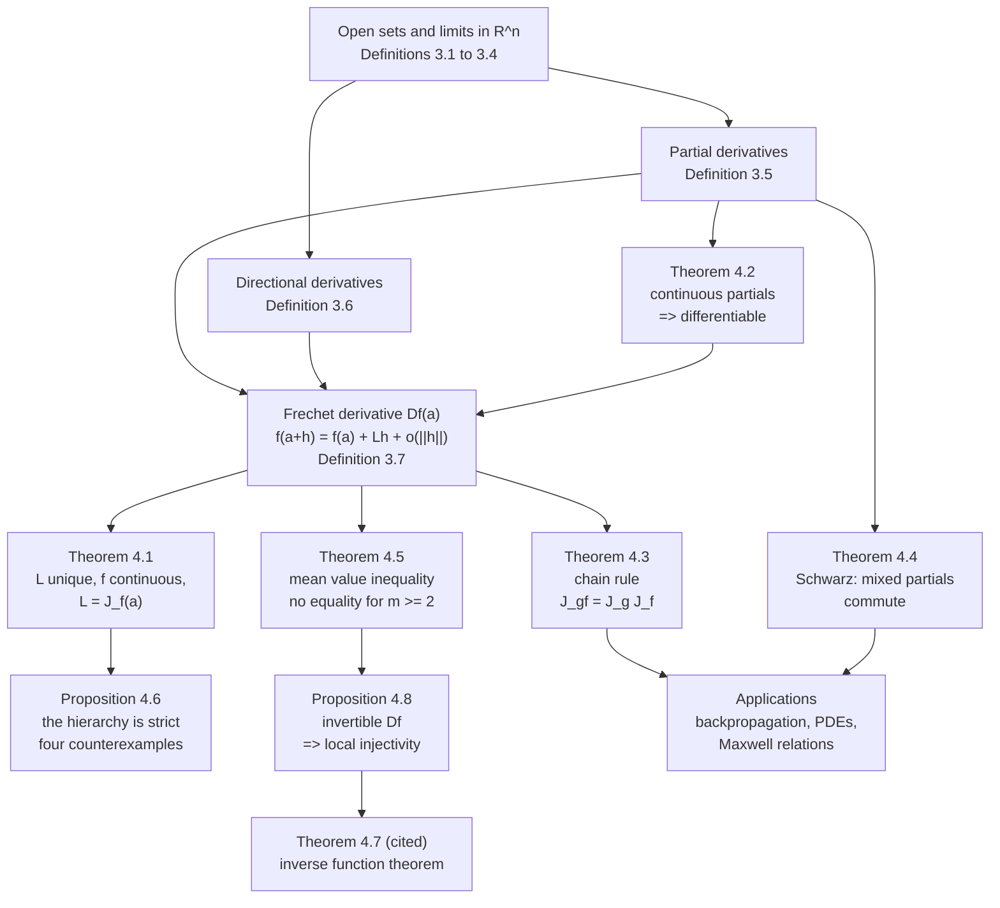

# Module 10 — Multivariable Functions and Partial Derivatives

In one variable the derivative is a number, and one number is enough because there is only one
direction to move in. In $\mathbb{R}^n$ the obvious generalisation — freeze every coordinate but
one and take the old derivative — produces the partial derivatives. They are easy to compute and,
on their own, nearly worthless: a function can have every partial derivative at a point and still
fail to be continuous there.

The object that actually does the work is a **linear map**: $f$ is differentiable at $a$ when one
linear $L$ satisfies $f(a+h) = f(a) + Lh + o(\lVert h \rVert)$. That map is unique, it forces
continuity, its matrix is the Jacobian, and every directional derivative falls out of it. What it
is not is computable straight from the definition.

The bridge between the two is the theorem this module exists to prove: if the partial derivatives
exist near $a$ and are continuous **at $a$**, then $f$ is differentiable at $a$ and its derivative
is the Jacobian. One statement about a linear map is converted into $mn$ statements about ordinary
one-variable derivatives, each of which a first-year calculus student can check.

The rest is the apparatus that makes the derivative usable — the chain rule, the symmetry of
second derivatives, and the mean value inequality that replaces the mean value theorem once
$m \ge 2$ — together with an honest catalogue of which converses fail and the counterexample that
kills each one.

> [!NOTE]
> **Continuous partials are enough.** If every $\partial_j f_i$ exists on a ball around $a$ and
> every one of them is continuous at $a$, then $f$ is differentiable at $a$ and $Df(a) = J_f(a)$.
> The converse is false — differentiability at a point does not make the partials continuous
> there — so $C^1$ is a sufficient condition, never a necessary one.

## Prerequisites

| Module | What this module takes from it |
| :--- | :--- |
| [calculus/02 — Limits and Continuity](../02_limits_and_continuity/) | the $\varepsilon$-$\delta$ discipline, reused verbatim for limits in $\mathbb{R}^n$ |
| [calculus/03 — Single-Variable Derivatives](../03_single_variable_derivatives/) | the one-variable mean value theorem, applied on each coordinate segment |
| [linear_algebra/01 — Vectors, Spaces and Subspaces](../../linear_algebra/01_vectors_spaces_and_subspaces/) | linear maps, norms, and the operator norm |

**Downstream.** [calculus/11 — Gradients and Directional Derivatives](../11_gradients_directional_derivatives/)
reads the derivative of a scalar field as a vector and turns it into a geometry of level sets and
steepest ascent. The full module graph is in [docs/prerequisites.md](../../docs/prerequisites.md).

## Learning outcomes

- State Definition 3.7 and explain why $f(a+h) = f(a) + Lh + o(\lVert h \rVert)$ is a strictly
  stronger claim than the existence of $n$ partial derivatives.
- Decide whether a given limit in $\mathbb{R}^2$ exists, using polar coordinates for a proof and a
  second path for a disproof, and say why straight lines alone settle nothing.
- Prove Theorem 4.2 — continuous partials imply differentiability — by telescoping the increment
  along coordinate directions and applying the one-variable mean value theorem to each piece.
- Apply the chain rule as matrix multiplication, and identify forward- and reverse-mode automatic
  differentiation as the two association orders of the same product.
- State Schwarz's theorem with its exact hypotheses, and produce Peano's function as the
  counterexample once continuity of the mixed partial is dropped.
- Place a given function in the hierarchy (P), (A), (F), (C) of Proposition 4.6, and name the
  counterexample that blocks each false converse.
- Use the mean value inequality in place of the mean value theorem when $m \ge 2$, and explain why
  the equality form is unavailable.

## Concept map

## Notation

Drawn from [docs/notation.md](../../docs/notation.md); nothing here departs from the register.

| Symbol | Meaning | Convention |
| :--- | :--- | :--- |
| $\lVert x \rVert$ | Euclidean norm on $\mathbb{R}^n$ | `\lVert ... \rVert`, never `\Vert`, never a bare pipe |
| $\lvert t \rvert$ | absolute value of a scalar | `\lvert ... \rvert` |
| $B_r(a)$ | open ball of radius $r$ about $a$ | Definition 3.1 |
| $\partial_j f_i$, $\dfrac{\partial f_i}{\partial x_j}$ | partial derivative of component $i$ in direction $j$ | Definition 3.5 |
| $D_v f(a)$ | directional derivative along $v$ | unit $v$ unless stated otherwise; Definition 3.6 |
| $Df(a)$ | the Fréchet derivative, a linear map $\mathbb{R}^n \to \mathbb{R}^m$ | Definition 3.7 |
| $J_f(a)$ | Jacobian matrix of $Df(a)$ | $m \times n$, so $J_f = (\nabla f)^\top$ when $m = 1$ |
| $\nabla f(a)$ | gradient of a scalar field | a **column** vector in $\mathbb{R}^n$ |
| $\lVert A \rVert_{\mathrm{op}}$ | operator norm | the default matrix norm |
| $o(\lVert h \rVert)$ | Landau little-o | bare letter, not `\mathcal{O}` |
| $C^1(U)$ | partials exist and are continuous on $U$ | Definition 3.8 |

## Core results

| Result | Statement | Hypotheses that carry the weight |
| :--- | :--- | :--- |
| **Theorem 4.1** | $L$ is unique; $f$ is continuous at $a$; $D_v f(a) = Lv$ for every $v$; $L = J_f(a)$ | differentiability at the single point $a$, and $U$ open |
| **Theorem 4.2** | partials existing on $B_r(a)$ and continuous at $a$ $\Rightarrow$ $f$ differentiable at $a$, $Df(a) = J_f(a)$ | existence on a *neighbourhood* feeds the mean value theorem; continuity is needed only at $a$ |
| **Theorem 4.3** | $D(g \circ f)(a) = Dg(b) \, Df(a)$ with $b = f(a)$ | differentiability of $f$ at $a$, not just its partials — directional derivatives do not compose |
| **Theorem 4.4** | $\partial_x \partial_y f(a,b) = \partial_y \partial_x f(a,b)$ | $\partial_y \partial_x f$ continuous at the single point $(a,b)$; the other mixed partial is part of the conclusion, not a hypothesis |
| **Theorem 4.5** | $\lVert f(y) - f(x) \rVert \le M \lVert y - x \rVert$ when $\lVert Df \rVert_{\mathrm{op}} \le M$ | $U$ convex, so the segment stays inside; for $m \ge 2$ no equality form exists |
| **Proposition 4.6** | (C) $\Rightarrow$ (F) $\Rightarrow$ (A) $\Rightarrow$ (P), and every other implication is false | each false converse is blocked by an explicit function, all five checked in Section 7.3 |
| **Theorem 4.7** (cited) | invertible $J_f(a)$ $\Rightarrow$ $f$ is a $C^1$ diffeomorphism near $a$ | needs the contraction mapping principle, which this area develops later |
| **Proposition 4.8** | $\lVert f(y) - f(x) \rVert \ge \lambda \lVert y - x \rVert$ on a ball, $\lambda = 1/(2\lVert J_f(a)^{-1} \rVert_{\mathrm{op}})$ | $f \in C^1$ and $J_f(a)$ invertible; this is the injectivity half of Theorem 4.7, proved in full |

## Common misconceptions

| Misconception | What is actually true | The counterexample |
| :--- | :--- | :--- |
| "Both partial derivatives exist, so $f$ is continuous." | Partials probe two lines out of infinitely many directions. Continuity and (P) are **incomparable**, not nested. | $f(x,y) = xy/(x^2+y^2)$, $f(0,0)=0$: both partials vanish at the origin, yet $f \equiv 1/2$ on $y = x$. |
| "Every straight-line limit is $L$, so the limit is $L$." | The limit must agree along *every* path, including curved ones. | $f(x,y) = x^2 y/(x^4+y^2)$: every line gives $0$, the parabola $y = kx^2$ gives $k/(1+k^2)$. |
| "Mixed partials always commute." | They commute when the mixed partial is continuous at the point (Theorem 4.4). Continuity is the whole content of the theorem. | Peano's $f(x,y) = xy(x^2-y^2)/(x^2+y^2)$: $f_{xy}(0,0) = -1$ while $f_{yx}(0,0) = +1$. |
| "All directional derivatives exist, so $f$ is differentiable." | Differentiability additionally requires $v \mapsto D_v f(a)$ to be **linear** and the remainder to be $o(\lVert h \rVert)$ uniformly. | $f(x,y) = x^3/(x^2+y^2)$: $D_v f(0,0) = v_1^3/\lVert v \rVert^2$, which is not additive. |
| "Differentiable at $a$, so the partials are continuous at $a$." | Differentiability is pointwise; it says nothing about neighbouring points. $C^1$ is sufficient, never necessary. | $f(x,y) = (x^2+y^2)\sin\bigl(1/(x^2+y^2)\bigr)$: differentiable at the origin with $Df(0)=0$, while $\partial_x f$ is unbounded on every neighbourhood. |
| "Continuity gives you at least the partials." | It gives you neither. | $f(x,y) = \lvert x \rvert$ is continuous on $\mathbb{R}^2$ and has no $\partial_x f$ anywhere on $x = 0$. |
| "The total differential $df$ is a small number." | $df(a)$ is a linear map; $df(a)(h) = J_f(a) h$ evaluates it on an increment. | The first-order estimate it produces is a *bound to first order only* — see Problem L2.8, where the true worst case is $4.0918\%$ against a linear bound of $4\%$. |

## Exercise index

[`exercises.ipynb`](exercises.ipynb) holds **40 problems**, every one fully solved, with a code
cell that recomputes each numeric or algorithmic answer and asserts it.

| Tier | Count | Contents |
| :--- | ---: | :--- |
| `L0 — Concept Checks` | 8 | level curves, a slope-dependent limit, partials at a corner, one total differential, one Clairaut check, a removable discontinuity, one directional derivative, the Gâteaux/Fréchet distinction |
| `L1 — Foundations` | 10 | domain topology, an $\varepsilon$-$\delta$ proof, partials without continuity, lines versus parabolas, a polar squeeze, third-order mixed partials, linear approximation, differentiability from the definition, the spherical Jacobian |
| `L2 — Applications (AI/ML and Physics)` | 12 | heat kernel, d'Alembert's wave solution, the logarithmic potential, a Maxwell relation, the least-squares gradient, the softmax Jacobian, a regularised functional, error propagation, an equipotential normal, dual-number autodiff, two-layer backpropagation, incompressible flow |
| `L3 — Challenge Proofs` | 10 | Peano's function, two directional-derivative pathologies, the Fréchet threshold for $r^{2\alpha}\sin(r^{-2})$, Euler's homogeneous function theorem, first-order convexity, the Newtonian potential, local versus global invertibility, $S_3$-invariance of third partials, a nowhere-differentiable continuous function |

## References

- Rudin, W. *Principles of Mathematical Analysis*, 3rd ed., Ch. 9 — Thm 9.15 (chain rule),
  Thm 9.19 (mean value inequality), Thm 9.21 (continuous partials give differentiability),
  Thm 9.24 (inverse function theorem), Thm 9.41 (the sharp mixed-partial theorem, proved here as
  Theorem 4.4).
- Spivak, M. *Calculus on Manifolds*, Ch. 2 — Thm 2-8 (chain rule), Thm 2-7 (partials and the
  derivative), Thm 2-9 (continuous partials criterion).
- Apostol, T. M. *Mathematical Analysis*, 2nd ed., Ch. 12 — Thm 12.11 (total derivative from
  continuous partials), Thm 12.13 (chain rule).
- Hubbard, J. H. and Hubbard, B. B. *Vector Calculus, Linear Algebra, and Differential Forms*,
  5th ed., §1.7–1.9 (derivative as a linear map, criterion for differentiability) and §2.10
  (inverse and implicit function theorems).
- Marsden, J. E. and Tromba, A. J. *Vector Calculus*, 6th ed., Ch. 2 — level sets, partial and
  directional derivatives.
- Demidovich, B. P. *Problems in Mathematical Analysis*, §VI — the classical pathological limits
  reused in Proposition 4.6 and the `L3` tier.
- Boyd, S. and Vandenberghe, L. *Convex Optimization*, §3.1.3 — the first-order convexity
  condition proved in Problem L3.6.
- Within this repository: [the module graph](../../docs/prerequisites.md),
  [the notation register](../../docs/notation.md),
  [first_principles.ipynb](first_principles.ipynb), [exercises.ipynb](exercises.ipynb).
