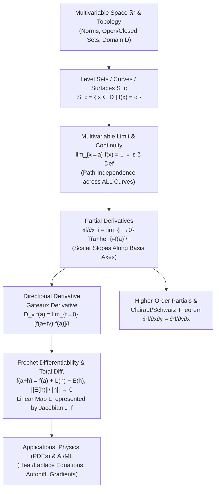

# Topic 10: Multivariable Functions & Partial Derivatives — Calculus Mastery Module

## Executive Summary & Learning Objectives

Multivariable calculus extends single-variable analysis to functions operating on higher-dimensional vector spaces, $f: \mathbb{R}^n \to \mathbb{R}^m$. Moving from $\mathbb{R}$ to $\mathbb{R}^n$ introduces rich topological and geometric structures: directions of approach to a point become infinite, level sets describe hyper-surfaces of constant value, and the concept of derivative transitions from a scalar rate of change to a bounded linear operator (the **Fréchet derivative** or **total differential**).

This module establishes a rigorous foundation for multivariable functions, limits, continuity, partial derivatives, and differentiability. It bridges classical geometric intuition with the formal functional analysis required in modern mathematical physics and machine learning optimization.

### Key Learning Objectives

1. **Domain Topology & Level Sets**: Identify, sketch, and mathematically analyze domains $D \subset \mathbb{R}^n$ and level sets $S_c = \{x \in D \mid f(x) = c\}$, understanding their topological properties (open, closed, bounded, compact).
2. **Multivariable Limits & Continuity**: Rigorously analyze multivariable limits using $\epsilon$-$\delta$ formalisms, polar/spherical coordinate transformations, and path-dependent non-existence criteria.
3. **Partial Derivatives & Directional Rates**: Compute scalar partial derivatives $\frac{\partial f}{\partial x_i}$ and directional derivatives $D_v f(a)$, establishing their geometric interpretation as cross-sectional slopes.
4. **Symmetry of Mixed Partials**: Master **Clairaut's (Schwarz's) Theorem**, proving conditions under which $\frac{\partial^2 f}{\partial x_i \partial x_j} = \frac{\partial^2 f}{\partial x_j \partial x_i}$, and analyze classical counterexamples where mixed partials fail to commute.
5. **Differentiability Hierarchy**: Distinguish clearly between partial derivability, Gâteaux differentiability (directional differentiability), Fréchet differentiability (total differentiability), and $C^1$ continuity, proving containment relationships and structural counterexamples.
6. **Applications in Physics & AI/ML**: Formulate physical field equations (Heat, Wave, Laplace) and machine learning loss functions, evaluating gradients, Jacobians, and total differentials in optimization landscapes.

---

## First-Principles Concept Map



---

## Common Misconceptions Table

| Misconception | Reality & Mathematical Truth | Counterexample / Correct Principle |
| :--- | :--- | :--- |
| **"If partial derivatives $\frac{\partial f}{\partial x}$ and $\frac{\partial f}{\partial y}$ exist everywhere, $f$ must be continuous."** | **False.** Partial derivatives only restrict behavior along coordinate axes. A function can be discontinuous at $(0,0)$ even if both partial derivatives exist everywhere. | $f(x,y) = \frac{xy}{x^2+y^2}$ for $(x,y)\neq(0,0)$, $f(0,0)=0$. Partials at $(0,0)$ are both $0$, but $\lim_{(x,y)\to(0,0)} f(x,y)$ does not exist ($f=1/2$ along $y=x$). |
| **"If $\lim_{(x,y)\to(0,0)} f(x,y) = L$ along every straight line $y = kx$, the multivariable limit is $L$."** | **False.** Approaching along straight lines is insufficient. A limit must evaluate to $L$ along *all possible paths*, including parabolic, exponential, or oscillatory curves. | $f(x,y) = \frac{x^2 y}{x^4 + y^2}$. Along $y = kx$, $\lim_{x\to 0} \frac{k x^3}{x^4 + k^2 x^2} = 0$. But along $y = x^2$, $f(x,x^2) = \frac{x^4}{2 x^4} = \frac{1}{2} \neq 0$. |
| **"Mixed partial derivatives always commute ($\frac{\partial^2 f}{\partial x \partial y} = \frac{\partial^2 f}{\partial y \partial x}$)."** | **False.** Equality requires continuity of the second partial derivatives at the target point (Clairaut's / Schwarz's Theorem). | Peano's counterexample: $f(x,y) = \frac{xy(x^2-y^2)}{x^2+y^2}$ for $(x,y)\neq(0,0)$ and $f(0,0)=0$. Here $f_{xy}(0,0) = -1$, but $f_{yx}(0,0) = +1$. |
| **"If directional derivatives $D_v f(a)$ exist in all directions $v$, then $f$ is Fréchet differentiable."** | **False.** Directional differentiability (Gâteaux differentiability) does not imply total differentiability, nor does it imply continuity, unless the directional derivatives assemble into a continuous linear map with zero remainder. | $f(x,y) = \frac{x^3}{x^2+y^2}$ for $(x,y)\neq(0,0)$, $f(0,0)=0$. $D_v f(0,0)$ exists for all $v$, but $f$ is not Fréchet differentiable at $(0,0)$ because $D_v f(0,0)$ is non-linear in $v$. |
| **"The total differential $df$ is just a tiny number."** | **False.** The total differential at $a$, denoted $df(a)$ or $D f(a)$, is a *linear map* (bounded linear operator) $L: \mathbb{R}^n \to \mathbb{R}^m$. $df = \sum_{i=1}^n \frac{\partial f}{\partial x_i} dx_i$ evaluates this map on incremental vector inputs $dx$. | In matrix form, $df(a)(h) = J_f(a) h$, where $J_f(a)$ is the Jacobian matrix and $h \in \mathbb{R}^n$. |

---

## Directory Inventory

```text
calculus/10_multivariable_functions_partials/
├── README.md               # Overview, Concept Map, Misconceptions, & References (This File)
├── first_principles.ipynb  # First-Principles Theory, Rigorous Proofs, Algorithmic & Physical Applications
└── exercises.ipynb         # 4-Tier Exercise Package (40 Fully Solved Problems with Boxed Answers & Takeaways)
```

---

## Recommended References

1. **Spivak, Michael** — *Calculus on Manifolds: A Modern Approach to Classical Theorems of Advanced Calculus*, Westview Press, 1965. *(Gold standard for Fréchet differentiability, total differentials, and rigorous multivariable analysis).*
2. **Apostol, Tom M.** — *Mathematical Analysis*, 2nd Edition, Addison-Wesley, 1974; and *Calculus, Volume II*, 2nd Edition, Wiley, 1969. *(Masterful coverage of multivariable limits, continuity, partial derivatives, and Clairaut's theorem).*
3. **Marsden, Jerrold E., & Tromba, Anthony J.** — *Vector Calculus*, 6th Edition, W. H. Freeman, 2011. *(Exceptional geometric intuition, level sets, partial derivatives, and physical field applications).*
4. **Demidovich, B. P.** — *Problems in Mathematical Analysis*, Mir Publishers, 1973. *(Classical source for challenging multivariable limits, singular points, and path-dependent counterexamples).*
5. **Stewart, James** — *Multivariable Calculus*, 8th Edition, Cengage Learning, 2015. *(Accessible introductory multivariable geometry, level surfaces, and computational foundations).*
6. **Pólya, George, & Szegő, Gábor** — *Problems and Theorems in Analysis*, Springer, 1998. *(Advanced mathematical techniques and structural insights).*
7. **Putnam Competition & Cambridge Mathematical Tripos** — *Selected Multivariable Real Analysis Problems*.
