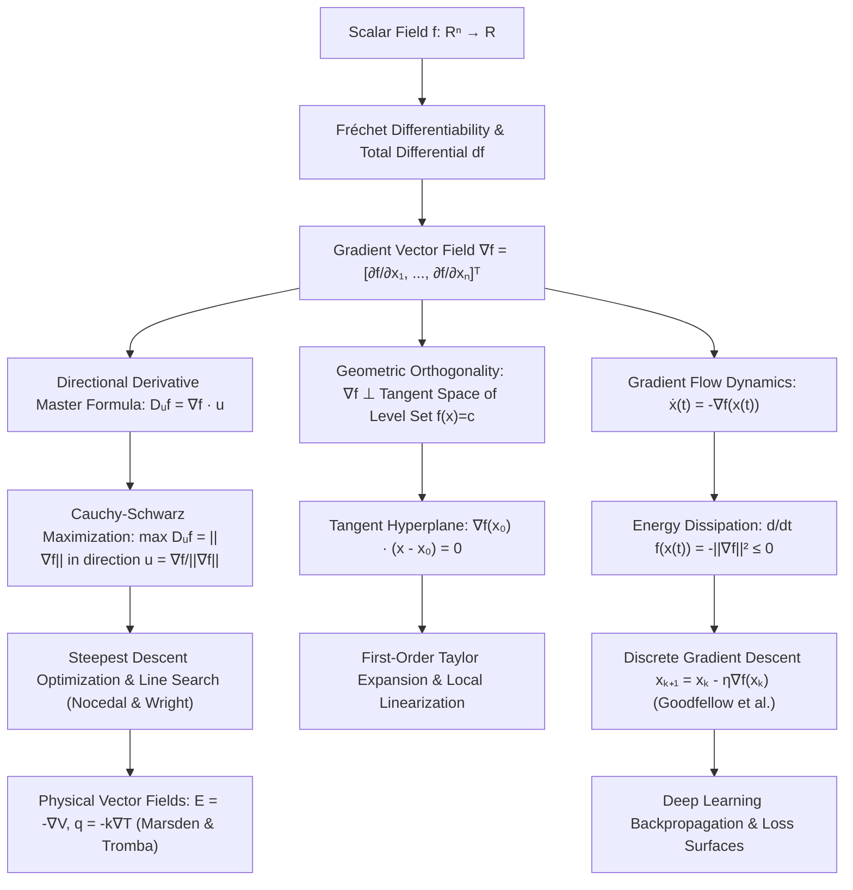

# Topic 11: Gradients & Directional Derivatives — Calculus Mastery Module

**Status:** Active  
**Level:** Advanced Foundation (Part II of Calculus & Multivariable Analysis Series)  
**Target Audience:** Mathematical Modelers, Optimization Engineers, Physicists, AI/ML Researchers  

---

## 📌 Module Overview

In multivariable calculus, understanding how functions change across multidimensional spaces is central to modeling physical systems, analyzing scalar and vector fields, and optimizing complex loss functions in machine learning. While single-variable calculus measures rate of change along a single line via $f'(x)$, multivariable functions $f: \mathbb{R}^n \to \mathbb{R}$ possess infinitely many directions in which change can occur.

This module develops the theory of **Gradients and Directional Derivatives** from first principles. It answers the fundamental questions:
1. **Directional Query:** How fast does a scalar field change when moving in an arbitrary spatial direction $\mathbf{u}$?
2. **Steepest Ascent/Descent:** Which direction maximizes or minimizes the instantaneous rate of increase, and what is that maximum rate?
3. **Geometric Interpretation:** Why is the gradient vector $\nabla f(\mathbf{x}_0)$ always orthogonal to the level set $f(\mathbf{x}) = c$ at point $\mathbf{x}_0$?
4. **Dynamical Trajectories:** How do continuous gradient flow systems $\dot{\mathbf{x}}(t) = -\nabla f(\mathbf{x}(t))$ evolve across energy landscapes, and how do they discretize into optimization algorithms like Gradient Descent?

This module connects pure analysis ($\varepsilon$-$\delta$ Fréchet differentiability) to physical field theory (electrostatics, heat flow, fluid dynamics) and modern artificial intelligence (loss landscapes, backpropagation, automatic differentiation, ill-conditioned optimization dynamics).

---

## 🎯 Learning Objectives

By completing this module, you will be able to:

1. **Formulate & Derive Directional Derivatives**: Define the directional derivative $D_{\mathbf{u}}f(\mathbf{x})$ from first principles as a limit of a difference quotient along a direction vector, and prove the master inner product formula $D_{\mathbf{u}}f(\mathbf{x}) = \nabla f(\mathbf{x}) \cdot \mathbf{u}$ for differentiable functions.
2. **Master Steepest Ascent & Geometry**: Use Cauchy-Schwarz inequality to prove that $\nabla f(\mathbf{x})$ points in the direction of maximum instantaneous rate of increase, with magnitude $\|\nabla f(\mathbf{x})\|$ representing that rate.
3. **Construct Tangent Hyperplanes & Normal Vectors**: Rigorously prove that $\nabla f(\mathbf{x}_0)$ is orthogonal to the tangent space of the level set $f(\mathbf{x}) = c$, and construct explicit linear approximations, normal lines, and tangent hyperplanes.
4. **Apply Multivariable Chain Rules**: Apply chain rules along parameterized curves $\mathbf{r}(t)$ and composite vector maps $\mathbf{g}(\mathbf{u})$, evaluating rates of change along dynamic trajectories.
5. **Analyze Continuous & Discrete Gradient Flow**: Formulate gradient flow differential equations $\dot{\mathbf{x}} = -\nabla f(\mathbf{x})$, prove Lyapunov energy dissipation $\frac{d}{dt}f(\mathbf{x}(t)) \le 0$, and analyze convergence dynamics under conditioning of the Hessian matrix.
6. **Solve 40 Solved Mastery Problems (L0–L3)**: Solve rigorous problems spanning conceptual checks, computational mastery, physics modeling (electrostatics, Fourier heat flow), deep learning loss surfaces (linear/logistic regression, softmax cross-entropy, backpropagation), and olympiad/Tripos level challenge proofs.

---

## 📂 Directory Inventory

```text
calculus/11_gradients_directional_derivatives/
├── README.md               <-- Module Overview, Concept Map, Misconceptions, & References (This File)
├── first_principles.ipynb  <-- Complete First-Principles Theory, Proofs, Physics & AI/ML Applications
└── exercises.ipynb         <-- 4-Level Exercise Package (40 Solved Problems with Boxed Answers & Takeaways)
```

---

## 🗺️ First-Principles Concept Map



---

## ⚠️ Common Misconceptions Table

| Misconception | Mathematical Reality | Correct First-Principles Concept |
|---|---|---|
| **"The gradient points along the tangent line of the function graph $z = f(x,y)$."** | The gradient $\nabla f(x,y)$ lives strictly in the **domain space** $\mathbb{R}^n$, not in the codomain/graph space $\mathbb{R}^{n+1}$. | $\nabla f(x_0, y_0)$ is a 2D vector in the $xy$-plane pointing perpendicular to the **level curve** $f(x,y)=c$. The normal vector to the 3D surface $z - f(x,y) = 0$ is $\mathbf{n} = (\frac{\partial f}{\partial x}, \frac{\partial f}{\partial y}, -1)^T$. |
| **"Directional derivative $D_{\mathbf{v}}f$ can be computed using any direction vector $\mathbf{v}$."** | Directional derivatives measure rate of change per **unit distance**. If $\mathbf{v}$ is not a unit vector, $D_{\mathbf{v}}f$ scales linearly with $\Vert\mathbf{v}\Vert$. | Always normalize $\mathbf{u} = \frac{\mathbf{v}}{\Vert\mathbf{v}\Vert}$ before applying the formula $D_{\mathbf{u}}f = \nabla f \cdot \mathbf{u}$. |
| **"If partial derivatives exist everywhere at a point, $D_{\mathbf{u}}f = \nabla f \cdot \mathbf{u}$ holds for all $\mathbf{u}$."** | Existence of partial derivatives does NOT imply Fréchet differentiability or continuity. The linear formula requires differentiability. | Without differentiability, directional derivatives can exist in all directions but fail to depend linearly on $\mathbf{u}$. |
| **"Gradient descent trajectories follow straight lines to the global minimum."** | Steepest descent trajectories follow orthogonal paths across level curves $\dot{\mathbf{x}} = -\nabla f(\mathbf{x})$. On anisotropic/ill-conditioned landscapes, paths curve and zigzag sharply. | Path direction is local ($-\nabla f(\mathbf{x})$). Condition number $\kappa = \lambda_{\max}/\lambda_{\min}$ of the Hessian matrix dictates trajectory oscillation and convergence speed. |
| **"The directional derivative $D_{\mathbf{u}}f(\mathbf{x})$ is a vector."** | $D_{\mathbf{u}}f(\mathbf{x})$ is a **scalar quantity** representing the slope / instantaneous rate of change of $f$ along direction $\mathbf{u}$. | The gradient $\nabla f(\mathbf{x})$ is a vector field; the directional derivative is the scalar projection $D_{\mathbf{u}}f = \nabla f \cdot \mathbf{u}$. |
| **"Steepest descent direction is parallel to the level set."** | Level set $f(\mathbf{x})=c$ is the set of constant value ($D_{\mathbf{T}}f = 0$). Steepest descent is strictly **orthogonal** to the level set. | $\nabla f(\mathbf{x})$ is orthogonal to tangent vectors $\mathbf{T}$ of the level set because $\nabla f \cdot \mathbf{T} = 0$. |

---

## 📖 Recommended References

- **Marsden, J. E., & Tromba, A.** *Vector Calculus* (6th Edition) — Chapters 2 & 4. Exemplary geometric treatment of directional derivatives, gradients, tangent planes, and conservative vector fields.
- **Apostol, T. M.** *Calculus, Volume II: Multi-Variable Calculus and Linear Algebra with Applications* (2nd Edition) — Chapters 8 & 9. Rigorous treatment of Fréchet differentiation, gradient operator, chain rule, and implicit function theorem.
- **Nocedal, J., & Wright, S. J.** *Numerical Optimization* (2nd Edition) — Chapters 2 & 3. Canonical reference for steepest descent dynamics, step length control, line search, and landscape conditioning.
- **Goodfellow, I., Bengio, Y., & Courville, A.** *Deep Learning* (MIT Press) — Chapter 4 (Numerical Computation) & Chapter 6 (Deep Feedforward Networks). Gradient computation, automatic differentiation, loss surface topology, and backpropagation.
- **Spivak, M.** *Calculus on Manifolds* — Chapters 2 & 3. Rigorous differential topology, total derivative as a linear transformation, and gradient as Riesz dual.
- **Stewart, J.** *Multivariable Calculus* (8th Edition) — Chapter 14. Accessible computational practice for directional derivatives, tangent planes, and extreme values.
- **Demidovich, B. P.** *Problems in Mathematical Analysis* — Multivariable Differential Calculus section (Problems 3201–3250). Classical benchmark computational problems.
- **William Lowell Putnam Mathematical Competition & Cambridge Mathematical Tripos** — Archives on multivariable calculus, homogenous functions (Euler's theorem), and gradient vector fields.

