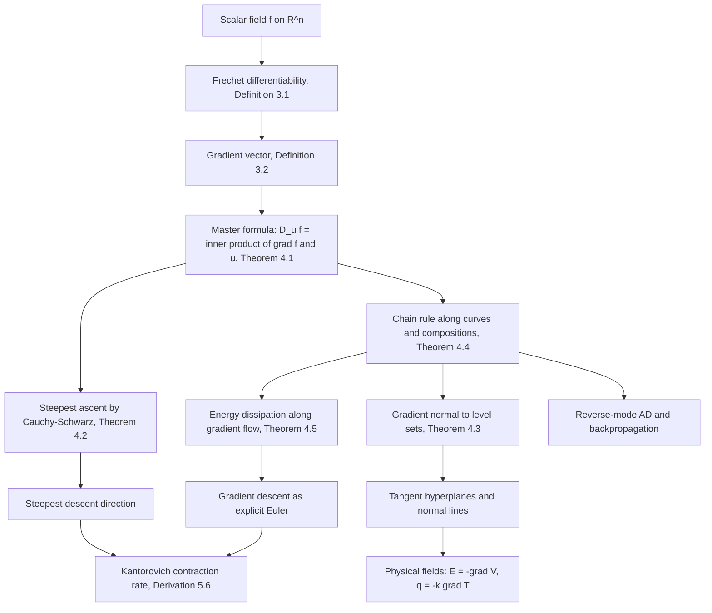

# Module 11 — Gradients and Directional Derivatives

A function of one variable has two directions of travel and one derivative. A scalar field
$f : \mathbb{R}^n \to \mathbb{R}$ has infinitely many directions of travel, and this module shows that
a single vector — the gradient $\nabla f(\mathbf{x})$ — encodes the rate of change along every one of
them. Module 10 built the $n$ partial derivatives; here they are assembled into one object and the
consequences are extracted.

Three consequences carry the module. The rate along a unit direction $\mathbf{u}$ is the inner product
$\langle \nabla f(\mathbf{x}), \mathbf{u}\rangle$, so no new limit is ever needed. Maximising that
inner product over the unit sphere identifies $\nabla f$ itself as the unique steepest-ascent
direction, with $\lVert \nabla f \rVert$ as the maximal rate. And because moving along a level set
changes nothing, the gradient is the normal to the level set, which is where tangent hyperplanes come
from for free.

The module is deliberately strict about hypotheses. Existence of all partial derivatives — even of all
directional derivatives — does not give the inner-product formula: $f(x,y) = x^3/(x^2+y^2)$ at the
origin has $D_{\mathbf{u}}f = u_1^3$, which is not linear in $\mathbf{u}$. Fréchet differentiability is
the hypothesis that does the work, and every theorem here says so.

Finally the gradient is set in motion. The flow $\dot{\mathbf{x}} = -\nabla f(\mathbf{x})$ dissipates
$f$ at rate $\lVert \nabla f \rVert^2$, its explicit Euler discretisation is gradient descent, and the
condition number of the Hessian controls how badly that descent zigzags — the bridge to every
optimisation module downstream.

> [!NOTE]
> **The master formula.** If $f$ is Fréchet differentiable at $\mathbf{x}$ and $\lVert \mathbf{u}\rVert = 1$,
> then $D_{\mathbf{u}} f(\mathbf{x}) = \langle \nabla f(\mathbf{x}), \mathbf{u}\rangle = \lVert \nabla f(\mathbf{x})\rVert \cos\theta$.
> Every directional rate is a linear functional of the direction; steepest ascent, level-set
> orthogonality and the chain rule are all corollaries of this one line.

## Prerequisites

- [calculus/10 — Multivariable Functions and Partial Derivatives](../10_multivariable_functions_partials/)
- [linear_algebra/04 — Orthogonality, Projections and QR](../../linear_algebra/04_orthogonality_projections_and_qr/)

**Downstream — modules this one unlocks**

- [calculus/12 — Hessian, Jacobian and Curvature](../12_hessian_jacobian_curvature/)
- [calculus/14 — Vector Calculus and Field Theorems](../14_vector_calculus_field_theorems/)
- [calculus_optimization/01 — Derivatives and Gradients for ML](../../calculus_optimization/01_derivatives_and_gradients_for_ml/)
- [optimization/03 — Gradient Descent and Convergence](../../optimization/03_gradient_descent_and_convergence/)
- [optimization/05 — Constrained Optimization and Lagrange Multipliers](../../optimization/05_constrained_optimization_lagrange/)

## Learning outcomes

- Define $D_{\mathbf{u}}f(\mathbf{x})$ as a one-dimensional limit and prove
  $D_{\mathbf{u}}f = \langle \nabla f, \mathbf{u}\rangle$ from Fréchet differentiability alone.
- Exhibit a function whose partial and directional derivatives all exist but which is not
  differentiable, and say exactly which conclusion fails.
- Prove by Cauchy–Schwarz that $\nabla f / \lVert \nabla f\rVert$ is the *unique* maximiser of the
  directional derivative over the unit sphere.
- Prove that $\nabla f(\mathbf{x}_0)$ annihilates every tangent vector of the level set through
  $\mathbf{x}_0$, and state the extra hypotheses under which the tangent space is exactly that
  orthogonal complement.
- Apply the chain rule in both forms — along a curve, and as $J_{\mathbf{g}}^\top \nabla f$ — and
  recognise backpropagation as the second form run right to left.
- Prove $\frac{d}{dt}f(\mathbf{x}(t)) = -\lVert \nabla f(\mathbf{x}(t))\rVert^2$ along gradient flow and
  read gradient descent as its Euler discretisation.
- Predict and measure the order of forward and central finite-difference gradients, and the
  $((\kappa-1)/(\kappa+1))^2$ contraction of exact-line-search steepest descent.

## Concept map

## Notation

| Symbol | Meaning | Convention |
|---|---|---|
| $\nabla f(\mathbf{x})$ | gradient of $f$ at $\mathbf{x}$ | a **column** vector in $\mathbb{R}^n$ |
| $Df(\mathbf{x})$ | Fréchet derivative | the row vector $\nabla f(\mathbf{x})^\top$ |
| $D_{\mathbf{u}} f(\mathbf{x})$ | directional derivative along $\mathbf{u}$ | a **scalar**; $\mathbf{u}$ must be a unit vector |
| $\langle \mathbf{a}, \mathbf{b}\rangle$ | Euclidean inner product $\mathbf{a}^\top\mathbf{b}$ | also written $\mathbf{a}\cdot\mathbf{b}$ |
| $\lVert \mathbf{v} \rVert$ | Euclidean norm | written `\lVert ... \rVert`, never `\Vert` |
| $J_{\mathbf{g}}(\mathbf{u})$ | Jacobian of $\mathbf{g}:\mathbb{R}^m\to\mathbb{R}^n$ | an $n \times m$ matrix; $J_f = (\nabla f)^\top$ when $n=1$ |
| $\mathcal{S}_c$ | level set $\lbrace \mathbf{x} : f(\mathbf{x}) = c \rbrace$ | level curve for $n=2$, level surface for $n=3$ |
| $T_{\mathbf{x}_0}\mathcal{S}_c$ | tangent space of the level set at $\mathbf{x}_0$ | velocities of curves lying in $\mathcal{S}_c$ |
| $\kappa$ | condition number $\lambda_{\max}/\lambda_{\min}$ | of a positive definite Hessian |
| $\lVert \mathbf{v} \rVert_{\mathbf{A}}$ | energy norm, $\sqrt{\mathbf{v}^\top\mathbf{A}\mathbf{v}}$ | requires $\mathbf{A} \succ 0$ |

## Core results

| Result | Statement | Hypotheses |
|---|---|---|
| Theorem 4.1 — master formula | $D_{\mathbf{u}}f(\mathbf{x}) = \langle \nabla f(\mathbf{x}), \mathbf{u}\rangle$ | $\Omega$ open, $f$ Fréchet differentiable at $\mathbf{x}$, $\lVert \mathbf{u}\rVert = 1$ |
| Theorem 4.2 — steepest ascent | $\max_{\lVert \mathbf{u}\rVert=1} D_{\mathbf{u}}f = \lVert \nabla f\rVert$, attained only at $\nabla f/\lVert \nabla f\rVert$ | as Theorem 4.1, plus $\nabla f(\mathbf{x}) \neq \mathbf{0}$ for uniqueness |
| Theorem 4.3 — level-set normal | $\langle \nabla f(\mathbf{x}_0), \mathbf{v}\rangle = 0$ for all $\mathbf{v} \in T_{\mathbf{x}_0}\mathcal{S}_c$ | $f$ differentiable; equality of the two spaces needs $f \in C^1$ and $\nabla f(\mathbf{x}_0) \neq \mathbf{0}$ |
| Theorem 4.4 — chain rule | $(f\circ\mathbf{r})'(t_0) = \langle \nabla f(\mathbf{r}(t_0)), \mathbf{r}'(t_0)\rangle$; $\nabla(f\circ\mathbf{g}) = J_{\mathbf{g}}^\top \nabla f$ | inner map differentiable at the point, outer map differentiable at its image |
| Theorem 4.5 — energy dissipation | $\frac{d}{dt} f(\mathbf{x}(t)) = -\lVert \nabla f(\mathbf{x}(t))\rVert^2 \le 0$ | $f \in C^1$ and $\mathbf{x}(\cdot)$ solves $\dot{\mathbf{x}} = -\nabla f(\mathbf{x})$ |
| Derivation 5.6 — contraction rate | $\lVert \mathbf{x}_{k+1}-\mathbf{x}^\star\rVert_{\mathbf{A}}^2 \le \left(\frac{\kappa-1}{\kappa+1}\right)^2 \lVert \mathbf{x}_{k}-\mathbf{x}^\star\rVert_{\mathbf{A}}^2$ | quadratic objective, $\mathbf{A}\succ 0$, exact line search; bound is attained |

## Common misconceptions

| Misconception | Reality | What to hold instead |
|---|---|---|
| "The gradient points uphill along the graph $z = f(x,y)$." | $\nabla f$ lives in the **domain** $\mathbb{R}^n$, not in the graph space $\mathbb{R}^{n+1}$. | $\nabla f(x_0,y_0)$ is a vector in the $xy$-plane, normal to the level curve. The normal to the surface $z - f(x,y) = 0$ is $(f_x, f_y, -1)^\top$. |
| "Any direction vector will do in $D_{\mathbf{v}}f$." | The limit is positively homogeneous of degree one in $\mathbf{v}$, so an unnormalised $\mathbf{v}$ rescales the answer by $\lVert \mathbf{v}\rVert$. | Normalise first: $\mathbf{u} = \mathbf{v}/\lVert \mathbf{v}\rVert$, then apply Theorem 4.1. |
| "If the partials exist, $D_{\mathbf{u}}f = \langle \nabla f, \mathbf{u}\rangle$." | Partials probe $n$ axes only. $f = x^3/(x^2+y^2)$ has all partials and all directional derivatives at the origin, yet $D_{\mathbf{u}}f = u_1^3$. | Fréchet differentiability, Definition 3.1, is the hypothesis that makes $\mathbf{u} \mapsto D_{\mathbf{u}}f$ linear. |
| "$D_{\mathbf{u}}f(\mathbf{x})$ is a vector." | It is a scalar — the slope felt while walking along $\mathbf{u}$. | The gradient is the vector; the directional derivative is its projection onto $\mathbf{u}$. |
| "Steepest descent heads straight at the minimiser." | $-\nabla f$ is the best *local* direction only. On an ill-conditioned quadratic it is nearly orthogonal to $\mathbf{x}^\star - \mathbf{x}_k$. | Consecutive exact-line-search steps are orthogonal, giving the zigzag; the error contracts by $((\kappa-1)/(\kappa+1))^2$ per step. |
| "Steepest descent runs along the level set." | Along a level set the rate of change is exactly $0$, so no progress is made. | $-\nabla f$ crosses level sets at right angles, by Theorem 4.3. |
| "Smaller $h$ always gives a better finite-difference gradient." | Below $h \approx \varepsilon^{1/2}$ (forward) or $\varepsilon^{1/3}$ (central), cancellation roundoff of size $\varepsilon/h$ dominates the truncation error. | The total error is U-shaped in $h$; pick $h$ at the measured minimum, not at the smallest representable value. |

## Exercise index

`exercises.ipynb` contains **40 problems**, every one fully solved with a boxed answer, a key takeaway,
and — wherever the answer is numeric — a code cell that recomputes it.

| Tier | Title | Count | Focus |
|---|---|---|---|
| L0 | Concept Checks | 8 | one-line facts: what kind of object each symbol is, when a hypothesis is needed |
| L1 | Foundations | 10 | gradients, directional derivatives, tangent planes, chain rule by hand |
| L2 | Applications (AI/ML and Physics) | 12 | electrostatics, heat flow, thermodynamic potentials, regression and softmax gradients, descent dynamics |
| L3 | Challenge Proofs | 10 | Euler's homogeneous-function theorem, non-differentiability counterexamples, mean value inequalities, flow convergence |

## References

- Apostol, T. M., *Calculus, Volume II*, 2nd ed., §12.2, §12.4 (Thm 12.4 — the master formula), §12.6, §12.10
- Rudin, W., *Principles of Mathematical Analysis*, 3rd ed., §9.6–9.12, Thm 9.15, Thm 9.28 (implicit function theorem)
- Spivak, M., *Calculus on Manifolds*, Ch. 2 (Thm 2-7, Thm 2-9)
- Marsden, J. E. & Tromba, A., *Vector Calculus*, 6th ed., §2.5–2.6, §4.3
- Nocedal, J. & Wright, S. J., *Numerical Optimization*, 2nd ed., §2.2, §3.3 (eq. 3.29)
- Luenberger, D. G. & Ye, Y., *Linear and Nonlinear Programming*, 4th ed., §8.2 (Thm 1, Kantorovich inequality)
- Goodfellow, I., Bengio, Y. & Courville, A., *Deep Learning*, §4.3, §6.5
- Higham, N. J., *Accuracy and Stability of Numerical Algorithms*, 2nd ed., §1.11
