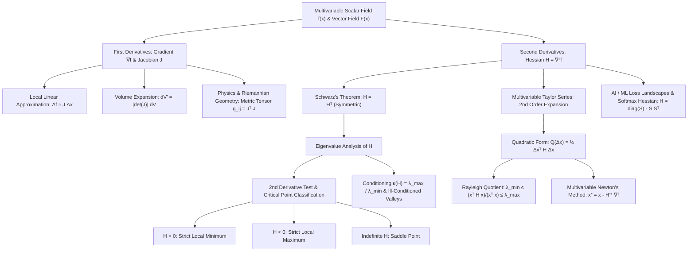

# Topic 12: Hessian Matrix, Jacobian, & Curvature — Calculus Mastery Module

**Status:** Active  
**Level:** Advanced Multivariable Calculus & Optimization Foundation (Part of Calculus Series)  
**Target Audience:** Applied Mathematicians, Mathematical Modelers, AI/ML Researchers, Physicists  

---

## 📌 Module Overview

In multivariable calculus and continuous optimization, understanding local dynamics requires moving beyond first-order directional derivatives. While the gradient $\nabla f(x)$ identifies the direction of steepest ascent (a local linear approximation), higher-order geometry and coordinate transformations are governed by two fundamental matrices:
1. **The Jacobian Matrix ($J$):** Captures the local linear transformation of vector-valued mappings $f: \mathbb{R}^n \to \mathbb{R}^m$. Its determinant $\det(J)$ acts as the local differential volume expansion factor during coordinate transformations and non-linear deformations.
2. **The Hessian Matrix ($H$ or $\nabla^2 f$):** Captures local second-order curvature for scalar fields $f: \mathbb{R}^n \to \mathbb{R}$. As a symmetric matrix of second partial derivatives, its quadratic form $x^T H x$, eigenvalues, and Rayleigh quotients determine local surface convexity, bowl-like minima, dome-like maxima, and saddle points.

This module provides a rigorous first-principles theoretical foundation alongside a **4-Level Mastery Exercise Package** containing **40 fully solved problems** bridging pure mathematical analysis, physical coordinate metrics, numerical optimization (2D Newton's method, condition numbers), and modern deep learning (Softmax Hessians, loss landscapes, natural gradients).

---

## 🎯 Learning Objectives

By completing this module, you will be able to:

1. **Construct & Interpret Jacobians:** Compute $J \in \mathbb{R}^{m \times n}$ for arbitrary vector functions, prove the chain rule for vector compositions $J_{g \circ f} = J_g(f(x)) J_f(x)$, and apply the Jacobian determinant $\lvert\det(J)\rvert$ to measure local infinitesimal volume expansion $\mathbf{d}V' = \lvert\det(J)\rvert \mathbf{d}V$.
2. **Derive Multivariable Taylor Expansions:** Expand $f: \mathbb{R}^n \to \mathbb{R}$ to second order around a point $x_0$, expressing local quadratic behavior as $f(x_0 + \Delta x) \approx f(x_0) + \nabla f(x_0)^T \Delta x + \frac{1}{2} \Delta x^T H_f(x_0) \Delta x$.
3. **Classify Critical Points via Spectral Analysis:** State and prove Schwarz's theorem ($H = H^T$), apply Sylvester's Criterion (principal minors) and eigenvalue sign signatures ($\lambda_i \gt 0 \implies H \succ 0$, $\lambda_i \lt 0 \implies H \prec 0$, mixed signs $\implies$ saddle point) to classify stationary points.
4. **Master Rayleigh Quotients & Spectral Conditioning:** Bound local surface curvature using Rayleigh quotients $\lambda_{\min} \le \frac{x^T H x}{x^T x} \le \lambda_{\max}$, and explain why high spectral condition numbers $\kappa(H) = \frac{\lambda_{\max}}{\lambda_{\min}} \gg 1$ cause severe oscillation in gradient descent.
5. **Formulate & Analyze Multivariable Newton's Method:** Construct the multidimensional Newton update $x^{(k+1)} = x^{(k)} - H_f^{-1}(x^{(k)}) \nabla f(x^{(k)})$ as the exact minimizer of the local quadratic model, and state conditions for local quadratic convergence.
6. **Derive AI & Physics Foundations:** Rigorously derive the Softmax Jacobian $J = \text{diag}(S) - S S^T$, cross-entropy loss Hessian $\nabla^2 \mathcal{L}_{CE} = \text{diag}(S) - S S^T$, Fisher Information Matrix curvature, and metric tensors in classical mechanics.

---

## 🗺️ First-Principles Concept Map



---

## ⚠️ Common Misconceptions Table

| Misconception | Mathematical Reality | Intuitive / Correct View |
|---|---|---|
| **1. The Hessian is always symmetric.** | $H_{ij} = \frac{\partial^2 f}{\partial x_i \partial x_j}$ is symmetric **only** if the second partial derivatives exist and are continuous at that point (Schwarz / Clairaut Theorem). | For non-$C^2$ functions, mixed partials can differ. Symmetry $H = H^T$ relies explicitly on continuity. |
| **2. $\det(H) \gt 0$ implies a local minimum in 2D.** | $\det(H) = \lambda_1 \lambda_2 \gt 0$ means both eigenvalues share the **same sign**. If both are negative ($\lambda_1, \lambda_2 \lt 0$), it is a local **maximum**. | You must check $f_{xx} \gt 0$ (or $\text{Tr}(H) = \lambda_1 + \lambda_2 \gt 0$) alongside $\det(H) \gt 0$ to guarantee a minimum. |
| **3. A point with $\det(H) = 0$ is always a saddle point.** | $\det(H) = 0$ means $H$ has at least one zero eigenvalue ($\lambda = 0$). The second derivative test is **inconclusive**. | The point could be a minimum (e.g., $f(x,y) = x^4 + y^4$ at $(0,0)$), maximum, or degenerate valley/ridge. Higher-order terms are needed. |
| **4. The Jacobian determinant $\det(J)$ can be negative for real coordinate changes.** | $\det(J)$ can be negative, which indicates that the coordinate transformation **reverses orientation** (e.g., reflection). | The change-of-variables integral formula uses the absolute value $\lvert\det(J)\rvert$ because differential volume elements are strictly non-negative ($\mathbf{d}V \ge 0$). |
| **5. Gradient descent always moves directly toward the minimum.** | Gradient descent steps along $-\nabla f(x)$, which is perpendicular to local contour lines, **not** pointing directly at the minimizer when $\kappa(H) \gg 1$. | When curvature differs wildly across axes ($\lambda_{\max} \gg \lambda_{\min}$), gradient descent zig-zags severely inside narrow elliptical valleys. |
| **6. The Softmax Hessian is strictly positive definite ($H \succ 0$).** | Softmax sums to 1 ($\sum S_i = 1$), causing $H = \text{diag}(S) - S S^T$ to have a zero eigenvalue corresponding to eigenvector $\mathbf{1} = (1,1,\dots,1)^T$. | Softmax is invariant to constant shifts in logits ($z + c\mathbf{1}$), so $H \mathbf{1} = \mathbf{0}$. Thus $H \succeq 0$ (positive semi-definite), not $H \succ 0$. |

---

## 📂 Directory Inventory

```text
foundations/calculus/12_hessian_jacobian_curvature/
├── README.md         <-- Module Overview, Concept Map, Misconceptions, & References (This File)
├── first_principles.ipynb  <-- Complete First-Principles Theory, Proofs, Derivations, & Algorithmic Analysis
└── exercises.ipynb    <-- 4-Level Exercise Package (40 Fully Solved Problems with Boxed Answers & Insights)
```

---

## 📖 Recommended References

- **Boyd, S., & Vandenberghe, L.** *Convex Optimization* (Cambridge University Press) — Chapters 2, 3, & 9 (Convexity, Hessian positive semi-definiteness, Rayleigh bounds, and Newton's method).
- **Nocedal, J., & Wright, S. J.** *Numerical Optimization* (Springer) — Chapters 2 & 3 (Line search, Newton-Raphson, Quasi-Newton BFGS, and Hessian spectral conditioning).
- **Spivak, M.** *Calculus on Manifolds* — Chapters 2 & 3 (Rigorous Jacobians, continuous differentiability, Schwarz theorem proof, and inverse/implicit function theorems).
- **Horn, R. A., & Johnson, C. R.** *Matrix Analysis* (2nd Edition) — Chapters 4 & 7 (Symmetric matrices, Rayleigh-Ritz theorem, Sylvester's criterion, and positive definite matrices).
- **Polyak, B. T.** *Introduction to Optimization* (Optimization Software Inc.) — Chapter 1 & 2 (Gradient descent convergence bounds, condition numbers, and saddle point dynamics).
- **Apostol, T. M.** *Mathematical Analysis* (2nd Edition) — Chapter 12 (Multivariable partial derivatives, Taylor's formula in higher dimensions, Jacobians, and extrema).
- **Stewart, J.** *Multivariable Calculus* (8th Edition) — Chapters 14 & 15 (Tangential planes, second derivative tests, directional derivatives, change of variables in multiple integrals).
- **Demidovich, B. P.** *Problems in Mathematical Analysis* — Chapters VI & VII (Multivariable differentiation, Hessian classification, Jacobian determinants, coordinate transformations).
- **Polya, G., & Szego, G.** *Problems and Theorems in Analysis II* — Part Five (Multivariable real analysis, convex functions, log-concavity, and positive definite forms).
- **Putnam Mathematical Competition & Cambridge Mathematical Tripos** — Past Archives (Advanced multivariable extrema, functional Jacobians, and geometric surface curvature).
