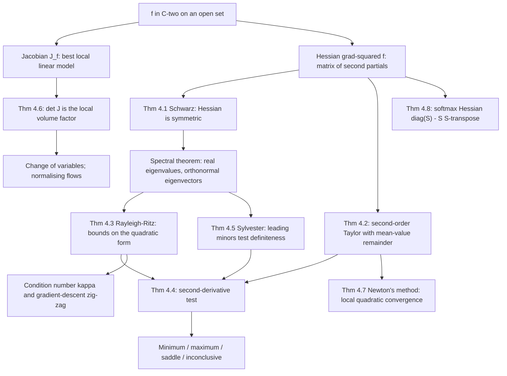

# Module 12 — Hessian, Jacobian, and Curvature

In one variable $f'(x)$ gives the tangent line and $f''(x)$ decides whether the graph curves up or down. In $n$ variables neither object is a number, and two different matrices take over. For a vector-valued map $f : \mathbb{R}^n \to \mathbb{R}^m$ the best local linear model is the Jacobian $J_f(x) \in \mathbb{R}^{m \times n}$; when $m = n$ its determinant is the factor by which $f$ scales volume, which is exactly what makes the change-of-variables formula work and what lets a normalising flow report an exact log-density.

For a scalar field $f : \mathbb{R}^n \to \mathbb{R}$ the gradient points uphill but says nothing about shape where it vanishes. A bowl, a dome, a plateau and a mountain pass all satisfy $\nabla f = \mathbf{0}$. Telling them apart needs the matrix of second partials, the Hessian $\nabla^2 f(x)$, and specifically the signs of its eigenvalues. Symmetry of that matrix is not an accident of notation: it is Schwarz's theorem, and it is what licenses the spectral theorem and the whole eigenvalue picture built on top of it.

The module derives the second-order Taylor expansion with an honest mean-value remainder, proves the second-derivative test from it, proves Rayleigh–Ritz and Sylvester's criterion, reads $\lvert \det J_f \rvert$ as a local volume factor, and closes with the two results this machinery exists to serve: local quadratic convergence of Newton's method, and the softmax cross-entropy Hessian $\operatorname{diag}(S) - S S^\top$ that sits inside every classifier.

Every optimisation guarantee later in this curriculum is a statement about Hessian eigenvalues — strong convexity is $\nabla^2 f \succeq \mu I$, smoothness is $\nabla^2 f \preceq L I$, the gradient-descent rate is governed by $\kappa = \lambda_{\max}/\lambda_{\min}$ — so this is where that vocabulary is built.

> [!NOTE]
> **Second-derivative test (Theorem 4.4).** Let $f \in C^2$ and let $\nabla f(x_0) = \mathbf{0}$, $H = \nabla^2 f(x_0)$. If $H \succ 0$ then $x_0$ is a strict local minimum; if $H \prec 0$, a strict local maximum; if $H$ is indefinite, a saddle. If $H$ is singular and semidefinite the test is inconclusive — that is a missing verdict, not a fourth one.

## Prerequisites

- [calculus/09 — Taylor and Power Series](../09_taylor_and_power_series/) — the one-variable Taylor theorem with remainder, which Theorem 4.2 reduces to.
- [calculus/11 — Gradients and Directional Derivatives](../11_gradients_directional_derivatives/) — the gradient, differentiability, and directional derivatives.
- [linear_algebra/06 — Eigenvalues, Eigenvectors, Spectral Theory](../../linear_algebra/06_eigenvalues_eigenvectors_spectral_theory/) — the spectral theorem for real symmetric matrices.

## Downstream

- [calculus/13 — Multiple Integrals and Coordinate Transforms](../13_multiple_integrals_coordinate_transforms/) — the change-of-variables formula carries $\lvert \det J \rvert$.
- [linear_algebra/10 — Matrix Calculus, Graph and AI Applications](../../linear_algebra/10_matrix_calculus_graph_and_ai_applications/)
- [probability_statistics/09 — Maximum Likelihood and MAP Estimation](../../probability_statistics/09_maximum_likelihood_and_map_estimation/) — the Fisher information is a Hessian.
- [calculus_optimization/02 — Taylor Approximation and Local Models](../../calculus_optimization/02_taylor_approximation_and_local_models/)
- [optimization/01 — Problem Formulation and Convexity](../../optimization/01_problem_formulation_and_convexity/)
- [differential_equations/05 — Phase Plane and Stability Analysis](../../differential_equations/05_phase_plane_and_stability_analysis/) — linearising a vector field is taking its Jacobian.

## Learning outcomes

After this module you will be able to:

- Build $J_f(x)$ for a vector-valued map, and read $\lvert \det J_f(x) \rvert$ as the local volume gain and its sign as an orientation flip.
- State Schwarz's theorem with its exact hypotheses, and exhibit a function whose mixed partials exist everywhere yet differ at a point.
- Expand $f \in C^2$ to second order with a mean-value remainder, and bound the model error by $\tfrac{L}{6}\lVert h \rVert^3$ when $\nabla^2 f$ is $L$-Lipschitz.
- Classify a critical point from the spectrum of $\nabla^2 f$, and say precisely when the test returns no verdict.
- Apply Sylvester's criterion, and explain why it uses leading principal minors and why it fails for the semidefinite case.
- Bound a quadratic form with the Rayleigh quotient, and predict gradient-descent zig-zag from $\kappa = \lambda_{\max}/\lambda_{\min}$.
- Derive the Newton step as the exact minimiser of the local quadratic model, and state the hypotheses behind quadratic convergence.
- Derive the softmax Jacobian $\operatorname{diag}(S) - S S^\top$ and show the cross-entropy Hessian is positive semidefinite with null vector $\mathbf{1}$.

## Concept map

## Notation

| Symbol | Meaning | Convention used here |
|---|---|---|
| $\nabla f(x)$ | gradient of a scalar field | a column vector in $\mathbb{R}^n$ |
| $\nabla^2 f(x)$ | Hessian | always written $\nabla^2 f$; $H$ only as a local abbreviation defined in the same cell |
| $J_f(x)$ | Jacobian of $f : \mathbb{R}^n \to \mathbb{R}^m$ | an $m \times n$ matrix, so $J_f = (\nabla f)^\top$ when $m = 1$ |
| $\lambda_{\min}$, $\lambda_{\max}$ | extreme eigenvalues of a symmetric matrix | named, never indexed |
| $A \succ 0$, $A \succeq 0$ | positive definite, positive semidefinite | symmetric $A$ only |
| $R_A(x) = \dfrac{x^\top A x}{x^\top x}$ | Rayleigh quotient | defined for $x \ne \mathbf{0}$ |
| $\kappa = \lambda_{\max}/\lambda_{\min}$ | condition number of a positive definite Hessian | |
| $\lVert x \rVert$ | Euclidean norm; operator norm on matrices | |
| $L$, $\mu$ | smoothness constant, strong-convexity modulus | $\mu I \preceq \nabla^2 f \preceq L I$ |
| $S(z)$ | softmax of the logits $z$ | $S_i = e^{z_i} / \sum_k e^{z_k}$ |

## Core results

| # | Result | Statement in brief | Hypotheses that matter |
|---|---|---|---|
| 4.1 | Schwarz | mixed partials commute, so $\nabla^2 f$ is symmetric | both mixed partials exist near $x_0$ and are continuous **at** $x_0$ |
| 4.2 | Second-order Taylor | $f(x+h) = f(x) + \nabla f(x)^\top h + \tfrac12 h^\top \nabla^2 f(x + \theta h) h$ | $f \in C^2$, $\Omega$ convex; Lipschitz $\nabla^2 f$ only for the cubic bound |
| 4.3 | Rayleigh–Ritz | $\lambda_{\min} \le R_A(x) \le \lambda_{\max}$, both attained | $A$ symmetric |
| 4.4 | Second-derivative test | $\nabla^2 f(x_0) \succ 0 \Rightarrow$ strict local min; $\prec 0 \Rightarrow$ max; indefinite $\Rightarrow$ saddle | $f \in C^2$, $\nabla f(x_0) = \mathbf{0}$, **strict** definiteness |
| 4.5 | Sylvester's criterion | $A \succ 0$ iff all $n$ **leading** principal minors are positive | $A$ symmetric; false for non-leading minors and for $\succeq 0$ |
| 4.6 | Jacobian volume factor | image volume $= \lvert \det J_f(x) \rvert \cdot$ domain volume, in the limit | $f$ differentiable at $x$; $\det J_f(x) \ne 0$ for the limit form |
| 4.7 | Newton, local quadratic rate | $\lVert x^{(k+1)} - x^\star \rVert \le \tfrac{ML}{2} \lVert x^{(k)} - x^\star \rVert^2$ | $\nabla^2 f(x^\star) \succ 0$, $\nabla^2 f$ $L$-Lipschitz, start close enough |
| 4.8 | Softmax curvature | $J_S = \nabla^2 \mathcal{L}_{\mathrm{CE}} = \operatorname{diag}(S) - S S^\top \succeq 0$ | all $S_i \gt 0$; shift invariance forces the null vector $\mathbf{1}$ |

## Common misconceptions

| Misconception | Reality | The correct view |
|---|---|---|
| The Hessian is always symmetric. | Symmetry is Theorem 4.1, and it has hypotheses. Section 7 runs $f(x,y) = xy(x^2-y^2)/(x^2+y^2)$, whose mixed partials exist everywhere yet satisfy $f_{xy}(0,0) = -1 \ne +1 = f_{yx}(0,0)$. | Symmetry needs the mixed partials to be **continuous** at the point, not merely to exist. |
| $\det H \gt 0$ in 2D means a local minimum. | $\det H = \lambda_1\lambda_2 \gt 0$ only says the eigenvalues share a sign. Both can be negative. | Check $f_{xx} \gt 0$, or equivalently $\operatorname{tr} H \gt 0$, alongside $\det H \gt 0$. |
| $\det H = 0$ means a saddle. | A zero eigenvalue makes the test **inconclusive**, not negative. | $x^4 + y^4$ has a minimum at the origin, $-x^4-y^4$ a maximum, $x^3$ neither — all with singular $H$. |
| A negative $\det J$ is impossible for a real coordinate change. | It is perfectly possible and means the map reverses orientation. | The change-of-variables formula uses $\lvert \det J \rvert$ because volume is non-negative. |
| Gradient descent heads at the minimiser. | $-\nabla f$ is normal to the level set, which points at the minimiser only when the level sets are spheres. | When $\kappa \gg 1$ the level sets are long thin ellipses and the iterates zig-zag across the valley. |
| The softmax Hessian is positive definite. | $\sum_i S_i = 1$ gives $(\operatorname{diag}(S) - SS^\top)\mathbf{1} = \mathbf{0}$. | It is positive **semi**definite of rank $n-1$; the loss is flat along constant shifts of the logits. |
| Sylvester's criterion extends to $\succeq 0$ by relaxing to $\ge$. | $\operatorname{diag}(0,-1)$ has $\Delta_1 = \Delta_2 = 0$ and is not $\succeq 0$. | The semidefinite test needs **all** principal minors non-negative, not just the leading ones. |

## Exercise index

[`exercises.ipynb`](exercises.ipynb) holds **40 fully solved problems** in four tiers.

| Tier | Focus | Count |
|---|---|---|
| L0 — Concept Checks | one-line reads of $J$, $\det J$, Hessian eigenvalues, conditioning, the Newton step, softmax rank | 8 |
| L1 — Foundations | spherical and cylindrical Jacobians, critical-point classification, Taylor polynomials, Rayleigh bounds, Sylvester, an explicit Newton step | 10 |
| L2 — Applications (AI/ML and Physics) | softmax and cross-entropy curvature, logistic and ridge regression, gradient-descent rates, natural gradient, planar deformation, the Lagrangian kinetic-energy metric, Monge-patch curvature | 12 |
| L3 — Challenge Proofs | strong convexity bounds, Newton's basin, Courant–Fischer, BFGS, saddle escape, fundamental forms, $\varepsilon$-$\delta$ Schwarz, Gauss–Newton rank, log-concavity | 10 |

## References

- Apostol, T. M., *Mathematical Analysis*, 2nd ed. — §12.11 (equality of mixed partials, Thm 12.13) and §12.13 (Taylor's formula in several variables).
- Spivak, M., *Calculus on Manifolds* — Ch. 2 (differentiability and the Jacobian, Thm 2-5), Ch. 3 (change of variables, Thm 3-13).
- Hubbard, J. H. & Hubbard, B. B., *Vector Calculus, Linear Algebra, and Differential Forms* — §3.6 (second-derivative test via the Hessian signature), §4.10 (change of variables).
- Horn, R. A. & Johnson, C. R., *Matrix Analysis*, 2nd ed. — §4.2 (Rayleigh–Ritz, Thm 4.2.2), §7.2 (Sylvester's criterion, Thm 7.2.5).
- Nocedal, J. & Wright, S. J., *Numerical Optimization*, 2nd ed. — Thm 2.4 (second-order sufficient conditions), Thm 3.5 (local quadratic convergence of Newton's method).
- Boyd, S. & Vandenberghe, L., *Convex Optimization* — §9.3 (gradient descent and the condition number), §9.5 (Newton's method).
- Bishop, C. M., *Pattern Recognition and Machine Learning* — §4.3.4 (softmax derivatives), §5.4 (the Hessian in neural networks).
- Amari, S., *Information Geometry and Its Applications* — Ch. 6 (the Fisher metric as the second-order expansion of KL divergence).
