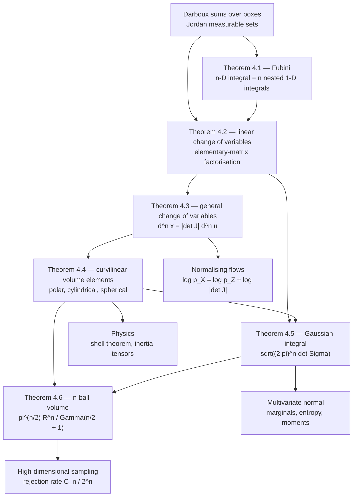

# Module 13 — Multiple Integrals and Coordinate Transformations

Single-variable integration has the fundamental theorem of calculus to fall back on. In
$\mathbb{R}^n$ there is no such shortcut: an integral over a solid region is a limit of Darboux
sums over a partition into boxes, and nothing in that definition tells you how to evaluate it.
Two theorems make the definition usable. Fubini's theorem replaces one $n$-dimensional integral
by $n$ nested one-dimensional integrals, each attackable with single-variable technique. The
change-of-variables theorem replaces an awkward region by a parameter box, at the price of one
scalar factor per point — the absolute Jacobian determinant.

That scalar is the whole content of the module. A $C^1$ map deforms an infinitesimal cube into an
infinitesimal parallelotope, and $\lvert\det J_{\mathbf{T}}(\mathbf{u})\rvert$ is the ratio of their
volumes. Everything else follows: $dA = r\,dr\,d\theta$ in polar coordinates, $dV = \rho^2\sin\varphi\,d\rho\,d\varphi\,d\theta$
in spherical coordinates, the normalising constant $\sqrt{(2\pi)^n\det\Sigma}$ of the multivariate
normal, and the volume $\pi^{n/2}R^n/\Gamma(n/2+1)$ of the Euclidean $n$-ball.

The hypotheses are load-bearing, not decoration. Drop absolute integrability and the two iterated
integrals of $(x^2-y^2)/(x^2+y^2)^2$ over $(0,1]^2$ come out as $+\pi/4$ and $-\pi/4$. Drop
injectivity and a change of variables counts part of the target region twice.

The payoff outside pure calculus is immediate. A normalising flow is a change of variables with a
learned diffeomorphism, and its training objective *is* $\log\lvert\det J\rvert$; RealNVP's coupling
layers are triangular precisely so that this determinant costs $O(n)$ instead of $O(n^3)$.
Gaussian likelihoods, differential entropies, moments of inertia and Newton's shell theorem are all
the same determinant showing up in different clothes.

> [!NOTE]
> **The change-of-variables formula.** If $\mathbf{T} : U \to V$ is a $C^1$-diffeomorphism between
> open sets in $\mathbb{R}^n$ and $f$ is continuous with $\int_V \lvert f \rvert \lt \infty$, then
> $\int_V f(\mathbf{x})\,d^n\mathbf{x} = \int_U f(\mathbf{T}(\mathbf{u}))\,\lvert\det J_{\mathbf{T}}(\mathbf{u})\rvert\,d^n\mathbf{u}$.
> The map enters the integral only through the scalar $\lvert\det J_{\mathbf{T}}\rvert$, the local
> volume-distortion factor.

## Prerequisites

| Prerequisite | Why it is needed |
|---|---|
| [calculus/06 — Integral Applications](../06_integral_applications_geometry_physics/) | Building a differential element for area, volume, mass and centre of mass. |
| [calculus/12 — Hessian, Jacobian, Curvature](../12_hessian_jacobian_curvature/) | The Jacobian matrix as the local linearisation of a map. |
| [linear_algebra/05 — Determinants and Trace](../../linear_algebra/05_determinants_trace_and_matrix_polynomials/) | The determinant as a signed volume factor, and its multiplicativity. |

**Downstream — what this module unlocks**

| Next module | What it uses from here |
|---|---|
| [calculus/14 — Vector Calculus and Field Theorems](../14_vector_calculus_field_theorems/) | Multiple integrals as the right-hand sides of Green, Stokes and the divergence theorem. |
| [probability_statistics/07 — Joint Distributions and the Multivariate Normal](../../probability_statistics/07_joint_distributions_and_multivariate_normal/) | Marginalisation as iterated integration, and the Gaussian normalising constant. |

## Learning outcomes

- State Fubini's theorem for continuous integrands on a product of closed boxes with its
  hypotheses, and exhibit the standard counterexample when absolute integrability fails.
- Prove the linear change-of-variables theorem by factoring an invertible matrix into elementary
  matrices, and explain how the general $C^1$ statement is assembled from it.
- Compute the Jacobian determinant of the polar, cylindrical and spherical maps and state the
  parameter ranges on which each is a diffeomorphism.
- Choose the coordinate system in which a region's boundaries become constant coordinate surfaces,
  and set up the resulting iterated integral.
- Evaluate the $n$-dimensional Gaussian integral $\int e^{-\frac12\mathbf{x}^{\mathsf T}\Sigma^{-1}\mathbf{x}}\,d^n\mathbf{x}$
  by orthogonal diagonalisation.
- Derive $\operatorname{vol}(B_n(R)) = \pi^{n/2}R^n/\Gamma(n/2+1)$ and read off the curse of
  dimensionality for rejection sampling.
- Connect $\log\lvert\det J\rvert$ to the exact log-likelihood of a normalising flow, and explain why
  triangular Jacobians are the design choice.

## Concept map

## Notation

| Symbol | Meaning | Convention here |
|---|---|---|
| $\Omega$, $Q$ | integration region; a closed box $\prod_i [a_i,b_i]$ | $Q$ always denotes a box |
| $d^n\mathbf{x}$ | Lebesgue/Jordan volume element in $\mathbb{R}^n$ | written $dA$ in $\mathbb{R}^2$, $dV$ in $\mathbb{R}^3$ |
| $J_{\mathbf{T}}(\mathbf{u})$ | Jacobian matrix of $\mathbf{T}$ at $\mathbf{u}$ | entries $\partial x_i / \partial u_j$; an $n \times n$ matrix |
| $\det J_{\mathbf{T}}$ | Jacobian determinant | the scalar; only $\lvert\det J_{\mathbf{T}}\rvert$ enters an integral |
| $\operatorname{tr}$, $\det$ | trace, determinant | `\operatorname{...}`, never `\text{...}` |
| $(r,\theta)$, $(r,\theta,z)$ | polar and cylindrical coordinates | $r \gt 0$, $\theta \in (0,2\pi)$ |
| $(\rho,\varphi,\theta)$ | spherical coordinates | $\rho \gt 0$, $\varphi \in (0,\pi)$ colatitude, $\theta \in (0,2\pi)$ azimuth |
| $B_n(R)$, $C_n$ | Euclidean ball of radius $R$; $\operatorname{vol}(B_n(1))$ | $\lVert \cdot \rVert$ is always $\lVert \cdot \rVert_2$ |
| $\Sigma$, $\Lambda = \Sigma^{-1}$ | covariance, precision matrix | symmetric positive definite |
| $\Gamma(z)$ | Gamma function | $\Gamma(z+1) = z\Gamma(z)$, $\Gamma(1/2) = \sqrt{\pi}$ |

## Core results

| Result | Statement | Hypotheses that cannot be dropped |
|---|---|---|
| Theorem 4.1 (Fubini) | $\int_{A \times B} f = \int_A\!\left(\int_B f\right) = \int_B\!\left(\int_A f\right)$ | $A,B$ closed boxes; $f$ continuous on $A \times B$ |
| Theorem 4.2 (linear change of variables) | $\int_{\mathbb{R}^n} f = \lvert\det A\rvert \int_{\mathbb{R}^n} f \circ A$ | $A$ invertible; $f$ continuous with compact support |
| Theorem 4.3 (general change of variables) | $\int_V f = \int_U (f \circ \mathbf{T})\,\lvert\det J_{\mathbf{T}}\rvert$ | $\mathbf{T}$ a $C^1$-diffeomorphism; $\int_V \lvert f \rvert \lt \infty$ |
| Theorem 4.4 (volume elements) | $dA = r\,dr\,d\theta$; $dV = r\,dr\,d\theta\,dz$; $dV = \rho^2\sin\varphi\,d\rho\,d\varphi\,d\theta$ | the **open** parameter ranges, where $\det J \ne 0$ and $\mathbf{T}$ is injective |
| Theorem 4.5 (Gaussian integral) | $\int_{\mathbb{R}^n} e^{-\frac12 \mathbf{x}^{\mathsf T}\Sigma^{-1}\mathbf{x}}\,d^n\mathbf{x} = \sqrt{(2\pi)^n\det\Sigma}$ | $\Sigma$ symmetric positive definite |
| Theorem 4.6 ($n$-ball volume) | $\operatorname{vol}(B_n(R)) = \pi^{n/2}R^n/\Gamma(n/2+1)$ | the Euclidean norm; $\lVert\cdot\rVert_1$ gives $2^n/n!$ instead |

## Common misconceptions

| Misconception | Reality | Remedy |
|---|---|---|
| The area element in polar coordinates is $dr\,d\theta$ | It is $r\,dr\,d\theta$ | An infinitesimal polar cell has sides $dr$ and $r\,d\theta$; equivalently $\det J_{\text{polar}} = r$ (Proof 5.4). |
| Fubini's theorem always lets you swap the order | Iterated integrals can differ when $\iint \lvert f \rvert = \infty$ | Check absolute integrability first, or nonnegativity via Tonelli. Section 7 computes $+\pi/4$ and $-\pi/4$ for the same $f$. |
| The signed determinant belongs in the integral | Only $\lvert\det J_{\mathbf{T}}\rvert$ does | A reflection has $\det J \lt 0$ but does not produce negative volume; see Theorem 4.3. |
| The spherical colatitude runs to $2\pi$ | $\varphi$ runs from $0$ to $\pi$; only the azimuth $\theta$ runs to $2\pi$ | Taking $\varphi$ to $2\pi$ double-covers the sphere and doubles every answer. |
| Swapping the order leaves the limits alone | Only on a product region | On $\{0 \le y \le 1,\ y \le x \le 1\}$ the reversed description is $\{0 \le x \le 1,\ 0 \le y \le x\}$; sketch the region every time. |
| The unit ball's volume grows with $n$ | $\operatorname{vol}(B_n(1))$ peaks at $n=5$ and tends to $0$ | $\Gamma(n/2+1)$ beats $\pi^{n/2}$; this is exactly why rejection sampling dies in high dimension (Proof 5.6). |
| A change of variables must be injective everywhere | It may fail on a set of Jordan content zero | Discarding $r = 0$, $\varphi \in \{0,\pi\}$ and the seam $\theta = 0$ changes no integral. |

## Contents

| File | What it holds |
|---|---|
| [`first_principles.ipynb`](first_principles.ipynb) | Definitions 3.1–3.4, Theorems 4.1–4.6, Proofs 5.1–5.6, Examples 6.1–6.5, eight code cells and three figures. |
| [`exercises.ipynb`](exercises.ipynb) | 40 fully solved problems across the four tiers below. |

## Exercise index

| Tier | Count | Focus |
|---|---|---|
| L0 — Concept Checks | 8 | One-line checks: the polar area element, Fubini's hypotheses, matrix versus determinant Jacobian, centroid versus centre of mass. |
| L1 — Foundations | 11 | Order reversal, polar/cylindrical/spherical evaluation, surface area, linear maps on ellipses, centres of mass and moments of inertia. |
| L2 — Applications (AI/ML and Physics) | 11 | Normalising flows and Neural ODEs, Gaussian marginals and entropy, Newton's shell theorem, charged-disk potential, inertia tensors, Monte Carlo in high dimension. |
| L3 — Challenge Proofs | 10 | Non-linear substitutions, $\zeta(2)$ from the unit square, simplex and $n$-ball volume, the Fubini counterexample, rotation tricks, the metric-tensor area element. |

**Total: 40 problems.**

## References

| Topic | Reference | Precise location |
|---|---|---|
| Fubini's theorem, continuous case | Spivak, *Calculus on Manifolds* | Theorem 3-10, pp. 58–59 |
| Fubini, Riemann and Lebesgue versions | Apostol, *Mathematical Analysis*, 2nd ed. | Theorem 14.6; §15.7 |
| Linear change of variables via elementary matrices | Rudin, *Principles of Mathematical Analysis*, 3rd ed. | Theorem 10.9, Step 1, p. 252 |
| General change of variables | Rudin, *Principles of Mathematical Analysis*, 3rd ed. | Theorem 10.9, pp. 252–253 |
| Change of variables by partition of unity | Spivak, *Calculus on Manifolds* | Theorem 3-13, pp. 67–72 |
| Polar, cylindrical, spherical elements | Marsden & Tromba, *Vector Calculus*, 6th ed. | §6.2–6.3 |
| Multiple integrals, $n$-ball volume | Apostol, *Calculus, Vol. II*, 2nd ed. | Ch. 11, §11.28 |
| Gaussian normalising constant | Bishop, *Pattern Recognition and Machine Learning* | §2.3, Eq. (2.43) |
| Spectral theorem for real symmetric matrices | Horn & Johnson, *Matrix Analysis*, 2nd ed. | Theorem 4.1.5 |
| Differential entropy of a Gaussian | Cover & Thomas, *Elements of Information Theory*, 2nd ed. | Theorem 8.4.1 |
| Curse of dimensionality, Monte Carlo rate | Heath, *Scientific Computing*, 2nd ed. | §8.4 |
| Normalising flows, triangular Jacobians | Dinh, Sohl-Dickstein & Bengio, *Density Estimation Using Real NVP* | ICLR 2017, §3.2 |
| Instantaneous change of variables | Chen, Rubanova, Bettencourt & Duvenaud, *Neural Ordinary Differential Equations* | NeurIPS 2018, Theorem 1 |
