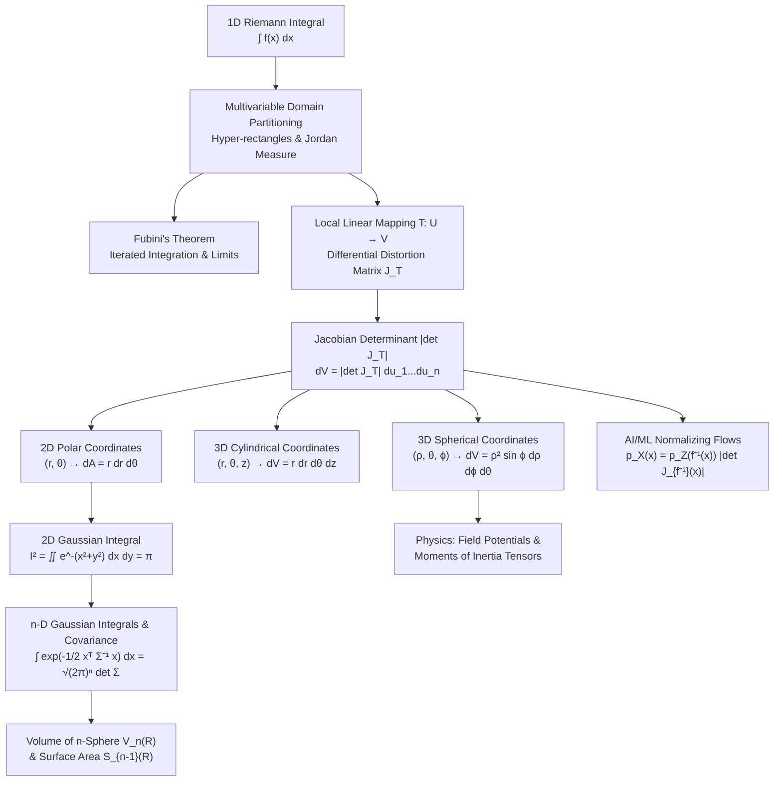

# Topic 13: Multiple Integrals & Coordinate Transformations — Calculus Mastery Module

## Executive Summary & Learning Objectives

Multiple integration extends single-variable calculus to functions of several variables over multi-dimensional domains $\Omega \subseteq \mathbb{R}^n$. While single-variable integration measures areas under curves, multivariable integration measures volumes, hyper-volumes, total masses of non-homogeneous media, continuous probabilities, and energy expectations across complex geometric spaces.

The central challenge in multivariable integration is handling complex domain geometries and high dimensions. This module establishes a unified first-principles framework for:
1. **Darboux & Riemann Integration in $\mathbb{R}^n$**: Partitioning hyper-rectangles, upper and lower sums, and defining Jordan measure.
2. **Iterated Integration & Fubini’s Theorem**: Conditions under which $n$-dimensional integrals reduce to sequential 1D integrals, including counterexamples when hypotheses fail.
3. **Change of Variables & The Jacobian Determinant**: Understanding coordinate transformations as local linear mappings, where the absolute value of the Jacobian determinant $\lvert\det J_{\mathbf{T}}(\mathbf{u})\rvert$ acts as the local differential volume distortion factor.
4. **Curvilinear Coordinate Systems**: Master-level proficiency in 2D Polar $(r, \theta)$, 3D Cylindrical $(r, \theta, z)$, 3D Spherical $(\rho, \theta, \phi)$, and generalized ellipsoidal/parabolic coordinates.
5. **High-Dimensional Integration**: Calculating 2D and $n$-dimensional Gaussian integrals, deriving the volume $V_n(R)$ and surface area $S_{n-1}(R)$ of the $n$-sphere via Gamma function identities.
6. **Modern Applications in Physics & AI/ML**: Computing physical field potentials, rigid-body moments of inertia, and connecting Jacobian determinants directly to Normalizing Flows (RealNVP), continuous normalizing flows (Neural ODEs), and variational inference in Machine Learning.

---

## First-Principles Concept Map

---

## Common Misconceptions Table

| Misconception | Mathematical Reality | Correct Viewpoint & Remedy |
| :--- | :--- | :--- |
| **Forgetting the Jacobian factor** ($dA = dr d\theta$) | Area element in polar is $dA = r\,dr\,d\theta$, not $dr\,d\theta$. | Coordinate transformation scales local volume. Infinitesimal polar rectangle has sides $dr$ and $r\,d\theta$, yielding area $r\,dr\,d\theta$. |
| **Fubini's Theorem always holds** | Iterated integrals $\iint f(x,y) \, dx \, dy$ and $\iint f(x,y) \, dy \, dx$ can differ if $f$ is not absolutely integrable. | Fubini requires $\iint \lvert f(x,y) \rvert dA \lt \infty$ or continuity on bounded domains. Always check Tonelli's theorem first for nonnegative functions. |
| **Jacobian sign error** | Determinants can be negative when orientation changes (e.g. reflection). | The change of variables formula requires the **absolute value** of the Jacobian determinant: $d^n\mathbf{x} = \left\vert\det J_{\mathbf{T}}(\mathbf{u})\right\vert d^n\mathbf{u}$. |
| **Confusing Spherical Angle Limits** | Integrating polar angle $\phi$ from $0$ to $2\pi$. | $\phi$ (zenith/colatitude) ranges from $0$ to $\pi$ (north to south pole), whereas $\theta$ (azimuth) ranges from $0$ to $2\pi$. Integrating $\phi$ to $2\pi$ double-covers the sphere. |
| **Swapping limits without domain sketching** | Replacing $\int_0^1 \int_y^1 f(x,y) dx dy$ with $\int_0^1 \int_y^1 f(x,y) dy dx$. | Limits of inner integral depend on outer variable. Swapping order requires sketching the 2D region $D = \{(x,y): 0 \le y \le 1, y \le x \le 1\}$ and expressing it as $0 \le x \le 1, 0 \le y \le x$. |
| **Treating $n$-sphere volume as $V_3(R)$ scaled** | Assuming volume of $n$-sphere grows exponentially with dimension $n$. | As $n \to \infty$, the volume $V_n(R)$ of a fixed radius $R$ sphere actually approaches $0$ due to the rapid growth of the $\Gamma(n/2+1)$ factor in the denominator! |

---

## Directory Inventory

- `README.md`: Module overview, learning objectives, concept map, misconception table, and literature references.
- `first_principles.md`: First-principles theory, rigorous definitions, theorem statements, detailed proofs (Jacobians, Fubini, Gaussian integrals, $n$-sphere volume), computational insights, and AI/ML connections.
- `exercises.md`: Comprehensive 4-level exercise package containing **40 fully solved problems** (Level 0 Concept Checks, Level 1 Foundations, Level 2 Physics & AI/ML Applications, Level 3 Olympiad/Putnam/Tripos Challenges) with explicit citations, KaTeX derivations, boxed answers, and takeaways.

---

## Recommended References

1. **Marsden, J. E., & Tromba, A.** — *Vector Calculus* (6th Edition, W. H. Freeman).
   - *Key Chapters*: Chapter 5 (Double and Triple Integrals), Chapter 6 (The Change of Variables Formula and Applications).
2. **Apostol, T. M.** — *Calculus, Volume II: Multi-Variable Calculus and Linear Algebra with Applications* (2nd Edition, Wiley).
   - *Key Chapters*: Chapter 11 (Multiple Integrals), Chapter 12 (Line Integrals & Change of Variables).
3. **Spivak, M.** — *Calculus on Manifolds* (W. A. Benjamin / Westview Press).
   - *Key Chapters*: Chapter 3 (Integration, Fubini's Theorem, Partition of Unity, Change of Variables).
4. **Stewart, J.** — *Multivariable Calculus* (8th Edition, Cengage Learning).
   - *Key Chapters*: Chapter 15 (Multiple Integrals).
5. **Demidovich, B. P.** — *Problems in Mathematical Analysis* (MIR Publishers / Moscow).
   - *Key Sections*: Multiple Integrals, Polar/Cylindrical/Spherical substitutions (Problems 3871–4150).
6. **Polya, G., & Szego, G.** — *Problems and Theorems in Analysis I & II* (Springer Classics in Mathematics).
   - *Key Sections*: Integrals in higher dimensions, symmetry principles, Dirichlet integrals.
7. **Putnam Mathematical Competition Archives** (Mathematical Association of America).
   - Selected multivariable integration problems (e.g., 1988 B1, 1989 A2, 1990 A1, 2005 B2).
8. **MIT Integration Bee Archives & MIT OCW 18.02 / 18.100C**.
   - Definite double integrals, order swapping tricks, improper multidimensional integrals.
