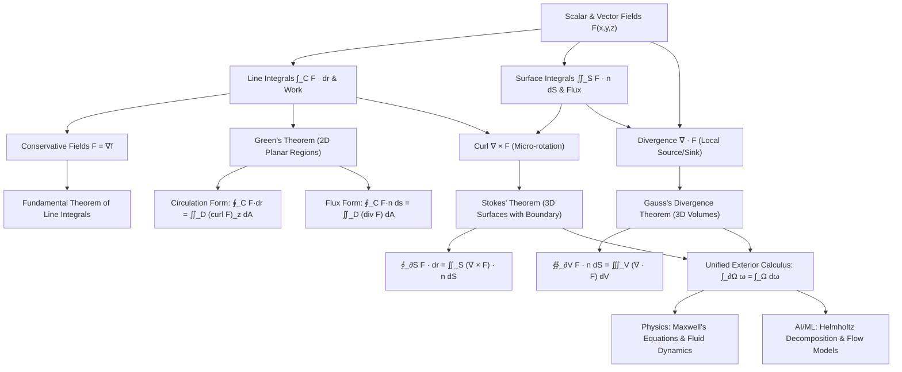

# Topic 14: Vector Calculus & Field Theorems — Calculus Mastery Module

**Status:** Active  
**Level:** Advanced Foundation (Part XIV of Calculus & Analysis Series)  
**Target Audience:** Mathematical Modelers, Theoretical Physicists, Machine Learning Researchers, Numerical Engineers  

---

## 📌 Executive Summary

Vector calculus is the natural mathematical language of spatially distributed vector fields, continuous media, force fields, fluid dynamics, electromagnetism, and high-dimensional optimization landscapes. While single-variable calculus handles scalar dynamics along a line and multivariable calculus describes local rates of change via partial derivatives and gradients, **vector calculus** synthesizes geometry, differential topology, and field theory to measure global accumulations (line and surface integrals) and local field behaviors (curl and divergence).

At the heart of vector calculus lie the three monumental **Field Theorems**:
1. **Green's Theorem**: Equating 2D planar circulation and flux to double integrals of scalar differential operators.
2. **Stokes' Theorem**: Mapping the circulation of a 3D vector field around a closed boundary curve to the surface integral of its curl.
3. **Gauss's Divergence Theorem**: Relating the net outward flux across a closed 2D surface (or $(n-1)$-dimensional manifold) to the volume integral of its divergence.

These theorems represent specific manifestations of a single, unified mathematical truth: the **Generalized Stokes' Theorem** for differential forms ($\int_{\partial \Omega} \omega = \int_{\Omega} \mathrm{d}\omega$).

In modern Artificial Intelligence and Machine Learning, vector calculus forms the bedrock of continuous-time optimization, non-conservative vector field dynamics (such as Generative Adversarial Network training and multi-agent game equilibria), neural ordinary differential equations (Neural ODEs), continuous normalizing flows (CNFs) via the continuity equation, and physical inductive biases embedded in Physics-Informed Neural Networks (PINNs).

This module provides a rigorous, first-principles theoretical exposition alongside a **40-Problem 4-Level Mastery Exercise Package** complete with step-by-step solutions, source attributions, boxed answers, and practical insights.

---

## 🎯 Learning Objectives

Upon completing this module, you will be able to:

1. **Formulate & Interpret Vector Fields**: Master the geometric and analytical representation of vector fields $\mathbf{F}: \mathbb{R}^n \to \mathbb{R}^n$, distinguishing source/sink structures, rotational flows, and conservative force fields.
2. **Evaluate Line Integrals**: Rigorously compute line integrals of scalar functions $\int_C f\,\mathrm{d}s$ and vector fields $\int_C \mathbf{F} \cdot \mathrm{d}\mathbf{r}$, establishing their physical meanings as arc length/mass and mechanical work/circulation.
3. **Analyze Conservative Fields & Potentials**: Prove path independence equivalence theorems, construct scalar potentials $f$ for conservative fields ($\mathbf{F} = \nabla f$), and utilize exact differential form criteria ($\nabla \times \mathbf{F} = \mathbf{0}$ on simply connected domains).
4. **Deploy Green's Theorem**: Apply Green's Theorem in both circulation-curl ($\oint_C P\,\mathrm{d}x + Q\,\mathrm{d}y = \iint_D \left(\frac{\partial Q}{\partial x} - \frac{\partial P}{\partial y}\right)\mathrm{d}A$) and flux-divergence forms to evaluate line integrals and planimeter surface areas.
5. **Compute Surface Integrals & Flux**: Parameterize 2D surfaces in $\mathbb{R}^3$, construct orientation unit normals $\mathbf{n}$, and evaluate scalar surface integrals $\iint_S f\,\mathrm{d}S$ and vector flux integrals $\iint_S \mathbf{F} \cdot \mathbf{n}\,\mathrm{d}S$.
6. **Understand Differential Operators (Grad, Div, Curl)**: Derive coordinate and coordinate-free limit definitions of $\nabla f$, $\nabla \cdot \mathbf{F}$, and $\nabla \times \mathbf{F}$, establishing their physical interpretations as local expansion rates and micro-rotation densities.
7. **Master Stokes' & Gauss's Theorems**: Apply Stokes' Theorem to convert circulation integrals into surface flux integrals and Gauss's Divergence Theorem to convert closed surface flux into 3D volume integrals, handling complex geometries and non-simply connected regions.
8. **Bridge Classical Physics & Modern AI**: Connect vector field theorems to Maxwell's equations, fluid dynamics (incompressibility, continuity equation), Helmholtz-Hodge decomposition, and optimizer flow fields in Machine Learning.

---

## 🗺️ First-Principles Concept Map



---

## ⚠️ Common Misconceptions Table

| Misconception | Incorrect Assumption | Core Reality & Mathematical Correction |
|---|---|---|
| **Irrotational $\implies$ Conservative** | If $\nabla \times \mathbf{F} = \mathbf{0}$, then $\mathbf{F}$ is automatically conservative and has a global potential. | $\nabla \times \mathbf{F} = \mathbf{0}$ implies conservative **if and only if** the domain is **simply connected**. For example, the vortex field $\mathbf{F} = \frac{-y \mathbf{i} + x \mathbf{j}}{x^2 + y^2}$ has $\nabla \times \mathbf{F} = \mathbf{0}$ on $\mathbb{R}^2 \setminus \{(0,0)\}$, but $\oint_{C} \mathbf{F} \cdot \mathrm{d}\mathbf{r} = 2\pi \neq 0$. |
| **Surface Orientation Independence** | The sign of a flux integral $\iint_S \mathbf{F} \cdot \mathbf{n}\,\mathrm{d}S$ is invariant to the choice of normal $\mathbf{n}$. | Flux depends strictly on orientation. Reversing $\mathbf{n} \to -\mathbf{n}$ flips the sign of the flux. Surfaces must be orientable (e.g., Mobius strip is non-orientable and cannot support standard flux integrals). |
| **Boundary Curve Orientation in Stokes'** | Any direction around $\partial S$ can be chosen when applying Stokes' Theorem. | $\partial S$ must be oriented using the **Right-Hand Rule**: if your thumb points along the unit normal $\mathbf{n}$, your fingers curl in the positive direction of $\partial S$. |
| **Divergence vs. Gradient** | Divergence $\nabla \cdot \mathbf{F}$ produces a vector field. | Divergence is a inner product of the operator $\nabla$ with vector field $\mathbf{F}$, yielding a **scalar field** representing net local volumetric flux. |
| **Stokes' Theorem Applicability to Closed Surfaces** | Stokes' theorem computes flux through closed surfaces like a sphere. | For a closed surface $S$, the boundary $\partial S = \emptyset$. Thus $\iint_S (\nabla \times \mathbf{F}) \cdot \mathbf{n}\,\mathrm{d}S = \oint_{\emptyset} \mathbf{F} \cdot \mathrm{d}\mathbf{r} = 0$. Gauss's Divergence Theorem, not Stokes', applies to enclosed volumes! |
| **Gradient Fields in Machine Learning** | All optimization vector fields $\mathbf{V}(\theta)$ in AI are conservative. | Standard loss gradient fields $\mathbf{V}(\theta) = -\nabla_\theta L(\theta)$ are conservative. However, multi-agent training (GANs, reinforcement learning games) generates non-conservative velocity fields with $\nabla \times \mathbf{V} \neq \mathbf{0}$, causing rotational/oscillatory dynamics. |

---

## 📂 Directory Inventory

```text
foundations/calculus/14_vector_calculus_field_theorems/
├── README.md         <-- Overview, Concept Map, Misconceptions & References (This File)
├── first_principles.md     <-- Complete First-Principles Theory, Proofs, Physics & AI Applications
└── exercises.md      <-- 40-Problem 4-Level Exercise Package (L0–L3) + Full Solutions
```

---

## 📖 Recommended References

1. **Marsden, J. E., & Tromba, A.** *Vector Calculus* (6th Edition), W. H. Freeman.  
   *(The definitive standard for physical intuition, surface parameterizations, and geometric proofs of field theorems).*
2. **Apostol, T. M.** *Calculus, Volume II* (2nd Edition), John Wiley & Sons.  
   *(Provides rigorous real analysis treatment of line integrals, differential forms, and multivariable field calculus).*
3. **Spivak, M.** *Calculus on Manifolds: A Modern Approach to Classical Theorems of Advanced Calculus*, HarperCollins.  
   *(Essential for understanding the generalized Stokes' theorem $\int_{\partial \Omega} \omega = \int_\Omega \mathrm{d}\omega$ via exterior algebra).*
4. **Stewart, J.** *Multivariable Calculus* (8th Edition), Cengage Learning.  
   *(Excellent for foundational computational practice, coordinate parameterizations, and geometric visualizations).*
5. **Demidovich, B. P.** *Problems in Mathematical Analysis*, Mir Publishers.  
   *(Classic problem book featuring challenging computational and structural multivariable line and surface integrals).*
6. **MIT OpenCourseWare:** *18.02 Multivariable Calculus* (Prof. Denis Auroux).  
   *(Outstanding video lecture series covering Stokes', Divergence, and Green's theorems with physical applications).*
7. **Feynman, R. P., Leighton, R. B., & Sands, M.** *The Feynman Lectures on Physics, Vol. II: Electromagnetism and Matter*, Caltech.  
   *(Unrivaled physical insight into curl, divergence, Gauss's law, and vector potentials).*
8. **Pólya, G., & Szegő, G.** *Problems and Theorems in Analysis*, Springer.  
   *(Advanced integration techniques and analytical field properties).*
