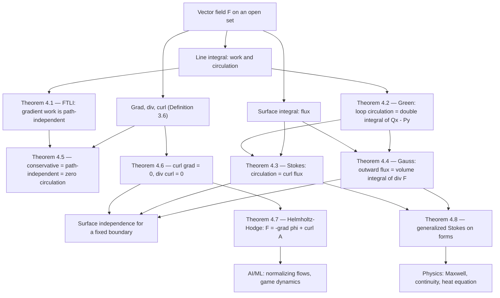

# Module 14 — Vector Calculus and Field Theorems

Single-variable calculus relates a function to its derivative through one theorem: the
Fundamental Theorem of Calculus, which trades an integral over an interval for the values of an
antiderivative at the two endpoints. Vector calculus is the statement that this trade survives in
higher dimensions, in every dimension at once, and that the "endpoints" become the *boundary* of a
curve, a surface, or a solid.

Three classical theorems make the trade explicit. **Green's Theorem** turns a circulation around a
planar loop into a double integral of $Q_x - P_y$ over the region it encloses. **Stokes' Theorem**
turns the circulation around a closed space curve into the flux of $\nabla \times \mathbf{F}$
through any surface spanning it. **Gauss's Divergence Theorem** turns the outward flux through a
closed surface into the volume integral of $\nabla \cdot \mathbf{F}$. All three are the same
sentence — *the integral of a derivative over a region equals the integral of the thing itself over
that region's boundary* — written in the dimension at hand.

The hypotheses are not decoration. Delete one interior point where $\mathbf{F}$ fails to be $C^1$
and Green's conclusion moves from $0$ to $2\pi$; drop simple connectivity and an irrotational field
stops having a global potential; reverse an orientation and every sign flips. This module treats
those hypotheses as the content, proves the three theorems from Fubini and the one-dimensional FTC
alone, and checks each conclusion numerically.

The payoff outside mathematics is immediate. Maxwell's equations are Stokes and Gauss applied to
$\mathbf{E}$ and $\mathbf{B}$; the continuity equation is Gauss applied to a density; the
instantaneous change-of-variables formula behind continuous normalizing flows is
$\frac{\mathrm{d}}{\mathrm{d}t}\log p_t = -\nabla \cdot \mathbf{f}$; and the rotational instability
of GAN training is exactly the statement that a game's update field has non-zero curl.

> [!NOTE]
> Every theorem in this module is one identity in three costumes:
> $\int_{\partial \Omega} \omega = \int_{\Omega} \mathrm{d}\omega$. Green, Stokes and Gauss are
> the cases $\dim \Omega = 2, 2, 3$. What the boundary $\partial\Omega$ sees is all that a
> derivative's integral can tell you — which is why two surfaces sharing a boundary curve always
> carry the same curl flux, and why a divergence-free field's flux depends only on the loop.

## Prerequisites

- [calculus/11 — Gradients and Directional Derivatives](../11_gradients_directional_derivatives/) — the gradient as steepest ascent and as a normal to a level set.
- [calculus/13 — Multiple Integrals and Coordinate Transforms](../13_multiple_integrals_coordinate_transforms/) — iterated integrals, Fubini, and the Jacobian factor.

**Downstream.** This module unlocks
[differential_equations/07 — Boundary Value Problems and PDE Preview](../../differential_equations/07_boundary_value_problems_and_pde_preview/),
where the divergence theorem supplies Green's identities and the uniqueness argument for the
Dirichlet problem.

## Learning outcomes

- Evaluate scalar line integrals $\int_C f\,\mathrm{d}s$, work integrals $\int_C \mathbf{F} \cdot \mathrm{d}\mathbf{r}$, scalar surface integrals and flux integrals from an explicit parameterisation.
- State Green's, Stokes' and Gauss's theorems with every hypothesis, and say what each hypothesis buys.
- Prove all three from Fubini and the one-dimensional Fundamental Theorem of Calculus.
- Decide whether a field is conservative, build its potential, and explain why $\nabla \times \mathbf{F} = \mathbf{0}$ is not enough on a punctured domain.
- Use the second-derivative identities $\nabla \times \nabla f = \mathbf{0}$ and $\nabla \cdot (\nabla \times \mathbf{F}) = 0$ to replace one surface by another.
- Split a field into gradient and rotational parts (Helmholtz–Hodge) and read the split as dissipation versus circulation.
- Derive Maxwell's differential equations, the continuity equation, and the continuous-normalizing-flow log-density ODE from the integral theorems.

## Concept map

## Notation

| Symbol | Meaning | Notes |
|---|---|---|
| $\mathbf{F}, \mathbf{G}$ | vector field $U \subseteq \mathbb{R}^n \to \mathbb{R}^n$ | bold upright; components $(P, Q, R)$ in $\mathbb{R}^3$ |
| $\mathbf{r}(t)$ | parameterisation of a curve $C$ | $\mathbf{r}'(t)$ is the velocity |
| $\mathrm{d}s$ | arc-length element, $\lVert \mathbf{r}'(t) \rVert\,\mathrm{d}t$ | unsigned; orientation-independent |
| $\mathrm{d}\mathbf{r}$ | oriented line element, $\mathbf{r}'(t)\,\mathrm{d}t$ | reverses sign with orientation |
| $\oint_C$ | integral over a closed curve | positively oriented unless stated |
| $\mathbf{n}$ | unit normal | outward for closed surfaces; right-hand rule against $\partial S$ |
| $\mathrm{d}S$ | surface-area element | $\lVert \mathbf{r}_u \times \mathbf{r}_v \rVert\,\mathrm{d}u\,\mathrm{d}v$ |
| $\nabla f$ | gradient of a scalar field | vector valued |
| $\nabla \cdot \mathbf{F}$ | divergence | scalar valued; local expansion rate |
| $\nabla \times \mathbf{F}$ | curl | vector valued; local circulation density |
| $\nabla^2 f$ | Laplacian $\nabla \cdot (\nabla f)$ | scalar valued |
| $\partial \Omega$ | boundary of $\Omega$ | with the induced orientation |
| $U$ simply connected | every loop in $U$ contracts to a point in $U$ | the hypothesis in Theorem 4.5 |

## Core results

| # | Result | Hypotheses that carry it |
|---|---|---|
| Theorem 4.1 | $\int_C \nabla f \cdot \mathrm{d}\mathbf{r} = f(B) - f(A)$ | $f \in C^1$ on open $U$; $C \subset U$ piecewise smooth |
| Theorem 4.2 | $\oint_{\partial D} P\,\mathrm{d}x + Q\,\mathrm{d}y = \iint_D (Q_x - P_y)\,\mathrm{d}A$ | $D$ Green-admissible, positively oriented; $P, Q \in C^1$ on a neighbourhood of $D$ |
| Theorem 4.3 | $\oint_{\partial S} \mathbf{F} \cdot \mathrm{d}\mathbf{r} = \iint_S (\nabla \times \mathbf{F}) \cdot \mathbf{n}\,\mathrm{d}S$ | $S$ oriented, piecewise smooth; $\partial S$ right-hand compatible; $\mathbf{F} \in C^1$ |
| Theorem 4.4 | $\oiint_{\partial V} \mathbf{F} \cdot \mathbf{n}\,\mathrm{d}S = \iiint_V (\nabla \cdot \mathbf{F})\,\mathrm{d}V$ | $V$ compact, Type I/II/III; outward $\mathbf{n}$; $\mathbf{F} \in C^1$ on a neighbourhood |
| Theorem 4.5 | conservative $\iff$ path-independent $\iff$ zero circulation; and $\nabla \times \mathbf{F} = \mathbf{0} \Rightarrow$ conservative | $U$ open and connected; the last implication needs $U$ **simply connected** |
| Theorem 4.6 | $\nabla \times (\nabla f) = \mathbf{0}$ and $\nabla \cdot (\nabla \times \mathbf{F}) = 0$ | $C^2$ data, so Clairaut applies |
| Theorem 4.7 | $\mathbf{F} = -\nabla \phi + \nabla \times \mathbf{A}$, uniquely, with $\nabla \cdot \mathbf{A} = 0$ | $C^2$ on $\mathbb{R}^3$ with decay faster than $\lVert \mathbf{r} \rVert^{-2}$ |
| Theorem 4.8 | $\int_{\partial \Omega} \omega = \int_{\Omega} \mathrm{d}\omega$ | compact oriented $k$-manifold with boundary; $\omega$ a $C^1$ $(k-1)$-form — cited, not proved here |

## Common misconceptions

| Misconception | What is actually true |
|---|---|
| $\nabla \times \mathbf{F} = \mathbf{0}$ implies $\mathbf{F}$ is conservative. | Only on a **simply connected** domain. On $\mathbb{R}^2 \setminus \{\mathbf{0}\}$ the vortex field $\mathbf{F} = (-y, x)/(x^2 + y^2)$ has vanishing curl yet circulation $2\pi$ around the unit circle. Section 7 of the theory notebook prints both numbers. |
| Flux does not depend on the choice of normal. | Reversing $\mathbf{n} \to -\mathbf{n}$ negates the flux. A non-orientable surface such as the Möbius band admits no global $\mathbf{n}$ at all, so its flux integral is undefined. |
| Any direction around $\partial S$ works in Stokes' Theorem. | The boundary must be right-hand compatible with $\mathbf{n}$: thumb along $\mathbf{n}$, fingers along $\partial S$. Reversing it flips the sign of one side only. |
| Divergence returns a vector field. | $\nabla \cdot \mathbf{F}$ is a **scalar** field — net outflow per unit volume. $\nabla \times \mathbf{F}$ is the vector-valued operator. |
| Stokes' Theorem computes the flux through a sphere. | A closed surface has $\partial S = \varnothing$, so Stokes gives $\iint_S (\nabla \times \mathbf{F}) \cdot \mathbf{n}\,\mathrm{d}S = 0$ — consistent with Theorem 4.6, and no substitute for Theorem 4.4. |
| Green's Theorem needs $P, Q$ to be $C^1$ only on the interior of $D$. | It needs $C^1$ on a neighbourhood of the closed region. The inner FTC step in Proof 5.2 is evaluated *at* the boundary graphs $g_1, g_2$. |
| Every optimisation field in ML is conservative. | $\mathbf{V}(\theta) = -\nabla_\theta L(\theta)$ is. A two-player game's update field need not be: for $L(x, y) = xy$ the field $(-y, x)$ has curl $2\mathbf{k}$, and trajectories orbit instead of converging. |

## Exercise index

[`exercises.ipynb`](exercises.ipynb) holds 40 fully solved problems.

| Tier | Count | Focus |
|---|---|---|
| L0 — Concept Checks | 8 | Orientation, sign conventions, the meaning of div and curl, the punctured-domain counterexample. |
| L1 — Foundations | 10 | Line, surface and flux integrals by parameterisation; Green, Stokes and Gauss computed both ways; the product rules for div and curl. |
| L2 — Applications (AI/ML and Physics) | 12 | Gauss's law, Faraday's law, stream functions, the vector potential, the heat equation, solid angle, normalizing flows, GAN update fields, PINN losses, Lorentz work, Kelvin circulation, Fokker–Planck steady states. |
| L3 — Challenge Proofs | 10 | Tripos surface integrals, pullback commutation, $n$-dimensional flux, winding-number monodromy, the electromagnetic wave equation, the Dirac monopole obstruction, Green's second identity, and a linear-game stability synthesis. |

## References

- Marsden, J. E., & Tromba, A. J. *Vector Calculus*, 6th ed., W. H. Freeman, 2012 — §7.2 (Green's Theorem, Thm. 1), §8.2 (Stokes' Theorem, Thm. 2), §8.4 (Divergence Theorem, Thm. 9).
- Apostol, T. M. *Calculus, Volume II*, 2nd ed., Wiley, 1969 — Ch. 10 (Thm. 10.3 is Theorem 4.1 here; Thms. 10.4–10.5 give Theorem 4.5), Ch. 12 (Thm. 12.10, the divergence theorem).
- Spivak, M. *Calculus on Manifolds*, Addison-Wesley, 1965 — Thm. 5-5 (pp. 124–125), the generalized Stokes' theorem; Ch. 4 for the exterior derivative.
- Hubbard, J. H., & Hubbard, B. B. *Vector Calculus, Linear Algebra, and Differential Forms*, 5th ed., Matrix Editions, 2015 — §6.9–§6.11 for the forms proof of Green, Stokes and Gauss.
- Griffiths, D. J. *Introduction to Electrodynamics*, 4th ed., Cambridge, 2017 — Appendix B (Helmholtz theorem), §7.3 (Maxwell's equations in both forms).
- Trefethen, L. N., & Weideman, J. A. C. "The exponentially convergent trapezoidal rule", *SIAM Review* **56**(3), 2014, pp. 385–458 — the periodic-integrand accuracy exploited by the loop quadratures.
- Chen, R. T. Q., Rubanova, Y., Bettencourt, J., & Duvenaud, D. "Neural Ordinary Differential Equations", *NeurIPS*, 2018 — Thm. 1, the instantaneous change-of-variables formula.
- Balduzzi, D., Racanière, S., Martens, J., Foerster, J., Tuyls, K., & Graepel, T. "The Mechanics of $n$-Player Differentiable Games", *ICML*, 2018 — the Hamiltonian/potential split of a game's update field.
