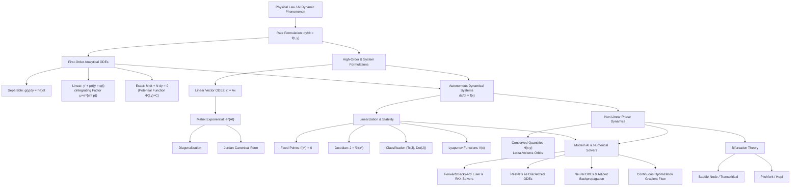

# Topic 15: Ordinary Differential Equations — Calculus Mastery Module

## Executive Summary & Learning Objectives

Ordinary Differential Equations (ODEs) form the mathematical foundation for describing dynamic systems across physics, engineering, quantitative biology, and artificial intelligence. While single-variable integral calculus calculates accumulated changes from known rate functions $f(x)$, differential equations invert this relationship: they determine state trajectories $y(t)$ when rates of change depend implicitly or explicitly on the state itself, its higher derivatives, and independent variables.

This module provides a rigorous, first-principles treatment of ODEs, spanning analytical solution techniques, linear vector spaces of differential operators, matrix exponentials $e^{At}$, non-linear phase plane dynamics, stability theory, and bifurcation behavior. Furthermore, it bridges classical differential equations to modern machine learning architectures, explicitly connecting continuous dynamical systems to **Neural ODEs**, **Residual Networks (ResNets)**, **Continuous-Time RNNs**, and **Optimization Gradient Flows**.

### Core Learning Objectives
1. **Analytical Mastery of First-Order Solvers**: Master exact solution techniques for first-order ODEs, including separation of variables, integrating factor methods for linear equations, and potential function derivations for exact equations.
2. **Structural Theory of Linear ODEs**: Derive the vector space structure of solution manifolds for $n$-th order linear homogeneous ODEs, prove Wronskian properties via Abel's identity, and apply Variation of Parameters for non-homogeneous systems.
3. **Linear Vector Systems & Matrix Exponentials**: Define the matrix exponential $e^{At}$ via operator series, establish its analytical properties, and compute it using matrix diagonalization, Jordan canonical forms, and the Cayley-Hamilton theorem.
4. **Phase Space Topology & Linear Stability**: Classify 2D autonomous system fixed points using the trace-determinant ($\tau, \Delta$) landscape of Jacobian matrices, construct phase portraits, and prove stability using Lyapunov direct methods.
5. **Non-Linear Dynamics & Bifurcations**: Analyze non-linear systems such as the Lotka-Volterra predator-prey model via first integrals/conserved quantities, and classify structural transitions under parameter changes (saddle-node, transcritical, pitchfork, and Hopf bifurcations).
6. **Continuous AI/ML Models & Numerical Solvers**: Formulate ResNets as forward Euler discretizations, analyze Neural ODEs and adjoint sensitivity backpropagation, and evaluate numerical integration schemes (Euler vs. RK4) by deriving their absolute stability regions.

---

## First-Principles Concept Map

---

## Common Misconceptions Table

| Misconception | First-Principles Reality | Mathematical Consequence |
| :--- | :--- | :--- |
| **"Every ODE has an explicit analytical solution in terms of elementary functions."** | Most non-linear ODEs cannot be solved in terms of elementary functions. Existence theorems (Picard-Lindelöf) guarantee local existence and uniqueness under Lipschitz conditions, but solutions must often be analyzed qualitatively or numerically. | Attempting integration by elementary techniques fails for systems like $\ddot{x} + \sin x = 0$ (pendulum) or $\dot{x} = x^2 + t$; analysis requires phase space methods or series. |
| **"The Wronskian $W(t) = 0$ at a single point implies linear dependence."** | $W(t) = 0$ at a single point implies linear dependence **only** if the functions are solutions to a homogeneous linear ODE with continuous coefficients on an interval. For arbitrary differentiable functions, $W(t) = 0$ everywhere does not guarantee linear dependence. | Functions like $y_1(t) = t^3$ and $y_2(t) = \lvert t \rvert^3$ on $[-1, 1]$ have $W(t) = 0$ for all $t$, yet are linearly independent. Abel's identity proves $W(t)$ is either everywhere zero or nowhere zero for linear ODE solutions. |
| **"The matrix exponential $e^{A+B}$ always equals $e^A e^B$."** | $e^{A+B} = e^A e^B$ holds **if and only if** the matrices commute, i.e., $AB = BA$. In general, non-commutative matrix algebra requires the Baker-Campbell-Hausdorff formula. | Blindly computing $e^{(A+B)t} = e^{At} e^{Bt}$ for non-commuting system matrices $A$ and $B$ produces incorrect trajectories and erroneous stability assessments. |
| **"Linearization near a fixed point always determines global non-linear stability."** | Linearization via the Jacobian matrix $J(\mathbf{x}^\ast)$ reveals local topological behavior **only** when eigenvalues have non-zero real parts (hyperbolic fixed points, Hartman-Grobman theorem). If $\text{Re}(\lambda) = 0$ (centers), non-linear higher-order terms dominate. | For non-linear centers ($\text{Tr}(J) = 0, \text{Det}(J) \gt 0$), linearization predicts neutral stability (centers), but non-linear terms may render the point a stable spiral or unstable spiral. |
| **"Euler's numerical method is sufficient for simulating stiff ODE systems."** | Stiff ODEs feature multi-scale dynamics (rapidly decaying transient modes alongside slow modes). Explicit schemes like Forward Euler require impractically small step sizes $h \lt 2/\lvert \lambda_{\max} \rvert$ to prevent numerical explosion. | Explicit Euler applied to stiff systems (e.g., chemical kinetics or neural network training with wide condition numbers) numerically oscillates and blows up unless implicit solvers (Backward Euler, TR-BDF2) are used. |
| **"Neural ODEs are just very deep Residual Networks."** | While ResNets approximate Forward Euler discretization with fixed step size $\Delta t = 1$, Neural ODEs parameterize the continuous derivative $\frac{dh(t)}{dt} = f(h(t), t, \theta)$, allowing adaptive ODE solvers, continuous memory footprints, and non-uniform sampling. | Treating Neural ODEs merely as discrete layers ignores continuous-time gradient computation via the Adjoint Sensitivity Method and continuous topology-preserving flows. |

---

## Directory Inventory

| File | Primary Description | Target Audience & Scope |
| :--- | :--- | :--- |
| [`README.md`](file:///home/hien/Study/AI/Mathematical Modeling/foundations/calculus/15_ordinary_differential_equations/README.md) | High-level module roadmap, learning objectives, concept map, misconception table, reference bibliography. | Overview & Orientation |
| [`first_principles.md`](file:///home/hien/Study/AI/Mathematical Modeling/foundations/calculus/15_ordinary_differential_equations/first_principles.md) | Exhaustive theoretical foundations, existence/uniqueness proofs, 1st/2nd order techniques, matrix exponentials $e^{At}$, phase plane dynamics, Lyapunov stability, Lotka-Volterra, bifurcations, RK4, and Neural ODE derivations. | First-Principles Core Theory |
| [`exercises.md`](file:///home/hien/Study/AI/Mathematical Modeling/foundations/calculus/15_ordinary_differential_equations/exercises.md) | 40 fully solved 4-level problems (L0 Concept Check, L1 Foundations, L2 Physics & AI/ML Applications, L3 Tripos/Putnam Olympiad Challenges) with full step-by-step KaTeX solutions, boxed results, and takeaways. | Mastery & Applied Practice |

---

## Recommended References

1. **Boyce, W. E., & DiPrima, R. C.** — *Elementary Differential Equations and Boundary Value Problems*. Wiley. *(The canonical standard for first-order techniques, second-order linear ODEs, series solutions, and introductory linear systems.)*
2. **Arnold, V. I.** — *Ordinary Differential Equations*. MIT Press / Springer. *(The definitive mathematical physicist's perspective: geometric phase flows, vector fields on manifolds, existence theorems, and classical mechanics linkages.)*
3. **Strogatz, S. H.** — *Nonlinear Dynamics and Chaos: With Applications to Physics, Biology, Chemistry, and Engineering*. Westview Press. *(Unmatched clarity for phase plane portraits, linear stability analysis, Lyapunov functions, Lotka-Volterra dynamics, and bifurcations.)*
4. **Spivak, M.** — *Calculus* (4th ed.) & *Calculus on Manifolds*. Publish or Perish. *(Rigorously treats initial value problems, Picard iteration, and differential forms.)*
5. **Apostol, T. M.** — *Calculus, Volume II: Multi-Variable Calculus and Linear Algebra with Applications*. Wiley. *(Masterful integration of linear algebra, matrix exponentials $e^{At}$, and linear systems of ODEs.)*
6. **Demidovich, B. P.** — *Problems in Mathematical Analysis*. Mir Publishers. *(Classic Russian problem collection featuring demanding computational differential equations.)*
7. **Polya, G., & Szego, G.** — *Problems and Theorems in Analysis*. Springer. *(Advanced analysis techniques applied to functional and differential equations.)*
8. **Putnam Mathematical Competition** — *William Lowell Putnam Mathematical Competition Problems and Solutions*. Mathematical Association of America. *(Olympiad-level contest problems exploring differential inequalities, Riccati equations, and non-linear dynamics.)*
9. **Cambridge Mathematical Tripos** — *Part IA and Part IB Examination Papers in Differential Equations and Dynamics*. Cambridge University. *(Deep structural problems combining mathematical mechanics, Sturm-Liouville theory, and phase plane topology.)*
10. **Chen, R. T. Q., Rubanova, Y., Bettencourt, J., & Duvenaud, D. K. (2018)** — *Neural Ordinary Differential Equations*. Advances in Neural Information Processing Systems (NeurIPS 2018). *(Foundational paper bridging continuous dynamical systems and deep learning.)*
