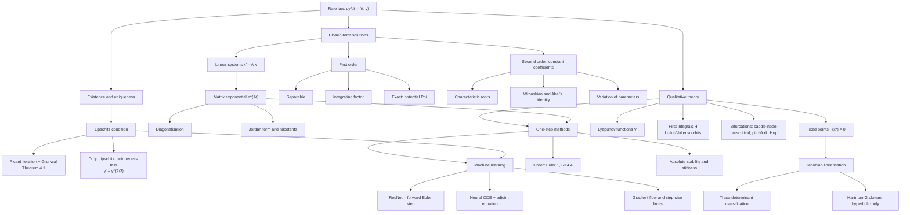

# Module 15 — Ordinary Differential Equations

Integral calculus solves $\dot y = g(t)$: the rate is a known function of the clock, and one integration finishes the job. Almost nothing in nature is of that form. A decaying isotope, a damped spring, a predator–prey pair and a residual network all obey a rate law in which the right-hand side depends on the *state*, not on the time. This module is about what changes when it does.

Three questions organise everything. **Does a trajectory exist, and is it unique?** The Picard–Lindelöf theorem answers both under a Lipschitz hypothesis, and its proof is constructive: the solution is the limit of an explicit sequence of integrals with a factorial error bound. **When can the trajectory be written down?** Separable, linear, exact and constant-coefficient equations can, and the matrix exponential $e^{At}$ handles every constant-coefficient linear system at once. **What can be said when it cannot?** Fixed points, linearisation, the trace–determinant classification, Lyapunov functions and conserved quantities describe flows that have no formula, and one-step numerical methods approximate them with a quantified order and a quantified stability limit.

The machine-learning payoff is direct rather than decorative. A residual block is one forward Euler step; a Neural ODE parameterises the vector field instead of the layers, which is well posed exactly because the field is Lipschitz; the adjoint sensitivity equation is a linear ODE run backwards in time; and gradient descent's step-size ceiling $\eta \lt 2/\lambda_{\max}$ is forward Euler's stability disc applied to the Hessian's spectrum.

> [!NOTE]
> **Picard–Lindelöf.** If $f$ is continuous on the box $\lvert t-t_0\rvert \le a$, $\lVert y-y_0\rVert \le b$ and Lipschitz in $y$ there with constant $L$, then with $M = \max\lVert f\rVert$ and $\alpha = \min(a, b/M)$ the initial value problem $y' = f(t,y)$, $y(t_0)=y_0$ has **exactly one** solution on $\lvert t-t_0\rvert \le \alpha$, and the Picard iterates converge to it at the rate $\frac{M}{L}\frac{(L\alpha)^{k+1}}{(k+1)!}e^{L\alpha}$. Drop the Lipschitz hypothesis and existence survives but uniqueness does not: $\dot y = y^{2/3}$, $y(0)=0$ is solved by both $y \equiv 0$ and $y = t^3/27$.

## Prerequisites

| Needed first | Why |
| :--- | :--- |
| [calculus/05 — Indefinite and definite integrals](../05_indefinite_and_definite_integrals/) | Every solution formula here is a quadrature, and the equivalence of the IVP with a Volterra integral equation is the fundamental theorem of calculus. |
| [calculus/09 — Taylor and power series](../09_taylor_and_power_series/) | The matrix exponential is a power series, and truncation-error orders come from Taylor remainders. |
| [linear_algebra/07 — Canonical forms and SVD](../../linear_algebra/07_canonical_forms_and_svd/) | Diagonalisation and Jordan form are how $e^{At}$ is computed and how defective systems produce $t^k e^{\lambda t}$. |

**Downstream.** [differential_equations/01 — Classification and first-order ODEs](../../differential_equations/01_classification_and_first_order_odes/) continues from here, and the whole `differential_equations` area builds on this module's existence theory, matrix exponential and phase-plane analysis.

## Learning outcomes

- State Picard–Lindelöf with its hypotheses, prove it from the contraction estimate on Picard iterates plus Grönwall's inequality, and say which conclusion each hypothesis buys.
- Solve first-order separable, linear and exact equations, and recognise Bernoulli and Riccati equations by the substitution that linearises them.
- Produce a basis of solutions for a constant-coefficient second-order equation in all three discriminant cases, and use Abel's identity to decide linear independence from a single point.
- Compute $e^{At}$ by diagonalisation, by Jordan decomposition and by Cayley–Hamilton, and use it to solve $\dot x = Ax$.
- Locate fixed points, linearise, and classify a planar system from $(\operatorname{tr}A, \det A)$; say why the classification transfers to the nonlinear system only at hyperbolic points.
- Prove stability with a Lyapunov function, and prove periodicity with a first integral where linearisation is inconclusive.
- Predict and then measure the order of forward Euler and RK4, and derive the stability region that makes explicit methods unusable on stiff problems.
- Read a residual network as a discretised flow, and derive the adjoint equation that gives Neural ODEs a constant-memory backward pass.

## Concept map

## Notation

| Symbol | Meaning | Convention |
| :--- | :--- | :--- |
| $y' , \dot{y}$ | derivative with respect to the independent variable | $\dot{\ }$ when the variable is time |
| $f(t, y)$ | the vector field of $\dot{y} = f(t,y)$ | $f : \Omega \subseteq \mathbb{R}\times\mathbb{R}^n \to \mathbb{R}^n$ |
| $L$ | Lipschitz constant in the state variable | $\lVert f(t,y_1) - f(t,y_2)\rVert \le L \lVert y_1 - y_2\rVert$ |
| $\lVert x \rVert$ | vector norm | `\lVert ... \rVert`, never `\Vert` |
| $\mu(x)$ | integrating factor | $\mu = \exp\left(\int p\right)$ |
| $W(y_1,y_2)$ | Wronskian | $y_1 y_2' - y_1' y_2$ |
| $e^{At}$ | matrix exponential | $\sum_k t^k A^k / k!$ |
| $J_F(x)$ | Jacobian of $F : \mathbb{R}^n \to \mathbb{R}^n$ | an $n\times n$ matrix |
| $\tau , \delta$ | $\operatorname{tr} A$ and $\det A$ of a $2\times 2$ matrix | `\operatorname{tr}`, never `\text{Tr}` |
| $\lambda_i$ | eigenvalues | descending, $\lambda_1 \ge \cdots \ge \lambda_n$, for symmetric matrices |
| $V(x)$ | Lyapunov function | $\dot{V} = \nabla V \cdot F$ is the orbital derivative |
| $H(x,y)$ | first integral | $\nabla H \cdot F \equiv 0$ |
| $R(z)$ | stability function, $z = \lambda h$ | $\mathcal{S} = \lbrace \lvert R(z)\rvert \le 1\rbrace$ |
| $O(h^p)$ | asymptotic order | bare $O$, not `\mathcal{O}` |

## Core results

| # | Result | Statement in brief | Hypotheses that matter |
| :--- | :--- | :--- | :--- |
| 4.1 | Picard–Lindelöf | unique solution on $\lvert t-t_0\rvert \le \min(a, b/M)$; Picard iterates converge at rate $(L\alpha)^{k+1}/(k+1)!$ | $f$ continuous, Lipschitz in $y$ on the box |
| 4.2 | Grönwall | $\varphi \le c + L\int \varphi \implies \varphi \le c e^{L(t-t_0)}$ | $\varphi$ continuous and non-negative, $L \ge 0$ |
| 4.3 | Peano (cited) | continuity alone gives existence, not uniqueness | $f$ continuous |
| 4.4 | Integrating factor | $y = \mu^{-1}\left(\mu(x_0)y(x_0) + \int \mu q\right)$ with $\mu = e^{\int p}$ | $p, q$ continuous on an interval |
| 4.5 | Exactness criterion | $M\,dx + N\,dy = 0$ is exact iff $M_y = N_x$ | $M, N \in C^1$, domain simply connected |
| 4.6 | Characteristic roots | three bases according to $\operatorname{sign}(b^2-4ac)$; solution space is $2$-dimensional | $a \ne 0$, coefficients constant |
| 4.7 | Abel's identity | $W(t) = W(t_0)\exp\left(-\int p\right)$: nowhere zero or identically zero | both solve the **same** equation, $p,q$ continuous |
| 4.8 | Variation of parameters | $y_p = -y_1\int y_2 g/W + y_2\int y_1 g/W$ | $g$ continuous, $\lbrace y_1,y_2\rbrace$ a basis |
| 4.9 | Matrix exponential | converges; $\frac{d}{dt}e^{At} = Ae^{At}$; $x(t) = e^{At}x_0$ is the unique solution | $e^{A+B} = e^Ae^B$ needs $AB = BA$ (sufficient, not necessary) |
| 4.10 | Trace–determinant | saddle / node / spiral / centre from $(\tau,\delta)$; asymptotically stable iff $\tau \lt 0 \lt \delta$ | $2\times 2$ only |
| 4.11 | Hartman–Grobman (cited) | nonlinear flow is topologically conjugate to its linearisation | fixed point **hyperbolic**; fails at centres |
| 4.12 | Lyapunov | $V \gt 0$, $\dot V \le 0 \Rightarrow$ stable; $\dot V \lt 0 \Rightarrow$ asymptotically stable | radial unboundedness for the global version |
| 4.13 | Lotka–Volterra | $H = \delta x - \gamma\ln x + \beta y - \alpha\ln y$ is conserved; every orbit is a closed curve, hence periodic | $\alpha,\beta,\gamma,\delta \gt 0$, open positive quadrant |
| 4.14 | Order and stability | Euler order $1$, disc $\lvert 1+z\rvert\le 1$; RK4 order $4$, $R = \sum_{k\le4} z^k/k!$; backward Euler A-stable | $f$ Lipschitz for the global error bound |

## Common misconceptions

| Misconception | What is actually true | Why it bites |
| :--- | :--- | :--- |
| "Every ODE has a closed-form solution." | Only a short list of structures does. Picard–Lindelöf guarantees a solution *exists*, not that it can be written with elementary functions. | $\ddot{x} + \sin x = 0$ and $\dot{x} = x^2 + t$ have no elementary solution; they need phase-plane or numerical analysis. |
| "$W(t_0) = 0$ at one point implies linear dependence." | Only for solutions of the **same** homogeneous linear ODE with continuous coefficients (Theorem 4.7). For arbitrary functions it is false even when $W \equiv 0$. | $y_1 = t^3$, $y_2 = \lvert t\rvert^3$ on $[-1,1]$ have $W \equiv 0$ and are independent. |
| "$e^{A+B} = e^A e^B$ always." | Commuting is **sufficient**; it is not necessary, and without it the identity generally fails. | Treating $e^{(A+B)t}$ as $e^{At}e^{Bt}$ for non-commuting system matrices gives wrong trajectories and wrong stability verdicts. |
| "Linearisation always decides nonlinear stability." | Only at **hyperbolic** fixed points (Theorem 4.11). When $\operatorname{Re}\lambda = 0$ the nonlinear terms decide. | A linear centre ($\tau = 0$, $\delta \gt 0$) can be a nonlinear spiral either way; Lotka–Volterra needs the first integral, not the Jacobian, to prove its orbits close. |
| "A first integral and a Lyapunov function are the same idea." | A first integral has $\dot H \equiv 0$ and forbids asymptotic stability; a Lyapunov function has $\dot V \le 0$ and is what proves it. | Using $H$ to argue that Lotka–Volterra populations converge to coexistence inverts the conclusion: $\dot H = 0$ means they never do. |
| "Euler's method is fine if you take small enough steps." | Explicit methods have a **bounded** stability region, so stiff systems force $h \lesssim 2/\lvert\lambda_{\max}\rvert$ regardless of the accuracy you want. | With $\lambda = -10^6$ the exact solution is smooth and boring, yet explicit Euler blows up unless $h \le 2\times 10^{-6}$; backward Euler has no such limit. |
| "Neural ODEs are just very deep ResNets." | A ResNet is forward Euler at fixed step $1$; a Neural ODE parameterises the field itself, allowing adaptive solvers and a constant-memory adjoint backward pass. | Reading a Neural ODE as discrete layers misses both the adjoint equation and the fact that its flow map is a homeomorphism, so trajectories cannot cross. |

## Exercise index

[`exercises.ipynb`](exercises.ipynb) contains **40 problems**, every one fully solved with a boxed answer, and every numeric or algorithmic answer recomputed in a code cell that runs.

| Tier | Count | Coverage |
| :--- | :--- | :--- |
| `L0 — Concept Checks` | 8 | verifying a solution and classifying an equation; 1D fixed points and their stability; slope fields; the solution space as a vector space; a Wronskian; trace–determinant classification; when $e^{A+B} = e^Ae^B$; a ResNet block as an Euler step |
| `L1 — Foundations` | 10 | separable IVP; integrating factor; exact equation; non-exact equation with $\mu(x)$; complex and repeated characteristic roots; undetermined coefficients; variation of parameters; $e^{At}$ by diagonalisation and for a defective matrix |
| `L2 — Applications (AI/ML and Physics)` | 12 | damped oscillator; driven RLC resonance; pendulum phase plane; Lotka–Volterra first integral; pitchfork and Hopf bifurcations; gradient-flow convergence rate; Neural ODE adjoint; CTRNN stability; RK4 amplification factor; quadratic-drag fall; probability-flow ODE of a diffusion model |
| `L3 — Challenge Proofs` | 10 | differential inequalities; periodicity of a quartic oscillator; Abel's identity with reduction of order; finite-time blow-up; infinitude of the zeros of $J_0$; matrix Riccati equation; constructing a Lyapunov function; a homogeneous substitution; a Sturm–Liouville eigenvalue equation; Liouville's theorem for Hamiltonian flow |

At least four of the twelve `L2` problems are genuine physics: the damped oscillator, the driven RLC circuit, the pendulum phase plane and the quadratic-drag fall.

## References

- Teschl, *Ordinary Differential Equations and Dynamical Systems*, GSM 140 — §2.2 (Thm 2.2, Picard–Lindelöf), §2.6 (Thm 2.19, Peano), §9.2 (Thm 9.9, Hartman–Grobman), §3.2 (matrix exponential).
- Arnold, *Ordinary Differential Equations*, 3rd ed. — Ch. 2 §7–8 (phase flows and vector fields), Ch. 3 §16 (conservative systems), Ch. 4 §22–25 (linear systems and $e^{At}$).
- Strogatz, *Nonlinear Dynamics and Chaos*, 2nd ed. — §5.2 (trace–determinant plane), §6.3–6.4 (phase portraits, Lotka–Volterra), §7.6 (Lyapunov functions), Ch. 3 and §8.2 (bifurcations).
- Boyce & DiPrima, *Elementary Differential Equations*, 11th ed. — §2.1 (integrating factor), §2.6 (exact equations), §3.1–3.4 (characteristic roots), §3.3 (Thm 3.3.2, Abel's identity), §3.6 (variation of parameters).
- Apostol, *Calculus*, Vol. II, 2nd ed. — §7.1–7.9 (linear systems, exponential matrix, Cayley–Hamilton).
- Hairer, Nørsett & Wanner, *Solving Ordinary Differential Equations I*, 2nd ed. — §II.1–II.3 (Runge–Kutta order conditions); Hairer & Wanner, *Solving Ordinary Differential Equations II*, §IV.2–IV.3 (A-stability and stiffness).
- Chen, Rubanova, Bettencourt & Duvenaud, *Neural Ordinary Differential Equations*, NeurIPS 2018 — §2 and Appendix B (adjoint sensitivity method).
- He, Zhang, Ren & Sun, *Deep Residual Learning for Image Recognition*, CVPR 2016 — §3.2 (the residual block).
