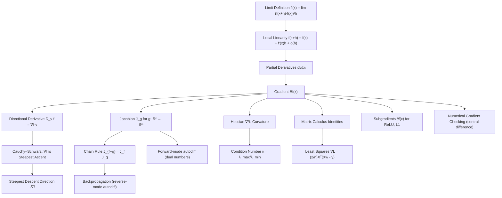

# Topic 01: Derivatives and Gradients for Machine Learning

## 1. Master Overview

Every learning algorithm that improves by adjusting parameters needs a signal telling it *which way to adjust*. That signal is the derivative. For a scalar function of one variable, the derivative $f'(x)$ is the unique coefficient of the best local linear approximation $f(x+h) = f(x) + f'(x)h + o(h)$. For the loss functions of machine learning — maps $L: \mathbb{R}^d \to \mathbb{R}$ with $d$ in the millions or billions — the same idea generalizes to the gradient $\nabla L(w)$, a vector that simultaneously encodes the sensitivity of the loss to every parameter.

This module builds the full differential toolbox used across ML: gradients and directional derivatives, the Jacobian of vector-valued maps, the Hessian and its curvature information, the vector chain rule that becomes backpropagation, matrix-calculus identities (least squares, quadratic forms), subgradients for non-smooth losses like ReLU and $L^1$ regularization, and numerical gradient checking. The central theorem — that $\nabla f(x)$ points in the direction of steepest ascent, proved via Cauchy–Schwarz — is the entire justification for gradient *descent*: stepping along $-\nabla f$ is locally the fastest way to decrease the loss.

The sibling module [`../../optimization/`](../../optimization/) treats general optimization theory in depth; here we stay focused on the calculus-to-ML bridge: how derivative objects are defined, proved, computed, and consumed by training algorithms.

> [!NOTE]
> Backpropagation is nothing more than the multivariable chain rule $\nabla_x(f \circ g)(x) = J_g(x)^\top \nabla f(g(x))$ applied repeatedly through a composition of layers, with intermediate values cached and reused. Understanding this one identity demystifies every deep learning framework.

## 2. First-Principles Framework

- **Phenomenon**: A loss function $L: \mathbb{R}^d \to \mathbb{R}$ responds in a complicated, nonlinear way to changes in its $d$ parameters; we need a local, computable summary of that response.
- **Goal**: Construct the best local linear model of $L$ at a point $w$, identify the direction of fastest decrease, and compute it efficiently through compositions of many simple functions.
- **Governing Equation (linearization)**: $f(x+h) = f(x) + \nabla f(x)^\top h + o(\lVert h \rVert)$.
- **Governing Equation (steepest ascent)**: $D_v f(x) = \nabla f(x)^\top v$, maximized over unit $v$ at $v = \nabla f(x)/\lVert \nabla f(x) \rVert_2$.
- **Governing Equation (chain rule / backprop)**: $J_{f \circ g}(x) = J_f(g(x))\, J_g(x)$, hence $\nabla_x (f \circ g)(x) = J_g(x)^\top \nabla f(g(x))$.
- **Non-smooth extension**: a subgradient $s$ of convex $f$ at $x$ satisfies $f(z) \ge f(x) + s^\top (z-x)$ for all $z$.

## 3. Mermaid Concept Map

## 4. Common Misconceptions

| Misconception | Mathematical Reality | Correct Mental Model |
|---|---|---|
| *"The gradient is just a list of slopes; its direction has no special meaning."* | By Cauchy–Schwarz, $D_v f(x) = \nabla f(x)^\top v \le \Vert \nabla f(x) \Vert_2$ for unit $v$, with equality only when $v$ is parallel to $\nabla f(x)$. | The gradient is the *direction of steepest ascent*, and its norm is the maximal rate of increase. |
| *"Existence of all partial derivatives implies differentiability."* | $f(x,y) = xy/(x^2+y^2)$ (with $f(0,0)=0$) has both partials at the origin yet is not even continuous there. | Differentiability means a *full linear approximation* exists; partials only probe axis directions. Continuous partials suffice. |
| *"Backpropagation is an approximation or a heuristic."* | Backprop computes the gradient *exactly* (to machine precision) via the chain rule; it is not a finite-difference scheme. | Reverse-mode autodiff evaluates $J_g^\top v$ products exactly, at a cost of a small constant times one forward pass. |
| *"The gradient points along the level curve of the loss."* | For any curve $r(t)$ inside a level set, $\frac{d}{dt} f(r(t)) = \nabla f \cdot r'(t) = 0$, so $\nabla f$ is *orthogonal* to the level set. | Gradients cross contour lines perpendicularly; gradient descent moves normal to contours. |
| *"ReLU cannot be used with gradient methods because it is not differentiable at 0."* | ReLU is convex, so the subdifferential $\partial f(0) = [0,1]$ exists; any subgradient yields valid descent-type updates. | Frameworks pick the convention $\text{ReLU}'(0)=0$; subgradient methods still converge, at rate $O(1/\sqrt{k})$. |
| *"Smaller $\epsilon$ always improves numerical gradient checks."* | Below $\epsilon \approx \epsilon_{\text{mach}}^{1/3}$ for central differences, round-off error $O(\epsilon_{\text{mach}}/\epsilon)$ dominates the $O(\epsilon^2)$ truncation error. | Total error is U-shaped in $\epsilon$; use $\epsilon \sim 10^{-5}$ to $10^{-7}$ and a *relative* error criterion. |
| *"A gradient of zero means we found a minimum."* | $\nabla f = 0$ only marks a stationary point: minimum, maximum, or saddle. Classification requires second-order (Hessian) information. | First-order conditions locate candidates; curvature decides. See Topic 04 for the full landscape story. |

## 5. Directory Inventory

| File | Type | Description |
|---|---|---|
| [`README.md`](README.md) | Index | Master overview, first-principles framework, concept map, misconceptions, references. |
| [`first_principles.ipynb`](first_principles.ipynb) | Theory | Intuition, rigorous definitions, six full proofs (steepest ascent, chain rule, level-set orthogonality, least-squares gradient, subgradient inequality, central-difference error), autodiff and gradient-checking insights, physics and ML applications. |
| [`exercises.ipynb`](exercises.ipynb) | Practice | 20 fully solved problems in 4 levels: L0 Concept Check (4), L1 Foundation (6), L2 Applications in AI/ML (6), L3 Challenge (4). |

## 6. References

1. **Goodfellow, I., Bengio, Y., & Courville, A.** (2016). *Deep Learning*. MIT Press. — *Chapter 4: Numerical Computation* (gradients, Jacobians, Hessians, gradient-based optimization) and *Chapter 6.5: Back-Propagation*.
2. **Baydin, A. G., Pearlmutter, B. A., Radul, A. A., & Siskind, J. M.** (2018). *Automatic Differentiation in Machine Learning: a Survey*. Journal of Machine Learning Research, 18(153), 1–43.
3. **Boyd, S., & Vandenberghe, L.** (2004). *Convex Optimization*. Cambridge University Press. — *Appendix A* (matrix calculus) and *Chapter 3* (subgradients via first-order conditions).
4. **Nocedal, J., & Wright, S. J.** (2006). *Numerical Optimization* (2nd ed.). Springer. — *Chapter 8: Calculating Derivatives* (finite differences, automatic differentiation).
5. **Petersen, K. B., & Pedersen, M. S.** (2012). *The Matrix Cookbook*. Technical University of Denmark. — Comprehensive matrix-derivative identity tables.
6. **Spivak, M.** (1965). *Calculus on Manifolds*. Benjamin. — *Chapter 2*: rigorous treatment of the total derivative and chain rule.
7. **Griewank, A., & Walther, A.** (2008). *Evaluating Derivatives: Principles and Techniques of Algorithmic Differentiation* (2nd ed.). SIAM.
8. **Rockafellar, R. T.** (1970). *Convex Analysis*. Princeton University Press. — *Part V*: subdifferential calculus.
