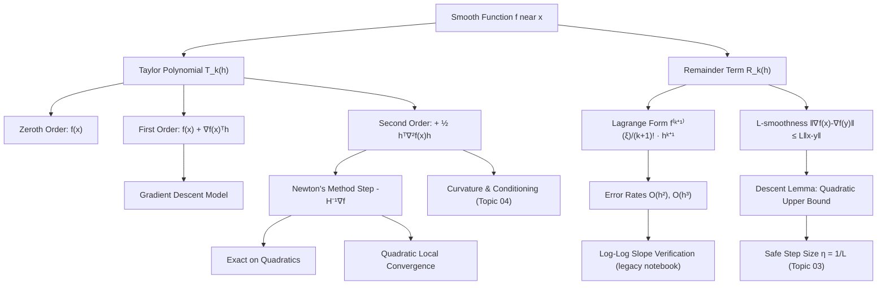

# Topic 02: Taylor Approximation and Local Models

## 1. Master Overview

Optimization algorithms never see the whole loss surface — they see the current point, the gradient there, and (sometimes) the curvature. Everything else is extrapolation. Taylor's theorem is the mathematical license for that extrapolation: it says exactly how well the value-plus-gradient model $f(x) + \nabla f(x)^\top h$ and the quadratic model $f(x) + \nabla f(x)^\top h + \frac{1}{2} h^\top \nabla^2 f(x) h$ track the true function, and it prices the error with explicit remainder terms.

This module develops Taylor approximation as the theory of *local models*. The first-order model with a Lagrange remainder explains why small gradient steps are safe; the second-order model explains Newton's method and why it is exact on quadratics; and the crown jewel for ML — the **descent lemma** for $L$-smooth functions, $f(y) \le f(x) + \nabla f(x)^\top (y-x) + \frac{L}{2}\lVert y-x \rVert_2^2$ — turns a global curvature bound into a guaranteed-progress inequality that underwrites every convergence proof in Topic 03. Numerically, remainder orders are visible: first-order error scales as $O(h^2)$ and second-order error as $O(h^3)$, showing up as slopes 2 and 3 on log-log error plots.

The legacy notebook [`../taylor_approximation.ipynb`](../taylor_approximation.ipynb) provides runnable experiments for these rates; the sibling [`../../calculus/09_taylor_and_power_series/`](../../calculus/09_taylor_and_power_series/) module treats infinite series and convergence radii, while here we care only about *finite* expansions with error control — the form optimization actually uses.

> [!NOTE]
> Machine learning almost never uses Taylor *series* (infinite sums); it uses Taylor *polynomials of degree 1 or 2 with explicit remainder bounds*. Gradient descent trusts the linear model within a radius set by $L$-smoothness; Newton's method trusts the quadratic model. The remainder term is not a technicality — it *is* the theory of step sizes.

## 2. First-Principles Framework

- **Phenomenon**: A smooth function is locally indistinguishable from a polynomial built out of its derivatives at one point; the mismatch grows in a controlled, quantifiable way with distance.
- **Goal**: Replace an intractable loss $f$ near $x$ by a tractable model $m_x(h)$ — linear or quadratic — with a provable error bound, then act (step, minimize the model) inside the region where the bound is small.
- **Governing Equation (Taylor with Lagrange remainder)**: $f(x+h) = \sum_{j=0}^{k} \frac{f^{(j)}(x)}{j!} h^j + \frac{f^{(k+1)}(\xi)}{(k+1)!} h^{k+1}$ for some $\xi$ between $x$ and $x+h$.
- **Governing Equation (multivariate, second order)**: $f(x+h) = f(x) + \nabla f(x)^\top h + \frac{1}{2} h^\top \nabla^2 f(x + \theta h)\, h$ for some $\theta \in (0,1)$.
- **Governing Inequality (descent lemma, $L$-smooth $f$)**: $f(y) \le f(x) + \nabla f(x)^\top (y-x) + \frac{L}{2}\lVert y-x \rVert_2^2$.
- **Algorithmic use**: minimizing the quadratic model gives the Newton step $h = -\left[\nabla^2 f(x)\right]^{-1} \nabla f(x)$; minimizing the descent-lemma upper bound gives the gradient step $h = -\frac{1}{L}\nabla f(x)$.

## 3. Mermaid Concept Map

## 4. Common Misconceptions

| Misconception | Mathematical Reality | Correct Mental Model |
|---|---|---|
| *"A Taylor polynomial converges to $f$ if you take enough terms."* | $f(x) = e^{-1/x^2}$ (with $f(0)=0$) has *all* derivatives zero at $0$: every Taylor polynomial at $0$ is identically $0$, yet $f$ is positive elsewhere. | Finite-order expansions with remainder bounds are the reliable tool; series convergence is a separate, stronger property. |
| *"The remainder is just 'higher-order terms' that can be ignored."* | The Lagrange remainder $\frac{f^{(k+1)}(\xi)}{(k+1)!}h^{k+1}$ is an *exact equality* at some intermediate $\xi$, and bounding it is precisely how step-size rules are derived. | The remainder is the star of the show in optimization: $L$-smoothness is nothing but a uniform bound on it. |
| *"First-order error is $O(h)$ because the model is first order."* | The first-order model absorbs the $O(h)$ term; its error is the *next* term, $\frac{1}{2}f''(\xi)h^2 = O(h^2)$. | Model of order $k$ has error of order $h^{k+1}$; on a log-log plot the error slope is $k+1$. |
| *"Newton's method is just gradient descent with a fancier learning rate."* | The Newton step $-\left[\nabla^2 f\right]^{-1}\nabla f$ rescales *and rotates* the gradient by the inverse Hessian; it is affine-invariant and not aligned with $-\nabla f$ in general. | Newton jumps to the minimizer of the local quadratic model — exact in one step on any positive-definite quadratic. |
| *"$L$-smoothness means the function is smooth (infinitely differentiable)."* | $L$-smoothness means the *gradient is Lipschitz*: $\Vert \nabla f(x) - \nabla f(y) \Vert_2 \le L \Vert x - y \Vert_2$ — a quantitative curvature cap, not a statement about higher derivatives. | Think "curvature bounded by $L$": the graph fits between two parabolas of opening $\pm L$ touching at each point. |
| *"The second-order model is always a better basis for a step than the first-order model."* | If $\nabla^2 f$ has negative or near-zero eigenvalues, the quadratic model is unbounded below or wildly ill-conditioned; the raw Newton step can move uphill or explode. | Trust-region and damping (Levenberg–Marquardt) exist precisely because the quadratic model is only locally trustworthy. |

## 5. Directory Inventory

| File | Type | Description |
|---|---|---|
| [`README.md`](README.md) | Index | Master overview, first-principles framework, concept map, misconceptions, references. |
| [`first_principles.ipynb`](first_principles.ipynb) | Theory | Local-model intuition, rigorous statements of Taylor's theorem (Lagrange and multivariate forms), five full proofs (Lagrange remainder, second-order expansion, descent lemma, Newton exactness on quadratics, error-order verification), algorithmic insights, applications. |
| [`exercises.ipynb`](exercises.ipynb) | Practice | 20 fully solved problems in 4 levels: L0 Concept Check (4), L1 Foundation (6), L2 Applications in AI/ML (6), L3 Challenge (4). |

## 6. References

1. **Goodfellow, I., Bengio, Y., & Courville, A.** (2016). *Deep Learning*. MIT Press. — *Chapter 4.3*: gradient-based optimization, Jacobians and Hessians, second-order approximation of the loss.
2. **Nocedal, J., & Wright, S. J.** (2006). *Numerical Optimization* (2nd ed.). Springer. — *Chapter 2* (Taylor-based models, Newton's method) and *Chapter 4* (trust-region methods).
3. **Nesterov, Y.** (2018). *Lectures on Convex Optimization* (2nd ed.). Springer. — *Chapter 1.2*: $L$-smooth functions and the descent lemma (Lemma 1.2.3).
4. **Boyd, S., & Vandenberghe, L.** (2004). *Convex Optimization*. Cambridge University Press. — *Chapter 9.5*: Newton's method and self-concordance.
5. **Spivak, M.** (2008). *Calculus* (4th ed.). Publish or Perish. — *Chapter 20*: Taylor's theorem with Lagrange and Cauchy remainders.
6. **Apostol, T. M.** (1967). *Calculus, Volume 1* (2nd ed.). Wiley. — *Chapter 7*: polynomial approximation and error estimates.
7. **Martens, J.** (2010). *Deep Learning via Hessian-Free Optimization*. ICML. — quadratic models with Hessian-vector products at deep-learning scale.
8. **Bottou, L., Curtis, F. E., & Nocedal, J.** (2018). *Optimization Methods for Large-Scale Machine Learning*. SIAM Review, 60(2). — the smoothness-based analysis framework used throughout modern ML optimization.
