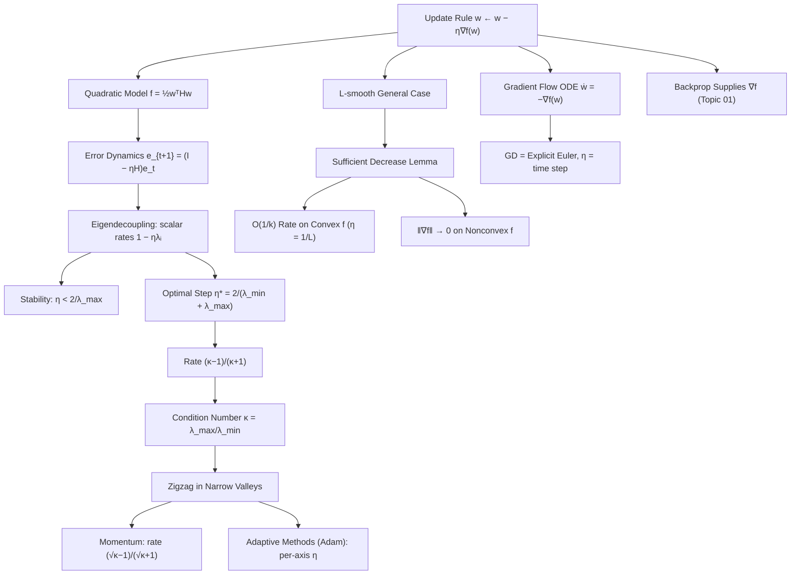

# Topic 03: Gradient Descent Mechanics

## 1. Master Overview

Gradient descent is the simplest possible answer to "I have a gradient, now what?": repeat $w_{t+1} = w_t - \eta \nabla f(w_t)$. Yet inside this one line lives essentially all of the quantitative theory of neural network training — stability thresholds, convergence rates, the tyranny of the condition number, and the reasons momentum and adaptive methods exist. This module dissects the mechanics with full proofs, using the quadratic case as an exactly solvable model and $L$-smoothness (Topic 02) as the bridge to general losses.

On a quadratic $f(w) = \frac{1}{2}w^\top H w$, the update is the linear recursion $w_{t+1} = (I - \eta H)w_t$, and everything reduces to spectral radius: stability demands $\eta \lt 2/\lambda_{\max}$, the optimal rate $\eta^\star = 2/(\lambda_{\min} + \lambda_{\max})$ balances the extreme eigendirections, and the resulting per-step contraction $(\kappa - 1)/(\kappa + 1)$ exposes the condition number $\kappa = \lambda_{\max}/\lambda_{\min}$ as the true cost driver — the zigzag of ill-conditioned valleys made precise. For general convex $L$-smooth functions, the descent lemma yields the classical $f(w_k) - f^\star \le \frac{\lVert w_0 - w^\star \rVert_2^2 L}{2k}$ bound: sublinear $O(1/k)$ convergence with step size $1/L$.

A second lens runs through the module: gradient descent is the explicit Euler discretization of the gradient-flow ODE $\dot{w} = -\nabla f(w)$, so learning-rate limits are ODE stability limits. The legacy notebook [`../gradient_descent.ipynb`](../gradient_descent.ipynb) runs all of these experiments; the sibling [`../../optimization/`](../../optimization/) module covers momentum, Adam, and stochastic methods in depth — here we build only the calculus core they all rest on.

> [!NOTE]
> Three numbers organize everything in this module: $\lambda_{\max}$ sets the stability ceiling $\eta \lt 2/\lambda_{\max}$, $\lambda_{\min}$ sets the speed floor along the flattest direction, and their ratio $\kappa$ sets the iteration count $O(\kappa \log(1/\epsilon))$. Momentum improves this to $O(\sqrt{\kappa}\log(1/\epsilon))$ — the reason it is not optional at high $\kappa$.

## 2. First-Principles Framework

- **Phenomenon**: Repeatedly stepping downhill by a fixed multiple of the gradient sometimes converges fast, sometimes crawls, sometimes oscillates, and sometimes explodes — all depending on one scalar $\eta$.
- **Goal**: Predict exactly which behavior occurs, from the curvature spectrum of the loss, and choose $\eta$ with guarantees.
- **Governing Equation (the update)**: $w_{t+1} = w_t - \eta \nabla f(w_t)$.
- **Governing Equation (quadratic error dynamics)**: for $f = \frac{1}{2}w^\top Hw$, $e_{t+1} = (I - \eta H)e_t$, so $e_t = (I - \eta H)^t e_0$ decouples along eigenvectors into scalar geometric sequences $(1 - \eta\lambda_i)^t$.
- **Governing Inequality (sufficient decrease)**: $L$-smoothness gives $f(w_{t+1}) \le f(w_t) - \eta\left(1 - \frac{L\eta}{2}\right)\lVert \nabla f(w_t) \rVert_2^2$.
- **Continuous limit**: $\dot{w} = -\nabla f(w)$ (gradient flow), for which $\frac{d}{dt}f(w(t)) = -\lVert \nabla f(w(t)) \rVert_2^2 \le 0$ — descent is automatic; only discretization can break it.

## 3. Mermaid Concept Map

## 4. Common Misconceptions

| Misconception | Mathematical Reality | Correct Mental Model |
|---|---|---|
| *"A smaller learning rate is always safer, so shrink it until things work."* | Below the stability threshold, halving $\eta$ roughly doubles the iterations needed; the loss along the flattest direction contracts by only $1 - \eta\lambda_{\min}$ per step. | There is a stability *window* $(0,\, 2/\lambda_{\max})$; the art is operating near its optimum, not near zero. |
| *"If the loss oscillates, gradient descent is diverging."* | For $1 \lt \eta\lambda_i \lt 2$, the mode $(1 - \eta\lambda_i)^t$ alternates sign yet still contracts; oscillation with decay is stable. | Divergence begins only when some $\lvert 1 - \eta\lambda_i \rvert \gt 1$, i.e. $\eta \gt 2/\lambda_i$; sign-flipping decay is normal near-optimal behavior. |
| *"Gradient descent converges to the minimum at a rate that only depends on $\eta$."* | On quadratics with the *optimal* $\eta$, the contraction factor is $(\kappa-1)/(\kappa+1)$ — a property of the problem, not the tuning. | Conditioning is the budget; the learning rate only decides whether you spend it efficiently. |
| *"$O(1/k)$ convergence means the error halves every fixed number of steps."* | $O(1/k)$ is *sublinear*: going from error $\epsilon$ to $\epsilon/2$ requires *doubling* the total iterations, unlike geometric (linear) rates $\rho^k$. | Convex+smooth buys $1/k$; strong convexity upgrades to geometric $\rho^k$; the two regimes feel completely different in practice. |
| *"The negative gradient is the best direction, so following it each step is the best algorithm."* | Steepest descent is optimal only *pointwise and myopically*; across steps it zigzags in ill-conditioned valleys, while momentum's non-gradient direction reaches the minimum in $O(\sqrt{\kappa})$. | Greedy-per-step is not greedy-over-trajectories; memory (momentum) beats myopia. |
| *"Gradient flow and gradient descent are the same thing."* | GD is explicit Euler applied to $\dot{w} = -\nabla f$ with time step $\eta$; discretization introduces the stability limit that the continuous flow (which always descends) does not have. | The ODE is the idealized limit $\eta \to 0$; every learning-rate pathology is a *discretization* artifact. |

## 5. Directory Inventory

| File | Type | Description |
|---|---|---|
| [`README.md`](README.md) | Index | Master overview, first-principles framework, concept map, misconceptions, references. |
| [`first_principles.ipynb`](first_principles.ipynb) | Theory | Update-rule intuition, formal definitions, five full proofs (quadratic error dynamics and stability, optimal step size and $\kappa$-rate, sufficient decrease, $O(1/k)$ convex convergence, gradient-flow descent), algorithmic insights (schedules, momentum preview, Euler view), applications. |
| [`exercises.ipynb`](exercises.ipynb) | Practice | 20 fully solved problems in 4 levels: L0 Concept Check (4), L1 Foundation (6), L2 Applications in AI/ML (6), L3 Challenge (4). |

## 6. References

1. **Goodfellow, I., Bengio, Y., & Courville, A.** (2016). *Deep Learning*. MIT Press. — *Chapter 4.3* (gradient descent, ill-conditioning) and *Chapter 8* (optimization for training deep models).
2. **Nesterov, Y.** (2018). *Lectures on Convex Optimization* (2nd ed.). Springer. — *Chapter 2*: $O(1/k)$ and accelerated rates, lower bounds.
3. **Boyd, S., & Vandenberghe, L.** (2004). *Convex Optimization*. Cambridge University Press. — *Chapter 9*: descent methods, exact/backtracking line search, condition-number analysis.
4. **Nocedal, J., & Wright, S. J.** (2006). *Numerical Optimization* (2nd ed.). Springer. — *Chapter 3*: line-search methods and convergence of steepest descent.
5. **Polyak, B. T.** (1964). *Some Methods of Speeding up the Convergence of Iteration Methods*. USSR Computational Mathematics and Mathematical Physics, 4(5). — the heavy-ball method and the $\sqrt{\kappa}$ rate.
6. **Bottou, L., Curtis, F. E., & Nocedal, J.** (2018). *Optimization Methods for Large-Scale Machine Learning*. SIAM Review, 60(2). — from deterministic GD to SGD in the smooth framework.
7. **Goh, G.** (2017). *Why Momentum Really Works*. Distill. — the eigendecoupled quadratic analysis of GD and momentum, visualized.
8. **Baydin, A. G., Pearlmutter, B. A., Radul, A. A., & Siskind, J. M.** (2018). *Automatic Differentiation in Machine Learning: a Survey*. JMLR, 18(153). — how the gradients consumed by GD are actually computed.
