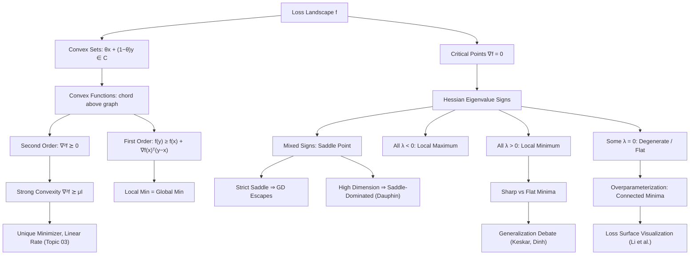

# Topic 04: Optimization Landscapes and Convexity

## 1. Master Overview

Topic 03 proved that gradient descent converges — but converges *to what*? The guarantee for a generic smooth loss is only that $\lVert \nabla f(\mathbf{x}_k) \rVert_2 \to 0$: the iterates reach a *stationary point*, which may be a minimum, a maximum, a saddle, or a flat degenerate region. Deciding which requires looking past the gradient at the shape of the loss surface itself. That shape — the **landscape** — is the subject of this module, and its single most consequential feature is whether the function is convex.

Convexity is the property that makes optimization *global*. For a convex $f$, the first-order condition $\nabla f(\mathbf{x}^\star) = 0$ upgrades from "necessary" to "necessary and sufficient for a global minimum", every local minimum is global, and the set of minimizers is itself convex. The two workhorse characterizations — the first-order inequality $f(\mathbf{y}) \ge f(\mathbf{x}) + \nabla f(\mathbf{x})^\top(\mathbf{y}-\mathbf{x})$ and the second-order condition $\nabla^2 f \succeq 0$ — say the same thing in two languages: every tangent plane lies below the graph, and there is no direction of negative curvature anywhere. Where curvature *is* indefinite, the Hessian spectrum classifies the critical point: all eigenvalues positive gives a strict local minimum, all negative a maximum, mixed signs a saddle, and any zero eigenvalue makes the second-order test inconclusive.

Deep networks are emphatically non-convex — permutation and rescaling symmetries alone force many disconnected global minimizers — yet the empirical picture is far friendlier than "non-convex" suggests. Random-matrix arguments (Bray & Dean; Dauphin et al., 2014) show that in high dimensions, critical points are overwhelmingly **saddles** rather than poor local minima, since a bad local minimum requires *all* $d$ Hessian eigenvalues to be positive simultaneously — an exponentially unlikely coincidence. Overparameterization goes further: it turns isolated minima into connected manifolds of solutions (Draxler et al.; Garipov et al.), and visualization with filter-normalized 2D slices (Li et al., 2018) makes the resulting basins visible. What remains genuinely contested is **sharp versus flat** minima and their link to generalization — a debate the reparameterization argument of Dinh et al. (2017) sharpened rather than settled.

The legacy notebook [`../optimization_landscape.ipynb`](../optimization_landscape.ipynb) renders these objects: convex versus non-convex surfaces, the canonical saddle $f(x,y)=x^2-y^2$, and the trajectory of gradient descent slowing to a crawl near a saddle plateau. Convex *algorithms* — duality, KKT, projected and proximal methods — belong to [`../../optimization/`](../../optimization/); here we build only the geometric core they assume, and we connect it back to the convergence machinery of [`../03_gradient_descent_mechanics/`](../03_gradient_descent_mechanics/).

> [!NOTE]
> Two facts do most of the work in this module. **(1)** Convexity converts a local certificate ($\nabla f = 0$) into a global one — that is its entire value, and it is why so much modeling effort goes into keeping losses convex. **(2)** In dimension $d$, requiring all $d$ Hessian eigenvalues to share a sign is exponentially restrictive, so high-dimensional landscapes are saddle-dominated. Gradient descent's real enemy in deep learning is not bad minima; it is flat regions and saddle plateaus.

## 2. First-Principles Framework

- **Phenomenon**: Optimizers stop where the gradient vanishes, but stationary points come in qualitatively different flavors, and only some are worth stopping at.
- **Goal**: Classify critical points from local curvature, identify the structural property (convexity) that makes local information globally conclusive, and describe what actually happens in high-dimensional non-convex losses.
- **Governing Definition (convex set)**: $C$ is convex if $\theta\mathbf{x}+(1-\theta)\mathbf{y} \in C$ for all $\mathbf{x},\mathbf{y}\in C$, $\theta\in[0,1]$.
- **Governing Inequality (convex function, zeroth order)**: $f(\theta\mathbf{x}+(1-\theta)\mathbf{y}) \le \theta f(\mathbf{x}) + (1-\theta)f(\mathbf{y})$.
- **First-order characterization**: $f$ convex $\iff$ $f(\mathbf{y}) \ge f(\mathbf{x}) + \nabla f(\mathbf{x})^\top(\mathbf{y}-\mathbf{x})$ for all $\mathbf{x},\mathbf{y}$.
- **Second-order characterization**: for $f\in C^2$ on an open convex domain, $f$ convex $\iff$ $\nabla^2 f(\mathbf{x}) \succeq 0$ everywhere; $\nabla^2 f \succeq \mu I$ with $\mu \gt 0$ gives $\mu$-strong convexity.
- **Critical-point taxonomy**: at $\nabla f(\mathbf{x}_c)=0$ with eigenvalues $\lambda_i$ of $\nabla^2 f(\mathbf{x}_c)$ — all $\lambda_i \gt 0$ strict local min; all $\lambda_i \lt 0$ strict local max; mixed signs saddle; some $\lambda_i = 0$ degenerate (test inconclusive).
- **Strict-saddle property**: every critical point either is a local min or has $\lambda_{\min}(\nabla^2 f) \lt 0$; under it, gradient descent from a random start almost surely avoids saddles.

## 3. Mermaid Concept Map

## 4. Common Misconceptions

| Misconception | Mathematical Reality | Correct Mental Model |
|---|---|---|
| *"Non-convex means gradient descent gets stuck in bad local minima."* | In $d$ dimensions a local minimum needs all $d$ Hessian eigenvalues positive at once; random-matrix models make that probability decay exponentially in $d$, so critical points are dominated by saddles (Dauphin et al., 2014). | The enemy is saddle plateaus and flat regions where $\lVert \nabla f \rVert_2$ is tiny but the loss is not — not a landscape full of traps. |
| *"$\nabla f(\mathbf{x}) = 0$ means we found a minimum."* | Vanishing gradient is necessary, never sufficient without curvature information: $f(x,y)=x^2-y^2$ has $\nabla f(0)=0$ at a saddle, and $f(x)=x^3$ at an inflection. | Stationarity is a *candidate* test; the Hessian spectrum is the verdict — except for convex $f$, where stationarity alone certifies global optimality. |
| *"A positive semidefinite Hessian at a point proves a local minimum."* | $\nabla^2 f(\mathbf{x}_c) \succeq 0$ is only necessary; $f(x,y)=x^2-y^4$ at the origin has Hessian $\operatorname{diag}(2,0) \succeq 0$ yet the origin is not a local minimum. | Necessary condition: $\succeq 0$. Sufficient condition: $\succ 0$. The gap is exactly the degenerate directions with $\lambda_i = 0$. |
| *"Convex functions have convex level sets, so convex level sets mean convex functions."* | Sublevel sets of convex functions are convex, but the converse fails: $f(x)=-e^{-x^2}$ has interval sublevel sets and is *quasiconvex*, not convex. | Convexity is a statement about the *epigraph*, a strictly stronger object than any single sublevel set. |
| *"Flat minima always generalize better than sharp ones."* | Dinh et al. (2017) show ReLU-network rescaling $(\alpha W_1, W_2/\alpha)$ leaves the function — hence generalization — unchanged while making Hessian eigenvalues arbitrarily large, so naive sharpness is not a well-defined property of a model. | Flatness correlates with generalization *within* a fixed parameterization and metric; the causal claim needs a scale-invariant sharpness measure. |
| *"Deep networks would be easier to train if the loss were convex in the weights."* | Convexity in the weights is incompatible with the permutation symmetry of hidden units: swapping two neurons gives another global minimizer, and the midpoint of two such minimizers generally has *higher* loss, violating the chord inequality. | Non-convexity in deep nets is structural, not accidental; the useful question is whether the reachable region behaves benignly (PL, strict saddle, connected minima). |
| *"Every global minimum is an isolated point."* | Overparameterized models have manifolds of global minima: $f(u,v)=(uv-1)^2$ is minimized on the whole hyperbola $uv=1$, where the Hessian is rank-deficient; modern nets show *mode connectivity* — low-loss paths between apparently distinct solutions. | Think of solution *sets*, often connected and degenerate, not solution *points*; degeneracy is the norm at scale, not a pathology. |

## 5. Directory Inventory

| File | Type | Description |
|---|---|---|
| [`README.md`](README.md) | Index | Master overview, first-principles framework, concept map, misconceptions, references. |
| [`first_principles.ipynb`](first_principles.ipynb) | Theory | Landscape intuition, rigorous definitions of convex sets/functions and critical-point types, six full proofs (first- and second-order characterizations of convexity, local implies global, second-order optimality conditions, saddle classification via the Hessian spectrum, exponential rarity of minima in high dimension), algorithmic insights, applications. |
| [`exercises.ipynb`](exercises.ipynb) | Practice | 20 fully solved problems in 4 levels: L0 Concept Check (4), L1 Foundation (6), L2 Applications in AI/ML (6), L3 Challenge (4). |

## 6. References

1. **Boyd, S., & Vandenberghe, L.** (2004). *Convex Optimization*. Cambridge University Press. — *Chapters 2–3*: convex sets, convex functions, first/second-order conditions, operations preserving convexity.
2. **Goodfellow, I., Bengio, Y., & Courville, A.** (2016). *Deep Learning*. MIT Press. — *Chapter 4.3* (critical points, ill-conditioning, saddle points) and *Chapter 8.2* (challenges in neural network optimization: plateaus, cliffs, flat regions).
3. **Nocedal, J., & Wright, S. J.** (2006). *Numerical Optimization* (2nd ed.). Springer. — *Chapter 2.1*: necessary and sufficient conditions for local optimality; *Chapter 4*: negative curvature and trust regions.
4. **Dauphin, Y., Pascanu, R., Gulcehre, C., Cho, K., Ganguli, S., & Bengio, Y.** (2014). *Identifying and Attacking the Saddle Point Problem in High-Dimensional Non-Convex Optimization*. NeurIPS. — the saddle-dominance argument and saddle-free Newton.
5. **Li, H., Xu, Z., Taylor, G., Studer, C., & Goldstein, T.** (2018). *Visualizing the Loss Landscape of Neural Nets*. NeurIPS. — filter normalization and 2D loss-surface slices.
6. **Keskar, N. S., Mudigere, D., Nocedal, J., Smelyanskiy, M., & Tang, P. T. P.** (2017). *On Large-Batch Training for Deep Learning: Generalization Gap and Sharp Minima*. ICLR. — the sharp/flat generalization claim.
7. **Dinh, L., Pascanu, R., Bengio, S., & Bengio, Y.** (2017). *Sharp Minima Can Generalize for Deep Nets*. ICML. — the reparameterization critique of sharpness measures.
8. **Lee, J. D., Simchowitz, M., Jordan, M. I., & Recht, B.** (2016). *Gradient Descent Converges to Minimizers*. COLT. — strict-saddle escape and measure-zero stable sets.
9. **Garipov, T., Izmailov, P., Podoprikhin, D., Vetrov, D., & Wilson, A. G.** (2018). *Loss Surfaces, Mode Connectivity, and Fast Ensembling of DNNs*. NeurIPS. — connected low-loss paths between minima.
10. **Choromanska, A., Henaff, M., Mathieu, M., Ben Arous, G., & LeCun, Y.** (2015). *The Loss Surfaces of Multilayer Networks*. AISTATS. — the spin-glass analogy for deep-network landscapes.
