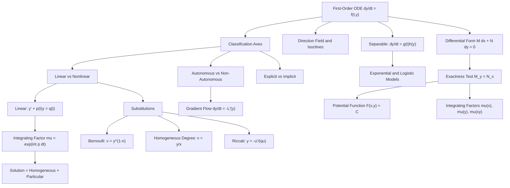

# Topic 01: Classification and First-Order ODEs

## 1. Master Overview

A differential equation is a statement about local change; solving one means reconstructing a global function from that local law. Before any solving begins, classification is the decisive act: identifying the order, whether the equation is ordinary or partial, linear or nonlinear, autonomous or non-autonomous, homogeneous or forced, explicit or implicit. Each axis is not bookkeeping — it is a routing table. Linearity unlocks superposition and the integrating factor; autonomy unlocks phase-line analysis and translation invariance; exactness unlocks a potential function. Misclassify an equation and every subsequent technique fails; classify it correctly and the solution method is often forced upon you.

This module is the analytic-techniques core of the differential equations track. We develop the four pillars of first-order solvability — separable equations, linear equations via the integrating factor $\mu(t) = e^{\int p(t)\,dt}$, exact equations via the criterion $M_y = N_x$ and its Poincaré-lemma justification, and substitution methods (Bernoulli, homogeneous-degree, Riccati) that transmute nonlinear equations into linear ones. Every technique is derived from first principles rather than presented as a recipe: separation of variables is justified by the chain rule, the exactness test is proved in both directions on simply connected domains, and the Riccati substitution $y = -u'/(qu)$ is shown to linearize a quadratic nonlinearity into a second-order linear equation.

The payoff extends far beyond classical physics. Gradient descent in the continuous-time limit is the autonomous first-order ODE $\dot{y} = -L'(y)$; learning-rate schedules are precisely time-dependent coefficients $p(t)$ in a linear first-order equation; the logistic equation underlies sigmoid activations and epidemic curves; and RC circuits, Newton cooling, and mixing tanks are the canonical linear systems whose exponential relaxation dynamics reappear in exponential moving averages and momentum methods throughout machine learning.

> [!NOTE]
> The integrating factor $\mu(t) = e^{\int p(t)\,dt}$ solves every linear first-order ODE $y' + p(t)y = q(t)$ in closed form and simultaneously proves uniqueness: multiplying by $\mu$ collapses the equation to $(\mu y)' = \mu q$, an exact derivative, so the entire solution set is one particular solution plus a one-parameter homogeneous family $Ce^{-\int p}$ — no solutions exist outside it.

## 2. First-Principles Framework

- **Phenomenon**: Systems in nature and computation are described by local laws of change — a rate $dy/dt$ specified as a function $f(t, y)$ of time and state — rather than by explicit formulas for their trajectories.
- **Goal**: Reconstruct the global trajectory $y(t)$ from the local law, and before that, determine *whether* a closed-form reconstruction is possible and *which* technique will produce it.
- **Governing Equation**: $\dfrac{dy}{dt} = f(t, y)$, with the initial condition $y(t_0) = y_0$ selecting one curve from the family.
- **Formulation**: Classify $f$ along structural axes (linearity, autonomy, exactness, homogeneity of degree) to route the equation to a technique: separable $f = g(t)h(y)$, linear $f = q(t) - p(t)y$, exact $M\,dx + N\,dy = 0$ with $M_y = N_x$, or substitution-reducible (Bernoulli, homogeneous, Riccati).
- **Resolution/Decomposition**: Each technique reduces the ODE to pure integration: separation splits variables across the equality, the integrating factor rewrites the equation as a total derivative $(\mu y)' = \mu q$, exactness produces a potential $F(x,y) = C$, and substitutions map the nonlinear problem onto one of the previous solved forms.

The resulting routing table, executed in order, is the module in miniature:

| Recognized form | Technique | Outcome |
| :--- | :--- | :--- |
| $y' = g(t)h(y)$ | Separate; integrate $\int dy/h = \int g\,dt$ (chain-rule justified) | Explicit or implicit solution by quadrature |
| $y' + p(t)y = q(t)$ | Integrating factor $\mu = e^{\int p\,dt}$, so $(\mu y)' = \mu q$ | Closed form: homogeneous $Ce^{-\int p}$ plus particular |
| $M\,dx + N\,dy = 0$, $M_y = N_x$ | Construct potential $F$ by partial integration | Level-set family $F(x,y) = C$ |
| $M_y \neq N_x$, quotient test passes | Integrating factor $\mu(x)$, $\mu(y)$, or $\mu(xy)$ | Reduced to the exact case |
| $y' + py = qy^n$ (Bernoulli) | Substitute $v = y^{1-n}$ | Linear equation in $v$ |
| $y' = f(y/x)$ (homogeneous-degree) | Substitute $v = y/x$ | Separable equation in $v$ |
| $y' = a + by + cy^2$ (Riccati) | Substitute $y = -u'/(cu)$, or $y = y_1 + 1/v$ given a particular $y_1$ | Second-order linear, or first-order linear |
| None of the above | Direction field, qualitative analysis, numerics | Structure without closed form |

## 3. Mermaid Concept Map

## 4. Common Misconceptions

| Misconception | Mathematical Reality | Correct Mental Model |
| :--- | :--- | :--- |
| "Separating variables" moves $dy$ and $dt$ around like fractions, which is illegal. | The manipulation is rigorous: dividing by $h(y)$ and integrating in $t$ applies the chain rule to $H(y(t))$ where $H' = 1/h$; the Leibniz notation merely records a valid substitution. | Separation is shorthand for integrating $\frac{y'(t)}{h(y(t))} = g(t)$, a chain-rule identity, not fraction algebra. |
| Every first-order ODE has a closed-form solution if you find the right trick. | Even innocuous equations like $y' = y^2 - t$ (a Riccati) have no solution in elementary functions; Liouville theory proves such obstructions. | Closed forms are the exception; classification tells you when you are in one of the privileged solvable classes. |
| "Homogeneous" means the same thing everywhere it appears. | Homogeneous *linear* equation means zero forcing ($q = 0$); homogeneous-*degree* equation means $f(\lambda x, \lambda y) = f(x, y)$, solvable by $v = y/x$. These are unrelated properties. | Track which axis the word modifies: forcing term versus scaling symmetry of $f$. |
| An exact-looking equation $M\,dx + N\,dy = 0$ can always be solved by finding $F$ with $F_x = M$, $F_y = N$. | A potential exists iff $M_y = N_x$ (on a simply connected domain); otherwise one must first multiply by an integrating factor, which may depend on $x$, $y$, or $xy$. | Exactness is a closure condition — the 2D curl test — and integrating factors repair a failed test. |
| Nonlinear first-order equations are hopeless analytically. | Bernoulli equations linearize under $v = y^{1-n}$; Riccati equations with one known particular solution reduce to linear; homogeneous-degree equations separate under $v = y/x$. | A nonlinear equation with enough structure carries a change of variables that flattens it into a linear or separable one. |
| The direction field is just a plotting aid with no analytic content. | Isoclines $f(t,y) = c$ organize the field into level sets; nullclines ($c = 0$) locate equilibria, and the sign of $f$ between nullclines determines monotonicity and stability without solving anything. | The slope field is the equation, drawn; qualitative conclusions (equilibria, trapping regions, blow-up) are read off it rigorously. |
| Solutions of $y' + p(t)y = q(t)$ might be non-unique if $p$ or $q$ is merely continuous. | The integrating factor method constructs *all* solutions: any two differ by a multiple of $e^{-\int p}$, so continuity of $p, q$ already forces a unique IVP solution — no Lipschitz argument needed. | For linear equations, existence and uniqueness are algebraic consequences of the total-derivative rewrite $(\mu y)' = \mu q$. |

## 5. Directory Inventory

| File | Description |
| :--- | :--- |
| [`README.md`](README.md) | This overview: classification axes as a routing table, concept map, misconceptions, and canonical references. |
| [`first_principles.ipynb`](first_principles.ipynb) | Markdown-only deep dive: rigorous definitions of every classification axis, six complete proofs (integrating factor, exactness criterion, logistic solution, Bernoulli reduction, linear uniqueness, Riccati linearization), computational insights on symbolic vs numeric solving and stiffness, and physics/ML applications. |
| [`exercises.ipynb`](exercises.ipynb) | 20 fully solved problems in four levels: concept checks on classification and direction fields; complete solves of separable, linear, exact, and Bernoulli instances; applied modeling (RC circuits, forensic Newton cooling, mixing tanks, logistic epidemics, gradient flow); and challenge problems (Riccati, $\mu(xy)$ integrating factors, a blow-up comparison argument, implicit exact families). |

## 6. References

1. **Arnold, V. I.** *Ordinary Differential Equations* — Chapter 1 (phase spaces, direction fields, and the geometric meaning of a first-order equation).
2. **Boyce, W. E., & DiPrima, R. C.** *Elementary Differential Equations and Boundary Value Problems* — Chapters 1–2 (classification, integrating factors, separable and exact equations, modeling with first-order ODEs).
3. **Tenenbaum, M., & Pollard, H.** *Ordinary Differential Equations* — Lessons 6–11 (special first-order types: exact equations, integrating factors, Bernoulli and Riccati substitutions, worked in exhaustive detail).
4. **Coddington, E. A., & Levinson, N.** *Theory of Ordinary Differential Equations* — Chapter 1 (rigorous existence and uniqueness underpinning the solution formulas derived here).
5. **Hirsch, M. W., Smale, S., & Devaney, R. L.** *Differential Equations, Dynamical Systems, and an Introduction to Chaos* — Chapter 1 (first-order equations, the logistic model, and the phase-line viewpoint).
6. **Strogatz, S. H.** *Nonlinear Dynamics and Chaos* — Chapter 2 (flows on the line: qualitative analysis of autonomous first-order equations, fixed points, and stability).
7. **Ince, E. L.** *Ordinary Differential Equations* — Chapter 2 (classical treatment of integrating factors and the Riccati equation's link to second-order linear theory).
8. **Chen, R. T. Q., Rubanova, Y., Bettencourt, J., & Duvenaud, D.** (2018). *Neural Ordinary Differential Equations*, NeurIPS — first-order ODEs as continuous-depth network layers, motivating the gradient-flow perspective.
9. **Su, W., Boyd, S., & Candès, E.** (2016). *A Differential Equation for Modeling Nesterov's Accelerated Gradient Method*, JMLR — optimization algorithms as limits of ODE discretizations, connecting learning-rate schedules to time-dependent coefficients $p(t)$.
10. Survey-level companion module: [`../../calculus/15_ordinary_differential_equations/`](../../calculus/15_ordinary_differential_equations/) — a broad first pass over ODEs within the calculus track; this module goes deeper on classification and first-order analytic techniques.
