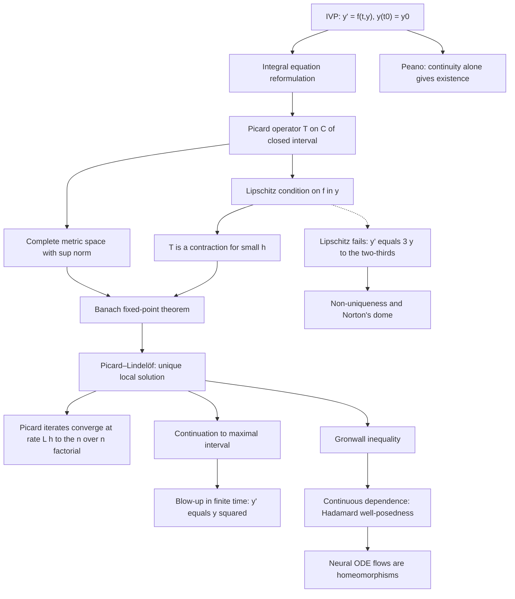

# Topic 02: Existence, Uniqueness, and the Picard–Lindelöf Theorem

## 1. Master Overview

Before we solve a single differential equation, we must answer a more fundamental question: does a solution exist at all, and if it does, is it the *only* one?
An initial value problem (IVP) is the mathematical formalization of determinism — a law of motion plus a present state should pin down exactly one future.
The Picard–Lindelöf theorem makes this promise precise: if the right-hand side $f(t, y)$ is continuous in $t$ and Lipschitz continuous in $y$, then the IVP $y' = f(t, y)$, $y(t_0) = y_0$ has exactly one solution on a small interval around $t_0$.
Remarkably, the proof is *constructive*: it converts the IVP into an integral equation and shows that the Picard iteration map is a contraction on a complete metric space of continuous functions, so the Banach fixed-point theorem hands us the solution as the limit of an explicitly computable sequence.

The theorem also tells us exactly what can go wrong when its hypotheses fail.
Drop Lipschitz continuity and uniqueness can shatter: $y' = 3y^{2/3}$ with $y(0) = 0$ admits infinitely many solutions, which is why Norton's dome is a genuine puzzle for classical determinism.
Keep smoothness but let $f$ grow too fast and solutions can cease to exist in finite time: $y' = y^2$, $y(0) = 1$ blows up at $t = 1$ even though $f$ is a polynomial.
Grönwall's inequality completes the well-posedness picture (in the sense of Hadamard: existence, uniqueness, continuous dependence) by bounding how fast two solutions with nearby initial data can separate — an exponential bound $e^{L \lvert t - t_0 \rvert}$ that reappears in numerical analysis as error propagation and in machine learning as a robustness certificate.

These are not museum-piece theorems.
Every ODE solver in `scipy` or `torchdiffeq` implicitly assumes a Lipschitz bound when it controls step size; Neural ODEs are well-posed precisely because Lipschitz networks (e.g., via spectral normalization) satisfy Picard–Lindelöf.
And the uniqueness theorem's corollary that trajectories never cross explains a genuine architectural limitation of Neural ODE flows — they are homeomorphisms, which is why augmented dimensions are needed to learn maps like $x \mapsto -x$.

> [!NOTE]
> The Picard–Lindelöf proof is one of mathematics' great "two birds, one stone" arguments: by recasting the IVP as a fixed-point problem $y = T[y]$ for the integral operator $T[y]\,(t) = y_0 + \int_{t_0}^{t} f(s, y(s))\,ds$ and showing $T$ is a contraction, it proves existence and uniqueness *simultaneously* — and the iterates $y_{n+1} = T[y_n]$ converge at the super-exponential rate $\frac{(L h)^n}{n!}$, faster than any geometric series.

## 2. First-Principles Framework

- **Phenomenon**: A model $y' = f(t, y)$ with initial state $y(t_0) = y_0$ is supposed to predict one unique future, but some right-hand sides yield no solution formula, several distinct solutions, or solutions that die in finite time.
- **Goal**: Find checkable conditions on $f$ guaranteeing that the IVP has exactly one solution, determine the largest interval on which it lives, and bound its sensitivity to the initial data.
- **Governing Equation**: The IVP $y' = f(t, y)$, $y(t_0) = y_0$, recast as the equivalent integral equation $y(t) = y_0 + \int_{t_0}^{t} f(s, y(s))\,ds$.
- **Formulation**: The integral equation says $y$ is a fixed point of the Picard operator $T$ acting on the complete metric space $C([t_0 - h, t_0 + h])$ with the sup norm; a Lipschitz condition on $f$ makes $T$ a contraction for $h$ small enough.
- **Resolution/Decomposition**: The Banach fixed-point theorem delivers a unique fixed point as the limit of Picard iterates $y_0(t) \equiv y_0$, $y_{n+1} = T[y_n]$; Grönwall's inequality upgrades this to continuous dependence, and a continuation argument extends the local solution to a maximal interval of existence.

Each hypothesis maps to exactly one failure mode: continuity blocks non-existence (Peano), the Lipschitz condition blocks non-uniqueness (contraction), and growth control or invariant compact regions block finite-time blow-up (continuation).
The counterexamples $y' = 3y^{2/3}$ and $y' = y^2$ are studied in full in the notebooks precisely because each one violates a single hypothesis and exhibits the corresponding single disaster.

## 3. Mermaid Concept Map

## 4. Common Misconceptions

| Misconception | Mathematical Reality | Correct Mental Model |
| :--- | :--- | :--- |
| Continuity of $f$ guarantees a unique solution. | Peano's theorem gives existence from continuity alone, but $y' = 3y^{2/3}$, $y(0) = 0$ is continuous yet has infinitely many solutions. | Continuity buys existence; Lipschitz continuity is the extra rigidity that buys uniqueness. |
| A smooth right-hand side yields a solution for all time. | $y' = y^2$, $y(0) = 1$ has the polynomial (even analytic) right side $f(y) = y^2$, yet its solution $y = 1/(1 - t)$ blows up at $t = 1$. | Smoothness is local information; global existence requires controlling growth (e.g., global Lipschitz or a priori bounds). |
| The Picard–Lindelöf interval $h = \min(a, b/M)$ is the true lifespan of the solution. | $h$ is only what the rectangle argument certifies; the maximal interval found by continuation is usually much larger, sometimes all of $\mathbb{R}$. | Picard–Lindelöf is a local germ; re-apply it at the endpoint and glue to continue the solution until it leaves every compact set. |
| Lipschitz continuity means $f$ is differentiable. | $f(y) = \lvert y \rvert$ is globally Lipschitz with $L = 1$ but not differentiable at $0$; conversely a bounded partial derivative $\partial f / \partial y$ implies Lipschitz, not the reverse. | Bounded slope of secant lines, not existence of tangent lines: Lipschitz sits strictly between continuity and $C^1$. |
| Picard iteration is only a proof device, never a computation. | For $y' = y$, $y(0) = 1$ the iterates are exactly the Taylor partial sums $\sum_{k=0}^{n} t^k / k!$, converging to $e^t$ with factorial speed. | Picard iteration is a genuine algorithm — symbolic, and the grandparent of modern iterative and collocation solvers. |
| Two different solutions of the same ODE may cross. | If $f$ is Lipschitz, uniqueness forbids two distinct solution curves through one point $(t^*, y^*)$; trajectories tile the strip without intersecting. | Solution curves form a non-crossing laminar flow — the geometric heart of why Neural ODE flows are invertible homeomorphisms. |
| Sensitivity to initial conditions contradicts well-posedness. | Grönwall gives $\lvert y_1(t) - y_2(t) \rvert \le \lvert y_1(t_0) - y_2(t_0) \rvert e^{L \lvert t - t_0 \rvert}$: divergence is at most exponential, and on any fixed interval the flow map is continuous. | Chaos is compatible with continuous dependence; well-posedness bounds the divergence *rate*, it does not forbid divergence. |

## 5. Directory Inventory

Recommended path: read `first_principles.ipynb` top to bottom (the six proofs in Section 3 are the heart of the module), then work the exercises level by level.
Problems L2.1–L2.2 and L2.6 depend on the Neural ODE material of Section 5, and Problem L3.4 completes the alternative proof sketched at the end of Proof 3.3.

| File | Description |
| :--- | :--- |
| [`README.md`](README.md) | This overview: the well-posedness roadmap, concept map, misconception table, and canonical references. |
| [`first_principles.ipynb`](first_principles.ipynb) | Full theory build: definitions (Lipschitz, integral equation, contraction), statements of Banach, Picard–Lindelöf, Peano, and Grönwall, six complete proofs including the blow-up and non-uniqueness counterexamples, algorithmic view of Picard iteration, and applications from Norton's dome to Neural ODEs. |
| [`exercises.ipynb`](exercises.ipynb) | 20 fully solved problems in four levels: concept checks on Lipschitz and integral forms, computed Picard iterates and maximal intervals, ML/physics applications (spectral-norm Lipschitz certificates, Grönwall robustness bounds, autocatalytic blow-up, SIR uniqueness), and challenge proofs (Osgood, comparison theorem, reachability, weighted-norm contraction). |

## 6. References

1. **Coddington, E. A., & Levinson, N.** *Theory of Ordinary Differential Equations* — Chapters 1–2: the definitive treatment of existence, uniqueness, continuation, and dependence on initial conditions.
2. **Arnold, V. I.** *Ordinary Differential Equations* — Chapters 1–2: the geometric view of ODEs as vector fields and flows; determinism as a mathematical axiom.
3. **Hirsch, M. W., Smale, S., & Devaney, R. L.** *Differential Equations, Dynamical Systems, and an Introduction to Chaos* — Chapter 17: existence and uniqueness with complete proofs, plus continuous dependence.
4. **Boyce, W. E., & DiPrima, R. C.** *Elementary Differential Equations and Boundary Value Problems* — Section 2.8: the Picard iteration method presented accessibly with worked iterates.
5. **Tenenbaum, M., & Pollard, H.** *Ordinary Differential Equations* — Lessons 57–58: Picard's method of successive approximations with hands-on computations.
6. **Teschl, G.** *Ordinary Differential Equations and Dynamical Systems* — Chapter 2: the weighted-norm (Bielecki) proof of Picard–Lindelöf and Grönwall's inequality in full generality.
7. **Strogatz, S. H.** *Nonlinear Dynamics and Chaos* — Section 2.5: blow-up and non-uniqueness examples in the phase-line setting.
8. **Chen, R. T. Q., Rubanova, Y., Bettencourt, J., & Duvenaud, D.** (2018). *Neural Ordinary Differential Equations*, NeurIPS — well-posedness of learned dynamics via Lipschitz networks.
9. **Dupont, E., Doucet, A., & Teh, Y. W.** (2019). *Augmented Neural ODEs*, NeurIPS — why uniqueness (non-crossing flows) limits expressivity and how augmentation fixes it.
10. **Miyato, T., Kataoka, T., Koyama, M., & Yoshida, Y.** (2018). *Spectral Normalization for Generative Adversarial Networks*, ICLR — enforcing Lipschitz constants architecturally, i.e., the Picard–Lindelöf hypothesis by construction.
11. **Norton, J. D.** (2008). *The Dome: An Unexpectedly Simple Failure of Determinism*, Philosophy of Science 75, 786–798 — the physical face of Lipschitz failure.
12. Survey-level companion module: [`../../calculus/15_ordinary_differential_equations/`](../../calculus/15_ordinary_differential_equations/) — a broad tour of ODE solution techniques; this module goes deeper on the single question of well-posedness.
