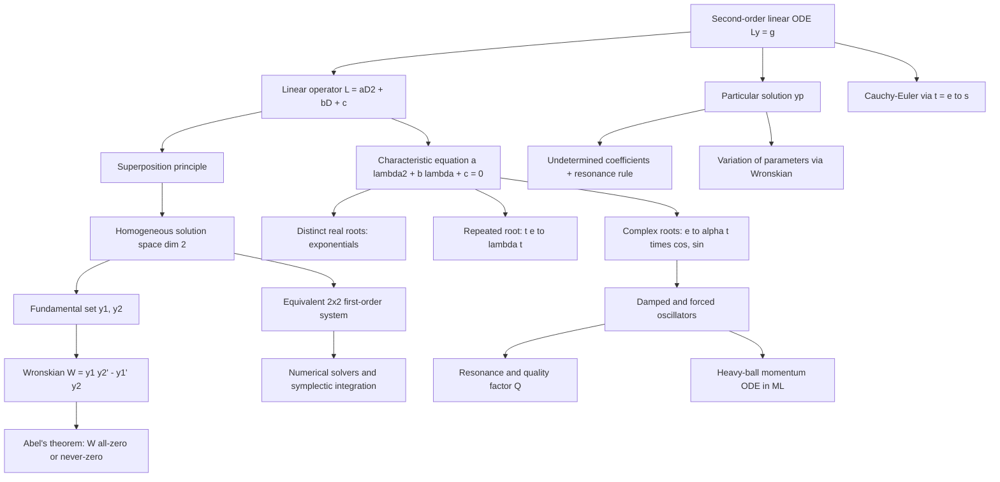

# Topic 03: Second-Order Linear ODEs

## 1. Master Overview

Second-order linear ordinary differential equations $a(t) y'' + b(t) y' + c(t) y = g(t)$ occupy a privileged position in applied mathematics: they are the simplest equations rich enough to oscillate. Newton's second law $F = ma$ is intrinsically second-order, so every mechanical system near equilibrium — a spring, a pendulum, a bridge deck, a car suspension — reduces to one. The same equation, with charge replacing position, governs the RLC circuit; with parameters reinterpreted, it governs momentum-based gradient descent in machine learning. Mastering this single equation therefore unlocks a remarkable range of phenomena.

The deep structural fact is algebraic: for the homogeneous equation $L y = 0$ with $L = a D^2 + b D + c$, the solution set is a **two-dimensional vector space**. Every solution is a linear combination $y = c_1 y_1 + c_2 y_2$ of any two independent solutions, and independence is certified by a single scalar — the Wronskian $W(t) = y_1 y_2' - y_1' y_2$ — which by Abel's theorem is either identically zero or never zero. The non-homogeneous problem then splits cleanly into "general homogeneous plus one particular," solvable by undetermined coefficients or variation of parameters.

For constant coefficients, the whole theory collapses to a quadratic: the characteristic equation $a\lambda^2 + b\lambda + c = 0$. Its discriminant sorts all behavior into three regimes — overdamped decay, critically damped decay, and underdamped oscillation — and the borderline case of pure resonance, where forcing a system at its natural frequency produces amplitude growing linearly in time. This module builds the full theory from first principles, then applies it to oscillators, circuits, and the heavy-ball ODE that explains why momentum accelerates optimization.

> [!NOTE]
> **Abel's theorem** states that the Wronskian of two solutions of $y'' + p(t) y' + q(t) y = 0$ satisfies $W(t) = W(t_0)\, e^{-\int_{t_0}^{t} p(s)\, ds}$. Since an exponential never vanishes, the Wronskian of two solutions is *either identically zero or never zero* — a dichotomy that fails for arbitrary function pairs and is the secret behind the clean two-dimensional solution theory.

## 2. First-Principles Framework

- **Phenomenon**: Systems governed by acceleration — masses on springs, charge in circuits, parameters under momentum descent — respond to displacement and velocity with restoring and damping forces, producing decay, oscillation, or a blend of both.
  - The same three-term balance (inertia + dissipation + restoration) recurs across mechanics, electronics, acoustics, and optimization, which is why one equation covers all of them.
- **Goal**: Characterize *every* solution of $a y'' + b y' + c y = g(t)$, predict long-term behavior (decay rate, oscillation frequency, steady-state amplitude), and understand the singular phenomenon of resonance.
  - Secondary goals: certify when two computed solutions capture *all* solutions (Wronskian), and translate the scalar equation into the first-order-system form that numerical solvers require.
- **Governing Equation**: $L y = a y'' + b y' + c y = g(t)$, with the homogeneous case $L y = 0$ as the structural core.
- **Formulation**: Linearity of $L$ makes the homogeneous solution set a vector space; existence–uniqueness for the IVP $y(t_0) = y_0$, $y'(t_0) = v_0$ shows this space has dimension exactly 2. The ansatz $y = e^{\lambda t}$ converts constant-coefficient equations into the algebraic characteristic equation $a\lambda^2 + b\lambda + c = 0$.
  - Variable-coefficient equations keep the entire structural theory (dimension 2, Wronskian, variation of parameters); only the explicit exponential formulas are lost, with the Cauchy–Euler family $t^2 y'' + a t y' + b y = 0$ recoverable via $t = e^s$.
- **Resolution/Decomposition**: General solution $= c_1 y_1 + c_2 y_2 + y_p$: a fundamental set spanning the homogeneous space (certified by the Wronskian), plus one particular solution found by undetermined coefficients or variation of parameters. Physically: transient (homogeneous, decays with damping) plus steady state (particular, persists).
  - The two constants are then fixed by initial data — always *after* adding $y_p$, a classic pitfall.

## 3. Mermaid Concept Map

## 4. Common Misconceptions

| Misconception | Mathematical Reality | Correct Mental Model |
| :--- | :--- | :--- |
| "Two solutions are independent if one isn't a constant multiple of the other, so I can always check by inspection." | Independence of *solutions* is equivalent to $W(t_0) \neq 0$ at a single point, by Abel's theorem; for arbitrary functions like $t^3$ and $\lvert t \rvert^3$ the Wronskian vanishes identically yet the pair is independent. | The Wronskian test is a theorem *about solutions of the ODE*, powered by existence–uniqueness — not a generic fact about functions. |
| "The repeated-root solution $t e^{\lambda t}$ is a trick you memorize." | It emerges from reduction of order ($y_2 = v y_1$ forces $v'' = 0$) and equally from the limit of $\frac{e^{\lambda_2 t} - e^{\lambda_1 t}}{\lambda_2 - \lambda_1}$ as the roots merge. | When two exponential modes collide, their difference quotient survives as a derivative in $\lambda$ — that derivative is $t e^{\lambda t}$. |
| "Complex roots mean the physical solution is complex." | $e^{(\alpha + i\beta)t}$ and $e^{(\alpha - i\beta)t}$ span the same real 2-dimensional space as $e^{\alpha t}\cos\beta t$ and $e^{\alpha t}\sin\beta t$. | Complex exponentials are bookkeeping; real linear combinations extract genuinely real oscillations via Euler's formula. |
| "Resonance means the forced solution blows up whenever you force near the natural frequency." | Exact undamped resonance gives secular growth $\frac{t}{2\omega}\sin\omega t$; with damping the amplitude is finite, peaking near $\omega_{\text{res}} = \sqrt{\omega_0^2 - 2\zeta^2\omega_0^2}$ with height controlled by $Q$. | Resonance is a finite, damping-limited amplification peak; only the idealized zero-damping case grows without bound. |
| "More damping always means the system settles faster." | Overdamped systems contain a slow mode $e^{\lambda_{\text{slow}} t}$ whose decay rate *decreases* as damping grows; critical damping $b^2 = 4ac$ is the fastest non-oscillatory return. | Damping past critical trades oscillation for sluggishness — car suspensions and optimal momentum coefficients both sit at the critical point. |
| "A particular solution must resemble the forcing exactly." | When the forcing solves the homogeneous equation, the naive ansatz is annihilated by $L$; the rule is to multiply by $t$ (or $t^2$ for double roots). | The ansatz must escape the null space of $L$ — resonance is precisely forcing *inside* the null space. |
| "Second-order equations are fundamentally different objects from first-order systems." | Setting $x_1 = y$, $x_2 = y'$ gives an equivalent $2 \times 2$ first-order system $\mathbf{x}' = A\mathbf{x}$ with the same characteristic polynomial. | One second-order equation and a $2 \times 2$ system are two coordinate systems for the same dynamics — this is how numerical solvers actually see the equation. |

## 5. Directory Inventory

| File | Description |
| :--- | :--- |
| [`README.md`](README.md) | This overview: master narrative, first-principles framework, concept map, misconceptions, and canonical references. |
| [`first_principles.ipynb`](first_principles.ipynb) | Full theory build-up: solution-space structure, Wronskian and Abel's theorem, all three characteristic-equation regimes, non-homogeneous methods, Cauchy–Euler equations, oscillator physics, numerical and ML insights, with six complete proofs. |
| [`exercises.ipynb`](exercises.ipynb) | 20 fully solved problems across four levels: concept checks, all solution techniques, physics/ML applications (RLC, suspension, heavy-ball momentum, seismometers), and challenge problems (zeros of solutions, Sturm comparison, Green's functions). |

## 6. References

1. **Boyce, W. E., & DiPrima, R. C.** *Elementary Differential Equations and Boundary Value Problems* — Chapter 3 (second-order linear equations, Wronskian, undetermined coefficients, variation of parameters, mechanical and electrical vibrations).
   - The closest single-source match to this module; its Section 3.7–3.8 vibration treatment parallels our oscillator material.
2. **Tenenbaum, M., & Pollard, H.** *Ordinary Differential Equations* — Lessons 20–29 (linear equations of order two, operators, and oscillatory systems).
   - Encyclopedic worked examples; excellent drill companion for the Level 1 exercises.
3. **Arnold, V. I.** *Ordinary Differential Equations* — Chapter 3 (linear systems, the exponential of an operator, and the geometry of phase portraits).
   - The geometric viewpoint behind our Proof 3.6 equivalence with planar systems.
4. **Coddington, E. A., & Levinson, N.** *Theory of Ordinary Differential Equations* — Chapters 1–3 (existence–uniqueness and the rigorous linear theory underlying Abel's theorem and fundamental sets).
   - The rigor backstop: every "by uniqueness" step in our proofs is grounded here.
5. **Hirsch, M. W., Smale, S., & Devaney, R. L.** *Differential Equations, Dynamical Systems, and an Introduction to Chaos* — Chapters 2–6 (planar linear systems, the trace–determinant plane, and the harmonic oscillator).
6. **Strogatz, S. H.** *Nonlinear Dynamics and Chaos* — Chapter 5 (linear systems and classification of fixed points) and Chapter 7 (limit cycles, contrasting linear resonance with nonlinear oscillation).
7. **Su, W., Boyd, S., & Candès, E. J.** (2016). *A Differential Equation for Modeling Nesterov's Accelerated Gradient Method* — JMLR 17(153); the continuous-time limit of accelerated optimization as a damped oscillator ODE.
   - Source for the Nesterov ODE $\theta'' + \frac{3}{t}\theta' + \nabla \mathcal{L}(\theta) = 0$ discussed in the applications section.
8. **Chen, R. T. Q., Rubanova, Y., Bettencourt, J., & Duvenaud, D.** (2018). *Neural Ordinary Differential Equations* — NeurIPS; second-order dynamics realized as augmented first-order neural ODE systems.
9. **Hairer, E., Lubich, C., & Wanner, G.** *Geometric Numerical Integration* — Chapters I–II (symplectic Euler vs explicit Euler, energy behavior of oscillator integrators).
   - Backs the computational section's energy-drift analysis: forward Euler multiplies SHM energy by $1 + h^2\omega^2$ per step, symplectic schemes do not.
10. **Polyak, B. T.** (1964). *Some Methods of Speeding Up the Convergence of Iteration Methods* — USSR Comp. Math. and Math. Phys. 4(5); the original heavy-ball method whose continuous limit is our damped-oscillator ODE.
11. Survey-level companion in this repository: [`../../calculus/15_ordinary_differential_equations/`](../../calculus/15_ordinary_differential_equations/) — a broad ODE overview; the present module goes deeper on the second-order linear theory.
