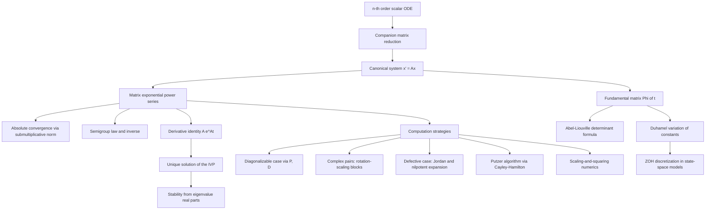

# Topic 04: Systems of ODEs and the Matrix Exponential

## 1. Master Overview

Almost nothing in nature evolves alone. Salt concentrations in coupled tanks, currents in an RLC network, populations of predators and prey, hidden states of a recurrent neural network — each quantity changes at a rate that depends on the *current values of all the others*. The mathematical home for such coupled evolution is the first-order system $\mathbf{x}' = \mathbf{f}(t, \mathbf{x})$, and a fundamental reduction shows this is not a special case but the *general* one: every $n$-th order ODE becomes a first-order system in $n$ variables via its companion matrix. The constant-coefficient linear system $\mathbf{x}' = A\mathbf{x}$ is therefore the canonical object of the subject — every linear ODE of any order, and the linearization of every nonlinear system near an equilibrium, lives here.

The scalar equation $x' = ax$ is solved by $e^{at}x_0$, and the entire module is the story of making that formula work when $a$ becomes a matrix. The matrix exponential $e^{At} = \sum_{k \ge 0} (At)^k/k!$ converges absolutely for every square matrix, solves the initial value problem uniquely, and satisfies a family of beautiful identities: the semigroup law $e^{A(t+s)} = e^{At}e^{As}$, invertibility with inverse $e^{-At}$, and Jacobi's formula $\det e^{A} = e^{\operatorname{tr} A}$. It also carries a famous trap: $e^{A+B} \ne e^A e^B$ unless $AB = BA$. Computing $e^{At}$ is its own craft — diagonalization when possible, rotation-scaling blocks for complex eigenvalues, nilpotent expansions for defective matrices, Putzer's algorithm, and (numerically) scaling-and-squaring rather than any of the "nineteen dubious ways."

Beyond exact solutions, the matrix exponential is the backbone of the variation-of-constants (Duhamel) formula for forced systems, the master equation of continuous-time Markov chains $P(t) = e^{Qt}$, quantum time evolution $e^{-iHt}$, heat flow on graphs $e^{-Lt}$, and — in modern machine learning — the zero-order-hold discretization $\bar{A} = e^{A\Delta}$ at the heart of state-space models like S4 and Mamba, as well as the eigenvalue analysis of vanishing and exploding gradients in linear RNNs.

> [!NOTE]
> Jacobi's formula $\det e^{At} = e^{t \operatorname{tr} A}$ implies that $e^{At}$ is invertible for *every* matrix $A$ and every time $t$: a linear flow can compress volume exponentially fast but can never crush it to zero in finite time, so every linear evolution is exactly reversible by running $e^{-At}$.

## 2. First-Principles Framework

- **Phenomenon**: Several interacting quantities evolve simultaneously, each rate depending linearly on the current values of all the others — coupled tanks, spring-mass chains, Markov-chain probabilities, RNN hidden states.
- **Goal**: Solve $\mathbf{x}' = A\mathbf{x}$, $\mathbf{x}(0) = \mathbf{x}_0$ in closed form, and read the qualitative fate of the system (decay, oscillation, growth) directly from the spectrum of $A$.
- **Governing Equation**: $\mathbf{x}'(t) = A\mathbf{x}(t) + \mathbf{g}(t)$, with the homogeneous case $\mathbf{g} = \mathbf{0}$ as the core object.
- **Formulation**: Mimic the scalar solution $e^{at}$ by *defining* $e^{At} = \sum_{k=0}^{\infty} \frac{(At)^k}{k!}$, then prove convergence, differentiability, and uniqueness of the resulting solution $\mathbf{x}(t) = e^{At}\mathbf{x}_0$.
- **Resolution/Decomposition**: Eigendecomposition $A = PDP^{-1}$ decouples the system into $n$ scalar modes $e^{\lambda_i t}$; Jordan blocks handle defective matrices via nilpotent corrections $e^{\lambda t}(I + Nt + \cdots)$; Duhamel's formula $\mathbf{x}(t) = e^{At}\mathbf{x}_0 + \int_0^t e^{A(t-s)}\mathbf{g}(s)\,ds$ absorbs forcing.

## 3. Mermaid Concept Map

## 4. Common Misconceptions

| Misconception | Mathematical Reality | Correct Mental Model |
| :--- | :--- | :--- |
| $e^{A+B} = e^A e^B$ always holds. | It holds if $AB = BA$; for the nilpotent matrix units $A = E_{12}$ and $B = E_{21}$ the two sides differ ($\cosh 1 \ne 2$ in the top-left entry). | The scalar law of exponents survives only on commuting families; the failure is measured by commutators (BCH series). |
| $e^{At}$ is computed by exponentiating each entry of $At$. | The series involves matrix *powers*, which mix entries; entrywise exponentiation is wrong except for diagonal matrices. | Think of $e^{At}$ as a flow operator built from repeated application of $A$, not as an entrywise recipe. |
| A defective matrix makes $\mathbf{x}' = A\mathbf{x}$ unsolvable in closed form. | Writing $A = \lambda I + N$ with $N$ nilpotent gives $e^{At} = e^{\lambda t}(I + Nt + \cdots + N^{m-1}t^{m-1}/(m-1)!)$ exactly. | Missing eigenvectors cost you polynomial factors $t^k e^{\lambda t}$, never solvability. |
| $e^{At}$ might be singular for some $A$ or $t$. | $\det e^{At} = e^{t \operatorname{tr} A} \ne 0$ for all $A, t$. | Every linear flow is invertible; run time backwards with $e^{-At}$. |
| Truncating the Taylor series is a good numerical algorithm for $e^{A}$. | For matrices with large or mixed-sign entries the series suffers catastrophic cancellation; production codes use scaling-and-squaring with Pade approximants. | The definition of $e^A$ and the algorithm for $e^A$ are different objects (Moler and Van Loan's nineteen dubious ways). |
| Complex eigenvalues mean the real system has complex solutions. | Conjugate pairs $a \pm ib$ combine into real rotation-scaling blocks $e^{at}(\cos bt, \sin bt)$. | Complex eigenvalues are how a real matrix encodes rotation; solutions spiral, they do not leave $\mathbb{R}^n$. |
| Eigenvalues with $\operatorname{Re}\lambda \le 0$ guarantee bounded solutions. | A Jordan block with a purely imaginary eigenvalue produces polynomial growth $t^k$; boundedness needs imaginary-axis eigenvalues to be semisimple. | Stability is a spectral condition *plus* an eigenvector-completeness condition on the boundary of the spectrum. |

## 5. Directory Inventory

| File | Description |
| :--- | :--- |
| [`README.md`](README.md) | This overview: framework, concept map, misconceptions, references. |
| [`first_principles.ipynb`](first_principles.ipynb) | Markdown-only deep dive: companion-matrix reduction, rigorous definition of $e^{At}$, six complete proofs (convergence, derivative, uniqueness, Jacobi's formula, Duhamel, Putzer), computational strategies and numerical caveats, physics and ML applications. |
| [`exercises.ipynb`](exercises.ipynb) | 20 fully solved problems in 4 levels: concept checks, hand computation of matrix exponentials, applied modeling (mixing tanks, oscillators, CTMCs, graph heat flow, RNNs, SSM discretization), and challenge proofs (boundedness criterion, Putzer for a defective 3x3, BCH commutator term). |

## 6. References

1. **Arnold, V. I.** *Ordinary Differential Equations* — Chapter 3 (linear systems, the exponential of a linear operator, complexification).
2. **Hirsch, M. W., Smale, S., & Devaney, R. L.** *Differential Equations, Dynamical Systems, and an Introduction to Chaos* — Chapters 5–6 (higher-dimensional linear systems, the exponential of a matrix).
3. **Boyce, W. E., & DiPrima, R. C.** *Elementary Differential Equations and Boundary Value Problems* — Chapter 7 (systems of first-order linear equations, fundamental matrices).
4. **Coddington, E. A., & Levinson, N.** *Theory of Ordinary Differential Equations* — Chapter 3 (linear systems, Abel–Liouville formula, variation of constants).
5. **Teschl, G.** *Ordinary Differential Equations and Dynamical Systems* — Chapter 3 (linear equations, Jordan canonical form and $e^{At}$).
6. **Perko, L.** *Differential Equations and Dynamical Systems* — Chapter 1 (linear systems, exponentials of operators, stability theory).
7. **Moler, C., & Van Loan, C.** (2003). "Nineteen Dubious Ways to Compute the Exponential of a Matrix, Twenty-Five Years Later," *SIAM Review* 45(1) — the definitive survey of numerical methods for $e^{A}$.
8. **Higham, N. J.** *Functions of Matrices: Theory and Computation* — Chapter 10 (the scaling-and-squaring algorithm used by `scipy.linalg.expm`).
9. **Gu, A., Goel, K., & Ré, C.** (2022). "Efficiently Modeling Long Sequences with Structured State Spaces" (ICLR) — $e^{A\Delta}$ discretization inside the S4 architecture.
10. **Chen, R. T. Q., Rubanova, Y., Bettencourt, J., & Duvenaud, D.** (2018). *Neural Ordinary Differential Equations* (NeurIPS) — continuous-depth networks generalizing linear flows.

Survey-level companion: [`../../calculus/15_ordinary_differential_equations/`](../../calculus/15_ordinary_differential_equations/) treats systems of ODEs as one section of a broad ODE overview; this module goes deeper on the single topic. The spectral machinery used throughout is developed in [`../../linear_algebra/06_eigenvalues_eigenvectors_spectral_theory/`](../../linear_algebra/06_eigenvalues_eigenvectors_spectral_theory/).
