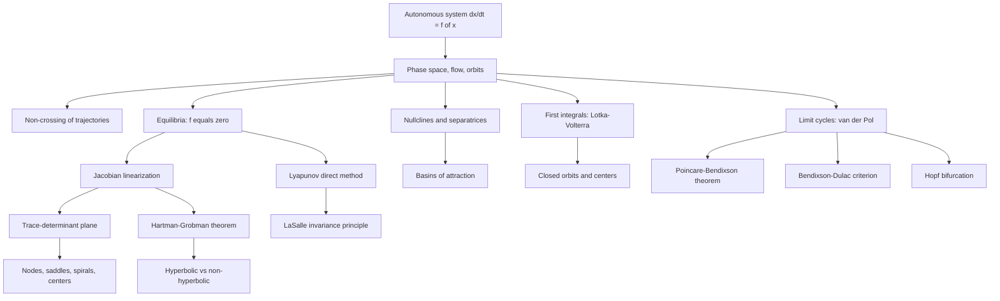

# Topic 05: Phase Plane and Stability Analysis

## 1. Master Overview

Most nonlinear differential equations cannot be solved in closed form, yet we can often say everything that matters about them: where solutions settle, whether they oscillate, and how the long-run fate of a trajectory depends on where it starts. This is the program of qualitative dynamics, initiated by Poincaré: replace the search for formulas with the study of the *phase portrait* — the geometric arrangement of all orbits of an autonomous system $\dot{\mathbf{x}} = \mathbf{f}(\mathbf{x})$ in its state space. In the plane, this geometry is astonishingly complete: equilibria, their local type, nullclines, separatrices, conserved quantities, and limit cycles together determine the global picture, and the Poincaré–Bendixson theorem guarantees that nothing wilder (in particular, no chaos) can occur.

The local theory rests on two pillars. First, near an equilibrium the Jacobian linearization classifies behavior through just two numbers — the trace $\tau$ and determinant $\Delta$ — yielding the celebrated trace–determinant diagram of nodes, saddles, spirals, and centers, with the Hartman–Grobman theorem certifying that this linear picture is faithful whenever the equilibrium is hyperbolic. Second, Lyapunov's direct method decides stability *without* solving or even linearizing: a single scalar function decreasing along trajectories acts as a generalized energy, and the LaSalle invariance principle sharpens it into a precision tool for asymptotic convergence.

These ideas are load-bearing far beyond classical mechanics. The damped pendulum, epidemic thresholds ($R_0$ in the SIR model), predator–prey cycles, and van der Pol relaxation oscillations are all phase-plane stories. In machine learning, gradient descent is a discretized flow whose convergence is exponential stability, Hopfield networks compute by descending a Lyapunov energy, and the notorious oscillation of GAN training is — literally — the phase portrait of a two-player vector field whose equilibrium is a center rather than a sink.

> [!NOTE]
> The Poincaré–Bendixson theorem: a bounded trajectory of a smooth planar autonomous system that stays away from equilibria must converge to a periodic orbit. Two dimensions are therefore too small for chaos — a rigidity result with no analogue in dimension three or higher.

## 2. First-Principles Framework

- **Phenomenon**: Nonlinear systems $\dot{\mathbf{x}} = \mathbf{f}(\mathbf{x})$ rarely admit closed-form solutions, yet their trajectories organize themselves into a small vocabulary of geometric behaviors: settling to equilibrium, escaping, or cycling.
- **Goal**: Determine the long-run behavior of every initial condition — the complete phase portrait — without solving the equation, using only local data (Jacobians) and scalar certificates (Lyapunov functions, first integrals).
- **Governing Equation**: $\dot{\mathbf{x}} = \mathbf{f}(\mathbf{x})$, $\mathbf{x} \in \mathbb{R}^2$, with equilibria $\mathbf{f}(\mathbf{x}^*) = \mathbf{0}$ and linearization $\dot{\boldsymbol{\eta}} = J(\mathbf{x}^*)\boldsymbol{\eta}$.
- **Formulation**: Classify each equilibrium via $\tau = \operatorname{tr} J$ and $\Delta = \det J$; certify stability via $\varepsilon$–$\delta$ definitions realized by Lyapunov functions $V$ with $\dot{V} \le 0$; detect or exclude periodic orbits via Poincaré–Bendixson and Bendixson–Dulac.
- **Resolution/Decomposition**: Decompose the plane by nullclines and separatrices into basins of attraction; decompose dynamics near equilibria along eigenvector directions; decompose global structure into equilibria, closed orbits, and connecting orbits.

## 3. Mermaid Concept Map

## 4. Common Misconceptions

| Misconception | Mathematical Reality | Correct Mental Model |
| :--- | :--- | :--- |
| The linearization always decides nonlinear stability. | Hartman–Grobman applies only to hyperbolic equilibria; when eigenvalues sit on the imaginary axis the nonlinear terms decide, as in $\dot{x} = -y + ax(x^2+y^2)$, $\dot{y} = x + ay(x^2+y^2)$. | Linearization is a magnifying glass that fogs up exactly on the borderline cases; there, reach for Lyapunov functions. |
| Trajectories of a planar system can cross each other. | Uniqueness (Picard–Lindelöf) forbids two distinct orbits through one point of an autonomous system. | Orbits partition phase space like non-intersecting streamlines of a steady fluid flow. |
| "Stable" means solutions converge to the equilibrium. | Lyapunov stability only requires staying $\varepsilon$-close; a center is stable but nothing converges. Asymptotic stability is strictly stronger. | Stable = never leaves the neighborhood; asymptotically stable = also comes home. |
| A nullcline is a trajectory. | A nullcline is where one component of the velocity vanishes; the flow generally crosses it (vertically on the $x$-nullcline, horizontally on the $y$-nullcline). | Nullclines are the scaffolding of the portrait, not the orbits themselves. |
| Negative real parts of eigenvalues mean monotone decay. | Spiral sinks oscillate while decaying, and non-normal linear systems show large transient growth before decay. | Eigenvalues govern the asymptotic envelope, not the transient shape. |
| Planar systems can be chaotic. | Poincaré–Bendixson: bounded planar orbits limit onto equilibria, closed orbits, or connections between equilibria — never strange attractors. | Chaos needs room; in the plane the Jordan curve theorem cages every trajectory. |
| A conserved quantity is a special kind of Lyapunov function. | A first integral is constant on orbits ($\dot{H} = 0$), so it can prove closed orbits and Lyapunov stability but never asymptotic stability. | First integrals freeze orbits onto level curves; Lyapunov functions push orbits down the level curves. |

## 5. Directory Inventory

| File | Description |
| :--- | :--- |
| [`README.md`](README.md) | This overview: framework, concept map, misconceptions, and literature for phase-plane and stability analysis. |
| [`first_principles.ipynb`](first_principles.ipynb) | Full theory: flows and orbits, $\varepsilon$–$\delta$ stability definitions, the trace–determinant classification, Hartman–Grobman, Lyapunov's direct method with proofs, Bendixson–Dulac via Green's theorem, Lotka–Volterra first integral, computational phase-portrait techniques, and GAN/Hopfield/PL-inequality applications. |
| [`exercises.ipynb`](exercises.ipynb) | 20 fully solved problems across four levels: eigenvalue classification drills, SIR endemic stability, damped pendulum, bilinear GAN games, Dulac functions, Hamiltonian level sets, and a Poincaré–Bendixson trapping-region construction. |

## 6. References

1. **Strogatz, S. H.** *Nonlinear Dynamics and Chaos* — Chapters 5–8: linear systems, phase plane, limit cycles, bifurcations; the canonical first source for this module.
2. **Hirsch, M. W., Smale, S., & Devaney, R. L.** *Differential Equations, Dynamical Systems, and an Introduction to Chaos* — Chapters 8–10: equilibria, phase portraits, closed orbits, and stability.
3. **Perko, L.** *Differential Equations and Dynamical Systems* — Chapters 1–3: rigorous Hartman–Grobman, stable manifold theorem, and Poincaré–Bendixson proofs.
4. **Arnold, V. I.** *Ordinary Differential Equations* — Chapters 3–5: phase flows, one-parameter groups of diffeomorphisms, and the geometric viewpoint.
5. **Khalil, H. K.** *Nonlinear Systems* — Chapters 3–4: Lyapunov stability theory, LaSalle invariance, and converse theorems.
6. **Boyce, W. E., & DiPrima, R. C.** *Elementary Differential Equations and Boundary Value Problems* — Chapter 9: nonlinear differential equations and stability, with the trace–determinant chart.
7. **Teschl, G.** *Ordinary Differential Equations and Dynamical Systems* — Chapters 6–8: dynamical systems, stability, and planar dynamics, freely available and fully rigorous.
8. **Chen, R. T. Q., Rubanova, Y., Bettencourt, J., & Duvenaud, D.** (2018) *Neural Ordinary Differential Equations*, NeurIPS — deep networks as flows, where stability of the learned vector field governs robustness.
9. **Mescheder, L., Geiger, A., & Nowozin, S.** (2018) *Which Training Methods for GANs do actually Converge?*, ICML — GAN training as a two-player vector field; eigenvalue analysis of the Dirac-GAN center and regularization as damping.
10. Survey-level companion: [`../../calculus/15_ordinary_differential_equations/`](../../calculus/15_ordinary_differential_equations/) — the calculus-track ODE overview that this module deepens on its qualitative-dynamics thread.
