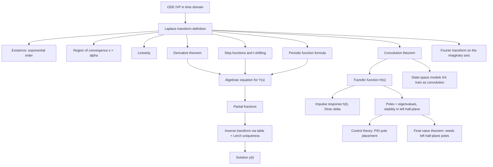

# Topic 06: Laplace Transform Methods

## 1. Master Overview

The Laplace transform is the great "change of arena" of applied mathematics: it maps a function of time $f(t)$
to a function of complex frequency $F(s) = \int_0^\infty e^{-st} f(t)\, dt$, and in doing so it converts calculus
into algebra. Differentiation in the time domain becomes multiplication by $s$, convolution becomes ordinary
multiplication, and an entire initial value problem — equation and initial conditions together — collapses into
one algebraic equation for $F(s)$. Solving a linear constant-coefficient ODE then reduces to partial fractions
and a table lookup.

Historically, the method descends from Oliver Heaviside's operational calculus of the 1890s: an engineer's
audacious symbolic manipulation of the differentiation operator that produced correct answers for telegraph-cable
problems without proof. Bromwich, Carson, and Doetsch later made the calculus rigorous by recognizing Heaviside's
operator rules as theorems about the integral transform that Laplace had studied a century earlier. The result is
a tool that is simultaneously rigorous analysis and mechanical procedure.

The transform's power is greatest exactly where classical methods are weakest: discontinuous forcing (a switch
thrown at $t = 2$), impulsive forcing (a hammer blow modeled by the Dirac delta), and input-output system
descriptions. The transfer function $H(s)$, poles as eigenvalues, stability from pole locations in the left
half-plane, and the convolution representation $y = h * u$ form the backbone of control theory — and, more
recently, of deep state-space sequence models such as S4, which train as convolutions and infer as recurrences
precisely because of the convolution theorem.

> [!NOTE]
> The derivative theorem $\mathcal{L}\{f'\}(s) = sF(s) - f(0)$ turns differentiation into multiplication by $s$ and automatically injects the initial condition. An $n$-th order linear IVP with constant coefficients therefore becomes a single algebraic equation whose solution $Y(s)$ already contains every initial condition — no separate step of "fitting constants" is ever needed.

## 2. First-Principles Framework

- **Phenomenon**: Linear ODE initial value problems driven by switched, impulsive, or periodic inputs are awkward in the time domain: undetermined coefficients fails on discontinuities, and matching solutions piecewise across every switching time is error-prone.
- **Goal**: Find an invertible linear map that converts differentiation into an algebraic operation, absorbs initial conditions automatically, and turns convolution integrals into products.
- **Governing Equation**: $F(s) = \mathcal{L}\{f\}(s) = \int_0^\infty e^{-st} f(t)\, dt$, convergent for $s \gt \alpha$ whenever $f$ is piecewise continuous of exponential order $\alpha$.
- **Formulation**: Apply $\mathcal{L}$ to $ay'' + by' + cy = g(t)$ using linearity and the derivative theorem to obtain $(as^2 + bs + c)Y(s) = G(s) + a s y(0) + a y'(0) + b y(0)$, an algebraic equation solved by division.
- **Resolution/Decomposition**: Decompose $Y(s)$ by partial fractions into table entries; each pole of $Y$ contributes one exponential/oscillatory mode, and Lerch's uniqueness theorem guarantees that inverting term by term recovers the one continuous solution $y(t)$.

The same framework, read as systems theory: with zero initial state the map from input to output is
multiplication by the transfer function $H(s)$, whose inverse transform is the impulse response $h(t)$;
convolution $y = h * u$ in time equals the product $Y = H U$ in frequency; and the poles of $H$ — the eigenvalues
of the underlying system matrix — decide stability by which half-plane they occupy. Everything from PID tuning to
S4 sequence layers is a corollary of this dictionary.

## 3. Mermaid Concept Map

## 4. Common Misconceptions

| Misconception | Mathematical Reality | Correct Mental Model |
| :--- | :--- | :--- |
| Every function has a Laplace transform. | The integral must converge: $f$ must be locally integrable and of exponential order; $e^{t^2}$ has no transform for any $s$. | The transform is a machine with an admission ticket: growth at worst $M e^{\alpha t}$, convergence for $s \gt \alpha$. |
| Inversion always requires the Bromwich contour integral. | For rational $F(s)$, partial fractions plus Lerch's uniqueness theorem give a fully rigorous inversion with no complex contour at all. | Table lookup is not a heuristic — uniqueness makes it a proof. |
| $\mathcal{L}\{fg\} = \mathcal{L}\{f\}\mathcal{L}\{g\}$. | Products transform to nothing simple; it is the convolution $(f*g)(t) = \int_0^t f(\tau) g(t-\tau)\, d\tau$ whose transform is $F(s)G(s)$. | Multiplication in the $s$-domain corresponds to convolution in the $t$-domain, and vice versa. |
| The Dirac delta is a function with $\delta(0) = \infty$. | $\delta$ is a distribution, the limit of unit-area pulses $d_\varepsilon$; only its action $\int \delta(t-c) f(t)\, dt = f(c)$ is defined. | Delta is a sampling instruction, not a graph; $\mathcal{L}\{\delta\} = 1$ because it samples $e^{-st}$ at $t = 0$. |
| The final value theorem always gives $\lim_{t \to \infty} f(t)$. | It requires every pole of $sF(s)$ in the open left half-plane; for $f = e^{t}$ or $f = \cos t$ the formula produces a finite number while $f$ has no limit. | Check pole locations first; the theorem reads off the limit only when a limit exists for pole-related reasons. |
| Initial conditions are handled after inversion, like integration constants. | The derivative theorem embeds $y(0), y'(0)$ into the algebraic equation itself. | The transform solves the IVP, not just the ODE — one pass, no constant-fitting. |
| The variable $s$ is mere bookkeeping. | $s = \sigma + i\omega$ is a complex frequency; on $s = i\omega$ the transform becomes the Fourier transform, and pole locations decide stability. | The $s$-plane is a map of behaviors: right half-plane growth, left half-plane decay, imaginary axis oscillation. |

## 5. Directory Inventory

| File | Description |
| :--- | :--- |
| [`README.md`](README.md) | This overview: framework, concept map, misconceptions, inventory, references. |
| [`first_principles.ipynb`](first_principles.ipynb) | Full theory in 23 cells: definition, exponential order and the existence proof with region of convergence; the core transform table derived from scratch; the operational theorems (derivative, both shiftings, scaling, multiplication by $t$, integrals, periodic functions); complete proofs of the convolution theorem, the t-shifting theorem, the final value theorem with counterexample, and an end-to-end discontinuous IVP; numerical inversion (Talbot, Gaver–Stehfest, ill-posedness); applications from switched RLC circuits and hammer blows to PID control, S4 state-space models, and RL discounting. |
| [`exercises.ipynb`](exercises.ipynb) | 20 fully solved problems in four levels: L0 concept checks (why transforms help, ROC, linearity limits, the meaning of delta); L1 foundations (transform derivations by induction and shifting, partial-fraction inversion for distinct, repeated, and complex roots, first- and second-order IVPs); L2 applications (RLC with a switch at $t = 2$, hammer-blow resonance, PID pole placement, the S4 kernel $K(t) = C e^{At} B$, discounted RL return as a Laplace evaluation, periodic drug dosing); L3 challenges (Gamma-function transforms of half-integer powers, the Dirichlet integral via division by $t$, a Volterra convolution equation, contour-free rigorous inversion and FVT edge cases). |

## 6. References

1. **Schiff, J. L.** *The Laplace Transform: Theory and Applications* (Springer) — the dedicated reference: existence, Lerch's theorem, operational rules, applications.
2. **Boyce, W. E., & DiPrima, R. C.** *Elementary Differential Equations and Boundary Value Problems*, Chapter 6 — step functions, impulses, convolution, and IVP solving at textbook pace.
3. **Tenenbaum, M., & Pollard, H.** *Ordinary Differential Equations*, Lessons on operators and Laplace methods — hundreds of worked transform problems.
4. **Coddington, E. A., & Levinson, N.** *Theory of Ordinary Differential Equations* — rigorous linear theory underlying the operational calculus.
5. **Arnold, V. I.** *Ordinary Differential Equations* — the exponential of an operator and the eigenvalue view of linear flows that poles encode.
6. **Doetsch, G.** *Introduction to the Theory and Application of the Laplace Transformation* (Springer) — the classical rigorous treatment that legitimized Heaviside's calculus.
7. **Ogata, K.** *Modern Control Engineering* — transfer functions, block diagrams, PID design, and stability from pole locations.
8. **Gu, A., Goel, K., & Ré, C.** (2022). *Efficiently Modeling Long Sequences with Structured State Spaces* (ICLR) — S4: the transfer-function and convolution-kernel view of $x' = Ax + Bu$ in deep learning.
9. **Chen, R. T. Q., Rubanova, Y., Bettencourt, J., & Duvenaud, D.** (2018). *Neural Ordinary Differential Equations* (NeurIPS) — continuous-time models for which the linear special case is exactly the SSM kernel.
10. Survey-level companion: [`../../calculus/15_ordinary_differential_equations/`](../../calculus/15_ordinary_differential_equations/) — the broad ODE overview that this module deepens on the transform-methods front.
