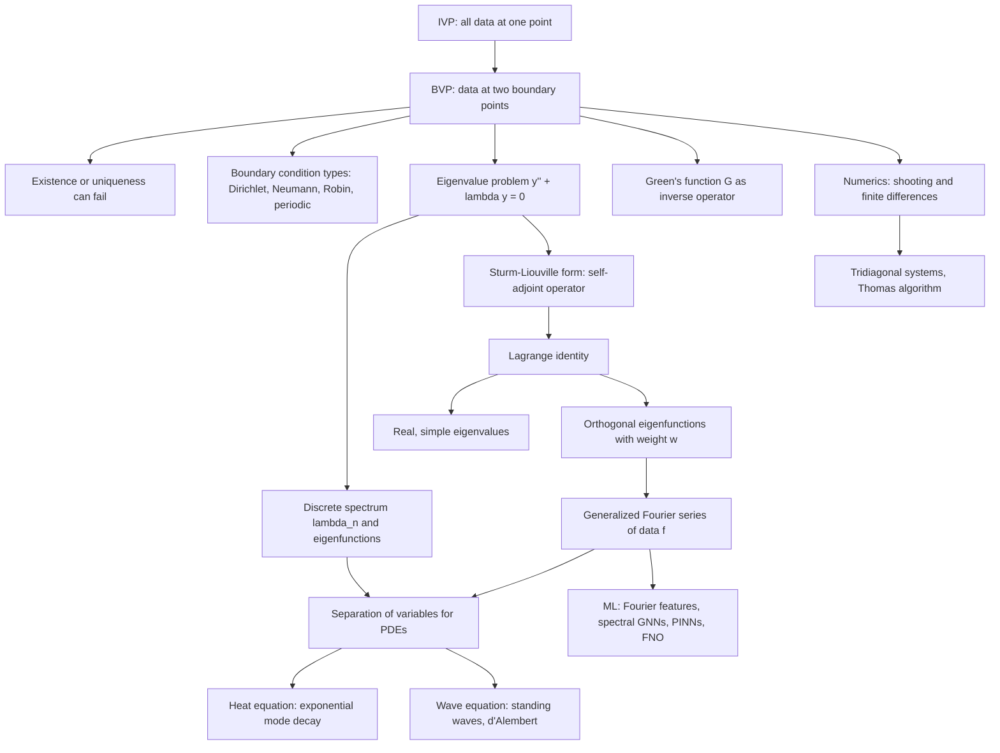

# Topic 07: Boundary Value Problems and PDE Preview

## 1. Master Overview

Everything in the course so far has been an *initial value problem*: all data specified at one instant, with Picard–Lindelöf guaranteeing a unique local solution. Boundary value problems (BVPs) change the rules — data is split between two ends of an interval, as when a heated rod has both endpoint temperatures pinned, or a guitar string is clamped at both ends. This seemingly small change destroys the clean existence–uniqueness theory: a perfectly innocent BVP can have no solution at all, exactly one, or infinitely many, depending on a delicate resonance between the operator and the boundary conditions.

The structure hiding underneath is the *eigenvalue problem*. Asking for which $\lambda$ the problem $y'' + \lambda y = 0$ with $y(0) = y(L) = 0$ admits nontrivial solutions produces a discrete ladder $\lambda_n = (n\pi/L)^2$ with eigenfunctions $\sin(n\pi x/L)$. Sturm–Liouville theory generalizes this: any regular self-adjoint problem $(p y')' + q y + \lambda w y = 0$ has real, simple eigenvalues increasing to infinity, and its eigenfunctions form a complete orthogonal basis — the reason Fourier series work. Green's functions provide the complementary view: the inverse of a differential operator is an integral operator with an explicit kernel.

These tools are precisely what is needed to enter the world of partial differential equations. Separation of variables converts the heat equation $u_t = k u_{xx}$ into a Sturm–Liouville eigenproblem in space and trivial exponential decay in time; the wave equation yields standing-wave modes and d'Alembert's traveling waves. The same mathematics reappears throughout machine learning: Fourier features and positional encodings are Laplacian eigenfunctions, graph Laplacian eigenvectors drive spectral GNNs, physics-informed neural networks minimize BVP residuals, and Fourier Neural Operators learn Green's-function-like solution operators.

> [!NOTE]
> Quantization is a purely boundary-driven phenomenon: the ODE $y'' + \lambda y = 0$ accepts every $\lambda$ on the line, but imposing $y(0) = y(L) = 0$ collapses the spectrum to the discrete set $\lambda_n = (n\pi/L)^2$. This one mechanism explains why a guitar string plays discrete harmonics and why the electron in a quantum well has discrete energy levels.

## 2. First-Principles Framework

The module is built by asking what changes when data moves from one instant to two boundary points, and following the consequences all the way to PDEs:

- **Phenomenon**: Steady heat flow in a rod, standing waves on a clamped string, and quantum particles in wells are all governed by ODEs whose data lives at *two spatial endpoints* rather than one initial instant — and admissible states exist only for special parameter values.
- **Goal**: Decide when a BVP is solvable and how to solve it; find the eigenvalue–eigenfunction ladder of a differential operator; and use that ladder to expand arbitrary data and to solve time-dependent PDEs.
- **Governing Equation**: The regular Sturm–Liouville problem $(p(x) y')' + q(x) y + \lambda w(x) y = 0$ on $[a, b]$ with separated boundary conditions $\alpha_1 y(a) + \alpha_2 y'(a) = 0$, $\beta_1 y(b) + \beta_2 y'(b) = 0$.
- **Formulation**: Self-adjointness via the Lagrange identity forces real eigenvalues and $w$-weighted orthogonality; completeness of eigenfunctions turns "solve the PDE" into "compute generalized Fourier coefficients $c_n = \langle f, \varphi_n \rangle_w / \lVert \varphi_n \rVert_w^2$".
- **Resolution/Decomposition**: Three complementary solution engines — eigenfunction expansion (spectral), Green's function $y(x) = \int_a^b G(x, \xi) f(\xi)\, d\xi$ (integral-operator inverse), and numerics (shooting on the missing slope; finite differences yielding tridiagonal systems).

## 3. Mermaid Concept Map

The map below traces the module's single through-line: boundary conditions break IVP theory, eigenvalue problems explain the breakage, Sturm–Liouville theory organizes the eigenstructure, and that structure powers Green's functions, numerics, PDEs, and modern spectral machine learning.

Note how every downstream node routes through either the eigenfunction basis or the Green's function — the two faces (spectral and integral) of inverting one differential operator.

## 4. Common Misconceptions

Each row contrasts a tempting but wrong belief with the precise mathematical statement and the mental model that makes the truth memorable.

| Misconception | Mathematical Reality | Correct Mental Model |
| :--- | :--- | :--- |
| BVPs, like IVPs, always have a unique solution. | $y'' + y = 0$ with $y(0) = 0$, $y(\pi) = 1$ has *no* solution, while $y(\pi) = 0$ gives infinitely many; Picard–Lindelöf simply does not apply to two-point data. | Solvability is a resonance question: it depends on whether the boundary data "collides" with an eigenvalue of the operator. |
| Eigenvalues of a differential operator can be any complex number. | For regular Sturm–Liouville problems, all eigenvalues are real, simple, and form an increasing sequence $\lambda_1 \lt \lambda_2 \lt \cdots \to \infty$. | Self-adjointness plays the role that symmetry plays for matrices: the SL theorem is the infinite-dimensional spectral theorem. |
| Orthogonality of eigenfunctions is a lucky trigonometric accident. | The Lagrange identity forces $(\lambda_m - \lambda_n) \int_a^b w\, \varphi_m \varphi_n\, dx = 0$ for *any* regular SL problem, sines or not. | Orthogonality is structural — it comes from integration by parts and the boundary conditions, not from sine formulas. |
| A Green's function is just a trick for one specific $f$. | $G(x, \xi)$ depends only on the operator and boundary conditions; $y(x) = \int G(x, \xi) f(\xi)\, d\xi$ solves the BVP for *every* forcing $f$. | $G$ is the kernel of the inverse operator — the continuous analogue of a matrix inverse $A^{-1}$. |
| Separation of variables solves the heat equation only for sine-shaped initial data. | Superposition plus completeness handles arbitrary $f$: $u(x,t) = \sum b_n e^{-k(n\pi/L)^2 t} \sin(n\pi x/L)$ with $b_n$ the Fourier sine coefficients of $f$. | Any initial profile is a chord of eigenfunction "notes"; the PDE just decays each note at its own rate. |
| The shooting method and finite differences are interchangeable black boxes. | Shooting reduces a BVP to root-finding on the missing initial slope (fragile for stiff/nonlinear problems, e.g. Bratu's two solutions); finite differences yield a tridiagonal system solvable in $O(n)$ with $O(h^2)$ error. | Shooting reuses IVP machinery; finite differences discretize the operator itself — different failure modes, different diagnostics. |
| PDE types are just labels. | Parabolic (heat), hyperbolic (wave), and elliptic (Laplace) equations have fundamentally different well-posed data: initial-boundary, initial with finite speed, and pure boundary respectively. | Classification tells you *which data the equation is entitled to ask for* — it is the PDE analogue of the IVP/BVP distinction. |

## 5. Directory Inventory

Read `first_principles.ipynb` first for the theory and proofs, then work `exercises.ipynb` level by level; every problem is fully solved, so the exercises double as worked examples.

Attempt each problem before reading its solution — Level 2 problems are quantitative physics/ML scenarios, and Level 3 problems are proof-based challenges at Tripos difficulty.

| File | Description |
| :--- | :--- |
| [`README.md`](README.md) | This overview: master narrative, first-principles framework, concept map, misconceptions, and references. |
| [`first_principles.ipynb`](first_principles.ipynb) | Full theory: BC types and IVP/BVP contrast, eigenvalue problems solved completely, Sturm–Liouville theorem with Lagrange identity, six complete proofs (Dirichlet spectrum, orthogonality, reality, Green's function, heat-equation separation, energy uniqueness), numerical methods, and physics/ML applications. |
| [`exercises.ipynb`](exercises.ipynb) | 20 fully solved problems in four levels: concept checks, eigenproblem and Fourier computations, quantitative physics/ML scenarios (particle in a box, guitar string, Robin rod, PINN loss, FNO, discrete Laplacian), and challenge proofs (simplicity, Rayleigh quotient, d'Alembert, Bratu). |

## 6. References

Boyce & DiPrima is the primary text for this module (Chapters 10–11 cover nearly every section); Coddington & Levinson and Teschl supply the rigorous Sturm–Liouville theory, Evans the PDE side, and the final entries anchor the machine-learning applications.

1. **Boyce, W. E., & DiPrima, R. C.** *Elementary Differential Equations and Boundary Value Problems* — Chapters 10–11: two-point BVPs, Fourier series, Sturm–Liouville theory, and the heat/wave/Laplace trio.
2. **Coddington, E. A., & Levinson, N.** *Theory of Ordinary Differential Equations* — Chapters 7–8: rigorous self-adjoint eigenvalue problems and expansion theorems.
3. **Teschl, G.** *Ordinary Differential Equations and Dynamical Systems* — Chapter 5: Sturm–Liouville problems, oscillation theory, and spectral theory of compact operators.
4. **Evans, L. C.** *Partial Differential Equations* — Chapter 2: heat, wave, and Laplace equations; energy methods and uniqueness.
5. **Arnold, V. I.** *Ordinary Differential Equations* — geometric perspective on linear operators and boundary-value phenomena.
6. **Tenenbaum, M., & Pollard, H.** *Ordinary Differential Equations* — accessible worked BVP and eigenfunction computations.
7. **Raissi, M., Perdikaris, P., & Karniadakis, G. E.** (2019). *Physics-Informed Neural Networks* (J. Comput. Phys.) — solving BVPs by residual minimization.
8. **Li, Z., et al.** (2021). *Fourier Neural Operator for Parametric Partial Differential Equations* (ICLR) — learning Green's-function-like solution operators in Fourier space.
9. **Chen, R. T. Q., Rubanova, Y., Bettencourt, J., & Duvenaud, D.** (2018). *Neural Ordinary Differential Equations* (NeurIPS) — the continuous-depth bridge between ODE theory and deep learning.
10. Survey-level companion: [`../../calculus/15_ordinary_differential_equations/`](../../calculus/15_ordinary_differential_equations/) — the calculus-track ODE overview that this module deepens toward boundary-value and PDE territory.
