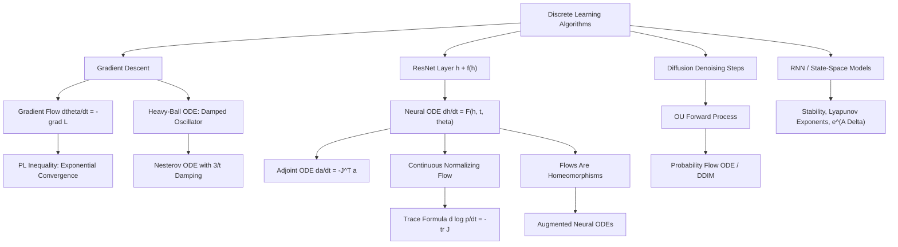

# Topic 08: ODEs in Machine Learning

## 1. Master Overview

Modern machine learning is, to a remarkable extent, applied dynamical systems theory. Training a model with gradient descent is the forward-Euler discretization of the gradient flow ODE $\dot{\theta} = -\nabla L(\theta)$; adding momentum turns optimization into a damped second-order oscillator; and Nesterov acceleration corresponds to a precisely tuned time-dependent damping schedule. On the architecture side, a residual network layer $h_{l+1} = h_l + f(h_l)$ is one Euler step of a continuous flow, and taking the depth-to-continuum limit yields the **Neural ODE**: a network whose forward pass is an ODE solve and whose backward pass integrates an adjoint ODE.

This module develops these correspondences with full rigor. We derive the adjoint sensitivity method that lets Neural ODEs backpropagate with $O(1)$ memory, prove the instantaneous change-of-variables formula $\frac{d}{dt}\log p = -\operatorname{tr}(\partial F/\partial h)$ that powers continuous normalizing flows, solve the Ornstein–Uhlenbeck moment ODEs underlying diffusion models, and analyze the probability flow ODE that makes diffusion sampling deterministic. We also treat recurrent networks and state-space models ($x' = Ax + Bu$, discretized through $e^{A\Delta}$) through the lens of linear stability, connecting vanishing and exploding gradients to Lyapunov exponents.

The payoff is a unified mental model: optimizers, deep architectures, generative samplers, and sequence models are all discretizations of continuous flows, and every stability, convergence, or expressiveness question about them is an ODE question studied in Topics 01–07.

> [!NOTE]
> The adjoint sensitivity method (Chen et al., NeurIPS 2018) computes exact gradients of a Neural ODE by solving a second ODE backward in time, $\dot{a} = -\left(\partial F/\partial h\right)^{T} a$, requiring memory independent of the number of solver steps — the continuous-time generalization of backpropagation.

## 2. First-Principles Framework

- **Phenomenon**: Discrete learning systems — gradient updates, residual layers, denoising steps, recurrent cells — behave like sampled trajectories of continuous processes; their step size controls a trade-off between cost and fidelity to an underlying flow.
- **Goal**: Identify the continuous flow behind each discrete algorithm, analyze it with ODE theory (existence-uniqueness, stability, phase-plane, transforms), and transfer the conclusions back to the discrete algorithm.
- **Governing Equation**: $\dot{h}(t) = F(h(t), t, \theta)$ — the state $h$ may be parameters (optimization), features (Neural ODEs), log-densities (normalizing flows), or noisy data (diffusion).
- **Formulation**: Forward pass or training run $=$ initial value problem; backpropagation $=$ adjoint/variational equation solved in reverse time; density evolution $=$ continuity equation whose Lagrangian form is the trace formula.
- **Resolution**: Solve or bound the continuous system (matrix exponentials, Lyapunov functions, Grönwall estimates), then account for discretization error and stability limits of the numerical scheme actually used.

The module leans on the whole curriculum:

- Topic 02 (Picard–Lindelöf, Grönwall) supplies well-posedness of Neural ODE flows and robustness bounds between nearby trajectories.
- Topic 03 (damped oscillators) is reused verbatim for momentum and Nesterov dynamics.
- Topic 04 (matrix exponentials, variational equations) powers state-space models and the adjoint method.
- Topic 05 (Lyapunov theory) becomes convergence analysis of optimizers and stability of recurrent dynamics.
- Topic 06 (transfer functions) reappears as the convolution-kernel view of SSM layers.

## 3. Mermaid Concept Map

## 4. Common Misconceptions

| Misconception | Mathematical Reality | Correct Mental Model |
|---|---|---|
| *"Neural ODEs are just very deep ResNets."* | A ResNet is the forward-Euler discretization with fixed step $\Delta t = 1$; a Neural ODE defines the continuous flow itself and lets an adaptive solver choose steps, so its effective depth (NFE) varies per input. | ResNet $=$ one particular discretization of a Neural ODE; the continuous object supports adaptive solvers, invertibility, and $O(1)$-memory adjoints. |
| *"The adjoint method is always better than backpropagating through the solver."* | The adjoint gives gradients of the *continuous* solution; backprop-through-solver gives exact gradients of the *discrete* computation. With loose tolerances, the reconstructed reverse trajectory drifts, and adjoint gradients can be noticeably inexact. | Optimize-then-discretize (adjoint) and discretize-then-optimize (backprop) commute only in the limit of vanishing solver error. |
| *"Gradient descent follows the gradient flow trajectory."* | GD is forward Euler with step $\eta$; it tracks the flow only for $\eta \to 0$ and is linearly stable on an $L$-smooth quadratic only when $\eta \le 2/L$. Large-step GD (edge of stability) leaves the flow regime entirely. | Gradient flow is the idealized limit; step size mediates a stability-speed trade-off exactly as in numerical ODE analysis. |
| *"Continuous normalizing flows must compute a Jacobian determinant."* | The instantaneous change-of-variables theorem replaces $\log \lvert \det J \rvert$ with the integral of $\operatorname{tr}(\partial F/\partial h)$, estimable in $O(d)$ via Hutchinson probes. | In continuous time, the determinant's time derivative collapses to a trace (Jacobi's formula) — the whole point of CNFs. |
| *"Diffusion model sampling is inherently stochastic."* | Every diffusion SDE has a probability flow ODE with identical marginals $p_t$; DDIM-style samplers integrate this deterministic ODE. | Diffusion sampling can be a deterministic, invertible ODE solve; stochasticity is a choice, not a necessity. |
| *"More momentum always accelerates convergence."* | For a quadratic mode with curvature $\lambda$, the heavy-ball ODE decays fastest at critical damping $\gamma = 2\sqrt{\lambda}$; excess momentum (underdamping) causes oscillation and overshoot, excess friction (overdamping) slows the return. | Momentum tunes a damped oscillator; aim near critical damping for the slowest curvature direction. |
| *"A Neural ODE can represent any continuous invertible map."* | Time-$T$ flow maps of Lipschitz fields are orientation-preserving homeomorphisms isotopic to the identity; in one dimension they are strictly increasing, so even $x \mapsto -x$ is unreachable without extra dimensions. | Flows deform space without tearing or reflecting; augmenting the state restores lost expressiveness. |

## 5. Directory Inventory

| File | Primary Description | Scope |
| :--- | :--- | :--- |
| [`README.md`](README.md) | Module overview, first-principles framework, concept map, misconceptions, references. | Orientation |
| [`first_principles.ipynb`](first_principles.ipynb) | Full theory: gradient flow and PL convergence, heavy-ball and Nesterov ODEs, Neural ODE adjoint derivation, CNF trace formula, OU moments and probability flow, RNN/SSM stability, solver and memory trade-offs. | Core Theory |
| [`exercises.ipynb`](exercises.ipynb) | 20 fully solved problems in 4 levels (L0 Concept Check, L1 Foundation, L2 AI/ML & Physics Applications, L3 Challenge) with complete derivations, boxed answers, and key takeaways. | Mastery Practice |

## 6. References

1. **Chen, R. T. Q., Rubanova, Y., Bettencourt, J., & Duvenaud, D.** (2018). *Neural Ordinary Differential Equations*. NeurIPS 2018. — Neural ODEs and the adjoint sensitivity method.
2. **Su, W., Boyd, S., & Candès, E. J.** (2016). *A Differential Equation for Modeling Nesterov's Accelerated Gradient Method*. JMLR 17(153). — The Nesterov ODE and its Lyapunov analysis.
3. **Song, Y., Sohl-Dickstein, J., Kingma, D. P., Kumar, A., Ermon, S., & Poole, B.** (2021). *Score-Based Generative Modeling through Stochastic Differential Equations*. ICLR 2021. — Diffusion SDEs and the probability flow ODE.
4. **Grathwohl, W., Chen, R. T. Q., Bettencourt, J., Sutskever, I., & Duvenaud, D.** (2019). *FFJORD: Free-Form Continuous Dynamics for Scalable Reversible Generative Models*. ICLR 2019. — Hutchinson trace estimation for CNFs.
5. **Gu, A., Goel, K., & Ré, C.** (2022). *Efficiently Modeling Long Sequences with Structured State Spaces (S4)*. ICLR 2022. — State-space sequence models built on $e^{A\Delta}$.
6. **E, W.** (2017). *A Proposal on Machine Learning via Dynamical Systems*. Communications in Mathematics and Statistics 5(1). — The dynamical-systems view of deep learning.
7. **Haber, E., & Ruthotto, L.** (2017). *Stable Architectures for Deep Neural Networks*. Inverse Problems 34(1). — Forward-propagation stability via eigenvalue analysis.
8. **Rubanova, Y., Chen, R. T. Q., & Duvenaud, D.** (2019). *Latent ODEs for Irregularly-Sampled Time Series*. NeurIPS 2019.
9. **Hirsch, M. W., Smale, S., & Devaney, R. L.** — *Differential Equations, Dynamical Systems, and an Introduction to Chaos*. Academic Press. — Flow and stability foundations used throughout.
10. **Arnold, V. I.** — *Ordinary Differential Equations*. MIT Press. — Geometric flows, variational equations, and Liouville's formula.
11. **Dupont, E., Doucet, A., & Teh, Y. W.** (2019). *Augmented Neural ODEs*. NeurIPS 2019. — Expressiveness limits of flows and the augmentation remedy.
12. **Kidger, P.** (2022). *On Neural Differential Equations*. DPhil thesis, University of Oxford. — Comprehensive modern survey of neural ODEs/SDEs/CDEs and solver practice.
13. Survey-level companion within this repository: [`../../calculus/15_ordinary_differential_equations/`](../../calculus/15_ordinary_differential_equations/).
