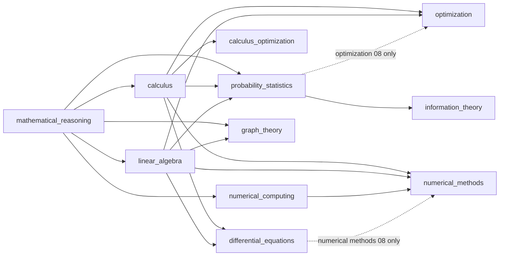

# Prerequisite Graph

This file is the repository-wide dependency graph over all **87 modules** in the eleven
curriculum areas.

It is the single source of truth for what a module may depend on. Every module `README.md`
must draw its Prerequisites and Downstream section from this file, not from memory.

---

## Why this file exists

The curriculum was written module by module, and it shows.

Only 20 of the 87 module READMEs contain any relative link at all, and none of them states
its prerequisites. There is no declared order to read the material in.

The consequence is worse than untidy navigation. Several modules silently use results that
are proved in a *later* module, so a reader working straight through meets machinery that
has not been introduced.

Three confirmed cases:

- `information_theory/01` and `information_theory/02` both close a central proof with
  "Gibbs' inequality, proved in Topic 04".
- `calculus/04` proves Newton's quadratic convergence with Taylor's theorem with Lagrange
  remainder, which is stated only in `calculus/09`.
- `calculus_optimization/03` sends the reader to `numerical_methods/03` for a conditioning
  and stiffness discussion that lives in two other modules.

Duplicated treatments then drift apart, because nothing links them. Fano's inequality is
proved three times inside `information_theory` in three notations. Courant-Fischer is stated
in `linear_algebra/06` and proved in `linear_algebra/09` with the opposite ordering convention.

This graph fixes the order, names the offending references, and designates one canonical
home for each duplicated topic.

---

## What an edge means

An edge `A -> B` means: **you cannot follow B without having done A.**

It does not mean the two are related, adjacent in a syllabus, or mutually illuminating.
If B states the result it borrows, with hypotheses, then B does not need an edge to A.

Three rules follow from the graph.

1. A module may cite only its prerequisites and their prerequisites. Anything else must be
   stated inline, with hypotheses, before it is used.
2. A **labelled preview** pointing forward is allowed, because nothing depends on it. A
   *proof step* that leans on a later module is not.
3. Every cross-module reference is a working relative markdown link, never the prose
   "Topic 04".

Prerequisite lists below name what a module directly leans on. The full requirement is the
transitive closure: a module also needs everything its prerequisites need.

---

## The area graph

Eleven areas. Solid arrows are area-wide dependencies; dashed arrows hold for a single
module only.

`mathematical_reasoning` reaches every other area, directly or through `calculus`,
`linear_algebra`, `numerical_computing`, `probability_statistics` and `graph_theory`.
It is the one area with no prerequisite of its own.

### Two areas that interleave

`calculus` and `linear_algebra` do not nest, so the area graph draws no arrow between them.
They interleave at module level:

- `calculus/10` through `calculus/15` need `linear_algebra/01` through `linear_algebra/07`.
- `linear_algebra/10` needs `calculus/12`.

The module tables below are the authority whenever the area picture is ambiguous.

---

## Mathematical reasoning

| Module | Prerequisites | Unlocks | What you can do after this |
| :--- | :--- | :--- | :--- |
| [mathematical_reasoning/01](../mathematical_reasoning/01_propositional_and_predicate_logic/) | none | [mathematical_reasoning/02](../mathematical_reasoning/02_sets_relations_and_functions/), [mathematical_reasoning/03](../mathematical_reasoning/03_proof_techniques/), [calculus/02](../calculus/02_limits_and_continuity/) | Read and negate a quantified statement, so an epsilon-delta definition parses correctly. |
| [mathematical_reasoning/02](../mathematical_reasoning/02_sets_relations_and_functions/) | [mathematical_reasoning/01](../mathematical_reasoning/01_propositional_and_predicate_logic/) | [mathematical_reasoning/03](../mathematical_reasoning/03_proof_techniques/), [mathematical_reasoning/05](../mathematical_reasoning/05_combinatorics_and_counting/), [calculus/01](../calculus/01_functions_and_properties/), [linear_algebra/01](../linear_algebra/01_vectors_spaces_and_subspaces/), [probability_statistics/01](../probability_statistics/01_sample_spaces_and_probability_axioms/) | Prove two sets equal by double inclusion and classify a map as injective, surjective or bijective. |
| [mathematical_reasoning/03](../mathematical_reasoning/03_proof_techniques/) | [mathematical_reasoning/01](../mathematical_reasoning/01_propositional_and_predicate_logic/), [mathematical_reasoning/02](../mathematical_reasoning/02_sets_relations_and_functions/) | [mathematical_reasoning/04](../mathematical_reasoning/04_induction_and_recursion/), [linear_algebra/01](../linear_algebra/01_vectors_spaces_and_subspaces/), [numerical_computing/01](../numerical_computing/01_ieee754_floating_point_representation/), [graph_theory/01](../graph_theory/01_graph_fundamentals_and_representations/) | Choose the proof shape a claim demands: direct, contrapositive, contradiction, cases, counterexample. |
| [mathematical_reasoning/04](../mathematical_reasoning/04_induction_and_recursion/) | [mathematical_reasoning/03](../mathematical_reasoning/03_proof_techniques/) | [mathematical_reasoning/05](../mathematical_reasoning/05_combinatorics_and_counting/), [mathematical_reasoning/06](../mathematical_reasoning/06_asymptotics_and_algorithmic_reasoning/), [calculus/08](../calculus/08_sequences_series_convergence/) | Prove a statement for every n, and justify a recursive algorithm by strong induction on input size. |
| [mathematical_reasoning/05](../mathematical_reasoning/05_combinatorics_and_counting/) | [mathematical_reasoning/02](../mathematical_reasoning/02_sets_relations_and_functions/), [mathematical_reasoning/04](../mathematical_reasoning/04_induction_and_recursion/) | [mathematical_reasoning/06](../mathematical_reasoning/06_asymptotics_and_algorithmic_reasoning/), [probability_statistics/01](../probability_statistics/01_sample_spaces_and_probability_axioms/), [graph_theory/03](../graph_theory/03_trees_and_minimum_spanning_trees/) | Count a finite set exactly, and bound one by pigeonhole or inclusion-exclusion. |
| [mathematical_reasoning/06](../mathematical_reasoning/06_asymptotics_and_algorithmic_reasoning/) | [mathematical_reasoning/04](../mathematical_reasoning/04_induction_and_recursion/), [mathematical_reasoning/05](../mathematical_reasoning/05_combinatorics_and_counting/) | [numerical_computing/04](../numerical_computing/04_vectorization_and_numpy_performance/), [graph_theory/02](../graph_theory/02_traversal_and_connectivity/) | Turn an algorithm into a recurrence and solve it for a tight asymptotic bound. |

## Calculus

| Module | Prerequisites | Unlocks | What you can do after this |
| :--- | :--- | :--- | :--- |
| [calculus/01](../calculus/01_functions_and_properties/) | [mathematical_reasoning/02](../mathematical_reasoning/02_sets_relations_and_functions/) | [calculus/02](../calculus/02_limits_and_continuity/) | Compute a natural domain, decide invertibility, and split a function into even and odd parts. |
| [calculus/02](../calculus/02_limits_and_continuity/) | [mathematical_reasoning/01](../mathematical_reasoning/01_propositional_and_predicate_logic/), [calculus/01](../calculus/01_functions_and_properties/) | [calculus/03](../calculus/03_single_variable_derivatives/), [calculus/07](../calculus/07_improper_integrals_special_functions/), [calculus/08](../calculus/08_sequences_series_convergence/), [calculus/10](../calculus/10_multivariable_functions_partials/) | Write an epsilon-delta proof, classify a discontinuity, and use IVT and EVT as existence guarantees. |
| [calculus/03](../calculus/03_single_variable_derivatives/) | [calculus/02](../calculus/02_limits_and_continuity/) | [calculus/04](../calculus/04_derivative_applications_optimization/), [calculus/05](../calculus/05_indefinite_and_definite_integrals/), [calculus/09](../calculus/09_taylor_and_power_series/), [calculus/10](../calculus/10_multivariable_functions_partials/), [numerical_computing/03](../numerical_computing/03_conditioning_and_condition_numbers/) | Differentiate anything built from the elementary catalogue and read the derivative as a local linear model. |
| [calculus/04](../calculus/04_derivative_applications_optimization/) | [calculus/03](../calculus/03_single_variable_derivatives/) | [numerical_methods/02](../numerical_methods/02_root_finding_methods/), [information_theory/01](../information_theory/01_self_information_and_entropy/) | Locate and certify a one-dimensional extremum, resolve an indeterminate limit, and run Newton's method. |
| [calculus/05](../calculus/05_indefinite_and_definite_integrals/) | [calculus/03](../calculus/03_single_variable_derivatives/) | [calculus/06](../calculus/06_integral_applications_geometry_physics/), [calculus/07](../calculus/07_improper_integrals_special_functions/), [calculus/15](../calculus/15_ordinary_differential_equations/), [probability_statistics/03](../probability_statistics/03_random_variables_and_distribution_functions/), [numerical_methods/06](../numerical_methods/06_numerical_integration_quadrature/) | Evaluate an integral by substitution, parts or partial fractions, and use both parts of the FTC. |
| [calculus/06](../calculus/06_integral_applications_geometry_physics/) | [calculus/05](../calculus/05_indefinite_and_definite_integrals/) | [calculus/13](../calculus/13_multiple_integrals_coordinate_transforms/) | Build the differential element for a length, area, volume, work or centre-of-mass problem. |
| [calculus/07](../calculus/07_improper_integrals_special_functions/) | [calculus/02](../calculus/02_limits_and_continuity/), [calculus/05](../calculus/05_indefinite_and_definite_integrals/) | [probability_statistics/05](../probability_statistics/05_continuous_distributions/), [differential_equations/06](../differential_equations/06_laplace_transform_methods/) | Decide whether an improper integral converges, and evaluate it with Gamma, Beta or parameter differentiation. |
| [calculus/08](../calculus/08_sequences_series_convergence/) | [mathematical_reasoning/04](../mathematical_reasoning/04_induction_and_recursion/), [calculus/02](../calculus/02_limits_and_continuity/) | [calculus/09](../calculus/09_taylor_and_power_series/), [probability_statistics/04](../probability_statistics/04_discrete_distributions/), [differential_equations/02](../differential_equations/02_existence_uniqueness_picard_lindelof/) | Decide convergence of a series with the right test, and separate absolute from conditional convergence. |
| [calculus/09](../calculus/09_taylor_and_power_series/) | [calculus/03](../calculus/03_single_variable_derivatives/), [calculus/08](../calculus/08_sequences_series_convergence/) | [calculus/12](../calculus/12_hessian_jacobian_curvature/), [calculus/15](../calculus/15_ordinary_differential_equations/), [probability_statistics/06](../probability_statistics/06_expectation_variance_and_moments/), [probability_statistics/08](../probability_statistics/08_law_of_large_numbers_and_clt/), [calculus_optimization/02](../calculus_optimization/02_taylor_approximation_and_local_models/), [optimization/02](../optimization/02_unconstrained_optimality_conditions/), [numerical_methods/01](../numerical_methods/01_error_analysis_and_floating_point/) | Bound a truncation error with an explicit remainder, and find a radius of convergence. |
| [calculus/10](../calculus/10_multivariable_functions_partials/) | [calculus/02](../calculus/02_limits_and_continuity/), [calculus/03](../calculus/03_single_variable_derivatives/), [linear_algebra/01](../linear_algebra/01_vectors_spaces_and_subspaces/) | [calculus/11](../calculus/11_gradients_directional_derivatives/) | Compute partial derivatives on R^n and tell partial, directional and Frechet differentiability apart. |
| [calculus/11](../calculus/11_gradients_directional_derivatives/) | [calculus/10](../calculus/10_multivariable_functions_partials/), [linear_algebra/04](../linear_algebra/04_orthogonality_projections_and_qr/) | [calculus/12](../calculus/12_hessian_jacobian_curvature/), [calculus/14](../calculus/14_vector_calculus_field_theorems/), [calculus_optimization/01](../calculus_optimization/01_derivatives_and_gradients_for_ml/), [optimization/03](../optimization/03_gradient_descent_and_convergence/), [optimization/05](../optimization/05_constrained_optimization_lagrange/) | Read the gradient as the steepest-ascent direction and as the normal to a level set. |
| [calculus/12](../calculus/12_hessian_jacobian_curvature/) | [calculus/09](../calculus/09_taylor_and_power_series/), [calculus/11](../calculus/11_gradients_directional_derivatives/), [linear_algebra/06](../linear_algebra/06_eigenvalues_eigenvectors_spectral_theory/) | [calculus/13](../calculus/13_multiple_integrals_coordinate_transforms/), [linear_algebra/10](../linear_algebra/10_matrix_calculus_graph_and_ai_applications/), [probability_statistics/09](../probability_statistics/09_maximum_likelihood_and_map_estimation/), [calculus_optimization/02](../calculus_optimization/02_taylor_approximation_and_local_models/), [optimization/01](../optimization/01_problem_formulation_and_convexity/), [differential_equations/05](../differential_equations/05_phase_plane_and_stability_analysis/) | Classify a critical point from Hessian eigenvalues, and read the Jacobian determinant as a volume factor. |
| [calculus/13](../calculus/13_multiple_integrals_coordinate_transforms/) | [calculus/06](../calculus/06_integral_applications_geometry_physics/), [calculus/12](../calculus/12_hessian_jacobian_curvature/), [linear_algebra/05](../linear_algebra/05_determinants_trace_and_matrix_polynomials/) | [calculus/14](../calculus/14_vector_calculus_field_theorems/), [probability_statistics/07](../probability_statistics/07_joint_distributions_and_multivariate_normal/) | Set up an iterated integral in the coordinate system that fits, carrying the Jacobian factor correctly. |
| [calculus/14](../calculus/14_vector_calculus_field_theorems/) | [calculus/11](../calculus/11_gradients_directional_derivatives/), [calculus/13](../calculus/13_multiple_integrals_coordinate_transforms/) | [differential_equations/07](../differential_equations/07_boundary_value_problems_and_pde_preview/) | Convert between circulation, flux and volume integrals with Green, Stokes and the divergence theorem. |
| [calculus/15](../calculus/15_ordinary_differential_equations/) | [calculus/05](../calculus/05_indefinite_and_definite_integrals/), [calculus/09](../calculus/09_taylor_and_power_series/), [linear_algebra/07](../linear_algebra/07_canonical_forms_and_svd/) | [differential_equations/01](../differential_equations/01_classification_and_first_order_odes/) | Solve first- and second-order ODEs, exponentiate a matrix, and read a two-dimensional phase portrait. |

## Linear algebra

| Module | Prerequisites | Unlocks | What you can do after this |
| :--- | :--- | :--- | :--- |
| [linear_algebra/01](../linear_algebra/01_vectors_spaces_and_subspaces/) | [mathematical_reasoning/02](../mathematical_reasoning/02_sets_relations_and_functions/), [mathematical_reasoning/03](../mathematical_reasoning/03_proof_techniques/) | [calculus/10](../calculus/10_multivariable_functions_partials/), [linear_algebra/02](../linear_algebra/02_linear_maps_and_matrix_transformations/), [differential_equations/03](../differential_equations/03_second_order_linear_odes/) | Decide whether a set is a subspace, and compute span, independence, basis and dimension. |
| [linear_algebra/02](../linear_algebra/02_linear_maps_and_matrix_transformations/) | [linear_algebra/01](../linear_algebra/01_vectors_spaces_and_subspaces/) | [linear_algebra/03](../linear_algebra/03_linear_systems_and_direct_factorizations/), [linear_algebra/05](../linear_algebra/05_determinants_trace_and_matrix_polynomials/), [calculus_optimization/01](../calculus_optimization/01_derivatives_and_gradients_for_ml/), [optimization/05](../optimization/05_constrained_optimization_lagrange/), [graph_theory/01](../graph_theory/01_graph_fundamentals_and_representations/) | Represent a linear map as a matrix, compute its kernel and image, and change basis. |
| [linear_algebra/03](../linear_algebra/03_linear_systems_and_direct_factorizations/) | [linear_algebra/02](../linear_algebra/02_linear_maps_and_matrix_transformations/) | [linear_algebra/04](../linear_algebra/04_orthogonality_projections_and_qr/), [optimization/04](../optimization/04_line_search_newton_quasi_newton/), [numerical_methods/04](../numerical_methods/04_polynomial_and_spline_interpolation/) | Solve a linear system by LU, PLU or Cholesky, and describe its full solution set. |
| [linear_algebra/04](../linear_algebra/04_orthogonality_projections_and_qr/) | [linear_algebra/03](../linear_algebra/03_linear_systems_and_direct_factorizations/) | [calculus/11](../calculus/11_gradients_directional_derivatives/), [linear_algebra/06](../linear_algebra/06_eigenvalues_eigenvectors_spectral_theory/) | Project onto a subspace, orthogonalize stably, and solve least squares through QR. |
| [linear_algebra/05](../linear_algebra/05_determinants_trace_and_matrix_polynomials/) | [linear_algebra/02](../linear_algebra/02_linear_maps_and_matrix_transformations/) | [calculus/13](../calculus/13_multiple_integrals_coordinate_transforms/), [linear_algebra/06](../linear_algebra/06_eigenvalues_eigenvectors_spectral_theory/), [graph_theory/03](../graph_theory/03_trees_and_minimum_spanning_trees/) | Compute determinant and trace, and reduce a matrix polynomial with Cayley-Hamilton. |
| [linear_algebra/06](../linear_algebra/06_eigenvalues_eigenvectors_spectral_theory/) | [linear_algebra/04](../linear_algebra/04_orthogonality_projections_and_qr/), [linear_algebra/05](../linear_algebra/05_determinants_trace_and_matrix_polynomials/) | [calculus/12](../calculus/12_hessian_jacobian_curvature/), [linear_algebra/07](../linear_algebra/07_canonical_forms_and_svd/), [linear_algebra/08](../linear_algebra/08_numerical_linear_algebra_iterative_solvers/), [probability_statistics/07](../probability_statistics/07_joint_distributions_and_multivariate_normal/), [calculus_optimization/03](../calculus_optimization/03_gradient_descent_mechanics/), [optimization/01](../optimization/01_problem_formulation_and_convexity/), [differential_equations/07](../differential_equations/07_boundary_value_problems_and_pde_preview/), [numerical_methods/03](../numerical_methods/03_fixed_point_iteration_and_convergence/), [graph_theory/06](../graph_theory/06_graph_laplacian_and_spectral_theory/) | Diagonalize when possible, apply the spectral theorem, and localize a spectrum with Gershgorin discs. |
| [linear_algebra/07](../linear_algebra/07_canonical_forms_and_svd/) | [linear_algebra/06](../linear_algebra/06_eigenvalues_eigenvectors_spectral_theory/) | [calculus/15](../calculus/15_ordinary_differential_equations/), [linear_algebra/09](../linear_algebra/09_numerical_spectrum_algorithms/), [linear_algebra/10](../linear_algebra/10_matrix_calculus_graph_and_ai_applications/), [numerical_computing/03](../numerical_computing/03_conditioning_and_condition_numbers/), [optimization/07](../optimization/07_linear_quadratic_conic_programs/), [differential_equations/04](../differential_equations/04_systems_of_odes_matrix_exponential/), [numerical_methods/07](../numerical_methods/07_linear_least_squares/) | Compute an SVD, form the pseudoinverse, and produce the optimal low-rank approximation. |
| [linear_algebra/08](../linear_algebra/08_numerical_linear_algebra_iterative_solvers/) | [linear_algebra/06](../linear_algebra/06_eigenvalues_eigenvectors_spectral_theory/), [numerical_computing/03](../numerical_computing/03_conditioning_and_condition_numbers/) | [linear_algebra/09](../linear_algebra/09_numerical_spectrum_algorithms/) | Choose between a direct and a Krylov solver, and predict CG or GMRES behaviour from the spectrum. |
| [linear_algebra/09](../linear_algebra/09_numerical_spectrum_algorithms/) | [linear_algebra/07](../linear_algebra/07_canonical_forms_and_svd/), [linear_algebra/08](../linear_algebra/08_numerical_linear_algebra_iterative_solvers/) | [graph_theory/07](../graph_theory/07_spectral_clustering_and_gnn_applications/) | Compute a spectrum by power, QR or Lanczos iteration, with a convergence rate you can predict. |
| [linear_algebra/10](../linear_algebra/10_matrix_calculus_graph_and_ai_applications/) | [calculus/12](../calculus/12_hessian_jacobian_curvature/), [linear_algebra/07](../linear_algebra/07_canonical_forms_and_svd/) | none | Differentiate matrix expressions, and analyse a Markov chain or a linear dynamical system. |

## Numerical computing

| Module | Prerequisites | Unlocks | What you can do after this |
| :--- | :--- | :--- | :--- |
| [numerical_computing/01](../numerical_computing/01_ieee754_floating_point_representation/) | [mathematical_reasoning/03](../mathematical_reasoning/03_proof_techniques/) | [numerical_computing/02](../numerical_computing/02_error_propagation_and_stability_tricks/), [numerical_computing/04](../numerical_computing/04_vectorization_and_numpy_performance/) | Read an IEEE-754 bit pattern, quote ulp and unit roundoff, and pick a format for a workload. |
| [numerical_computing/02](../numerical_computing/02_error_propagation_and_stability_tricks/) | [numerical_computing/01](../numerical_computing/01_ieee754_floating_point_representation/) | [numerical_computing/03](../numerical_computing/03_conditioning_and_condition_numbers/) | Spot catastrophic cancellation and rewrite the expression so it does not happen. |
| [numerical_computing/03](../numerical_computing/03_conditioning_and_condition_numbers/) | [calculus/03](../calculus/03_single_variable_derivatives/), [linear_algebra/07](../linear_algebra/07_canonical_forms_and_svd/), [numerical_computing/02](../numerical_computing/02_error_propagation_and_stability_tricks/) | [linear_algebra/08](../linear_algebra/08_numerical_linear_algebra_iterative_solvers/), [numerical_computing/05](../numerical_computing/05_numerical_stability_in_deep_learning/), [calculus_optimization/03](../calculus_optimization/03_gradient_descent_mechanics/), [numerical_methods/01](../numerical_methods/01_error_analysis_and_floating_point/) | Compute a condition number, and separate an ill-conditioned problem from an unstable algorithm. |
| [numerical_computing/04](../numerical_computing/04_vectorization_and_numpy_performance/) | [mathematical_reasoning/06](../mathematical_reasoning/06_asymptotics_and_algorithmic_reasoning/), [numerical_computing/01](../numerical_computing/01_ieee754_floating_point_representation/) | [numerical_computing/05](../numerical_computing/05_numerical_stability_in_deep_learning/) | Predict whether a NumPy kernel is memory- or compute-bound, and restructure it to remove passes. |
| [numerical_computing/05](../numerical_computing/05_numerical_stability_in_deep_learning/) | [numerical_computing/03](../numerical_computing/03_conditioning_and_condition_numbers/), [numerical_computing/04](../numerical_computing/04_vectorization_and_numpy_performance/) | none | Stabilize softmax, cross-entropy, normalization and mixed-precision training in narrow formats. |

## Probability and statistics

| Module | Prerequisites | Unlocks | What you can do after this |
| :--- | :--- | :--- | :--- |
| [probability_statistics/01](../probability_statistics/01_sample_spaces_and_probability_axioms/) | [mathematical_reasoning/02](../mathematical_reasoning/02_sets_relations_and_functions/), [mathematical_reasoning/05](../mathematical_reasoning/05_combinatorics_and_counting/) | [probability_statistics/02](../probability_statistics/02_conditional_probability_and_bayes/) | Build a probability space, and compute with the axioms, inclusion-exclusion and the union bound. |
| [probability_statistics/02](../probability_statistics/02_conditional_probability_and_bayes/) | [probability_statistics/01](../probability_statistics/01_sample_spaces_and_probability_axioms/) | [probability_statistics/03](../probability_statistics/03_random_variables_and_distribution_functions/) | Update a probability with Bayes' rule, and factorize a joint law by the chain rule. |
| [probability_statistics/03](../probability_statistics/03_random_variables_and_distribution_functions/) | [calculus/05](../calculus/05_indefinite_and_definite_integrals/), [probability_statistics/02](../probability_statistics/02_conditional_probability_and_bayes/) | [probability_statistics/04](../probability_statistics/04_discrete_distributions/), [probability_statistics/05](../probability_statistics/05_continuous_distributions/) | Move between CDF, PMF, PDF and quantile function, and transform a random variable. |
| [probability_statistics/04](../probability_statistics/04_discrete_distributions/) | [calculus/08](../calculus/08_sequences_series_convergence/), [probability_statistics/03](../probability_statistics/03_random_variables_and_distribution_functions/) | [probability_statistics/06](../probability_statistics/06_expectation_variance_and_moments/) | Choose the right discrete law and quote its mean, variance and generating function. |
| [probability_statistics/05](../probability_statistics/05_continuous_distributions/) | [calculus/07](../calculus/07_improper_integrals_special_functions/), [probability_statistics/03](../probability_statistics/03_random_variables_and_distribution_functions/) | [probability_statistics/06](../probability_statistics/06_expectation_variance_and_moments/), [probability_statistics/10](../probability_statistics/10_bayesian_inference/) | Choose the right continuous law, and derive one family from another. |
| [probability_statistics/06](../probability_statistics/06_expectation_variance_and_moments/) | [calculus/09](../calculus/09_taylor_and_power_series/), [probability_statistics/04](../probability_statistics/04_discrete_distributions/), [probability_statistics/05](../probability_statistics/05_continuous_distributions/) | [probability_statistics/07](../probability_statistics/07_joint_distributions_and_multivariate_normal/), [probability_statistics/08](../probability_statistics/08_law_of_large_numbers_and_clt/), [information_theory/01](../information_theory/01_self_information_and_entropy/) | Compute expectations, variances and moments, and apply Markov, Chebyshev and Jensen. |
| [probability_statistics/07](../probability_statistics/07_joint_distributions_and_multivariate_normal/) | [calculus/13](../calculus/13_multiple_integrals_coordinate_transforms/), [linear_algebra/06](../linear_algebra/06_eigenvalues_eigenvectors_spectral_theory/), [probability_statistics/06](../probability_statistics/06_expectation_variance_and_moments/) | [probability_statistics/09](../probability_statistics/09_maximum_likelihood_and_map_estimation/), [information_theory/02](../information_theory/02_joint_and_conditional_entropy/) | Manipulate a multivariate normal: marginals, conditionals, whitening and precision-matrix independence. |
| [probability_statistics/08](../probability_statistics/08_law_of_large_numbers_and_clt/) | [calculus/09](../calculus/09_taylor_and_power_series/), [probability_statistics/06](../probability_statistics/06_expectation_variance_and_moments/) | [probability_statistics/09](../probability_statistics/09_maximum_likelihood_and_map_estimation/), [optimization/08](../optimization/08_stochastic_optimization_for_ml/) | State and use the LLN and CLT with an explicit error rate, and build a confidence interval. |
| [probability_statistics/09](../probability_statistics/09_maximum_likelihood_and_map_estimation/) | [calculus/12](../calculus/12_hessian_jacobian_curvature/), [probability_statistics/07](../probability_statistics/07_joint_distributions_and_multivariate_normal/), [probability_statistics/08](../probability_statistics/08_law_of_large_numbers_and_clt/) | [probability_statistics/10](../probability_statistics/10_bayesian_inference/), [information_theory/03](../information_theory/03_cross_entropy_and_loss_functions/) | Derive an MLE or MAP estimator, and quote its Fisher information and asymptotic variance. |
| [probability_statistics/10](../probability_statistics/10_bayesian_inference/) | [probability_statistics/05](../probability_statistics/05_continuous_distributions/), [probability_statistics/09](../probability_statistics/09_maximum_likelihood_and_map_estimation/) | [information_theory/06](../information_theory/06_information_theory_in_deep_learning/) | Compute a posterior, a credible interval and a posterior predictive, exactly or by approximation. |

## Calculus for optimization

| Module | Prerequisites | Unlocks | What you can do after this |
| :--- | :--- | :--- | :--- |
| [calculus_optimization/01](../calculus_optimization/01_derivatives_and_gradients_for_ml/) | [calculus/11](../calculus/11_gradients_directional_derivatives/), [linear_algebra/02](../linear_algebra/02_linear_maps_and_matrix_transformations/) | [calculus_optimization/02](../calculus_optimization/02_taylor_approximation_and_local_models/) | Compute the gradient and Jacobian of a machine-learning loss, and check them by finite differences. |
| [calculus_optimization/02](../calculus_optimization/02_taylor_approximation_and_local_models/) | [calculus/09](../calculus/09_taylor_and_power_series/), [calculus/12](../calculus/12_hessian_jacobian_curvature/), [calculus_optimization/01](../calculus_optimization/01_derivatives_and_gradients_for_ml/) | [calculus_optimization/03](../calculus_optimization/03_gradient_descent_mechanics/) | Build first- and second-order local models with honest remainders, and derive the descent lemma. |
| [calculus_optimization/03](../calculus_optimization/03_gradient_descent_mechanics/) | [linear_algebra/06](../linear_algebra/06_eigenvalues_eigenvectors_spectral_theory/), [numerical_computing/03](../numerical_computing/03_conditioning_and_condition_numbers/), [calculus_optimization/02](../calculus_optimization/02_taylor_approximation_and_local_models/) | [calculus_optimization/04](../calculus_optimization/04_optimization_landscapes_and_convexity/) | Predict gradient-descent behaviour from the Hessian spectrum, and set a step size that cannot diverge. |
| [calculus_optimization/04](../calculus_optimization/04_optimization_landscapes_and_convexity/) | [calculus_optimization/03](../calculus_optimization/03_gradient_descent_mechanics/) | none | Classify the critical points of a loss landscape, and say what convexity does and does not buy. |

## Optimization

| Module | Prerequisites | Unlocks | What you can do after this |
| :--- | :--- | :--- | :--- |
| [optimization/01](../optimization/01_problem_formulation_and_convexity/) | [calculus/12](../calculus/12_hessian_jacobian_curvature/), [linear_algebra/06](../linear_algebra/06_eigenvalues_eigenvectors_spectral_theory/) | [optimization/02](../optimization/02_unconstrained_optimality_conditions/), [optimization/06](../optimization/06_kkt_conditions_and_duality/), [information_theory/04](../information_theory/04_kl_divergence_and_f_divergences/) | Put a problem in standard form, and certify convexity of the feasible set and the objective. |
| [optimization/02](../optimization/02_unconstrained_optimality_conditions/) | [calculus/09](../calculus/09_taylor_and_power_series/), [optimization/01](../optimization/01_problem_formulation_and_convexity/) | [optimization/03](../optimization/03_gradient_descent_and_convergence/), [optimization/05](../optimization/05_constrained_optimization_lagrange/) | Apply the first- and second-order conditions to classify a stationary point, and prove a minimizer exists. |
| [optimization/03](../optimization/03_gradient_descent_and_convergence/) | [calculus/11](../calculus/11_gradients_directional_derivatives/), [optimization/02](../optimization/02_unconstrained_optimality_conditions/) | [optimization/04](../optimization/04_line_search_newton_quasi_newton/), [optimization/08](../optimization/08_stochastic_optimization_for_ml/), [differential_equations/08](../differential_equations/08_odes_in_machine_learning/) | Prove a gradient-descent rate from smoothness and strong convexity, and pick a step size that attains it. |
| [optimization/04](../optimization/04_line_search_newton_quasi_newton/) | [linear_algebra/03](../linear_algebra/03_linear_systems_and_direct_factorizations/), [optimization/03](../optimization/03_gradient_descent_and_convergence/) | none | Guarantee global convergence with an Armijo or Wolfe line search, and run Newton, BFGS or L-BFGS. |
| [optimization/05](../optimization/05_constrained_optimization_lagrange/) | [calculus/11](../calculus/11_gradients_directional_derivatives/), [linear_algebra/02](../linear_algebra/02_linear_maps_and_matrix_transformations/), [optimization/02](../optimization/02_unconstrained_optimality_conditions/) | [optimization/06](../optimization/06_kkt_conditions_and_duality/) | Solve an equality-constrained problem with multipliers, and read a multiplier as a shadow price. |
| [optimization/06](../optimization/06_kkt_conditions_and_duality/) | [optimization/01](../optimization/01_problem_formulation_and_convexity/), [optimization/05](../optimization/05_constrained_optimization_lagrange/) | [optimization/07](../optimization/07_linear_quadratic_conic_programs/) | Write the KKT system, form the Lagrangian dual, and say when strong duality holds. |
| [optimization/07](../optimization/07_linear_quadratic_conic_programs/) | [linear_algebra/07](../linear_algebra/07_canonical_forms_and_svd/), [optimization/06](../optimization/06_kkt_conditions_and_duality/) | none | Recognize and model an LP, QP, SOCP or SDP, and exploit its dual. |
| [optimization/08](../optimization/08_stochastic_optimization_for_ml/) | [probability_statistics/08](../probability_statistics/08_law_of_large_numbers_and_clt/), [optimization/03](../optimization/03_gradient_descent_and_convergence/) | [information_theory/06](../information_theory/06_information_theory_in_deep_learning/) | Analyse minibatch noise, choose a step-size schedule, and explain momentum, AdaGrad and Adam. |

## Differential equations

| Module | Prerequisites | Unlocks | What you can do after this |
| :--- | :--- | :--- | :--- |
| [differential_equations/01](../differential_equations/01_classification_and_first_order_odes/) | [calculus/15](../calculus/15_ordinary_differential_equations/) | [differential_equations/02](../differential_equations/02_existence_uniqueness_picard_lindelof/), [differential_equations/03](../differential_equations/03_second_order_linear_odes/) | Classify a first-order ODE and solve it by integrating factor, separation, exactness or substitution. |
| [differential_equations/02](../differential_equations/02_existence_uniqueness_picard_lindelof/) | [calculus/08](../calculus/08_sequences_series_convergence/), [differential_equations/01](../differential_equations/01_classification_and_first_order_odes/) | [differential_equations/04](../differential_equations/04_systems_of_odes_matrix_exponential/), [numerical_methods/08](../numerical_methods/08_numerical_ode_solvers/) | Decide when an initial-value problem has a unique solution, and exhibit blow-up or non-uniqueness when it does not. |
| [differential_equations/03](../differential_equations/03_second_order_linear_odes/) | [linear_algebra/01](../linear_algebra/01_vectors_spaces_and_subspaces/), [differential_equations/01](../differential_equations/01_classification_and_first_order_odes/) | [differential_equations/04](../differential_equations/04_systems_of_odes_matrix_exponential/), [differential_equations/06](../differential_equations/06_laplace_transform_methods/), [differential_equations/07](../differential_equations/07_boundary_value_problems_and_pde_preview/) | Solve any constant-coefficient second-order linear ODE, forced or free, and read resonance off it. |
| [differential_equations/04](../differential_equations/04_systems_of_odes_matrix_exponential/) | [linear_algebra/07](../linear_algebra/07_canonical_forms_and_svd/), [differential_equations/02](../differential_equations/02_existence_uniqueness_picard_lindelof/), [differential_equations/03](../differential_equations/03_second_order_linear_odes/) | [differential_equations/05](../differential_equations/05_phase_plane_and_stability_analysis/) | Solve a linear system by matrix exponential in both the diagonalizable and the defective case. |
| [differential_equations/05](../differential_equations/05_phase_plane_and_stability_analysis/) | [calculus/12](../calculus/12_hessian_jacobian_curvature/), [differential_equations/04](../differential_equations/04_systems_of_odes_matrix_exponential/) | [differential_equations/08](../differential_equations/08_odes_in_machine_learning/) | Draw a phase portrait, classify equilibria, and prove stability with a Lyapunov function. |
| [differential_equations/06](../differential_equations/06_laplace_transform_methods/) | [calculus/07](../calculus/07_improper_integrals_special_functions/), [differential_equations/03](../differential_equations/03_second_order_linear_odes/) | none | Solve an initial-value problem by Laplace transform, and read stability off the pole locations. |
| [differential_equations/07](../differential_equations/07_boundary_value_problems_and_pde_preview/) | [calculus/14](../calculus/14_vector_calculus_field_theorems/), [linear_algebra/06](../linear_algebra/06_eigenvalues_eigenvectors_spectral_theory/), [differential_equations/03](../differential_equations/03_second_order_linear_odes/) | none | Solve a Sturm-Liouville eigenvalue problem, and separate variables in the heat and wave equations. |
| [differential_equations/08](../differential_equations/08_odes_in_machine_learning/) | [optimization/03](../optimization/03_gradient_descent_and_convergence/), [differential_equations/05](../differential_equations/05_phase_plane_and_stability_analysis/) | none | Read gradient flow, ResNets, Neural ODEs and diffusion samplers as one continuous-time story. |

## Numerical methods

| Module | Prerequisites | Unlocks | What you can do after this |
| :--- | :--- | :--- | :--- |
| [numerical_methods/01](../numerical_methods/01_error_analysis_and_floating_point/) | [calculus/09](../calculus/09_taylor_and_power_series/), [numerical_computing/03](../numerical_computing/03_conditioning_and_condition_numbers/) | [numerical_methods/02](../numerical_methods/02_root_finding_methods/), [numerical_methods/04](../numerical_methods/04_polynomial_and_spline_interpolation/), [numerical_methods/05](../numerical_methods/05_numerical_differentiation/), [numerical_methods/07](../numerical_methods/07_linear_least_squares/) | Bound a computed result by conditioning times backward error, and pick a stable formulation. |
| [numerical_methods/02](../numerical_methods/02_root_finding_methods/) | [calculus/04](../calculus/04_derivative_applications_optimization/), [numerical_methods/01](../numerical_methods/01_error_analysis_and_floating_point/) | [numerical_methods/03](../numerical_methods/03_fixed_point_iteration_and_convergence/) | Pick a root-finder for the situation at hand, and state its convergence order and failure modes. |
| [numerical_methods/03](../numerical_methods/03_fixed_point_iteration_and_convergence/) | [linear_algebra/06](../linear_algebra/06_eigenvalues_eigenvectors_spectral_theory/), [numerical_methods/02](../numerical_methods/02_root_finding_methods/) | none | Prove convergence from a contraction constant, and accelerate a linearly convergent iteration. |
| [numerical_methods/04](../numerical_methods/04_polynomial_and_spline_interpolation/) | [linear_algebra/03](../linear_algebra/03_linear_systems_and_direct_factorizations/), [numerical_methods/01](../numerical_methods/01_error_analysis_and_floating_point/) | none | Interpolate stably, avoid Runge's phenomenon, and build a cubic or B-spline. |
| [numerical_methods/05](../numerical_methods/05_numerical_differentiation/) | [numerical_methods/01](../numerical_methods/01_error_analysis_and_floating_point/) | [numerical_methods/06](../numerical_methods/06_numerical_integration_quadrature/) | Design a finite-difference stencil of any order, and pick the step that balances truncation against roundoff. |
| [numerical_methods/06](../numerical_methods/06_numerical_integration_quadrature/) | [calculus/05](../calculus/05_indefinite_and_definite_integrals/), [numerical_methods/05](../numerical_methods/05_numerical_differentiation/) | [numerical_methods/08](../numerical_methods/08_numerical_ode_solvers/) | Choose a quadrature rule with a known degree of exactness, and estimate its error honestly. |
| [numerical_methods/07](../numerical_methods/07_linear_least_squares/) | [linear_algebra/07](../linear_algebra/07_canonical_forms_and_svd/), [numerical_methods/01](../numerical_methods/01_error_analysis_and_floating_point/) | none | Solve least squares by QR or SVD rather than normal equations, and regularize a rank-deficient fit. |
| [numerical_methods/08](../numerical_methods/08_numerical_ode_solvers/) | [differential_equations/02](../differential_equations/02_existence_uniqueness_picard_lindelof/), [numerical_methods/06](../numerical_methods/06_numerical_integration_quadrature/) | none | Choose an explicit or implicit integrator from stiffness and the absolute-stability region. |

## Graph theory

| Module | Prerequisites | Unlocks | What you can do after this |
| :--- | :--- | :--- | :--- |
| [graph_theory/01](../graph_theory/01_graph_fundamentals_and_representations/) | [mathematical_reasoning/03](../mathematical_reasoning/03_proof_techniques/), [linear_algebra/02](../linear_algebra/02_linear_maps_and_matrix_transformations/) | [graph_theory/02](../graph_theory/02_traversal_and_connectivity/) | Model a system as a graph, choose a representation, and count walks with powers of the adjacency matrix. |
| [graph_theory/02](../graph_theory/02_traversal_and_connectivity/) | [mathematical_reasoning/06](../mathematical_reasoning/06_asymptotics_and_algorithmic_reasoning/), [graph_theory/01](../graph_theory/01_graph_fundamentals_and_representations/) | [graph_theory/03](../graph_theory/03_trees_and_minimum_spanning_trees/), [graph_theory/04](../graph_theory/04_shortest_paths_algorithms/) | Run BFS and DFS, and derive connectivity, bipartiteness, topological order and strong components. |
| [graph_theory/03](../graph_theory/03_trees_and_minimum_spanning_trees/) | [mathematical_reasoning/05](../mathematical_reasoning/05_combinatorics_and_counting/), [linear_algebra/05](../linear_algebra/05_determinants_trace_and_matrix_polynomials/), [graph_theory/02](../graph_theory/02_traversal_and_connectivity/) | [graph_theory/06](../graph_theory/06_graph_laplacian_and_spectral_theory/) | Use the tree characterizations, count spanning trees by Matrix-Tree, and build a minimum spanning tree. |
| [graph_theory/04](../graph_theory/04_shortest_paths_algorithms/) | [graph_theory/02](../graph_theory/02_traversal_and_connectivity/) | [graph_theory/05](../graph_theory/05_flows_matchings_and_bipartite_graphs/) | Choose the correct shortest-path algorithm for the weight structure, and justify it by the Bellman equation. |
| [graph_theory/05](../graph_theory/05_flows_matchings_and_bipartite_graphs/) | [graph_theory/04](../graph_theory/04_shortest_paths_algorithms/) | none | Compute a maximum flow, read the minimum cut, and solve bipartite matching and assignment. |
| [graph_theory/06](../graph_theory/06_graph_laplacian_and_spectral_theory/) | [linear_algebra/06](../linear_algebra/06_eigenvalues_eigenvectors_spectral_theory/), [graph_theory/03](../graph_theory/03_trees_and_minimum_spanning_trees/) | [graph_theory/07](../graph_theory/07_spectral_clustering_and_gnn_applications/) | Compute the Laplacian spectrum, and read connectivity, expansion and mixing directly off it. |
| [graph_theory/07](../graph_theory/07_spectral_clustering_and_gnn_applications/) | [linear_algebra/09](../linear_algebra/09_numerical_spectrum_algorithms/), [graph_theory/06](../graph_theory/06_graph_laplacian_and_spectral_theory/) | none | Run spectral clustering end to end, and read a graph convolution as a spectral filter. |

## Information theory

| Module | Prerequisites | Unlocks | What you can do after this |
| :--- | :--- | :--- | :--- |
| [information_theory/01](../information_theory/01_self_information_and_entropy/) | [calculus/04](../calculus/04_derivative_applications_optimization/), [probability_statistics/06](../probability_statistics/06_expectation_variance_and_moments/) | [information_theory/02](../information_theory/02_joint_and_conditional_entropy/) | Compute entropy in bits or nats, bound it by the uniform maximum, and handle differential entropy. |
| [information_theory/02](../information_theory/02_joint_and_conditional_entropy/) | [probability_statistics/07](../probability_statistics/07_joint_distributions_and_multivariate_normal/), [information_theory/01](../information_theory/01_self_information_and_entropy/) | [information_theory/03](../information_theory/03_cross_entropy_and_loss_functions/) | Decompose joint uncertainty with the chain rule, and bound classification error by Fano. |
| [information_theory/03](../information_theory/03_cross_entropy_and_loss_functions/) | [probability_statistics/09](../probability_statistics/09_maximum_likelihood_and_map_estimation/), [information_theory/02](../information_theory/02_joint_and_conditional_entropy/) | [information_theory/04](../information_theory/04_kl_divergence_and_f_divergences/) | Derive cross-entropy loss from the likelihood, and explain its irreducible floor. |
| [information_theory/04](../information_theory/04_kl_divergence_and_f_divergences/) | [optimization/01](../optimization/01_problem_formulation_and_convexity/), [information_theory/03](../information_theory/03_cross_entropy_and_loss_functions/) | [information_theory/05](../information_theory/05_mutual_information/) | Compute a KL or f-divergence, and choose forward or reverse KL knowing the failure mode of each. |
| [information_theory/05](../information_theory/05_mutual_information/) | [information_theory/04](../information_theory/04_kl_divergence_and_f_divergences/) | [information_theory/06](../information_theory/06_information_theory_in_deep_learning/) | Compute mutual information in any equivalent form, and apply the data-processing inequality. |
| [information_theory/06](../information_theory/06_information_theory_in_deep_learning/) | [probability_statistics/10](../probability_statistics/10_bayesian_inference/), [optimization/08](../optimization/08_stochastic_optimization_for_ml/), [information_theory/05](../information_theory/05_mutual_information/) | none | Read VAE, contrastive and RLHF objectives as information-theoretic quantities with known bounds. |
## Suggested study order

One valid topological order through all 87 modules. Every module appears after everything it
depends on.

The stages are a reading convenience, not part of the graph. Within a stage the numbering is
also valid, and two stages with no edge between them may be read in either order.

### Stage 1 — How to prove things

No prerequisites. Six modules that make every later proof readable.

1. [mathematical_reasoning/01](../mathematical_reasoning/01_propositional_and_predicate_logic/)
2. [mathematical_reasoning/02](../mathematical_reasoning/02_sets_relations_and_functions/)
3. [mathematical_reasoning/03](../mathematical_reasoning/03_proof_techniques/)
4. [mathematical_reasoning/04](../mathematical_reasoning/04_induction_and_recursion/)
5. [mathematical_reasoning/05](../mathematical_reasoning/05_combinatorics_and_counting/)
6. [mathematical_reasoning/06](../mathematical_reasoning/06_asymptotics_and_algorithmic_reasoning/)

### Stage 2 — Single-variable calculus

Limits through Taylor series. Needs only Stage 1.

7. [calculus/01](../calculus/01_functions_and_properties/)
8. [calculus/02](../calculus/02_limits_and_continuity/)
9. [calculus/03](../calculus/03_single_variable_derivatives/)
10. [calculus/04](../calculus/04_derivative_applications_optimization/)
11. [calculus/05](../calculus/05_indefinite_and_definite_integrals/)
12. [calculus/06](../calculus/06_integral_applications_geometry_physics/)
13. [calculus/07](../calculus/07_improper_integrals_special_functions/)
14. [calculus/08](../calculus/08_sequences_series_convergence/)
15. [calculus/09](../calculus/09_taylor_and_power_series/)

### Stage 3 — Core linear algebra

Spaces through the SVD. Independent of Stage 2; runs in parallel with it.

16. [linear_algebra/01](../linear_algebra/01_vectors_spaces_and_subspaces/)
17. [linear_algebra/02](../linear_algebra/02_linear_maps_and_matrix_transformations/)
18. [linear_algebra/03](../linear_algebra/03_linear_systems_and_direct_factorizations/)
19. [linear_algebra/04](../linear_algebra/04_orthogonality_projections_and_qr/)
20. [linear_algebra/05](../linear_algebra/05_determinants_trace_and_matrix_polynomials/)
21. [linear_algebra/06](../linear_algebra/06_eigenvalues_eigenvectors_spectral_theory/)
22. [linear_algebra/07](../linear_algebra/07_canonical_forms_and_svd/)

### Stage 4 — Multivariable calculus

Needs Stage 3: gradients need inner products, the Hessian needs eigenvalues, the Jacobian determinant needs determinants.

23. [calculus/10](../calculus/10_multivariable_functions_partials/)
24. [calculus/11](../calculus/11_gradients_directional_derivatives/)
25. [calculus/12](../calculus/12_hessian_jacobian_curvature/)
26. [calculus/13](../calculus/13_multiple_integrals_coordinate_transforms/)
27. [calculus/14](../calculus/14_vector_calculus_field_theorems/)
28. [calculus/15](../calculus/15_ordinary_differential_equations/)

### Stage 5 — Numerical computing

Floating point through mixed precision. Conditioning needs the SVD from Stage 3.

29. [numerical_computing/01](../numerical_computing/01_ieee754_floating_point_representation/)
30. [numerical_computing/02](../numerical_computing/02_error_propagation_and_stability_tricks/)
31. [numerical_computing/03](../numerical_computing/03_conditioning_and_condition_numbers/)
32. [numerical_computing/04](../numerical_computing/04_vectorization_and_numpy_performance/)
33. [numerical_computing/05](../numerical_computing/05_numerical_stability_in_deep_learning/)

### Stage 6 — Applied and numerical linear algebra

Iterative solvers need conditioning; matrix calculus needs the Hessian.

34. [linear_algebra/08](../linear_algebra/08_numerical_linear_algebra_iterative_solvers/)
35. [linear_algebra/09](../linear_algebra/09_numerical_spectrum_algorithms/)
36. [linear_algebra/10](../linear_algebra/10_matrix_calculus_graph_and_ai_applications/)

### Stage 7 — Probability and statistics

Needs integration, series, Taylor, multiple integrals and the spectral theorem.

37. [probability_statistics/01](../probability_statistics/01_sample_spaces_and_probability_axioms/)
38. [probability_statistics/02](../probability_statistics/02_conditional_probability_and_bayes/)
39. [probability_statistics/03](../probability_statistics/03_random_variables_and_distribution_functions/)
40. [probability_statistics/04](../probability_statistics/04_discrete_distributions/)
41. [probability_statistics/05](../probability_statistics/05_continuous_distributions/)
42. [probability_statistics/06](../probability_statistics/06_expectation_variance_and_moments/)
43. [probability_statistics/07](../probability_statistics/07_joint_distributions_and_multivariate_normal/)
44. [probability_statistics/08](../probability_statistics/08_law_of_large_numbers_and_clt/)
45. [probability_statistics/09](../probability_statistics/09_maximum_likelihood_and_map_estimation/)
46. [probability_statistics/10](../probability_statistics/10_bayesian_inference/)

### Stage 8 — Calculus for optimization

The applied on-ramp to Stage 9. Optional if you go straight to `optimization`.

47. [calculus_optimization/01](../calculus_optimization/01_derivatives_and_gradients_for_ml/)
48. [calculus_optimization/02](../calculus_optimization/02_taylor_approximation_and_local_models/)
49. [calculus_optimization/03](../calculus_optimization/03_gradient_descent_mechanics/)
50. [calculus_optimization/04](../calculus_optimization/04_optimization_landscapes_and_convexity/)

### Stage 9 — Optimization

Convexity through stochastic methods. Module 08 needs the CLT from Stage 7.

51. [optimization/01](../optimization/01_problem_formulation_and_convexity/)
52. [optimization/02](../optimization/02_unconstrained_optimality_conditions/)
53. [optimization/03](../optimization/03_gradient_descent_and_convergence/)
54. [optimization/04](../optimization/04_line_search_newton_quasi_newton/)
55. [optimization/05](../optimization/05_constrained_optimization_lagrange/)
56. [optimization/06](../optimization/06_kkt_conditions_and_duality/)
57. [optimization/07](../optimization/07_linear_quadratic_conic_programs/)
58. [optimization/08](../optimization/08_stochastic_optimization_for_ml/)

### Stage 10 — Differential equations

Needs the ODE survey in `calculus/15`, the Jordan form, and gradient descent for module 08.

59. [differential_equations/01](../differential_equations/01_classification_and_first_order_odes/)
60. [differential_equations/02](../differential_equations/02_existence_uniqueness_picard_lindelof/)
61. [differential_equations/03](../differential_equations/03_second_order_linear_odes/)
62. [differential_equations/04](../differential_equations/04_systems_of_odes_matrix_exponential/)
63. [differential_equations/05](../differential_equations/05_phase_plane_and_stability_analysis/)
64. [differential_equations/06](../differential_equations/06_laplace_transform_methods/)
65. [differential_equations/07](../differential_equations/07_boundary_value_problems_and_pde_preview/)
66. [differential_equations/08](../differential_equations/08_odes_in_machine_learning/)

### Stage 11 — Numerical methods

Needs numerical computing, Taylor, quadrature-grade integration, and Picard-Lindelof for module 08.

67. [numerical_methods/01](../numerical_methods/01_error_analysis_and_floating_point/)
68. [numerical_methods/02](../numerical_methods/02_root_finding_methods/)
69. [numerical_methods/03](../numerical_methods/03_fixed_point_iteration_and_convergence/)
70. [numerical_methods/04](../numerical_methods/04_polynomial_and_spline_interpolation/)
71. [numerical_methods/05](../numerical_methods/05_numerical_differentiation/)
72. [numerical_methods/06](../numerical_methods/06_numerical_integration_quadrature/)
73. [numerical_methods/07](../numerical_methods/07_linear_least_squares/)
74. [numerical_methods/08](../numerical_methods/08_numerical_ode_solvers/)

### Stage 12 — Graph theory

Needs counting, asymptotics and the spectral theorem. Can be taken any time after Stage 6.

75. [graph_theory/01](../graph_theory/01_graph_fundamentals_and_representations/)
76. [graph_theory/02](../graph_theory/02_traversal_and_connectivity/)
77. [graph_theory/03](../graph_theory/03_trees_and_minimum_spanning_trees/)
78. [graph_theory/04](../graph_theory/04_shortest_paths_algorithms/)
79. [graph_theory/05](../graph_theory/05_flows_matchings_and_bipartite_graphs/)
80. [graph_theory/06](../graph_theory/06_graph_laplacian_and_spectral_theory/)
81. [graph_theory/07](../graph_theory/07_spectral_clustering_and_gnn_applications/)

### Stage 13 — Information theory

Needs joint distributions, MLE, convexity and stochastic optimization.

82. [information_theory/01](../information_theory/01_self_information_and_entropy/)
83. [information_theory/02](../information_theory/02_joint_and_conditional_entropy/)
84. [information_theory/03](../information_theory/03_cross_entropy_and_loss_functions/)
85. [information_theory/04](../information_theory/04_kl_divergence_and_f_divergences/)
86. [information_theory/05](../information_theory/05_mutual_information/)
87. [information_theory/06](../information_theory/06_information_theory_in_deep_learning/)
---

## Forward references to remove

Each row is a place where a proof leans on a module that comes later in the graph. The graph
forbids all of them.

The fix is never to add a link and leave the dependency in place. It is to make the citing
module self-contained: state the borrowed result with its hypotheses, or prove the special
case the module actually needs, and link onward only as a pointer to the fuller treatment.

| File | Cites forward to | Do this instead |
| :--- | :--- | :--- |
| [information_theory/01](../information_theory/01_self_information_and_entropy/first_principles.ipynb), Proof 3.6 step 2 | [information_theory/04](../information_theory/04_kl_divergence_and_f_divergences/) — Gibbs' inequality | Prove the tangent-line bound `ln t <= t - 1` inline and get KL nonnegativity from it in three lines. |
| [information_theory/02](../information_theory/02_joint_and_conditional_entropy/first_principles.ipynb), Proof 3.3 step 3 | [information_theory/04](../information_theory/04_kl_divergence_and_f_divergences/) — Gibbs' inequality | Same lemma, or cite module 01 once module 01 carries it. Module 04 becomes the generalization to f-divergences. |
| [calculus/04](../calculus/04_derivative_applications_optimization/first_principles.ipynb), section 6.2 and exercises 3.4, 3.5 | [calculus/09](../calculus/09_taylor_and_power_series/) — Taylor with Lagrange remainder | State second-order Taylor with its hypotheses before Newton's convergence proof, then link to module 09 as the full development. |
| [calculus_optimization/01](../calculus_optimization/01_derivatives_and_gradients_for_ml/first_principles.ipynb), "proved in Topic 02" | [calculus_optimization/02](../calculus_optimization/02_taylor_approximation_and_local_models/) — Taylor with remainder | Link to [calculus/09](../calculus/09_taylor_and_power_series/), which is upstream of the whole area. |
| [calculus_optimization/01](../calculus_optimization/01_derivatives_and_gradients_for_ml/first_principles.ipynb), "proved in Topic 04" | [calculus_optimization/04](../calculus_optimization/04_optimization_landscapes_and_convexity/) — first-order convexity | Prove the differentiable case inline, or link to [optimization/01](../optimization/01_problem_formulation_and_convexity/). |
| [calculus_optimization/03](../calculus_optimization/03_gradient_descent_mechanics/first_principles.ipynb), cell 15 | [numerical_methods/03](../numerical_methods/03_fixed_point_iteration_and_convergence/), which is fixed-point iteration | Conditioning is [numerical_computing/03](../numerical_computing/03_conditioning_and_condition_numbers/); stiffness is [numerical_methods/08](../numerical_methods/08_numerical_ode_solvers/). Link both. |
| [linear_algebra/01](../linear_algebra/01_vectors_spaces_and_subspaces/first_principles.ipynb), cell 28 Proof 7 | [linear_algebra/02](../linear_algebra/02_linear_maps_and_matrix_transformations/) — Rank-Nullity | Count the annihilator dimension by extending a basis, which module 01 already has; or move the proof to module 02. |
| [linear_algebra/02](../linear_algebra/02_linear_maps_and_matrix_transformations/exercises.ipynb), Exercise 37 | [linear_algebra/07](../linear_algebra/07_canonical_forms_and_svd/) — Eckart-Young-Mirsky | Move the exercise to module 07, and replace it here with one the module can prove. |
| [linear_algebra/02](../linear_algebra/02_linear_maps_and_matrix_transformations/exercises.ipynb), Exercise 39 | [linear_algebra/06](../linear_algebra/06_eigenvalues_eigenvectors_spectral_theory/) — Rayleigh quotient maximum | Move the exercise to module 06. |
| [probability_statistics/03](../probability_statistics/03_random_variables_and_distribution_functions/first_principles.ipynb) | [probability_statistics/07](../probability_statistics/07_joint_distributions_and_multivariate_normal/) — change of variables in n dimensions | State the one-dimensional version with its injectivity hypothesis. That is all module 03 uses. |
| [probability_statistics/04](../probability_statistics/04_discrete_distributions/first_principles.ipynb), cell 13 Proof 3.6 | [probability_statistics/06](../probability_statistics/06_expectation_variance_and_moments/) — law of total variance | Prove the conditional-variance identity inline for the mixture at hand, or defer the dispersion claim to module 06. |
| [graph_theory/02](../graph_theory/02_traversal_and_connectivity/first_principles.ipynb), cell 15 | [graph_theory/05](../graph_theory/05_flows_matchings_and_bipartite_graphs/), which never proves it | Prove the odd-cycle characterization here by BFS two-colouring. The name König belongs to the matching-cover theorem, a different result. |

### Two related cases that are not forward references

[mathematical_reasoning/05](../mathematical_reasoning/05_combinatorics_and_counting/) derives the
Catalan closed form "in generating-function form (Topic 04)", but
[mathematical_reasoning/04](../mathematical_reasoning/04_induction_and_recursion/) develops no
generating functions at all. Either add them to module 04 or drop the parenthetical.

[numerical_computing/03](../numerical_computing/03_conditioning_and_condition_numbers/) uses the
Courant-Fischer bound on the smallest singular value, which appears nowhere in its own area. The
graph resolves this by making [linear_algebra/07](../linear_algebra/07_canonical_forms_and_svd/)
a prerequisite; the citation must become a real link.

A labelled preview stays. `optimization/05` closing with "Preview of Topic 06" is fine, because
no proof depends on it. `information_theory/02` pointing at mutual information in its concept map
is fine for the same reason.

---

## Canonical treatment of duplicated topics

The same theorem is developed in more than one place, in more than one notation, with nothing
linking the copies. Each row names the one module that owns the topic. Every other module keeps
only what it needs to use the result, and links.

| Topic | Canonical module | Modules that must link to it instead |
| :--- | :--- | :--- |
| Graph Laplacian, Dirichlet energy, Fiedler vector, Cheeger inequality | [graph_theory/06](../graph_theory/06_graph_laplacian_and_spectral_theory/) | [linear_algebra/10](../linear_algebra/10_matrix_calculus_graph_and_ai_applications/) |
| Spectral clustering: RatioCut, NCut, embedding, k-means rounding | [graph_theory/07](../graph_theory/07_spectral_clustering_and_gnn_applications/) | [linear_algebra/10](../linear_algebra/10_matrix_calculus_graph_and_ai_applications/) |
| Picard-Lindelöf existence and uniqueness | [differential_equations/02](../differential_equations/02_existence_uniqueness_picard_lindelof/) | [calculus/15](../calculus/15_ordinary_differential_equations/) |
| Matrix exponential and the solution of a linear system | [differential_equations/04](../differential_equations/04_systems_of_odes_matrix_exponential/) | [calculus/15](../calculus/15_ordinary_differential_equations/), [linear_algebra/10](../linear_algebra/10_matrix_calculus_graph_and_ai_applications/) |
| Phase plane, trace-determinant classification, Lyapunov stability | [differential_equations/05](../differential_equations/05_phase_plane_and_stability_analysis/) | [calculus/15](../calculus/15_ordinary_differential_equations/) |
| IEEE-754 formats, ulp, unit roundoff, rounding model | [numerical_computing/01](../numerical_computing/01_ieee754_floating_point_representation/) | [numerical_methods/01](../numerical_methods/01_error_analysis_and_floating_point/) |
| Cancellation, error propagation, backward stability | [numerical_computing/02](../numerical_computing/02_error_propagation_and_stability_tricks/) | [numerical_methods/01](../numerical_methods/01_error_analysis_and_floating_point/) |
| Conditioning and condition numbers | [numerical_computing/03](../numerical_computing/03_conditioning_and_condition_numbers/) | [numerical_methods/01](../numerical_methods/01_error_analysis_and_floating_point/), [linear_algebra/08](../linear_algebra/08_numerical_linear_algebra_iterative_solvers/), [calculus_optimization/03](../calculus_optimization/03_gradient_descent_mechanics/) |
| Fano's inequality | [information_theory/02](../information_theory/02_joint_and_conditional_entropy/) | [information_theory/01](../information_theory/01_self_information_and_entropy/) exercise L3.2, [information_theory/05](../information_theory/05_mutual_information/) Proof 3.6 |
| Courant-Fischer min-max characterization | [linear_algebra/06](../linear_algebra/06_eigenvalues_eigenvectors_spectral_theory/) | [linear_algebra/07](../linear_algebra/07_canonical_forms_and_svd/), [linear_algebra/09](../linear_algebra/09_numerical_spectrum_algorithms/), [graph_theory/06](../graph_theory/06_graph_laplacian_and_spectral_theory/), [numerical_computing/03](../numerical_computing/03_conditioning_and_condition_numbers/) |
| Positive-definiteness equivalences and Sylvester's criterion | [linear_algebra/06](../linear_algebra/06_eigenvalues_eigenvectors_spectral_theory/) | [linear_algebra/03](../linear_algebra/03_linear_systems_and_direct_factorizations/) |
| Gradient-descent rates, safe step size, condition-number zigzag | [optimization/03](../optimization/03_gradient_descent_and_convergence/) | [calculus_optimization/03](../calculus_optimization/03_gradient_descent_mechanics/) |
| Convexity: first- and second-order characterizations, local equals global | [optimization/01](../optimization/01_problem_formulation_and_convexity/) | [calculus_optimization/04](../calculus_optimization/04_optimization_landscapes_and_convexity/) |
| Taylor's theorem with remainder | [calculus/09](../calculus/09_taylor_and_power_series/) | [calculus/04](../calculus/04_derivative_applications_optimization/), [calculus_optimization/02](../calculus_optimization/02_taylor_approximation_and_local_models/) |

Three of these need a decision beyond the link.

**Courant-Fischer.** The statement is in `linear_algebra/06` and the proof is in
`linear_algebra/09`, with the opposite eigenvalue ordering. Moving the proof up to module 06 is
the only fix that respects the graph, and the spectral theorem it needs is already on that page.
Fix the ordering to descending at the same time.

**Matrix exponential.** `differential_equations/04` is the deepest treatment: convergence, the
semigroup law, the defective case, Putzer, scaling-and-squaring. `linear_algebra/10` and
`calculus/15` keep the series definition they use and link out for the rest.

**The `calculus_optimization` overlap with `optimization`.** These last two rows were confirmed
while building this graph and are not in the audit's own duplication list. `calculus_optimization`
is the applied on-ramp: it keeps the quadratic-model picture, the eigen-decoupled error dynamics
and the ML framing. The convergence theorems and the convexity characterizations belong to
`optimization`.

---

## Scope of this file

Run `python3 tools/curriculum_stats.py` for the current counts.

This file describes the order in which the material must be read. It makes no claim about how
far the executable-verification upgrade has reached; `python3 tools/check_module.py --all
--failing` answers that.

### Files outside the graph

Twenty-three legacy files sit at area roots, outside every numbered module. They predate the
numbered curriculum, duplicate module material at lower depth, and are not maintained against
the module notebooks.

They are **not** nodes in this graph, and no numbered module may depend on one.

Legacy notebooks:

- `calculus/visual_demos.ipynb`
- `calculus_optimization/gradient_descent.ipynb`, `taylor_approximation.ipynb`, `optimization_landscape.ipynb`
- `information_theory/kl_divergence.ipynb`
- `numerical_computing/conditioning_stability.ipynb`, `vectorization_numpy.ipynb`
- `computation.ipynb` in `differential_equations`, `graph_theory`, `mathematical_reasoning`, `numerical_methods`, `optimization`, `probability_statistics`

Legacy markdown:

- `first_principles.md` in `differential_equations`, `graph_theory`, `mathematical_reasoning`, `numerical_methods`, `optimization`, `probability_statistics`
- `probability_statistics/exercises.md`
- `calculus_optimization/derivatives_gradients.md`
- `information_theory/entropy_cross_entropy.md`
- `numerical_computing/floating_point_stability.md`

Where a module README currently promises an experiment that only a legacy file contains, the
promise is what has to change: the experiment moves into the module, or the claim is deleted.

### How to use this file

A module agent rebuilding a `README.md` to the STYLE_GUIDE section 20 contract takes its
Prerequisites and Downstream section verbatim from the row for that module above.

When a module genuinely needs a result from outside its prerequisite closure, the answer is to
prove the needed special case inline. Adding an edge to this file is a last resort, and the
edge must survive the test at the top: *you cannot follow this module without that one.*
