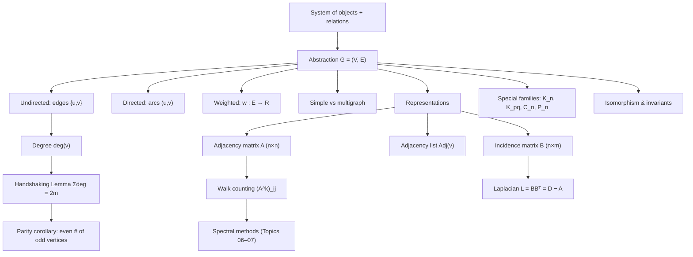

# Topic 01: Graph Fundamentals and Representations

## 1. Master Overview

Graph theory begins with a radical act of abstraction: strip a system of everything except its objects (vertices) and the pairwise relationships between them (edges). Cities and roads, neurons and synapses, web pages and hyperlinks, atoms and bonds — all collapse into the single mathematical object $G = (V, E)$. This module establishes that object rigorously: simple versus multigraphs, directed versus undirected edges, weighted edges, subgraphs, degree sequences, and graph isomorphism.

Equally important is the question of *representation*. The same graph can be encoded as an adjacency matrix $A$, an adjacency list, or an incidence matrix $B$, and the choice determines both the computational complexity of every downstream algorithm and the algebraic tools available. The adjacency matrix turns combinatorics into linear algebra — the celebrated walk-counting theorem states that $(A^k)_{ij}$ counts walks of length $k$ — while adjacency lists make sparse-graph traversal run in $O(n + m)$ time.

The first structural results of the subject already appear at this level: the handshaking lemma $\sum_v \deg(v) = 2m$, its parity corollary, and edge-count formulas for canonical families such as the complete graph $K_n$ and complete bipartite graph $K_{p,q}$. These innocuous counting identities are the seeds of everything that follows, from Eulerian circuits to spectral graph theory.

> [!NOTE]
> The bridge between combinatorics and linear algebra is the adjacency matrix: $(A^k)_{ij}$ equals the number of walks of length $k$ from vertex $i$ to vertex $j$. Every spectral method in Topics 06–07 — Laplacians, spectral clustering, graph neural networks — ultimately rests on this identification of a graph with a matrix.

## 2. First-Principles Framework

- **Phenomenon**: Real systems consist of discrete entities linked by pairwise relations; the geometry of the drawing is irrelevant, only the connection pattern matters.
- **Goal**: Define a minimal mathematical object capturing pure connectivity, classify its basic invariants (order $n$, size $m$, degree sequence), and encode it in data structures suited to both algorithmic traversal and matrix algebra.
- **Governing equation (handshaking lemma)**: $\sum_{v \in V} \deg(v) = 2 \vert E \vert$, because each edge contributes exactly two endpoint incidences.
- **Governing equation (walk counting)**: $(A^k)_{ij} = \#\{\text{walks of length } k \text{ from } i \text{ to } j\}$, proved by induction using matrix multiplication.
- **Representation trade-off**: adjacency matrix costs $O(n^2)$ space with $O(1)$ edge queries; adjacency list costs $O(n+m)$ space with $O(\deg v)$ queries — the sparse/dense dichotomy that governs all of algorithmic graph theory.

## 3. Mermaid Concept Map

## 4. Common Misconceptions

| Misconception | Mathematical Reality | Correct Mental Model |
|---|---|---|
| *"A graph is a picture; two different drawings are two different graphs."* | A graph is the pair $G=(V,E)$ only. Any two drawings with the same vertex set and edge set are the same graph; drawings related by relabeling are isomorphic. | The drawing is a visualization aid; the mathematical object is pure incidence structure. |
| *"The adjacency matrix is always the best representation."* | For a sparse graph with $m \ll n^2$, the matrix wastes $O(n^2)$ space and forces $O(n)$ neighbor scans, while an adjacency list uses $O(n+m)$ space and $O(\deg v)$ scans. | Choose matrix form for dense graphs and algebraic (spectral) work; choose lists for traversal on sparse graphs. |
| *"$(A^k)_{ij}$ counts paths of length $k$."* | It counts **walks**, which may repeat vertices and edges. Path counting is #P-hard in general. | Walks are unconstrained sequences of incident edges; paths forbid vertex repetition — a much stronger condition. |
| *"Equal degree sequences imply isomorphic graphs."* | $C_6$ and two disjoint triangles $C_3 \cup C_3$ are both 2-regular on 6 vertices yet non-isomorphic. | The degree sequence is a necessary invariant, never a sufficient certificate. |
| *"A directed edge $(u,v)$ implies the reverse edge $(v,u)$."* | In a digraph the edge set is a set of ordered pairs; $(u,v) \in E$ says nothing about $(v,u)$. | Direction encodes asymmetric relations (follows, cites, flows into); symmetry must be stated, not assumed. |
| *"Self-loops add 1 to the degree."* | The standard convention adds 2, so that the handshaking lemma $\sum_v \deg(v) = 2m$ remains valid. | Each edge — including a loop — contributes exactly two edge-endpoint incidences. |

## 5. Directory Inventory

| File | Description |
|---|---|
| [`README.md`](README.md) | Master overview, first-principles framework, concept map, misconceptions, references. |
| [`first_principles.ipynb`](first_principles.ipynb) | Markdown-only theory notebook: rigorous definitions, handshaking lemma with parity corollary, walk-counting theorem, representation complexity analysis, degree-sequence results, physics and AI/ML applications. |
| [`exercises.ipynb`](exercises.ipynb) | 20 fully solved problems in 4 levels (L0 Concept Check ×4, L1 Foundation ×6, L2 AI/ML & Physics Applications ×6, L3 Challenge ×4) with complete derivations, boxed answers, and key takeaways. |

## 6. References

1. **Diestel, R.** (2017). *Graph Theory* (5th ed.). Springer GTM 173. — Chapter 1: The Basics.
2. **West, D. B.** (2001). *Introduction to Graph Theory* (2nd ed.). Pearson. — Chapter 1: Fundamental Concepts.
3. **Bollobás, B.** (1998). *Modern Graph Theory*. Springer GTM 184. — Chapter I: Fundamentals.
4. **Bondy, J. A., & Murty, U. S. R.** (2008). *Graph Theory*. Springer GTM 244. — Chapters 1–2.
5. **Cormen, T. H., Leiserson, C. E., Rivest, R. L., & Stein, C.** (2022). *Introduction to Algorithms* (4th ed.). MIT Press. — Section 20.1: Representations of Graphs.
6. **Newman, M.** (2018). *Networks* (2nd ed.). Oxford University Press. — Chapters 6–7: Mathematics of Networks.
7. **Hamilton, W. L.** (2020). *Graph Representation Learning*. Morgan & Claypool. — Chapter 1: Introduction, Background and Traditional Approaches.
8. **Euler, L.** (1736). *Solutio problematis ad geometriam situs pertinentis*. Commentarii Academiae Scientiarum Petropolitanae — the founding paper of graph theory.
