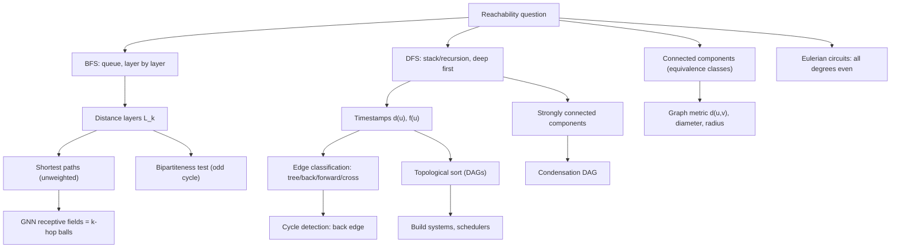

# Topic 02: Traversal and Connectivity

## 1. Master Overview

Once a graph is defined, the first algorithmic question is *reachability*: which vertices can be reached from which, and by what routes? This module develops the two canonical traversal algorithms — breadth-first search (BFS), which explores in expanding "ripples" of increasing distance, and depth-first search (DFS), which dives as deep as possible before backtracking. Both run in optimal $O(n+m)$ time, and together they answer nearly every structural question about connectivity.

Traversal is where graph theory becomes computational. BFS produces exact shortest-path distances in unweighted graphs and organizes the graph into distance layers; DFS produces a rich timestamp structure (discovery and finishing times) that classifies edges into tree, back, forward, and cross edges — the key to cycle detection, topological sorting of directed acyclic graphs, and Tarjan-style strongly connected component algorithms.

The module also treats connectivity as a mathematical structure: reachability is an equivalence relation whose classes are the connected components, the graph distance $d(u,v)$ is a genuine metric, and classical results such as Euler's 1736 theorem (a connected graph has a closed walk using every edge exactly once iff every degree is even) fall out of careful traversal arguments.

> [!NOTE]
> BFS and DFS have identical $O(n+m)$ complexity but produce fundamentally different certificates: BFS yields the *metric* structure (layers = exact distances), while DFS yields the *order* structure (timestamps ⇒ cycles, topological order, strongly connected components). Choosing the right traversal is choosing which certificate you need.

## 2. First-Principles Framework

- **Phenomenon**: Influence, information, infection, and control propagate through networks along edges; what is reachable, how fast, and in what order?
- **Goal**: Systematically visit every vertex reachable from a source, extracting distances (BFS) or a hierarchy of exploration intervals (DFS), in time linear in the input size.
- **Governing equation (BFS layers)**: $L_k = \{v : d(s,v) = k\}$ and every edge joins vertices in the same or adjacent layers: $\lvert d(s,u) - d(s,v) \rvert \le 1$ for $\{u,v\} \in E$.
- **Governing equation (Euler)**: a connected graph admits an Eulerian circuit $\iff$ $\deg(v) \equiv 0 \pmod 2$ for all $v$.
- **Invariant (DFS parenthesis theorem)**: discovery/finish intervals $[d(u), f(u)]$ of any two vertices are either nested or disjoint — never partially overlapping.

## 3. Mermaid Concept Map

## 4. Common Misconceptions

| Misconception | Mathematical Reality | Correct Mental Model |
|---|---|---|
| *"DFS also computes shortest paths."* | DFS may reach a vertex by a long detour before a short route; only BFS's queue discipline guarantees $\mathrm{dist}[v] = d(s,v)$. | BFS = wavefront expanding one edge per tick; DFS = a single explorer with a ball of string. |
| *"BFS works layer-perfectly on weighted graphs too."* | An edge of weight 10 is one "hop" to BFS. Weighted shortest paths need Dijkstra (Topic 04). | BFS counts edges, not weight; it is Dijkstra with all weights equal to 1. |
| *"A directed graph with no cycles must have a vertex with no edges."* | A DAG must have a *source* (in-degree 0) and a *sink* (out-degree 0), but every vertex can still have edges. | Acyclicity forces the partial order to have minimal and maximal elements, nothing more. |
| *"An Eulerian circuit exists iff the graph is connected."* | Connectivity is necessary but the degree parity condition is the decisive one: all degrees must be even. | Each visit to a vertex consumes one entering and one leaving edge — degrees must pair up. |
| *"Topological order is unique."* | Any DAG with two incomparable vertices has at least two valid orders; the count can be exponential. | A topological sort is one linear extension of a partial order, not *the* order. |
| *"Checking $A^{n-1}$ for zero entries is a practical connectivity test."* | Correct mathematically via walk counting, but costs $O(n^{\omega} \log n)$; one BFS answers it in $O(n+m)$. | Matrix powers are a proof device; traversal is the algorithm. |

## 5. Directory Inventory

| File | Description |
|---|---|
| [`README.md`](README.md) | Master overview, first-principles framework, concept map, misconceptions, references. |
| [`first_principles.ipynb`](first_principles.ipynb) | Markdown-only theory notebook: BFS/DFS with correctness proofs, components as equivalence classes, the graph metric, topological sorting, Euler's theorem, complexity tables, and applications from contact tracing to GNN receptive fields. |
| [`exercises.ipynb`](exercises.ipynb) | 20 fully solved problems in 4 levels (L0 Concept Check ×4, L1 Foundation ×6, L2 AI/ML & Physics Applications ×6, L3 Challenge ×4) with complete derivations, boxed answers, and key takeaways. |

## 6. References

1. **Cormen, T. H., Leiserson, C. E., Rivest, R. L., & Stein, C.** (2022). *Introduction to Algorithms* (4th ed.). MIT Press. — Chapter 20: Elementary Graph Algorithms (BFS, DFS, topological sort, SCCs).
2. **Diestel, R.** (2017). *Graph Theory* (5th ed.). Springer GTM 173. — Chapter 1.4–1.8: Paths, Connectivity, Euler Tours.
3. **West, D. B.** (2001). *Introduction to Graph Theory* (2nd ed.). Pearson. — Chapter 1.2: Paths, Cycles, and Trails.
4. **Bollobás, B.** (1998). *Modern Graph Theory*. Springer GTM 184. — Chapter I: Fundamentals.
5. **Tarjan, R. E.** (1972). Depth-first search and linear graph algorithms. *SIAM Journal on Computing*, 1(2), 146–160.
6. **Euler, L.** (1736). *Solutio problematis ad geometriam situs pertinentis* — the Königsberg bridges paper.
7. **Newman, M.** (2018). *Networks* (2nd ed.). Oxford University Press. — Chapter 8: Network structure and measurements.
8. **Hamilton, W. L.** (2020). *Graph Representation Learning*. Morgan & Claypool. — Chapter 5: message passing and receptive fields.
