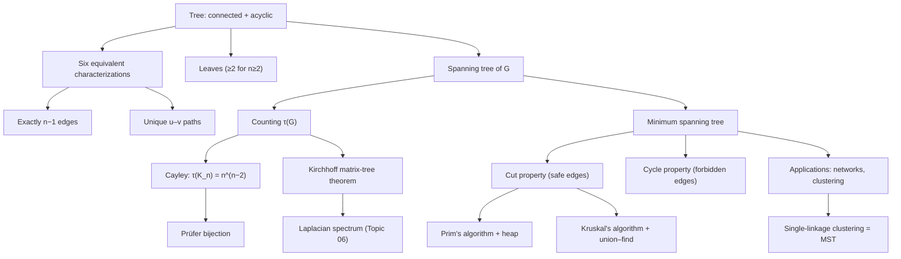

# Topic 03: Trees and Minimum Spanning Trees

## 1. Master Overview

Trees are the minimal connected graphs — connected structures in which every edge is essential and every pair of vertices is joined by exactly one path. This extreme economy makes trees the skeleton of graph theory: they appear as BFS/DFS traversal trees, as parse trees and decision trees, as phylogenies, and as the backbone of every divide-and-conquer recursion. The module opens with the six classical equivalent characterizations of a tree and the fundamental count: a tree on $n$ vertices has exactly $n-1$ edges.

The optimization heart of the module is the **minimum spanning tree (MST)** problem: given a connected weighted graph, find a spanning tree of minimum total weight. Two exchange arguments — the **cut property** (the lightest edge across any cut belongs to the MST) and the **cycle property** (the heaviest edge of any cycle does not) — completely characterize MST membership and directly certify the correctness of the two classical greedy algorithms, Kruskal's ($O(m \log m)$ with union–find) and Prim's ($O(m \log n)$ with a heap).

Counting spanning trees links the module to spectral theory: Cayley's formula $\tau(K_n) = n^{n-2}$ (proved via the Prüfer bijection) and Kirchhoff's matrix-tree theorem $\tau(G) = \frac{1}{n} \lambda_1 \cdots \lambda_{n-1}$, expressing the count through the Laplacian spectrum developed in Topic 06.

> [!NOTE]
> The MST is one of the rare combinatorial optimization problems where a *greedy* strategy is provably optimal. The reason is the exchange (matroid) structure of spanning trees: the cut and cycle properties let any candidate tree be improved edge-by-edge toward the optimum, so locally safe choices never need to be revoked.

## 2. First-Principles Framework

- **Phenomenon**: Connecting $n$ sites (cities, servers, houses) requires at least $n-1$ links; any extra link creates redundancy (a cycle) and extra cost.
- **Goal**: Characterize the cheapest connecting structures and compute them efficiently under edge costs $w : E \to \mathbb{R}$.
- **Governing equation (optimization)**: $T^{\ast} = \arg\min_{T \in \mathcal{T}(G)} \sum_{e \in T} w(e)$, where $\mathcal{T}(G)$ is the set of spanning trees.
- **Governing principle (cut property)**: for any cut $(S, V \setminus S)$, the unique lightest crossing edge lies in every MST — the local rule that makes greedy algorithms globally optimal.
- **Counting law (matrix-tree)**: $\tau(G) = \det(L_{11}) = \frac{1}{n} \prod_{i=2}^{n} \lambda_i(L)$ — spanning-tree counting is a Laplacian determinant.

## 3. Mermaid Concept Map

## 4. Common Misconceptions

| Misconception | Mathematical Reality | Correct Mental Model |
|---|---|---|
| *"The MST also minimizes distances between vertices."* | The MST minimizes total edge weight; path distances inside it can exceed graph distances by a factor up to $n-1$ (the MST of a cycle with one heavy edge is a long path). | MST = cheapest *connector*; shortest-path tree = cheapest *router*. Different objectives, different trees (Topic 04). |
| *"Kruskal and Prim can return different total weights."* | Every MST has the same total weight; with distinct edge weights the MST is unique, so both algorithms return the *same tree*. | Greedy order differs, but cut/cycle properties pin down the same optimum. |
| *"The heaviest edge of the graph never appears in the MST."* | If that edge is a bridge, it appears in every spanning tree, MST included. | Only the heaviest edge *of a cycle* is excluded (cycle property); bridges are unavoidable. |
| *"A tree can be defined only as 'connected and acyclic.'"* | Any two of {connected, acyclic, $m = n-1$} imply the third; unique-paths and edge-minimality give further equivalent definitions. | Trees sit at the intersection of many extremal conditions — pick whichever characterization the proof needs. |
| *"Cayley's formula counts the spanning trees of any graph."* | $n^{n-2}$ counts labeled trees on $n$ vertices, i.e., spanning trees of $K_n$ only; general graphs need Kirchhoff's determinant. | Cayley is the special case $G = K_n$ of the matrix-tree theorem. |
| *"Removing the MST's heaviest edge and reconnecting cheaply can improve it."* | The MST is a global optimum; no single exchange (or sequence of exchanges) reduces its weight. | The exchange argument works *for* the MST, not against it — it is exactly why greedy succeeds. |

## 5. Directory Inventory

| File | Description |
|---|---|
| [`README.md`](README.md) | Master overview, first-principles framework, concept map, misconceptions, references. |
| [`first_principles.ipynb`](first_principles.ipynb) | Markdown-only theory notebook: tree characterization theorem with full proof, leaf lemma, cut and cycle properties, Kruskal/Prim correctness, union–find complexity, Cayley via Prüfer, matrix-tree statement, applications. |
| [`exercises.ipynb`](exercises.ipynb) | 20 fully solved problems in 4 levels (L0 Concept Check ×4, L1 Foundation ×6, L2 AI/ML & Physics Applications ×6, L3 Challenge ×4) with complete derivations, boxed answers, and key takeaways. |

## 6. References

1. **Diestel, R.** (2017). *Graph Theory* (5th ed.). Springer GTM 173. — Chapter 1.5: Trees and Forests.
2. **West, D. B.** (2001). *Introduction to Graph Theory* (2nd ed.). Pearson. — Chapter 2: Trees and Distance.
3. **Bollobás, B.** (1998). *Modern Graph Theory*. Springer GTM 184. — Chapter VIII.5: The Matrix-Tree Theorem.
4. **Cormen, T. H., Leiserson, C. E., Rivest, R. L., & Stein, C.** (2022). *Introduction to Algorithms* (4th ed.). MIT Press. — Chapter 21: Minimum Spanning Trees; Chapter 19: Disjoint Sets.
5. **Chung, F. R. K.** (1997). *Spectral Graph Theory*. AMS CBMS 92. — Chapter 1 (Laplacian preliminaries for the matrix-tree theorem).
6. **Cayley, A.** (1889). A theorem on trees. *Quarterly Journal of Mathematics*, 23, 376–378.
7. **Prüfer, H.** (1918). Neuer Beweis eines Satzes über Permutationen. *Archiv der Mathematik und Physik*, 27, 742–744.
8. **Graham, R. L., & Hell, P.** (1985). On the history of the minimum spanning tree problem. *Annals of the History of Computing*, 7(1), 43–57.
9. **Tarjan, R. E.** (1975). Efficiency of a good but not linear set union algorithm. *Journal of the ACM*, 22(2), 215–225.
