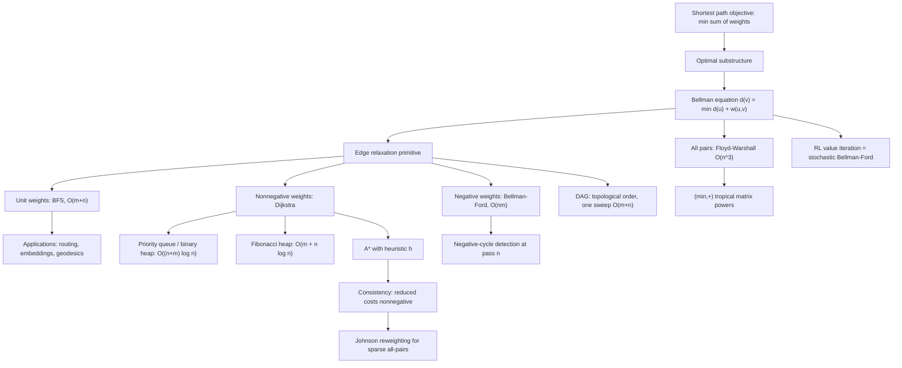

# Topic 04: Shortest Paths Algorithms

## 1. Master Overview

A shortest path is the cheapest way to get from one vertex to another, and almost every question about "distance" on a network reduces to computing one. The objective $d(s,v) = \min_{P : s \to v} \sum_{e \in P} w(e)$ looks innocent, but it hides a rich structure: shortest paths obey an *optimal substructure* principle (every prefix of a shortest path is itself shortest), which turns an exponential search over paths into a polynomial-time relaxation process. Every algorithm in this module — BFS, Dijkstra, Bellman–Ford, Floyd–Warshall, A$^{\ast}$, DAG relaxation — is a different schedule for applying the same local update $d(v) \leftarrow \min(d(v),\, d(u) + w(u,v))$.

The module is organized by the *assumptions* each algorithm needs. With unit weights, breadth-first search settles vertices in nondecreasing distance for free, in $O(m + n)$. With nonnegative weights, **Dijkstra's algorithm** replaces the FIFO queue by a priority queue and remains greedy-correct: once the closest unsettled vertex is extracted, its label can never improve. Allow negative weights and greed breaks — **Bellman–Ford** must instead relax all edges $n-1$ times, which costs $O(nm)$ but detects negative cycles, the case in which "shortest path" ceases to be well defined. For all-pairs distances, **Floyd–Warshall** performs a dynamic program over the set of permitted intermediate vertices in $O(n^3)$, and its algebraic form is nothing but matrix multiplication in the $(\min, +)$ tropical semiring.

The final layer is *guided* search. **A$^{\ast}$** adds a heuristic $h(v)$ estimating the remaining distance and runs Dijkstra on reduced costs $w_h(u,v) = w(u,v) + h(v) - h(u)$; when $h$ is consistent, these costs are nonnegative and A$^{\ast}$ inherits Dijkstra's correctness while exploring far fewer vertices. That same reduced-cost trick reappears in Johnson's algorithm, in potential-based reweighting for flows (Topic 05), and — under a different name — as the Bellman optimality operator of reinforcement learning, where value iteration is precisely Bellman–Ford on a stochastic graph.

> [!NOTE]
> Dijkstra, Bellman–Ford, Floyd–Warshall and value iteration are not four algorithms — they are four evaluation orders for the same fixed-point equation $d(v) = \min_{u \to v}\, \lbrace d(u) + w(u,v) \rbrace$ with $d(s) = 0$. Nonnegative weights make the fixed point reachable *greedily* (settle in distance order); general weights force *iteration to convergence*; a DAG makes topological order sufficient in one sweep.

## 2. First-Principles Framework

- **Phenomenon**: Moving through a network accumulates cost — travel time, latency, energy, negative log-probability — and rational agents take the cheapest route.
- **Goal**: Compute $d(s, v)$ for all $v$ (single-source), or $d(u,v)$ for all pairs, together with a predecessor structure that reconstructs the routes themselves.
- **Governing equation (Bellman)**: $d(v) = \min_{(u,v) \in E} \lbrace d(u) + w(u,v) \rbrace$ with $d(s) = 0$ — a fixed-point system whose least solution is the true distance vector.
- **Governing principle (optimal substructure)**: every subpath of a shortest path is a shortest path between its own endpoints; otherwise the shorter subpath could be substituted, contradicting optimality.
- **Safety invariant (relaxation)**: every label $d(v)$ is always the length of *some* real $s$–$v$ walk, hence $d(v) \ge \delta(s,v)$ at all times; algorithms differ only in how fast they drive the inequality to equality.
- **Well-posedness condition**: a shortest *path* exists iff no negative cycle is reachable from $s$; otherwise the infimum over walks is $-\infty$.
- **Duality (certificate)**: the distance vector is the *largest* $d$ with $d(s) = 0$ and $d(v) \le d(u) + w(u,v)$ for all arcs — so any candidate solution is verifiable in $O(m)$ by checking feasibility plus one tight incoming arc per vertex.
- **Invariance (reweighting)**: only *telescoping* shifts $w(u,v) \mapsto w(u,v) + p(u) - p(v)$ preserve the set of shortest paths; this single fact underlies A$^{\ast}$, Johnson's algorithm and min-cost-flow potentials.

## 3. Mermaid Concept Map

## 4. Common Misconceptions

| Misconception | Mathematical Reality | Correct Mental Model |
|---|---|---|
| *"Dijkstra just needs a tweak to handle negative edges."* | The greedy extraction step assumes a settled label can never improve; a single negative edge can lower a finalized distance, and no re-heapification rule fixes this in general (re-inserting settled vertices degrades to exponential time on adversarial graphs). | Dijkstra's correctness proof *uses* $w \ge 0$ at exactly one line; remove it and use Bellman–Ford or Johnson reweighting. |
| *"A negative edge means there is no shortest path."* | Only a negative *cycle* reachable from the source destroys well-posedness. A DAG with negative edges has perfectly well-defined shortest paths computable in $O(m + n)$. | Negative edges are a nuisance for *greedy order*; negative cycles are a failure of the *problem statement*. |
| *"The shortest-path tree is the minimum spanning tree."* | They optimize different objectives — sum over one path from $s$ versus sum over the whole tree. On a triangle with weights $1, 1, 1.9$ the MST and the shortest-path tree from a vertex differ. | MST = cheapest connector (Topic 03); SPT = cheapest router. Same greedy skeleton, different key. |
| *"A$^{\ast}$ with any 'reasonable' heuristic returns optimal paths."* | Optimality requires **admissibility** $h(v) \le \delta(v, t)$ for tree search, and **consistency** $h(u) \le w(u,v) + h(v)$ for graph search with a closed set; an overestimating heuristic can permanently close a vertex too early. | A$^{\ast}$ = Dijkstra on reduced costs $w + h(v) - h(u)$; consistency is exactly the statement that those costs are nonnegative. |
| *"Bellman–Ford needs $n$ passes because paths can be long."* | Any shortest path is simple, hence has at most $n-1$ edges; after pass $k$ all distances realizable by $\le k$ edges are exact. The $n$-th pass is only a *detector*: any further improvement certifies a negative cycle. | Pass count = path hop count, not path weight; induction on the number of edges is the whole proof. |
| *"Floyd–Warshall is just Dijkstra repeated $n$ times."* | It is an independent dynamic program over intermediate-vertex sets, tolerates negative edges, and runs $\Theta(n^3)$ regardless of density; repeated Dijkstra costs $O(nm \log n)$ and needs $w \ge 0$. | Use Floyd–Warshall for dense or negative-weight graphs; use Johnson (reweight, then $n$ Dijkstras) for sparse ones. |
| *"Distances in a graph embedding equal Euclidean distances between embedded points."* | Graph metrics are only approximately embeddable; trees need hyperbolic space for low distortion, and any embedding of a cycle into $\mathbb{R}^k$ distorts distances by $\Omega(n)$ in the worst case. | Shortest-path distance is the ground truth; embeddings are lossy compressions of it, and the loss is measured by distortion. |

## 5. Directory Inventory

| File | Description |
|---|---|
| [`README.md`](README.md) | Master overview, first-principles framework, concept map, misconceptions, references. |
| [`first_principles.ipynb`](first_principles.ipynb) | Markdown-only theory notebook: Bellman equation, relaxation invariants, full correctness proofs for BFS, Dijkstra, Bellman–Ford and Floyd–Warshall, A$^{\ast}$ via reduced costs, complexity tables, and AI/ML applications. |
| [`exercises.ipynb`](exercises.ipynb) | 20 fully solved problems in 4 levels (L0 Concept Check ×4, L1 Foundation ×6, L2 AI/ML & Physics Applications ×6, L3 Challenge ×4) with complete derivations, boxed answers, and key takeaways. |

## 6. References

1. **Cormen, T. H., Leiserson, C. E., Rivest, R. L., & Stein, C.** (2022). *Introduction to Algorithms* (4th ed.). MIT Press. — Chapters 22–23: Single-Source and All-Pairs Shortest Paths.
2. **Diestel, R.** (2017). *Graph Theory* (5th ed.). Springer GTM 173. — Chapter 1 (paths, distance, metric structure).
3. **West, D. B.** (2001). *Introduction to Graph Theory* (2nd ed.). Pearson. — Chapter 2.3: Distance and shortest paths.
4. **Ahuja, R. K., Magnanti, T. L., & Orlin, J. B.** (1993). *Network Flows: Theory, Algorithms, and Applications*. Prentice Hall. — Chapters 4–5: label-setting and label-correcting algorithms, reduced costs.
5. **Schrijver, A.** (2003). *Combinatorial Optimization: Polyhedra and Efficiency*. Springer. — Chapter 7: Shortest paths and the LP/duality view.
6. **Dijkstra, E. W.** (1959). A note on two problems in connexion with graphs. *Numerische Mathematik*, 1, 269–271.
7. **Bellman, R.** (1958). On a routing problem. *Quarterly of Applied Mathematics*, 16(1), 87–90.
8. **Floyd, R. W.** (1962). Algorithm 97: Shortest path. *Communications of the ACM*, 5(6), 345.
9. **Hart, P. E., Nilsson, N. J., & Raphael, B.** (1968). A formal basis for the heuristic determination of minimum cost paths. *IEEE Transactions on Systems Science and Cybernetics*, 4(2), 100–107.
10. **Johnson, D. B.** (1977). Efficient algorithms for shortest paths in sparse networks. *Journal of the ACM*, 24(1), 1–13.
11. **Sutton, R. S., & Barto, A. G.** (2018). *Reinforcement Learning: An Introduction* (2nd ed.). MIT Press. — Chapter 4: Dynamic programming and value iteration.
12. **Hamilton, W. L.** (2020). *Graph Representation Learning*. Morgan & Claypool. — Chapters 2–3: node embeddings and graph distances.
13. **Fredman, M. L., & Tarjan, R. E.** (1987). Fibonacci heaps and their uses in improved network optimization algorithms. *Journal of the ACM*, 34(3), 596–615.
14. **Thorup, M.** (1999). Undirected single-source shortest paths with positive integer weights in linear time. *Journal of the ACM*, 46(3), 362–394.
15. **Pearl, J.** (1984). *Heuristics: Intelligent Search Strategies for Computer Problem Solving*. Addison-Wesley. — Chapters 2–3: admissibility, consistency, and A$^{\ast}$ optimality.
16. **Sethian, J. A.** (1996). A fast marching level set method for monotonically advancing fronts. *PNAS*, 93(4), 1591–1595.

**Cross-links**: contrast with the minimum spanning tree in [`../03_trees_and_minimum_spanning_trees/README.md`](../03_trees_and_minimum_spanning_trees/README.md); the flow-network sequel is [`../05_flows_matchings_and_bipartite_graphs/README.md`](../05_flows_matchings_and_bipartite_graphs/README.md); runnable demos live in [`../computation.ipynb`](../computation.ipynb).
