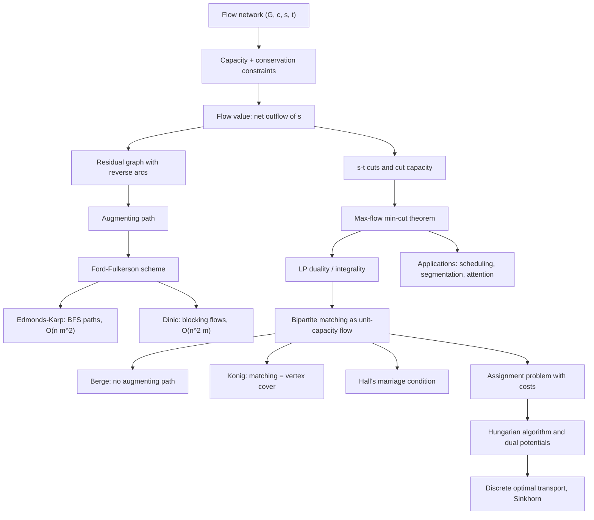

# Topic 05: Flows, Matchings and Bipartite Graphs

## 1. Master Overview

Network flow is what happens when a graph is asked to *carry* something. Given a directed graph with capacities $c : E \to \mathbb{R}_{\ge 0}$, a source $s$ and a sink $t$, a flow assigns a rate $f(e) \le c(e)$ to each edge such that everything entering an intermediate vertex leaves it again. The question "how much can flow from $s$ to $t$?" has an astonishing answer: it equals the cheapest way to *sever* the network. The **max-flow min-cut theorem** — the value of a maximum flow equals the capacity of a minimum $s$–$t$ cut — is simultaneously an optimality certificate, an instance of linear-programming duality, and the combinatorial ancestor of a dozen theorems that at first sight have nothing to do with flow.

Algorithmically the module follows the augmenting-path paradigm. **Ford–Fulkerson** repeatedly pushes flow along a path in the *residual* graph, where reverse arcs encode the option to undo earlier decisions; it terminates with an optimal flow exactly when no augmenting path remains. Its running time depends on the path choice: with arbitrary choices and irrational capacities it may fail to terminate, while **Edmonds–Karp** — always taking a *shortest* augmenting path (BFS, from Topic 04) — provably finishes in $O(nm^2)$ regardless of capacity magnitudes. Dinic's blocking-flow refinement improves this to $O(n^2 m)$, and to $O(m\sqrt{n})$ on unit-capacity networks, which is where bipartite matching lives.

The second half of the module cashes the flow machinery into **matching theory**. A matching is a set of pairwise disjoint edges; on a bipartite graph, maximum matching is exactly integral max-flow on a unit-capacity network. Min-cut then specializes to **König's theorem** (maximum matching $=$ minimum vertex cover in bipartite graphs), and the augmenting-path analysis specializes to **Berge's theorem** and **Hall's marriage theorem**, which characterizes when every vertex on one side can be matched. Adding edge costs gives the **assignment problem**, solved by the **Hungarian algorithm** through dual potentials — the same reduced-cost idea as A$^{\ast}$, and the direct combinatorial ancestor of discrete optimal transport, of which Sinkhorn-regularized attention is the modern soft cousin.

> [!NOTE]
> Max-flow min-cut, König, Hall, Menger and Dilworth are five statements of one fact. Each is the LP dual of a flow problem on a suitably built network, and each proof is the same argument: from a flow with no augmenting path, read off the reachable set in the residual graph and it *is* the optimal dual object (cut, vertex cover, blocking set).

## 2. First-Principles Framework

- **Phenomenon**: Networks transport commodities — packets, water, electricity, assigned tasks — and every link has a finite capacity.
- **Goal**: Maximize throughput from $s$ to $t$ subject to capacities and conservation; dually, find the cheapest set of links whose removal stops all transport.
- **Governing constraints (flow)**: capacity $0 \le f(e) \le c(e)$ for every edge, and conservation $\sum_{e \in \delta^{-}(v)} f(e) = \sum_{e \in \delta^{+}(v)} f(e)$ for every $v \notin \lbrace s, t \rbrace$.
- **Governing principle (duality)**: $\max_f \vert f \vert = \min_{(S,T)} c(S,T)$ — throughput is limited by the tightest bottleneck, and the bottleneck is certified by a cut.
- **Progress principle (augmentation)**: a flow is maximum iff its residual graph contains no $s$–$t$ path; a matching is maximum iff it admits no augmenting path (Berge).
- **Integrality principle**: with integer capacities, some maximum flow is integral — which is why combinatorial selection problems (matchings, disjoint paths, schedules) inherit flow algorithms verbatim.
- **Certificate principle**: after any max-flow computation, one graph search from $s$ in the final residual network returns the minimum cut in $O(m)$ — the optimality proof is a by-product, never a separate computation.
- **Potential principle (costs)**: adding edge costs turns the problem into min-cost flow, solved by shortest augmenting paths under reduced costs $c(u,v) + p(u) - p(v) \ge 0$ — the same dual-variable device as A$^{\ast}$ and Johnson reweighting in Topic 04.

## 3. Mermaid Concept Map

## 4. Common Misconceptions

| Misconception | Mathematical Reality | Correct Mental Model |
|---|---|---|
| *"A greedy set of saturating paths gives the max flow."* | Greedy without reverse arcs gets stuck: on the classic four-vertex diamond, saturating the middle edge first blocks the optimum. Residual reverse arcs exist precisely to *retract* earlier commitments. | Augmenting paths in the residual graph, not paths in the original graph. Reverse arcs are undo operations, not physical pipes. |
| *"Ford–Fulkerson always terminates."* | With irrational capacities it can run forever and converge to a value below the maximum; with integer capacities it terminates in at most $\vert f^{\ast} \vert$ augmentations, which is *pseudo-polynomial*, not polynomial. | Termination is a property of the path-selection rule; BFS selection (Edmonds–Karp) makes it strongly polynomial in $n$ and $m$. |
| *"The min cut is the set of the smallest-capacity edges."* | A cut must be a full $s$–$t$ separator induced by a vertex bipartition $(S, T)$ with $s \in S$, $t \in T$; only forward-crossing edges count toward its capacity. Cheap edges that cross nothing are irrelevant. | Read the min cut off the residual graph: $S$ is the set reachable from $s$ when no augmenting path remains. |
| *"Maximum matching means every vertex gets matched."* | A maximum matching may leave vertices exposed; a **perfect** matching is the special case $\vert M \vert = n/2$. Hall's condition characterizes when one side can be *saturated*, not when the graph has a perfect matching in general. | Maximum = no larger matching exists; perfect = no vertex is left over. Berge certifies the former, Hall the latter for bipartite graphs. |
| *"König's theorem holds for all graphs."* | It fails on odd cycles: the triangle has maximum matching $1$ but minimum vertex cover $2$. König is a *bipartite* theorem; general graphs obey the Tutte–Berge formula and need Edmonds' blossom algorithm. | Bipartiteness is what makes the matching LP integral; odd cycles are exactly the obstruction. |
| *"The Hungarian algorithm is just brute force over permutations sped up."* | It maintains dual potentials $u_i, v_j$ with $u_i + v_j \le c_{ij}$ and grows a matching only on tight edges; complementary slackness at termination certifies optimality in $O(n^3)$, never enumerating the $n!$ permutations. | Assignment = LP whose dual is the potential problem; the algorithm builds primal and dual solutions in lockstep. |
| *"Attention is a matching, so it can be replaced by one."* | Softmax attention is a *soft, row-stochastic* map; true matching is a doubly stochastic permutation. Sinkhorn iterations interpolate between the two, and only in the zero-temperature limit does the coupling converge to a permutation. | Matching is the $\varepsilon \to 0$ limit of entropically regularized optimal transport; attention lives at finite temperature with only one normalization. |

## 5. Directory Inventory

| File | Description |
|---|---|
| [`README.md`](README.md) | Master overview, first-principles framework, concept map, misconceptions, references. |
| [`first_principles.ipynb`](first_principles.ipynb) | Markdown-only theory notebook: flow definitions, residual graphs, full proofs of max-flow min-cut, Edmonds–Karp's $O(nm^2)$ bound, integrality, Berge, König and Hall, plus the Hungarian algorithm's duality and AI/ML applications. |
| [`exercises.ipynb`](exercises.ipynb) | 20 fully solved problems in 4 levels (L0 Concept Check ×4, L1 Foundation ×6, L2 AI/ML & Physics Applications ×6, L3 Challenge ×4) with complete derivations, boxed answers, and key takeaways. |

## 6. References

1. **Ahuja, R. K., Magnanti, T. L., & Orlin, J. B.** (1993). *Network Flows: Theory, Algorithms, and Applications*. Prentice Hall. — Chapters 6–9 (max flow), 12 (assignment).
2. **Schrijver, A.** (2003). *Combinatorial Optimization: Polyhedra and Efficiency*. Springer. — Chapters 10 (max-flow min-cut), 16 (matchings), 17 (König, Hall).
3. **Diestel, R.** (2017). *Graph Theory* (5th ed.). Springer GTM 173. — Chapter 2: Matching, Covering and Packing; Chapter 6.2: Flows.
4. **West, D. B.** (2001). *Introduction to Graph Theory* (2nd ed.). Pearson. — Chapter 3: Matchings and Factors; Chapter 4.3: Network Flow.
5. **Cormen, T. H., Leiserson, C. E., Rivest, R. L., & Stein, C.** (2022). *Introduction to Algorithms* (4th ed.). MIT Press. — Chapter 24: Maximum Flow.
6. **Ford, L. R., & Fulkerson, D. R.** (1956). Maximal flow through a network. *Canadian Journal of Mathematics*, 8, 399–404.
7. **Edmonds, J., & Karp, R. M.** (1972). Theoretical improvements in algorithmic efficiency for network flow problems. *Journal of the ACM*, 19(2), 248–264.
8. **Hall, P.** (1935). On representatives of subsets. *Journal of the London Mathematical Society*, 10(1), 26–30.
9. **Kőnig, D.** (1931). Gráfok és mátrixok. *Matematikai és Fizikai Lapok*, 38, 116–119.
10. **Kuhn, H. W.** (1955). The Hungarian method for the assignment problem. *Naval Research Logistics Quarterly*, 2(1–2), 83–97.
11. **Peyré, G., & Cuturi, M.** (2019). Computational optimal transport. *Foundations and Trends in Machine Learning*, 11(5–6), 355–607.
12. **Hamilton, W. L.** (2020). *Graph Representation Learning*. Morgan & Claypool. — matching and alignment views of graph neural networks.
13. **Edmonds, J.** (1965). Paths, trees, and flowers. *Canadian Journal of Mathematics*, 17, 449–467. — the blossom algorithm for general (non-bipartite) matching.
14. **Hopcroft, J. E., & Karp, R. M.** (1973). An $n^{5/2}$ algorithm for maximum matchings in bipartite graphs. *SIAM Journal on Computing*, 2(4), 225–231.
15. **Goldberg, A. V., & Tarjan, R. E.** (1988). A new approach to the maximum-flow problem. *Journal of the ACM*, 35(4), 921–940. — push–relabel.
16. **Kolmogorov, V., & Zabih, R.** (2004). What energy functions can be minimized via graph cuts? *IEEE TPAMI*, 26(2), 147–159.
17. **Zwick, U.** (1995). The smallest networks on which the Ford–Fulkerson maximum flow procedure may fail to terminate. *Theoretical Computer Science*, 148(1), 165–170.

**Cross-links**: shortest augmenting paths come from [`../04_shortest_paths_algorithms/README.md`](../04_shortest_paths_algorithms/README.md); the exchange-argument style originates in [`../03_trees_and_minimum_spanning_trees/README.md`](../03_trees_and_minimum_spanning_trees/README.md); runnable demos live in [`../computation.ipynb`](../computation.ipynb).
