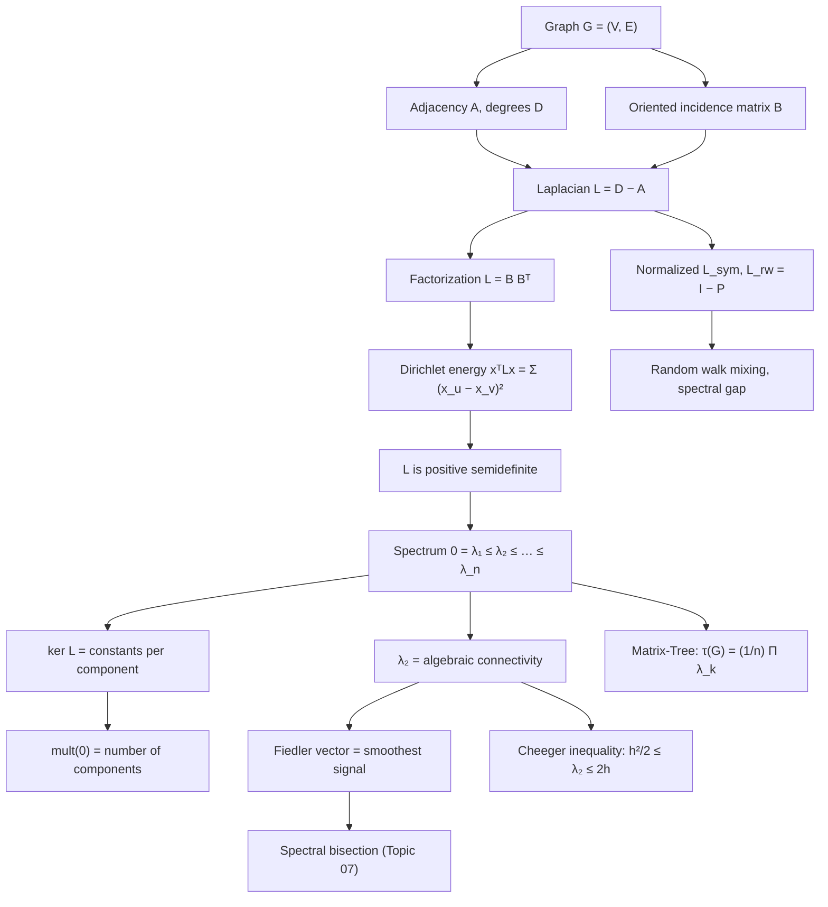

# Topic 06: Graph Laplacian and Spectral Theory

## 1. Master Overview

Spectral graph theory studies a graph through the eigenvalues and eigenvectors of matrices attached to it. The central object is the **combinatorial Laplacian** $L = D - A$, where $D$ is the diagonal degree matrix and $A$ the adjacency matrix. Unlike $A$, which merely records who touches whom, $L$ acts as a *discrete second derivative*: applied to a function $x : V \to \mathbb{R}$, it returns $(Lx)_v = \sum_{u \sim v} (x_v - x_u)$, the sum of differences between a vertex and its neighbours. This single identity makes $L$ the graph analogue of $-\nabla^2$ and imports the entire vocabulary of diffusion, vibration, and energy minimization into combinatorics.

Everything in this module flows from one algebraic fact: $L = B B^{\top}$ for the oriented incidence matrix $B$, hence $x^{\top} L x = \sum_{\{u,v\} \in E} (x_u - x_v)^2 \ge 0$. Positive semidefiniteness is immediate, the kernel is exactly the space of functions constant on connected components — so the multiplicity of eigenvalue $0$ counts components — and the second-smallest eigenvalue $\lambda_2$, Fiedler's **algebraic connectivity**, measures how hard the graph is to cut in two. The corresponding **Fiedler vector** is the smoothest non-constant function on the graph and is the workhorse of spectral partitioning, graph drawing, and manifold learning.

Two normalizations sharpen the picture when degrees are uneven: the symmetric Laplacian $L_{\mathrm{sym}} = D^{-1/2} L D^{-1/2}$, whose spectrum lies in $[0, 2]$, and the random-walk Laplacian $L_{\mathrm{rw}} = D^{-1} L = I - P$, whose eigenvalues govern the mixing rate of the natural random walk. The **Cheeger inequality** pins $\lambda_2$ between halves and squares of the conductance, converting a hard combinatorial isoperimetry problem into a tractable eigenvalue computation; the **Matrix-Tree theorem** turns the nonzero spectrum into an exact count of spanning trees. Together they explain why every downstream algorithm — spectral clustering, graph convolutional networks, spectral sparsification — begins by diagonalizing a Laplacian.

> [!NOTE]
> The Laplacian is best remembered not as a matrix but as a *quadratic form*: $x^{\top} L x$ is the Dirichlet energy $\sum_{\{u,v\} \in E} (x_u - x_v)^2$ of the signal $x$ on the graph. Every theorem in this module — semidefiniteness, kernel = components, Fiedler's variational characterization, Cheeger's inequality — is a statement about which signals have low energy, and every algorithm is a way of finding them.

## 2. First-Principles Framework

- **Phenomenon**: heat, current, opinions, and gradients all flow along edges from high to low, at a rate proportional to the difference across the edge.
- **Operator**: $(Lx)_v = \sum_{u \sim v}(x_u \mapsto x_v - x_u) = d_v x_v - \sum_{u \sim v} x_u$ — the discrete negative Laplacian; the diffusion equation on a graph is $\dot{x} = -Lx$ with solution $x(t) = e^{-tL} x(0)$.
- **Factorization**: $L = B B^{\top}$ with $B \in \mathbb{R}^{n \times m}$ the oriented incidence matrix; this is the entire source of positive semidefiniteness.
- **Energy law**: $x^{\top} L x = \sum_{\{u,v\} \in E} (x_u - x_v)^2$ — the Dirichlet energy, minimized by constants.
- **Variational principle**: $\lambda_2 = \min\{x^{\top} L x : \Vert x \Vert = 1, \ x \perp \mathbf{1}\}$ — the smoothest non-constant signal, whose minimizer is the Fiedler vector.
- **Counting law**: $\tau(G) = \frac{1}{n} \prod_{k \ge 2} \lambda_k$ — spanning trees read off the spectrum (Topic 03's matrix-tree theorem, proved here).
- **Normalization**: $L_{\mathrm{sym}} = D^{-1/2} L D^{-1/2}$ rescales the spectrum into the fixed window $[0, 2]$, making graphs of different sizes and degree distributions comparable.
- **Probabilistic law**: $L_{\mathrm{rw}} = I - P$ with $P = D^{-1} A$; small eigenvalues are slowly decaying random-walk modes, so the spectral gap *is* the mixing rate.
- **Isoperimetric law (Cheeger)**: $\frac{h^2}{2} \le \lambda_2^{\mathrm{sym}} \le 2h$ — the eigenvalue sandwiches the conductance, converting an NP-hard cut question into an eigenvalue computation.
- **Duality with resistance**: $R_{\mathrm{eff}}(u,v) = (e_u - e_v)^{\top} L^{+} (e_u - e_v)$ turns the pseudoinverse into a metric on $V$, with Foster's identity $\sum_{e} R_{\mathrm{eff}}(e) = n-1$.

## 3. Mermaid Concept Map

Read the map along its spine: the incidence matrix produces the factorization, the factorization produces the energy identity, and the energy identity produces every structural theorem below it. The two branches on the right — Cheeger and Matrix-Tree — are the two places where the spectrum answers a purely combinatorial question (how expensive is the cheapest balanced cut, and how many spanning trees are there) that has no obvious linear-algebraic content.

## 4. Common Misconceptions

| Misconception | Mathematical Reality | Correct Mental Model |
|---|---|---|
| *"The Laplacian can have negative eigenvalues on weird graphs."* | $L = B B^{\top}$ for any graph, so $x^{\top} L x = \sum_{\{u,v\} \in E} (x_u - x_v)^2 \ge 0$ always; with nonnegative edge weights $L \succeq 0$ unconditionally. | $L$ is a Gram matrix of edge-difference functionals — semidefiniteness is structural, not accidental. |
| *"Eigenvalue $0$ is simple whenever the graph has edges."* | The multiplicity of $0$ equals the number of connected components $c$; a graph with two triangles has $\dim \ker L = 2$ despite having many edges. | Count components first; the kernel is spanned by the indicator vectors $\mathbf{1}_{C_1}, \dots, \mathbf{1}_{C_c}$. |
| *"$\lambda_2 \gt 0$ means the graph is well connected."* | $\lambda_2 \gt 0$ only certifies connectedness; a path $P_n$ has $\lambda_2 = 2(1 - \cos(\pi/n)) \approx \pi^2/n^2$, vanishingly small. | $\lambda_2$ is a *quantitative* connectivity: it lower-bounds the cost of any balanced cut via Cheeger. |
| *"$L_{\mathrm{sym}}$ and $L_{\mathrm{rw}}$ have different spectra."* | They are similar: $L_{\mathrm{rw}} = D^{-1/2} L_{\mathrm{sym}} D^{1/2}$, so the eigenvalues coincide; only the eigenvectors differ by the factor $D^{1/2}$. | Same numbers, different coordinates — pick $L_{\mathrm{sym}}$ for symmetry, $L_{\mathrm{rw}}$ for probabilistic meaning. |
| *"The Laplacian spectrum determines the graph."* | Non-isomorphic **cospectral** graphs exist (the smallest Laplacian-cospectral pair has 6 vertices); the spectrum is an invariant, not a complete one. | The spectrum is a lossy fingerprint: it fixes $n$, $m$, component count, and $\tau(G)$, but not the graph. |
| *"Eigenvector entries of the Fiedler vector are cluster labels."* | They are real numbers; a threshold (sign, median, or best sweep cut) must be applied, and the resulting cut is only guaranteed within the Cheeger factor. | Relaxation then rounding: the eigenvector solves a continuous relaxation of a discrete cut problem. |
| *"Adding an edge can decrease $\lambda_2$."* | Adding an edge adds a nonnegative rank-one term $(e_u - e_v)(e_u - e_v)^{\top}$ to $L$, so all eigenvalues weakly increase (Weyl monotonicity). | Edges are springs: more springs, stiffer graph, higher frequencies. |

## 5. Directory Inventory

| File | Description |
|---|---|
| [`README.md`](README.md) | Master overview, first-principles framework, concept map, misconceptions, references. |
| [`first_principles.ipynb`](first_principles.ipynb) | Markdown-only theory notebook: incidence matrix and $L = B B^{\top}$, Dirichlet energy and positive semidefiniteness, kernel–components theorem, Courant–Fischer and the Fiedler vector, normalized Laplacians, Cheeger inequality, Matrix-Tree theorem via Cauchy–Binet, spectra of standard graphs, applications. |
| [`exercises.ipynb`](exercises.ipynb) | 20 fully solved problems in 4 levels (L0 Concept Check ×4, L1 Foundation ×6, L2 AI/ML & Physics Applications ×6, L3 Challenge ×4) with complete derivations, boxed answers, and key takeaways. |

## 6. References

1. **Chung, F. R. K.** (1997). *Spectral Graph Theory*. AMS CBMS Regional Conference Series 92. — Chapters 1–2: the normalized Laplacian, eigenvalue bounds, Cheeger's inequality.
2. **Godsil, C., & Royle, G.** (2001). *Algebraic Graph Theory*. Springer GTM 207. — Chapters 8 and 13: Laplacians, incidence matrices, the matrix-tree theorem.
3. **Fiedler, M.** (1973). Algebraic connectivity of graphs. *Czechoslovak Mathematical Journal*, 23(2), 298–305.
4. **Fiedler, M.** (1975). A property of eigenvectors of nonnegative symmetric matrices and its application to graph theory. *Czechoslovak Mathematical Journal*, 25(4), 619–633.
5. **von Luxburg, U.** (2007). A tutorial on spectral clustering. *Statistics and Computing*, 17(4), 395–416. — Section 3 is the cleanest survey of $L$, $L_{\mathrm{sym}}$, $L_{\mathrm{rw}}$ properties.
6. **Spielman, D. A.** (2019). *Spectral and Algebraic Graph Theory* (lecture notes, Yale). — Modern treatment of effective resistance, sparsification, and Laplacian solvers.
7. **Brouwer, A. E., & Haemers, W. H.** (2012). *Spectra of Graphs*. Springer Universitext. — Reference tables of spectra for standard graph families and cospectrality.
8. **Mohar, B.** (1991). The Laplacian spectrum of graphs. In *Graph Theory, Combinatorics, and Applications*, Wiley, 871–898.
9. **Diestel, R.** (2017). *Graph Theory* (5th ed.). Springer GTM 173. — Chapter 1 for notation, Chapter 8.5 for expansion and eigenvalues.
10. **Alon, N., & Milman, V. D.** (1985). $\lambda_1$, isoperimetric inequalities for graphs, and superconcentrators. *Journal of Combinatorial Theory B*, 38(1), 73–88.
