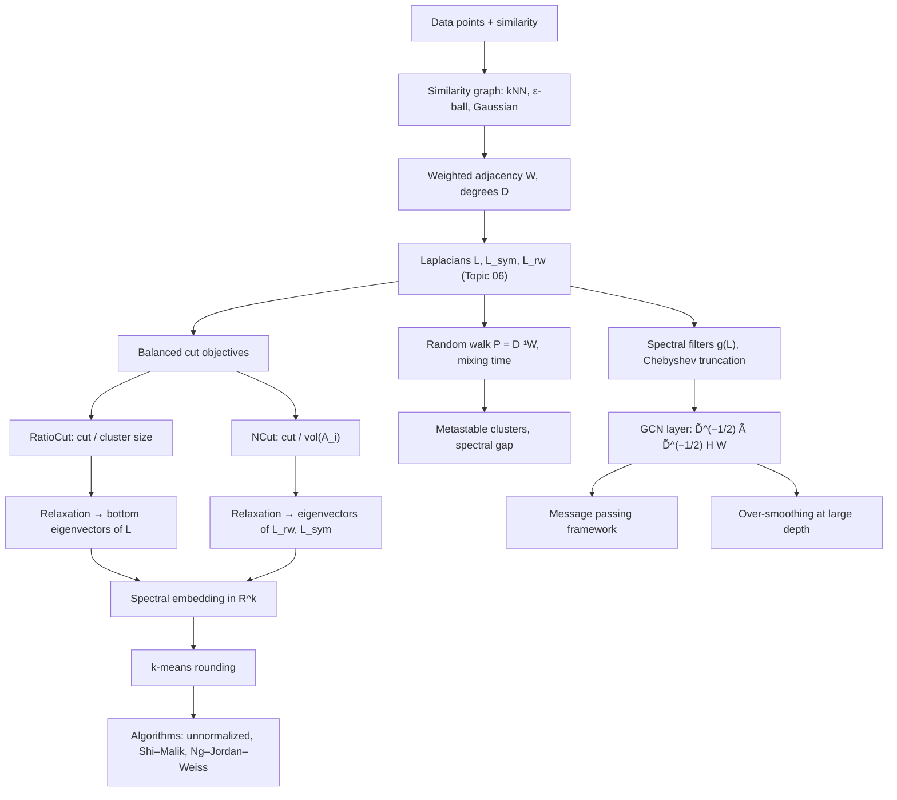

# Topic 07: Spectral Clustering and GNN Applications

## 1. Master Overview

Topic 06 built the Laplacian and its spectrum; this module spends that capital. The first payoff is **spectral clustering**: a partitioning method that embeds the vertices into $\mathbb{R}^k$ using the $k$ smallest Laplacian eigenvectors and then runs $k$-means in that space. The method looks like a heuristic and is in fact a *relaxation with a proof*: minimizing the balanced cut objectives **RatioCut** and **NCut** is NP-hard, but dropping the constraint that indicator vectors be discrete turns each into a trace-minimization problem whose exact solution is the span of the bottom eigenvectors of $L$ (RatioCut) or of $L_{\mathrm{rw}}$ / $L_{\mathrm{sym}}$ (NCut). The three canonical algorithms — unnormalized, Shi–Malik (random-walk normalized), and Ng–Jordan–Weiss (symmetric normalized with row normalization) — differ only in which Laplacian is diagonalized and how the embedding is scaled.

The random-walk view explains *why* it works. With $P = D^{-1} A$, the normalized Laplacian is $L_{\mathrm{rw}} = I - P$, so small Laplacian eigenvalues are slow-decaying random-walk modes: a good cluster is a region the walk gets trapped in for a long time. NCut is exactly the sum of transition probabilities of escaping each cluster in stationarity, and the spectral gap controls mixing. This probabilistic reading also predicts the failure modes — clusters of wildly different volumes, disconnected noise points, and the choice of similarity graph (fully connected Gaussian, $k$-nearest-neighbour, $\varepsilon$-ball) matter far more than the eigen-solver.

The second payoff is **graph neural networks**. Filtering a signal by $g_\theta(L)$ in the Laplacian eigenbasis is graph convolution; truncating that filter to a first-order Chebyshev polynomial and renormalizing yields Kipf & Welling's propagation rule $H^{(l+1)} = \sigma\big(\tilde{D}^{-1/2} \tilde{A} \tilde{D}^{-1/2} H^{(l)} W^{(l)}\big)$ with $\tilde{A} = A + I$. Each layer is one round of **message passing**: aggregate neighbours, transform, apply a nonlinearity. Because the propagation matrix is a low-pass filter, stacking many layers drives all node representations toward the dominant smooth mode — the **over-smoothing** phenomenon, which is exactly the statement that $\tilde{P}^{\,l}$ converges to a rank-one projector. Spectral analysis therefore both motivates GNNs and diagnoses their limits.

> [!NOTE]
> Spectral clustering and a GCN layer are the same operator seen from two sides. Clustering *reads off* the low-frequency eigenvectors of the Laplacian to find structure; a GCN *applies* a low-pass filter built from the same operator to smooth features along that structure. Understanding one as the eigen-decomposition and the other as the polynomial filter of a single matrix is the shortest route through both literatures.

## 2. First-Principles Framework

- **Phenomenon**: points that are similar should share labels, and similarity is naturally encoded as a weighted graph rather than as coordinates.
- **Objective (discrete)**: $\mathrm{NCut}(A_1, \dots, A_k) = \sum_{i=1}^{k} \frac{\mathrm{cut}(A_i, \bar{A_i})}{\mathrm{vol}(A_i)}$ — cut little, but keep clusters balanced by volume; RatioCut uses $\vert A_i \vert$ instead of $\mathrm{vol}(A_i)$.
- **Relaxation**: replace indicator matrices by any $H$ with $H^{\top} H = I$; then $\min \operatorname{tr}(H^{\top} L H)$ is solved by the bottom $k$ eigenvectors (Ky Fan / Courant–Fischer).
- **Rounding**: run $k$-means on the rows of the eigenvector matrix — the step where the proof stops and the heuristic begins.
- **Random-walk law**: $L_{\mathrm{rw}} = I - P$; low eigenvalues = slow modes = metastable clusters, and $\mathrm{NCut}$ equals the stationary escape probability summed over clusters.
- **Filtering law (GNN)**: a spectral filter is $g_\theta(L) x = U g_\theta(\Lambda) U^{\top} x$; the GCN layer is the degree-one polynomial approximation $\tilde{D}^{-1/2} \tilde{A} \tilde{D}^{-1/2}$, a low-pass filter applied once per layer.
- **Locality law**: $(L^k)_{uv} = 0$ whenever the graph distance $d(u,v) \gt k$, so a degree-$k$ polynomial filter is exactly $k$-hop local — the reason polynomial filters replaced free spectral filters.
- **Guarantee**: for $k = 2$ the sweep-cut rounding of the Fiedler vector achieves conductance at most $\sqrt{2\lambda_2^{\mathrm{sym}}}$ (Cheeger, Topic 06) — the only general quality bound in the whole pipeline.
- **Model selection**: the eigengap heuristic picks $k = \arg\max_k(\lambda_{k+1} - \lambda_k)$, justified by Davis–Kahan: the embedding is stable exactly when that gap is large relative to the perturbation.
- **Depth law**: powers of the propagation matrix converge geometrically, $\Vert \hat{S}^{\,l} - v_1 v_1^{\top} \Vert = \Theta(\vert \mu_2 \vert^{\,l})$ — receptive field grows linearly in depth while discriminative signal decays exponentially.

## 3. Mermaid Concept Map

The map has two halves that meet at the Laplacian. Going *down the left*, a combinatorial objective is relaxed into an eigenproblem and rounded back into a partition — clustering. Going *down the right*, the same operator is turned into a polynomial filter and applied to features — graph neural networks. Every node in the diagram above the split belongs to Topic 06; everything below it is what this module builds.

## 4. Common Misconceptions

| Misconception | Mathematical Reality | Correct Mental Model |
|---|---|---|
| *"Spectral clustering solves the min-cut problem exactly."* | RatioCut and NCut are NP-hard; the eigenvectors solve only the *continuous relaxation*, and rounding can be arbitrarily bad in adversarial cases (no constant-factor guarantee in general). | Relax, embed, round. The Cheeger inequality gives the only general quality guarantee, and only for $k = 2$. |
| *"Use the top eigenvectors, like in PCA."* | Clusters live in the *low-frequency* end: one uses the eigenvectors of the $k$ **smallest** eigenvalues of $L$ (equivalently the largest of $A$ or of $I - L$). | Laplacian small $\leftrightarrow$ adjacency large. Always check which operator's spectrum is being ordered. |
| *"Unnormalized and normalized spectral clustering are interchangeable."* | Unnormalized clustering relaxes RatioCut (balances vertex counts) and is statistically consistent only under restrictive degree conditions; NCut variants balance volumes and are consistent far more generally (von Luxburg, Belkin & Bousquet, 2008). | With heavy-tailed degrees, prefer $L_{\mathrm{rw}}$ (Shi–Malik); it is the default for a reason. |
| *"$k$-means on the embedding is a formality."* | It is the rounding step and it is where the NP-hardness reappears; the embedding merely makes the clusters nearly linearly separable so that $k$-means rarely fails. | Eigenvectors reshape geometry; $k$-means makes the decision. Both stages can be blamed for a bad result. |
| *"A GCN is a spectral method, so it needs the eigendecomposition."* | The GCN rule is a *polynomial* in $\tilde{A}$ of degree 1 per layer; it is evaluated by sparse matrix products in $O(m)$ time and never diagonalizes anything. | Spectral in derivation, spatial in execution — Chebyshev/localized filters exist precisely to avoid the $O(n^3)$ eigendecomposition. |
| *"Deeper GNNs are strictly more expressive."* | Repeated low-pass filtering makes $\tilde{P}^{\,l} \to$ a rank-one projector onto the degree-weighted constant, so node embeddings converge and become indistinguishable — over-smoothing. | Depth buys receptive field but spends discriminative power; residual connections, PairNorm, or jumping knowledge are needed past $2$–$3$ layers. |
| *"The renormalization $\tilde{A} = A + I$ is a numerical trick."* | Adding self-loops shrinks the spectrum of the propagation matrix into roughly $[-1, 1)$ with the largest eigenvalue pushed away from the unstable end, stabilizing deep stacks; it changes the filter's frequency response. | Self-loops are a deliberate spectral shift, not padding — they trade a little high-frequency response for training stability. |

## 5. Directory Inventory

| File | Description |
|---|---|
| [`README.md`](README.md) | Master overview, first-principles framework, concept map, misconceptions, references. |
| [`first_principles.ipynb`](first_principles.ipynb) | Markdown-only theory notebook: cut objectives, RatioCut and NCut relaxations with full derivations, Ky Fan trace minimization, the three spectral clustering algorithms, random-walk and commute-time views, spectral filters, Chebyshev truncation to the GCN rule, over-smoothing theorem, applications. |
| [`exercises.ipynb`](exercises.ipynb) | 20 fully solved problems in 4 levels (L0 Concept Check ×4, L1 Foundation ×6, L2 AI/ML & Physics Applications ×6, L3 Challenge ×4) with complete derivations, boxed answers, and key takeaways. |

## 6. References

1. **von Luxburg, U.** (2007). A tutorial on spectral clustering. *Statistics and Computing*, 17(4), 395–416. — The canonical reference for this module.
2. **Shi, J., & Malik, J.** (2000). Normalized cuts and image segmentation. *IEEE TPAMI*, 22(8), 888–905.
3. **Ng, A. Y., Jordan, M. I., & Weiss, Y.** (2002). On spectral clustering: analysis and an algorithm. *NeurIPS 14*, 849–856.
4. **Chung, F. R. K.** (1997). *Spectral Graph Theory*. AMS CBMS 92. — Cheeger inequality and conductance bounds behind the relaxations.
5. **Kipf, T. N., & Welling, M.** (2017). Semi-supervised classification with graph convolutional networks. *ICLR*.
6. **Defferrard, M., Bresson, X., & Vandergheynst, P.** (2016). Convolutional neural networks on graphs with fast localized spectral filtering. *NeurIPS 29*.
7. **Bruna, J., Zaremba, W., Szlam, A., & LeCun, Y.** (2014). Spectral networks and locally connected networks on graphs. *ICLR*.
8. **Hamilton, W. L.** (2020). *Graph Representation Learning*. Morgan & Claypool (Synthesis Lectures on AI and ML). — Chapters 5–7: message passing, spectral motivation, expressivity.
9. **Gilmer, J., Schoenholz, S. S., Riley, P. F., Vinyals, O., & Dahl, G. E.** (2017). Neural message passing for quantum chemistry. *ICML*.
10. **Li, Q., Han, Z., & Wu, X.-M.** (2018). Deeper insights into graph convolutional networks for semi-supervised learning. *AAAI*. — The over-smoothing analysis.
11. **Belkin, M., & Niyogi, P.** (2003). Laplacian eigenmaps for dimensionality reduction and data representation. *Neural Computation*, 15(6), 1373–1396.
12. **Diestel, R.** (2017). *Graph Theory* (5th ed.). Springer GTM 173. — Background notation and connectivity results.
